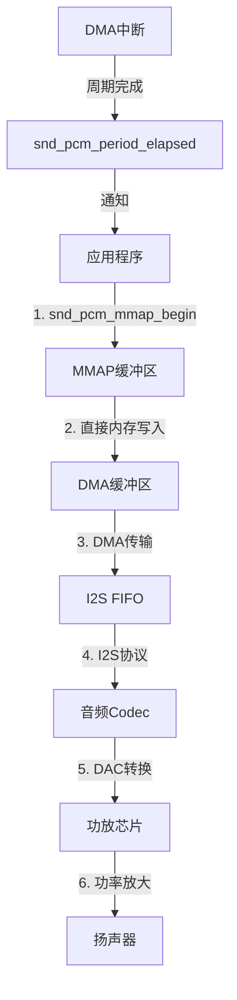

让我详细解释如何使用MMAP实现音频数据直接写入DMA，供功放读取的完整流程。
Ran tool

## MMAP音频数据流架构

### 整体数据流程

```
应用程序 → MMAP缓冲区 → DMA缓冲区 → I2S/DAI → 功放芯片 → 扬声器
    ↑           ↑           ↑         ↑        ↑
  用户空间   共享内存    内核DMA    硬件接口   音频硬件
```

## 1. 应用层MMAP使用方法

### 基本MMAP音频播放代码

mmap_audio_example.c

## 2. 底层DMA配置和硬件连接

### DMA缓冲区配置

dma_audio_driver_example.c

## 3. 设备树配置示例

## 4. 编译和使用说明

## 5. 完整的MMAP使用流程总结

### 数据流程图



### 使用步骤

#### 1. 环境准备
```bash
# 安装ALSA开发库
sudo apt-get install libasound2-dev build-essential

# 检查ALSA设备
aplay -l
cat /proc/asound/cards
```

#### 2. 编译示例程序
```bash
# 编译MMAP音频示例
make all

# 检查系统MMAP支持
make check-mmap

# 查看ALSA信息
make alsa-info
```

#### 3. 测试MMAP播放
```bash
# 使用默认设备测试
./mmap_audio_test default

# 使用硬件设备测试
./mmap_audio_test hw:0,0

# 使用插件设备测试
./mmap_audio_test plughw:0,0
```

#### 4. 验证功放工作
```bash
# 检查功放GPIO状态
cat /sys/class/gpio/gpio25/value

# 查看DMA状态
cat /proc/interrupts | grep dma

# 监控音频流
cat /proc/asound/card0/pcm0p/sub0/status
```

### 核心代码要点

#### 应用层MMAP使用：
```c
// 1. 设置MMAP访问模式
snd_pcm_hw_params_set_access(pcm, hw_params, SND_PCM_ACCESS_MMAP_INTERLEAVED);

// 2. 开始MMAP访问
snd_pcm_mmap_begin(pcm, &areas, &offset, &frames);

// 3. 直接在映射内存中写入数据
int16_t *samples = (int16_t *)((char *)areas[0].addr + 
                              (areas[0].first + offset * areas[0].step) / 8);
generate_audio_data(samples, frames);

// 4. 提交数据到DMA
snd_pcm_mmap_commit(pcm, offset, frames);
```

#### 内核层DMA配置：
```c
// 1. 分配DMA缓冲区
dma_area = dma_alloc_coherent(dev, buffer_size, &dma_addr, GFP_KERNEL);

// 2. 配置DMA传输
config.direction = DMA_MEM_TO_DEV;
config.dst_addr = i2s_fifo_addr;

// 3. 启动循环DMA
desc = dmaengine_prep_dma_cyclic(dma_chan, dma_addr, buffer_size, 
                                period_size, DMA_MEM_TO_DEV, DMA_PREP_INTERRUPT);
```

### 性能优化建议

1. **缓冲区大小调优**：
   - Period Size: 1024-4096 frames
   - Buffer Size: 4-16 periods
   - 平衡延迟和稳定性

2. **实时性优化**：
   - 设置进程优先级：`chrt -f 80 ./mmap_audio_test`
   - 禁用CPU频率调节
   - 减少系统中断

3. **DMA优化**：
   - 使用连续物理内存
   - 配置合适的DMA burst长度
   - 启用DMA缓存一致性

### 故障排除

#### 常见问题：

1. **MMAP不支持**：
```bash
# 检查驱动是否支持MMAP
grep MMAP /proc/asound/card0/pcm0p/info
```

2. **DMA传输失败**：
```bash
# 检查DMA中断
cat /proc/interrupts | grep audio-dma
# 检查内存映射
cat /proc/iomem | grep audio
```

3. **音频质量问题**：
```bash
# 检查采样率匹配
cat /proc/asound/card0/pcm0p/sub0/hw_params
# 监控underrun
cat /proc/asound/card0/pcm0p/sub0/xruns
```

### 总结

MMAP模式实现了：

- **零拷贝传输**：应用程序直接写入DMA缓冲区
- **超低延迟**：绕过内核缓冲层
- **高效传输**：DMA自动处理数据搬移
- **硬件直连**：功放直接从DMA读取数据

这种方式特别适合：
- 实时音频处理
- 专业音频设备
- 低延迟音频应用
- 高性能音频系统

通过正确配置设备树、驱动和应用程序，可以实现从用户空间到功放硬件的完整音频数据流，达到最佳的音频性能。