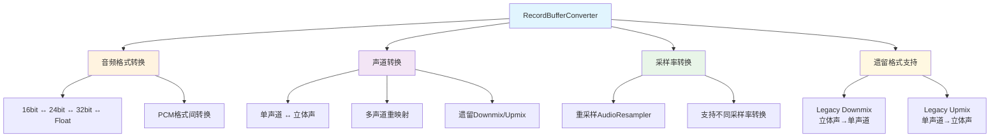

# 问题
在日常开发中会出现，app需要24bit但是底层录音设备只支持16bit这种情况。因此我们需要分析在这种情况下AF做了哪些工作？ 首先我们来看一下Record的创建过程。
# Record的创建
```c++
     android::content::AttributionSourceState attributionSource;
     attributionSource.packageName = std::string(PACKAGE_NAME);
     attributionSource.token = sp<BBinder>::make();

    sp<AudioRecord> audioRecord = new AudioRecord(audioSource,
        sampleRate /* sampleRate */,
        audioFormat,
        channelMask,
        attributionSource);
```
AudioRecord构造函数参数需要pcm的三套件，三套件就是app需要的pcm格式，audioSource就是音频源比如AUDIO_SOURCE_VOICE_COMMUNICATION。
在AudioRecord构造函数内会调用set函数，在该函数内会把pcm的格式保存下来，然后在set内调用createRecord_l函数，createRecord会调用AF中的createRecord。
```c++
sp<media::IAudioRecord> AudioFlinger::createRecord(const CreateRecordInput& input,
                                                   CreateRecordOutput& output,
                                                   status_t *status)
{
    ......
     client = registerPid(clientPid);
     for (;;) {
        lStatus = AudioSystem::getInputForAttr(&input.attr, &output.inputId,
                                      input.riid,
                                      sessionId,
                                    // FIXME compare to AudioTrack
                                      clientPid,
                                      clientUid,
                                      input.opPackageName,
                                      &input.config,
                                      output.flags, &output.selectedDeviceId, &portId);
    if (lStatus != NO_ERROR) {
        ALOGE("createRecord() getInputForAttr return error %d", lStatus);
        goto Exit;
    }

    {
        Mutex::Autolock _l(mLock);
        RecordThread *thread = checkRecordThread_l(output.inputId);
        if (thread == NULL) {
            ALOGW("createRecord() checkRecordThread_l failed, input handle %d", output.inputId);
            lStatus = FAILED_TRANSACTION;
            goto Exit;
        }

        ALOGV("createRecord() lSessionId: %d input %d", sessionId, output.inputId);

        output.sampleRate = input.config.sample_rate;
        output.frameCount = input.frameCount;
        output.notificationFrameCount = input.notificationFrameCount;

        recordTrack = thread->createRecordTrack_l(client, input.attr, &output.sampleRate,
                                                  input.config.format, input.config.channel_mask,
                                                  &output.frameCount, sessionId,
                                                  &output.notificationFrameCount,
                                                  callingPid, clientUid, &output.flags,
                                                  input.clientInfo.clientTid,
                                                  &lStatus, portId,
                                                  input.opPackageName);
        LOG_ALWAYS_FATAL_IF((lStatus == NO_ERROR) && (recordTrack == 0));

     }
}
}
我们来总结一下createRecord做了哪些事情
1. 通过getInputForAttr 获取录制流是哪一个，这个录制流就是音频源，比如AUDIO_SOURCE_VOICE_COMMUNICATION。
2. 使用checkRecordThread_l 获取到这个录制流线程
3. 使用createRecordTrack_l在这个线程中创建一个recordtrack
```
在createRecordTrack_l中会创建一个RecordTrack对象，这个对象就比较有说法了。
```c++
AudioFlinger::RecordThread::RecordTrack::RecordTrack()
{

    if (!isDirect()) {
        mRecordBufferConverter = new RecordBufferConverter(
                thread->mChannelMask, thread->mFormat, thread->mSampleRate,
                channelMask, format, sampleRate);

        if (mRecordBufferConverter->initCheck() != NO_ERROR) {
            ALOGE("%s(%d): RecordTrack unable to create record buffer converter", __func__, mId);
            return;
        }
    }

......
}
```
注意RecordBufferConverter的构造函数参数中，thread->mChannelMask, thread->mFormat, thread->mSampleRate是线程的声道，格式，采样率。channelMask, format, sampleRate是app需要的声道，格式，采样率。
这里我们只关注RecordBufferConverter这个对象，这个类有以下的功能

使用函数 size_t convert(void *dst, AudioBufferProvider *provider, size_t frames);完成以上功能。OK到现在为止我们知道AudioRecord是可以完成格式转换的。那我们找一下在哪里会调用convert
# 格式转换的使用
```c++
bool AudioFlinger::RecordThread::threadLoop()
{
                        // process frames from the RecordThread buffer provider to the RecordTrack
                    // buffer
                    framesOut = activeTrack->mRecordBufferConverter->convert(
                            activeTrack->mSink.raw,
                            activeTrack->mResamplerBufferProvider,
                            framesOut);
}
```
现在可以确定在threadLoop中会去调用这个函数，那么到这里就梳理清楚了。