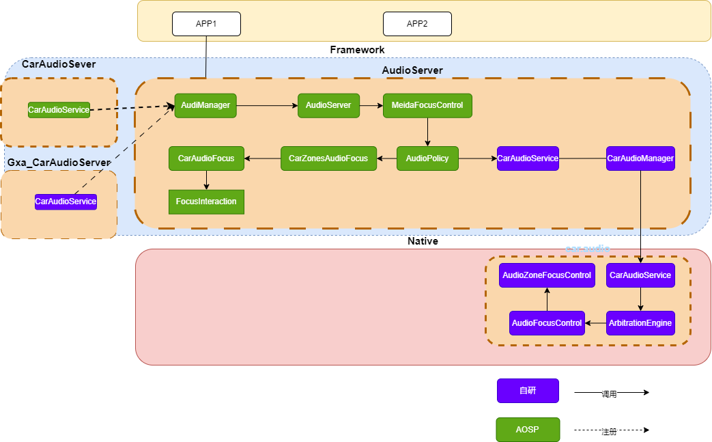

# Focus Compare
## 整体架构图

## 进程比较
### AOSP焦点策略涉及到的进程
1. APP:主要申请焦点，监听焦点状态
2. AudioServer:接受APP焦点请求并且焦点的仲裁逻辑在此进程中执行。与APP进程进行交互
3. CarAudioServer:配置焦点策略，比如音区个数，焦点仲裁策略等
   
### Gxaudio焦点策略涉及到的进程
1. APP:主要申请焦点，监听焦点状态
2. AudioServer:接受APP的焦点请求，并且把请求转发给GxaudioAudioServer。
3. GxaAudioServer:创建了AudioPolicy对象设置AudioPolicyFocusListener，注册给AudioService中，使焦点注册策略走到我们定制化流程中。
4. car.audio：该进程存在system区，主要功能有焦点仲裁策略的加载、焦点策略的执行等。

### 总结
1.从上述分析可以看出来AOSP的焦点策略流程是在AudioServer中执行的，在framework层就完成了焦点请求与仲裁不涉及Native。而Gxaudio的焦点策略流程贯穿APP->FRAMEWORK->Native。焦点策略加载与仲裁实在Native层完成。
2.猜测单独写一套焦点策略目的可能是为了防止Android版本升级代码变动增加维护成本。

## 焦点策略加载方式
### AOSP
在FocusInteraction.java维护了一个二维数组sInteractionMatrix，存放了焦点仲裁策略。理论上来说应该提供加载自定义焦点配置的接口但是查阅了Android12的源码并没有找到。
### Gxa
   使用cvs配置文件加载焦点策略。配置文件如下：
   ### 车载音频焦点策略配置文件说明

| 文件名                          | 作用描述                                                                 | 典型应用场景                                                                 |
|---------------------------------|--------------------------------------------------------------------------|----------------------------------------------------------------------------|
| `car_audio_focus_cfg.csv`       | 定义常规驾驶场景下的音频焦点仲裁规则                                       | 车辆正常行驶时音乐/导航/电话的焦点抢占逻辑                                   |
| `car_audio_focus_all_speak_cfg.csv` | 头枕扬声器模式专用策略，允许不同音区独立音频流                             | 后排乘客通过头枕听音乐，同时驾驶员听导航                                     |
| `car_audio_focus_out_media_cfg.csv`  | 媒体外放模式特殊策略（如车外扬声器播放）                                   | 露营模式下车外播放音乐，同时车内保持通话                                     |
| `car_audio_special_focus_cfg.csv`   | 处理紧急呼叫/报警音等特殊场景的强制焦点规则                                | 紧急呼叫自动中断娱乐系统，碰撞报警触发全车静音                               |

## 焦点控制容器
### AOSP
mFocusLosers:当前丢失焦点的有哪些，之后可能会恢复
mFocusHolders:当前正在持有的焦点有哪些。
### Gxa
mFocusStack,mSourceMap维护相同的焦点信息，不同在于SouceMap中还保存了焦点的状态信息，当焦点仲裁之后当前焦点的结果是AUDIOFOCUS_LOSS 那么就把当前焦点从mFocusStack,mSourceMap中移除.
###总结
aosp中获取当前活跃的焦点直接遍历mFocusHolders即可。而Gxa中需要查看mSourceMap中的焦点哪一个状态是STATE_ACTIVE