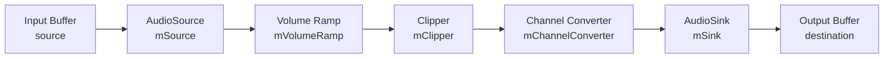

让我来解释这段AAudio FlowGraph的核心处理代码。
Ran tool
Read file: Audio相关/framework/libaaudio/src/client/AAudioFlowGraph.cpp

Ran tool

Read file: Audio相关/framework/libaaudio/src/client/AAudioFlowGraph.h

Read file: Audio相关/framework/libaaudio/src/flowgraph/SourceFloat.h
Read file: Audio相关/framework/libaaudio/src/flowgraph/SinkFloat.h

Read file: Audio相关/framework/libaaudio/src/flowgraph/AudioProcessorBase.h

Read file: Audio相关/framework/libaaudio/src/flowgraph/AudioProcessorBase.h

Read file: Audio相关/framework/libaaudio/src/flowgraph/AudioProcessorBase.h

## AAudioFlowGraph::process() 函数解析

这是Android AAudio框架中音频处理流图的核心函数，负责处理音频数据流。让我详细解释一下：

### 代码功能分析

```cpp
void AAudioFlowGraph::process(const void *source, void *destination, int32_t numFrames) {
    mSource->setData(source, numFrames);  // 1. 设置输入数据
    mSink->read(destination, numFrames);  // 2. 读取输出数据
}
```

### 1. 数据流图架构

AAudioFlowGraph是一个**音频处理流水线**，采用了**数据流图(Flow Graph)**的设计模式：



### 2. 处理流程详解

#### **步骤1：设置输入数据**
```cpp
mSource->setData(source, numFrames);
```

- `mSource` 是一个 `AudioSource` 对象（可能是 `SourceFloat`, `SourceI16`, `SourceI24`等）
- `setData()` 将原始音频数据缓冲区指针和帧数保存到 `AudioSource` 中
- **不进行数据拷贝**，只是设置指针引用

#### **步骤2：触发数据流处理**
```cpp
mSink->read(destination, numFrames);
```

- `mSink` 是一个 `AudioSink` 对象（如 `SinkFloat`, `SinkI16`, `SinkI24`等）
- `read()` 调用会**向后拉取数据** (pull-based)
- 触发整个处理链的执行

### 3. Pull-Based 数据流模式

AAudioFlowGraph采用**拉取式**数据流：

```cpp
// AudioSink::read() 内部流程
int32_t AudioSink::read(void *data, int32_t numFrames) {
    // 1. 从输入端口拉取数据
    pull(numFrames);  
    
    // 2. 将处理后的数据写入目标缓冲区
    // (具体实现在子类中，如SinkFloat::read())
    return copyDataToDestination(data, numFrames);
}
```

当`mSink->read()`被调用时：
1. **AudioSink** 向上游的 **ChannelConverter** 请求数据
2. **ChannelConverter** 向 **Clipper** 请求数据  
3. **Clipper** 向 **VolumeRamp** 请求数据
4. **VolumeRamp** 向 **AudioSource** 请求数据
5. **AudioSource** 从 `setData()` 设置的缓冲区中提供数据

### 4. 各处理模块的作用

从configure函数可以看到处理链包含：

#### **AudioSource** (数据输入)
```cpp
// 根据格式创建不同类型的Source
case AUDIO_FORMAT_PCM_FLOAT:
    mSource = std::make_unique<SourceFloat>(sourceChannelCount);
case AUDIO_FORMAT_PCM_16_BIT:  
    mSource = std::make_unique<SourceI16>(sourceChannelCount);
```

#### **VolumeRamp** (音量控制)
```cpp
mVolumeRamp = std::make_unique<RampLinear>(sourceChannelCount);
// 实现平滑的音量变化，避免爆音
```

#### **Clipper** (限幅器) 
```cpp
if (sourceFormat == AUDIO_FORMAT_PCM_FLOAT && sinkFormat == AUDIO_FORMAT_PCM_FLOAT) {
    mClipper = std::make_unique<ClipToRange>(sourceChannelCount);
    // 防止浮点数据超出合理范围
}
```

#### **ChannelConverter** (声道转换)
```cpp
if (sourceChannelCount == 1 && sinkChannelCount > 1) {
    mChannelConverter = std::make_unique<MonoToMultiConverter>(sinkChannelCount);
    // 单声道转多声道
}
```

#### **AudioSink** (数据输出)
```cpp
// 根据格式创建对应的Sink
case AUDIO_FORMAT_PCM_FLOAT:
    mSink = std::make_unique<SinkFloat>(sinkChannelCount);
```

### 5. 使用场景和优势

这种设计的优势：

1. **模块化设计**：每个处理模块独立，易于测试和维护
2. **零拷贝优化**：数据在处理链中通过指针传递，减少内存拷贝
3. **灵活配置**：可根据需要组合不同的处理模块
4. **实时处理**：适合低延迟音频处理需求

### 6. 典型使用场景

```cpp
// AAudio应用使用FlowGraph的典型流程
AAudioFlowGraph flowGraph;

// 配置：16bit立体声 -> 32bit浮点立体声  
flowGraph.configure(AUDIO_FORMAT_PCM_16_BIT, 2,    // source
                   AUDIO_FORMAT_PCM_FLOAT, 2);     // sink

// 设置音量
flowGraph.setTargetVolume(0.8f);

// 处理音频数据
int16_t inputBuffer[1024 * 2];   // 1024帧立体声16bit数据
float outputBuffer[1024 * 2];    // 1024帧立体声float数据

flowGraph.process(inputBuffer, outputBuffer, 1024);
```

这个`process()`函数是整个AAudio处理链的核心，实现了高效、模块化的音频数据处理流程。