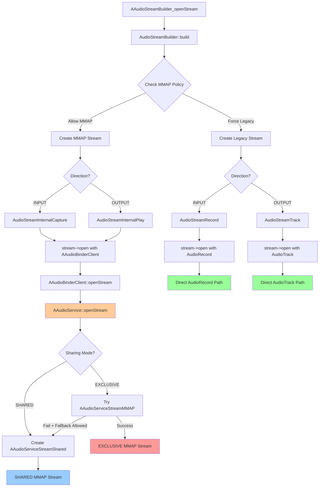
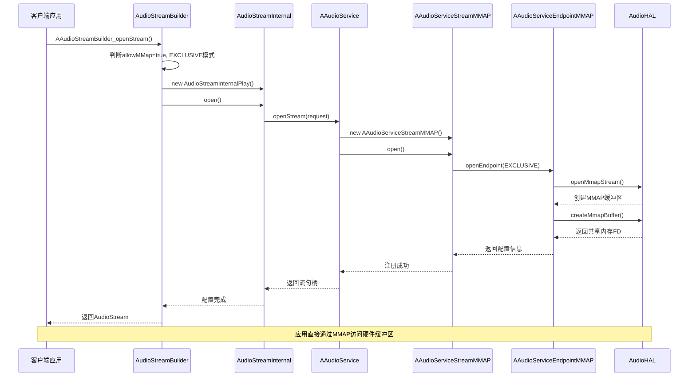
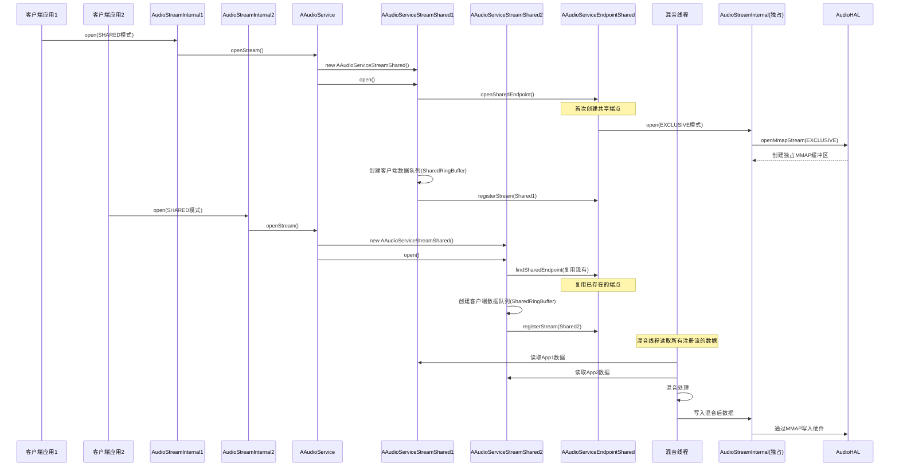
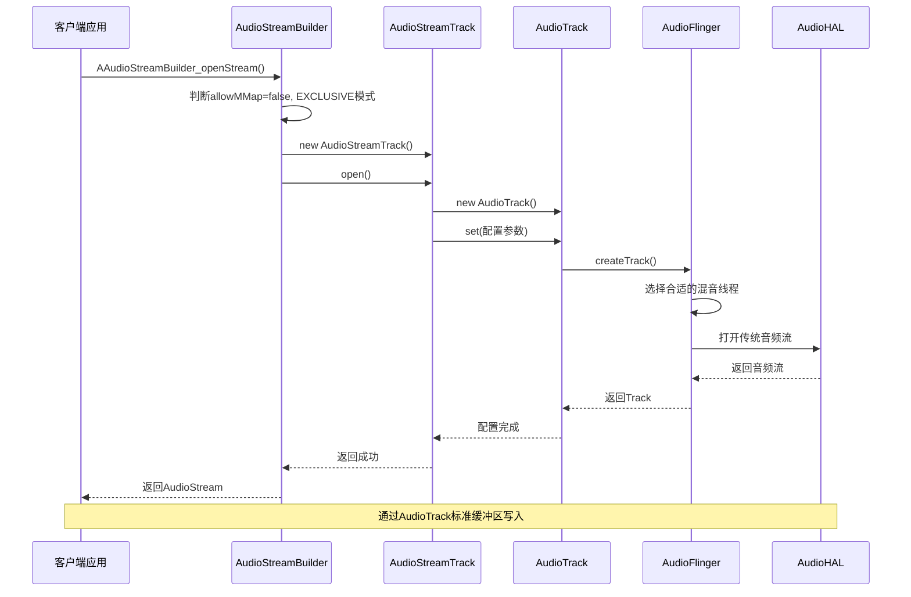
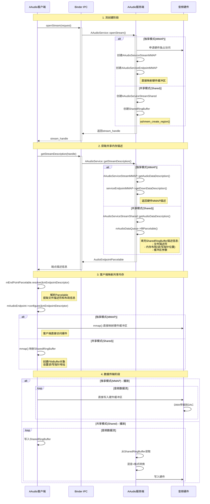
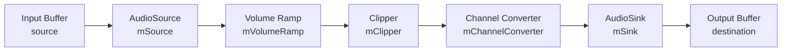

# AAudio学习
目前我们可知AAudio对于APM、AF来说也是一个client端类似与AudioTrack的感觉AAudio最优先匹配的是mmap输出流其次是fast输出流。我们接下来的学习已AAudio中的example入手，先看看这个模块是怎么工作的，然后在对源码进行分析。另外我们还要关注一下mmapthread中的内存是如何减少拷贝的。
## AAudio example
这部分代码路径frameworks\av\media\libaaudio\examples
### write_sine
该路径在存在`write_sine_callback.cpp`与`write_sine.cpp`文件，实现功能分别是使用回调与阻塞模式来写入正弦波。
#### write
我们来提取一下用到的AAudio的api。该流程与使用AudioTrack的流程类似。
```c++

        // 1.创建AAudioStreamBuilder
        AAudioStreamBuilder *builder = nullptr;
        result = AAudio_createStreamBuilder(&builder);
        //2.设置AAudioStreamBuilder的参数
        // 设置缓冲区容量（帧数）
        AAudioStreamBuilder_setBufferCapacityInFrames(builder, getBufferCapacity());
        // 设置通道数
        AAudioStreamBuilder_setChannelCount(builder, mChannelCount);
        // 设置设备ID（指定输出/输入设备）
        AAudioStreamBuilder_setDeviceId(builder, mDeviceId);
        // 设置音频数据格式
        AAudioStreamBuilder_setFormat(builder, mFormat);
        // 设置每次数据回调的帧数
        AAudioStreamBuilder_setFramesPerDataCallback(builder, mFramesPerCallback);
        // 设置性能模式（如低延迟、节能等）
        AAudioStreamBuilder_setPerformanceMode(builder, AAUDIO_PERFORMANCE_MODE_NONE);
        // 设置采样率
        AAudioStreamBuilder_setSampleRate(builder, mSampleRate);
        // 设置共享模式（独占/共享）
        AAudioStreamBuilder_setSharingMode(builder, AAUDIO_SHARING_MODE_SHARED);
        // 设置流方向为输出
        AAudioStreamBuilder_setDirection(builder, AAUDIO_DIRECTION_OUTPUT);
        // 打开音频流
        AAudioStream *aaudioStream
        //3. 使用AAudioStreamBuilder 创建 AAudioStream
        result = AAudioStreamBuilder_openStream(builder, &aaudioStream);

        // 如果流打开成功，设置缓冲区大小
        if (result == AAUDIO_OK) {
            int32_t sizeInBursts = parameters.getNumberOfBursts(); // 获取突发数
            int32_t framesPerBurst = AAudioStream_getFramesPerBurst(mStraaudioStreameam); // 获取每个突发的帧数
            int32_t bufferSizeFrames = sizeInBursts * framesPerBurst; // 计算总缓冲帧数
            AAudioStream_setBufferSizeInFrames(aaudioStream, bufferSizeFrames); // 设置缓冲区大小
        }
        //4.AAudioStream创建成功后删除builder，释放资源
        AAudioStreamBuilder_delete(builder);
          // 获取流的实际参数
        actualChannelCount = AAudioStream_getChannelCount(aaudioStream);
        actualSampleRate = AAudioStream_getSampleRate(aaudioStream);
        actualDataFormat = AAudioStream_getFormat(aaudioStream);

        framesPerBurst = AAudioStream_getFramesPerBurst(aaudioStream);
            //程序单次调用 AAudioStream_write() 时实际写入的帧数。
        int32_t  framesPerWrite = 0;
        framesPerWrite = framesPerBurst;
        //5.start AAudioStream
        aaudio_result_t result = AAudioStream_requestStart(mStream);
        if (result != AAUDIO_OK) {
            printf("ERROR - AAudioStream_requestStart(output) returned %d %s\n",
                    result, AAudio_convertResultToText(result));
        }
        //6.write data
        //write stream floatData存放的数据 这是一个阻塞调用，会等待直到数据被完全写入或超时。
        AAudioStream_write(aaudioStream, floatData, minFrames, timeoutNanos);

            // 获取并打印XRun(缓冲区欠载/过载)的次数 查看稳定性
        int xRunCount = AAudioStream_getXRunCount(aaudioStream);
        printf("AAudioStream_getXRunCount %d\n", xRunCount);

          aaudio_result_t result = AAudioStream_requestStop(mStream);
        if (result != AAUDIO_OK) {
            printf("ERROR - AAudioStream_requestStop(output) returned %d %s\n",
                   result, AAudio_convertResultToText(result));
        }
        //7.close AAudioStream
        AAudioStream_close(aaudioStream);
```
这个流程分为七部分看起来还是很清晰的。
****
#### callback
大体相同不同在于
```c++
/**
 * AAudio 数据回调函数。
 * 这个函数会在一个高优先级的实时线程中被 AAudio 服务周期性地调用。
 * 你的所有音频处理和数据生成都应该在这里完成。
 *
 * @param stream 我们正在操作的 AAudio 流
 * @param userData 在注册回调时传入的自定义数据指针
 * @param audioData 需要我们填充音频数据的缓冲区
 * @param numFrames 系统请求我们提供的音频帧数
 * @return 必须返回 AAUDIO_CALLBACK_RESULT_CONTINUE，流才会继续播放
 */
aaudio_callback_result_t dataCallback(
        AAudioStream *stream,
        void *userData,
        void *audioData,
        int32_t numFrames) {

    // 将 userData 和 audioData 转换为我们需要的类型
    SineGenerator *sineGenerator = (SineGenerator *)userData;
    float *outputBuffer = (float *)audioData;
    int32_t channelCount = AAudioStream_getChannelCount(stream);

    // 循环生成每一帧的音频数据
    for (int i = 0; i < numFrames; i++) {
        float sampleValue = sinf(sineGenerator->phase);

        // 为所有声道写入相同的采样值
        for (int j = 0; j < channelCount; j++) {
            outputBuffer[i * channelCount + j] = sampleValue;
        }

        // 更新相位
        sineGenerator->phase += sineGenerator->phaseIncrement;
        // 当相位超过 2*PI 时，将其卷绕回来，以防止浮点数精度问题
        if (sineGenerator->phase > 2.0 * M_PI) {
            sineGenerator->phase -= 2.0 * M_PI;
        }
    }

    return AAUDIO_CALLBACK_RESULT_CONTINUE;
}
    // 关键：注册我们的回调函数，并把振荡器作为 userData 传入 sineOscillator是一个结构体方便在dataCallback中使用
    AAudioStreamBuilder_setDataCallback(builder, dataCallback, &sineOscillator);
```
### loopback
### input_monitor
#### monitor
#### callback

## AAudio 源码分析
我们现在看一下开机时候的AAudioService的启动流程。
在这里先贴一个大概的流程图

### AAudioService开机初始化
```c++
main_audioserver.cpp
int main () {
            // AAudioService 仅应在 OC-MR1 及更高版本中使用。
        // 并且只有当系统 MMAP 策略明确允许时才启用 AAudioService。
        // 这可以防止客户端在不支持的情况下误用 AAudioService。
        aaudio_policy_t mmapPolicy = property_get_int32(AAUDIO_PROP_MMAP_POLICY,
                                                        AAUDIO_POLICY_NEVER);
        if (mmapPolicy == AAUDIO_POLICY_AUTO || mmapPolicy == AAUDIO_POLICY_ALWAYS) {
            AAudioService::instantiate();
        }
}
AAudioService.cpp
android::AAudioService::AAudioService()
    : BnAAudioService(),
      mAdapter(this) {
    // TODO consider using geteuid()
    // TODO b/182392769: use attribution source util
    mAudioClient.attributionSource.uid = VALUE_OR_FATAL(legacy2aidl_uid_t_int32_t(getuid()));
    mAudioClient.attributionSource.pid = VALUE_OR_FATAL(legacy2aidl_pid_t_int32_t(getpid()));
    mAudioClient.attributionSource.packageName = std::nullopt;
    mAudioClient.attributionSource.attributionTag = std::nullopt;
    AAudioClientTracker::getInstance().setAAudioService(this);
}
AAudioClientTracker.h
    void setAAudioService(android::AAudioService *aaudioService) {
        mAAudioService = aaudioService;
    }
```
这么看AAudioService开机的时候没做啥事，仅仅把自身设置给了AAudioClientTracker而已。那么接下来我们已`write_sine`为例，看看AAudio是如何工作的。在分析中要注意AAUDIO_SHARING_MODE_SHARED与AAUDIO_SHARING_MODE_EXCLUSIVE分配共享内存的区别。

### AAudioStreamBuilder_openStream
对于AAudioStreamBuilder我们不关系，里面没有做什么工作，仅仅是保存了一下设置参数，估计之后也是给AAudioStream用的。我们直接来看`AAudioStreamBuilder_openStream`
```c++
AAudioAudio.cpp
AAUDIO_API aaudio_result_t  AAudioStreamBuilder_openStream(AAudioStreamBuilder* builder,
                                                     AAudioStream** streamPtr)
{
    AudioStream *audioStream = nullptr;
    aaudio_stream_id_t id = 0;
    // Please leave these logs because they are very helpful when debugging.
    ALOGI("%s() called ----------------------------------------", __func__);
    AudioStreamBuilder *streamBuilder = COMMON_GET_FROM_BUILDER_OR_RETURN(streamPtr);
    //主要看一下这个build函数是如何创建audiostream的
    aaudio_result_t result = streamBuilder->build(&audioStream); 
    if (result == AAUDIO_OK) {
        audioStream->registerPlayerBase();
        *streamPtr = (AAudioStream*) audioStream;
        id = audioStream->getId();
    } else {
        *streamPtr = nullptr;
    }
    ALOGI("%s() returns %d = %s for s#%u ----------------",
        __func__, result, AAudio_convertResultToText(result), id);
    return result;
}
```
### AudioStreamBuilder::build
```c++
aaudio_result_t AudioStreamBuilder::build(AudioStream** streamPtr) {

    // 1. 参数验证 - 检查输出参数是否有效
    if (streamPtr == nullptr) {
        ALOGE("%s() streamPtr is null", __func__);
        return AAUDIO_ERROR_NULL;
    }
    *streamPtr = nullptr;  // 初始化为空指针

    // 2. 记录参数信息用于调试
    logParameters();

    // 3. 验证构建器参数的有效性
    aaudio_result_t result = validate();
    if (result != AAUDIO_OK) {
        return result;
    }

    // 4. 确定MMAP策略 - 按优先级获取配置
    // API设置具有最高优先级 默认是AAUDIO_UNSPECIFIED
    aaudio_policy_t mmapPolicy = AudioGlobal_getMMapPolicy();
    // 如果未指定，则从系统属性获取
    if (mmapPolicy == AAUDIO_UNSPECIFIED) {
        mmapPolicy = AAudioProperty_getMMapPolicy();
    }
    // 如果仍未指定，则使用默认值
    if (mmapPolicy == AAUDIO_UNSPECIFIED) {
        mmapPolicy = AAUDIO_MMAP_POLICY_DEFAULT;
    }

    // 5. 获取独占模式策略配置
    int32_t mapExclusivePolicy = AAudioProperty_getMMapExclusivePolicy();
    if (mapExclusivePolicy == AAUDIO_UNSPECIFIED) {
        mapExclusivePolicy = AAUDIO_MMAP_EXCLUSIVE_POLICY_DEFAULT;
    }

    // 6. 处理共享模式冲突 - 如果独占模式不被允许，强制使用共享模式
    aaudio_sharing_mode_t sharingMode = getSharingMode();
    if ((sharingMode == AAUDIO_SHARING_MODE_EXCLUSIVE)
        && (mapExclusivePolicy == AAUDIO_POLICY_NEVER)) {
        ALOGD("%s() EXCLUSIVE sharing mode not supported. Use SHARED.", __func__);
        sharingMode = AAUDIO_SHARING_MODE_SHARED;
        setSharingMode(sharingMode);
    }

    // 7. 根据策略确定允许的音频路径
    bool allowMMap = mmapPolicy != AAUDIO_POLICY_NEVER;      // 是否允许MMAP路径
    bool allowLegacy = mmapPolicy != AAUDIO_POLICY_ALWAYS;   // 是否允许Legacy路径

    // 8. 性能模式限制 - MMAP路径需要低延迟模式
    // TODO: 支持MMAP模式下的其他性能设置
    if (getPerformanceMode() != AAUDIO_PERFORMANCE_MODE_LOW_LATENCY) {
        ALOGD("%s() MMAP not used because AAUDIO_PERFORMANCE_MODE_LOW_LATENCY not requested.",
              __func__);
        allowMMap = false;  // 非低延迟模式禁用MMAP
    }

    // 9. SessionID和音效功能限制 - 仅在Legacy模式支持
    if (getSessionId() != AAUDIO_SESSION_ID_NONE) {
        ALOGD("%s() MMAP not used because sessionId specified.", __func__);
        allowMMap = false;  // 指定了SessionID则禁用MMAP
    }

    // 10. 检查是否有可用的后端实现
    if (!allowMMap && !allowLegacy) {
        ALOGE("%s() no backend available: neither MMAP nor legacy path are allowed", __func__);
        return AAUDIO_ERROR_ILLEGAL_ARGUMENT;
    }

    // 11. 设置隐私敏感模式 - 根据输入预设自动判断
    setPrivacySensitive(false);  // 默认非隐私敏感
    if (mPrivacySensitiveReq == PRIVACY_SENSITIVE_DEFAULT) {
        // 未明确请求时，根据输入预设设置隐私敏感模式：
        // 通信和摄像头录制默认被视为隐私敏感
        aaudio_input_preset_t preset = getInputPreset();
        if (preset == AAUDIO_INPUT_PRESET_CAMCORDER
                || preset == AAUDIO_INPUT_PRESET_VOICE_COMMUNICATION) {
            setPrivacySensitive(true);
        }
    } else if (mPrivacySensitiveReq == PRIVACY_SENSITIVE_ENABLED) {
        setPrivacySensitive(true);  // 明确要求启用隐私敏感模式
    }

    // 12. 创建音频流对象 - 首先尝试创建流实例
    android::sp<AudioStream> audioStream;
    result = builder_createStream(getDirection(), sharingMode, allowMMap, audioStream);
    if (result == AAUDIO_OK) {
        // 13. 使用构建器参数打开音频流
        result = audioStream->open(*this);
        if (result != AAUDIO_OK) {
            // 14. MMAP失败时的回退机制 - 尝试Legacy路径
            bool isMMap = audioStream->isMMap();
            if (isMMap && allowLegacy) {
                ALOGV("%s() MMAP stream did not open so try Legacy path", __func__);
                // MMAP流打开失败，尝试使用Legacy流
                result = builder_createStream(getDirection(), sharingMode,
                                              false, audioStream);  // 强制使用Legacy
                if (result == AAUDIO_OK) {
                    result = audioStream->open(*this);
                }
            }
        }
        // 15. 成功创建后的最终处理
        if (result == AAUDIO_OK) {
            audioStream->logOpen();  // 记录打开日志
            *streamPtr = startUsingStream(audioStream);  // 准备供C代码使用
        } // 否则audioStream会超出作用域并被删除
    }

    return result;
}
``` 
在`AudioStreamBuilder::build`会进行一系列判断来确定,打开的AAuido属性比如sharingMode、allowMMap、输出流方向。然后再将这些属性当作参数传给`builder_createStream`。
### AudioStreamBuilder::builder_createStream
```c++
AudioStreamBuilder::builder_createStream
/**
 * 根据方向、共享模式和MMAP偏好创建音频流对象
 * 
 * @param direction 音频流方向（输入/输出）
 * @param sharingMode 共享模式（独占/共享）
 * @param tryMMap 是否尝试使用MMAP路径
 * @param stream 用于返回创建的音频流对象的智能指针引用
 * @return 操作结果码，AAUDIO_OK表示成功
 */
static aaudio_result_t builder_createStream(aaudio_direction_t direction,
                                         aaudio_sharing_mode_t sharingMode,
                                         bool tryMMap,
                                         android::sp<AudioStream> &stream) {
    aaudio_result_t result = AAUDIO_OK;

    switch (direction) {

        case AAUDIO_DIRECTION_INPUT:  // 音频输入流（录音）
            if (tryMMap) {
                // 使用MMAP路径 - 低延迟内部捕获流
                stream = new AudioStreamInternalCapture(AAudioBinderClient::getInstance(),
                                                                 false);
            } else {
                // 使用Legacy路径 - 传统录音流
                stream = new AudioStreamRecord();
            }
            break;

        case AAUDIO_DIRECTION_OUTPUT:  // 音频输出流（播放）
            if (tryMMap) {
                // 使用MMAP路径 - 低延迟内部播放流
                stream = new AudioStreamInternalPlay(AAudioBinderClient::getInstance(),
                                                              false);
            } else {
                // 使用Legacy路径 - 传统播放流
                stream = new AudioStreamTrack();
            }
            break;

        default:
            ALOGE("%s() bad direction = %d", __func__, direction);
            result = AAUDIO_ERROR_ILLEGAL_ARGUMENT;
    }
    return result;
}
```
到这里我们可以看到有两种路径可以选择，*为什么会有两种路径选择呢？*
其实是为了兼容，如果当前的系统不支持mmap路径那么就会选择legacy路径，也就是AudioTrack与AudioRecord那一套了。
### AudioStreamInternalPlay::AudioStreamInternalPlay（MMaP）
```c++
AudioStreamInternalPlay.cpp
AudioStreamInternalPlay::AudioStreamInternalPlay(AAudioServiceInterface  &serviceInterface,
                                                       bool inService)
        : AudioStreamInternal(serviceInterface, inService) {

}
AudioStreamInternal.cpp
AudioStreamInternal::AudioStreamInternal(AAudioServiceInterface  &serviceInterface, bool inService)
        : AudioStream()
        , mClockModel() //音频流的时间同步
        , mServiceStreamHandle(AAUDIO_HANDLE_INVALID)
        , mInService(inService) //标志此流是否运行在音频服务进程内部
        , mServiceInterface(serviceInterface)
        , mAtomicInternalTimestamp()
        , mWakeupDelayNanos(AAudioProperty_getWakeupDelayMicros() * AAUDIO_NANOS_PER_MICROSECOND)
        , mMinimumSleepNanos(AAudioProperty_getMinimumSleepMicros() * AAUDIO_NANOS_PER_MICROSECOND)
        {
}
```
到此为止就创建了一个AudioStream。我们接下来看一下函数`AudioStreamBuilder::build`中的open函数。该函数做了很多事情，我们目前只关注创建输出流相关 其他内容删掉了。
### AudioStreamInternal::open
```c++
AudioStreamInternal::open

/**
 * 打开内部音频流
 * 这是MMAP路径的核心实现，负责与音频服务通信并配置共享内存缓冲区
 * 
 * @param builder 音频流构建器，包含所有请求的参数
 * @return 操作结果码，AAUDIO_OK表示成功
 */
aaudio_result_t AudioStreamInternal::open(const AudioStreamBuilder &builder) {

    aaudio_result_t result = AAUDIO_OK;
    int32_t framesPerBurst;          // 每次突发传输的音频帧数（可能经过软件优化调整）
    int32_t framesPerHardwareBurst;  // 音频硬件一次处理的原始帧数（由底层硬件决定）
    AAudioStreamRequest request;     // 发送给服务端的请求
    AAudioStreamConfiguration configurationOutput;  // 服务端返回的配置

    // 1. 状态检查 - 确保流尚未打开
    // 2. 调用父类的open方法 - 复制构建器参数到流对象
    //把build中的变量设置到AudioStream中
    result = AudioStream::open(builder);

    mServiceStreamHandle = mServiceInterface.openStream(request, configurationOutput);
        // 19. 获取音频端点描述信息
    // 从服务端获取共享内存和FIFO队列的详细描述
    result = mServiceInterface.getStreamDescription(mServiceStreamHandle, mEndPointParcelable);
    if (result != AAUDIO_OK) {
        goto error;
    }

    // 20. 解析端点描述信息
    // 将序列化的端点信息转换为可用的描述符结构
    result = mEndPointParcelable.resolve(&mEndpointDescriptor);
    if (result != AAUDIO_OK) {
        goto error;
    }

    // 21. 配置音频端点
    // 基于描述符创建和配置音频端点，建立与服务端的共享内存连接
    mAudioEndpoint = std::make_unique<AudioEndpoint>();
    result = mAudioEndpoint->configure(&mEndpointDescriptor, getDirection());
    if (result != AAUDIO_OK) {
        goto error;
    }
    setState(AAUDIO_STREAM_STATE_OPEN);
    return result;

error:
    // 错误处理：释放已分配的资源
    releaseCloseFinal();
    return result;
}
```
我们先来看一下openStream里面做了哪些内容，然后再继续分析。另外要注意aaudioserver创建的流的参数与用户设置的不一定相同，要根据硬件来。
### AAudioBinderClient::openStream
```c++
AudioBinderClient.cpp
aaudio_handle_t AAudioBinderClient::openStream(const AAudioStreamRequest &request,
                                               AAudioStreamConfiguration &configurationOutput) {
    aaudio_handle_t stream;
    for (int i = 0; i < 2; i++) {
        const sp<IAAudioService> &service = getAAudioService();
        if (service.get() == nullptr) return AAUDIO_ERROR_NO_SERVICE;

        stream = service->openStream(request, configurationOutput);

        if (stream == AAUDIO_ERROR_NO_SERVICE) {
            ALOGE("openStream lost connection to AAudioService.");
            dropAAudioService(); // force a reconnect
        } else {
            break;
        }
    }
    return stream;
}
```
到这里client端的任务目前就完成了把各个参数打包成request送入到server端。我们看看server端做了哪些事情。
### AAudioService::openStream
```c++
/**
 * AAudio服务端音频流打开方法
 * 
 * 这是AAudio服务端处理客户端打开音频流请求的核心方法。

 * 
 * @param _request 客户端发送的音频流请求参数
 * @param _paramsOut 返回给客户端的实际流配置参数
 * @param _aidl_return 返回的流句柄或错误码
 * @return Status 操作状态
 */
 Status
 AAudioService::openStream(const StreamRequest &_request, StreamParameters* _paramsOut,
                           int32_t *_aidl_return) {
     // 编译时类型检查：确保返回值类型与aaudio_result_t兼容
     static_assert(std::is_same_v<aaudio_result_t, std::decay_t<typeof(*_aidl_return)>>);
 
     // 1. 创建包装对象以便于操作序列化参数
     const AAudioStreamRequest request(_request);
     AAudioStreamConfiguration paramsOut;
 
     // 2. 获取互斥锁确保端点打开的顺序性
     // 当独占端点被抢占时使用锁来保证操作顺序：
     // 1) 线程A打开独占MMAP端点
     // 2) 线程B想要打开独占MMAP端点，在此锁下从A抢占
     // 3) 线程B打开共享MMAP端点
     // 4) 线程A获得锁后也可以打开共享流
     // 没有锁的话，线程A可能在B打开共享流之前重新分配独占流
     std::unique_lock<std::recursive_mutex> lock(mOpenLock);
 
     // 3. 初始化变量和获取请求参数
     aaudio_result_t result = AAUDIO_OK;
     sp<AAudioServiceStreamBase> serviceStream;
     const AAudioStreamConfiguration &configurationInput = request.getConstantConfiguration();
     bool sharingModeMatchRequired = request.isSharingModeMatchRequired();
     aaudio_sharing_mode_t sharingMode = configurationInput.getSharingMode();
 
     // 4. 强制执行客户端进程的流数量限制
     AttributionSourceState attributionSource = request.getAttributionSource();
     pid_t pid = IPCThreadState::self()->getCallingPid();
     attributionSource.pid = VALUE_OR_RETURN_ILLEGAL_ARG_STATUS(
         legacy2aidl_pid_t_int32_t(pid));
     attributionSource.uid = VALUE_OR_RETURN_ILLEGAL_ARG_STATUS(
         legacy2aidl_uid_t_int32_t(IPCThreadState::self()->getCallingUid()));
     attributionSource.token = sp<BBinder>::make();
     
     // 检查是否超过单进程最大流数量限制
     if (attributionSource.pid != mAudioClient.attributionSource.pid) {
         int32_t count = AAudioClientTracker::getInstance().getStreamCount(pid);
         if (count >= MAX_STREAMS_PER_PROCESS) {
             ALOGE("openStream(): exceeded max streams per process %d >= %d",
                   count,  MAX_STREAMS_PER_PROCESS);
             AIDL_RETURN(AAUDIO_ERROR_UNAVAILABLE);
         }
     }
 
     // 5. 验证共享模式参数的合法性
     if (sharingMode != AAUDIO_SHARING_MODE_EXCLUSIVE && sharingMode != AAUDIO_SHARING_MODE_SHARED) {
         ALOGE("openStream(): unrecognized sharing mode = %d", sharingMode);
         AIDL_RETURN(AAUDIO_ERROR_ILLEGAL_ARGUMENT);
     }
 
     // 6. 尝试创建独占模式流（EXCLUSIVE + MMAP）
     if (sharingMode == AAUDIO_SHARING_MODE_EXCLUSIVE
         && AAudioClientTracker::getInstance().isExclusiveEnabled(pid)) {
         // 只信任audioserver的服务内指示
         bool inService = false;
         if (isCallerInService()) {
             inService = request.isInService();
         }
         // 创建MMAP流以获得最低延迟
         serviceStream = new AAudioServiceStreamMMAP(*this, inService);
         result = serviceStream->open(request);
         if (result != AAUDIO_OK) {
             // 清除流对象，以便可能回退到共享流
             ALOGW("openStream(), could not open in EXCLUSIVE mode");
             serviceStream.clear();
         }
     }
 
     // 7. 尝试创建共享模式流或从独占模式回退
     if (sharingMode == AAUDIO_SHARING_MODE_SHARED) {
         // 直接创建共享流
         serviceStream =  new AAudioServiceStreamShared(*this);
         result = serviceStream->open(request);
     } else if (serviceStream.get() == nullptr && !sharingModeMatchRequired) {
         // 独占模式失败且允许模式不匹配时，回退到共享模式
         aaudio::AAudioStreamRequest modifiedRequest = request;
         // 将原始的独占模式改写为共享模式
         modifiedRequest.getConfiguration().setSharingMode(AAUDIO_SHARING_MODE_SHARED);
         serviceStream =  new AAudioServiceStreamShared(*this);
         result = serviceStream->open(modifiedRequest);
     }
 
     // 8. 处理最终结果
     if (result != AAUDIO_OK) {
         // 流创建失败，清理资源并返回错误
         serviceStream.clear();
         AIDL_RETURN(result);
     } else {
         // 9. 流创建成功，进行注册和配置
         // 为新流分配唯一句柄
         aaudio_handle_t handle = mStreamTracker.addStreamForHandle(serviceStream.get());
         serviceStream->setHandle(handle);
         
         // 向客户端追踪器注册此流
         AAudioClientTracker::getInstance().registerClientStream(pid, serviceStream);
         
         // 将流的实际配置复制到输出参数
         paramsOut.copyFrom(*serviceStream);
         *_paramsOut = std::move(paramsOut).parcelable();
         
         // 在有句柄后记录打开事件到MediaMetrics（需要句柄来创建指标ID）
         serviceStream->logOpen(handle);
         ALOGV("%s(): return handle = 0x%08X", __func__, handle);
         AIDL_RETURN(handle);
     }
 }
```
 * 主要功能：
 * 1. 验证客户端权限和流数量限制（最多八个）
 * 2. 根据共享模式选择合适的流类型（EXCLUSIVE或SHARED）
 * 3. 尝试创建MMAP或共享模式音频流
 * 4. 实现从独占模式到共享模式的回退机制
 * 5. 注册和追踪已创建的音频流
并且在这个函数中又会做了共享与独享模式的区分。我们目前只关注独享模式。我们接下来看一下`AAudioServiceStreamMMAP::open`函数。
### AAudioServiceStreamMMAP::open（独享模式）
```c++
AAudioServiceStreamMMAP.cpp
// Open stream on HAL and pass information about the shared memory buffer back to the client.
aaudio_result_t AAudioServiceStreamMMAP::open(const aaudio::AAudioStreamRequest &request) {

    sp<AAudioServiceStreamMMAP> keep(this);

    if (request.getConstantConfiguration().getSharingMode() != AAUDIO_SHARING_MODE_EXCLUSIVE) {
        ALOGE("%s() sharingMode mismatch %d", __func__,
              request.getConstantConfiguration().getSharingMode());
        return AAUDIO_ERROR_INTERNAL;
    }

    aaudio_result_t result = AAudioServiceStreamBase::open(request);
    if (result != AAUDIO_OK) {
        return result;
    }

    sp<AAudioServiceEndpoint> endpoint = mServiceEndpointWeak.promote();
    if (endpoint == nullptr) {
        ALOGE("%s() has no endpoint", __func__);
        return AAUDIO_ERROR_INVALID_STATE;
    }

    result = endpoint->registerStream(keep);
    if (result != AAUDIO_OK) {
        return result;
    }

    setState(AAUDIO_STREAM_STATE_OPEN);

    return AAUDIO_OK;
}
```
我们接下来看一下`AAudioServiceStreamBase::open`函数。
### AAudioServiceStreamBase::open
```c++
aaudio_result_t AAudioServiceStreamBase::open(const aaudio::AAudioStreamRequest &request) {
    AAudioEndpointManager &mEndpointManager = AAudioEndpointManager::getInstance();
    aaudio_result_t result = AAUDIO_OK;

    mMmapClient.attributionSource = request.getAttributionSource();
    // TODO b/182392769: use attribution source util
    mMmapClient.attributionSource.uid = VALUE_OR_FATAL(
        legacy2aidl_uid_t_int32_t(IPCThreadState::self()->getCallingUid()));
    mMmapClient.attributionSource.pid = VALUE_OR_FATAL(
        legacy2aidl_pid_t_int32_t(IPCThreadState::self()->getCallingPid()));

    // Limit scope of lock to avoid recursive lock in close().
    {
        std::lock_guard<std::mutex> lock(mUpMessageQueueLock);
        if (mUpMessageQueue != nullptr) {
            ALOGE("%s() called twice", __func__);
            return AAUDIO_ERROR_INVALID_STATE;
        }
        //创建了一个sharedringbuffer 从变量名字看这个一个信息队列
        mUpMessageQueue = std::make_shared<SharedRingBuffer>();
        result = mUpMessageQueue->allocate(sizeof(AAudioServiceMessage),
                                           QUEUE_UP_CAPACITY_COMMANDS);
        if (result != AAUDIO_OK) {
            goto error;
        }

        // This is not protected by a lock because the stream cannot be
        // referenced until the service returns a handle to the client.
        // So only one thread can open a stream.
        mServiceEndpoint = mEndpointManager.openEndpoint(mAudioService,
                                                         request);
        if (mServiceEndpoint == nullptr) {
            result = AAUDIO_ERROR_UNAVAILABLE;
            goto error;
        }
        // Save a weak pointer that we will use to access the endpoint.
        mServiceEndpointWeak = mServiceEndpoint;

        mFramesPerBurst = mServiceEndpoint->getFramesPerBurst();
        copyFrom(*mServiceEndpoint);
    }
    return result;

error:
    close();
    return result;
}

```
`AAudioServiceStreamBase::open`函数主要做了两件事
1. 创建了一个sharedringbuffer 从变量名字看这个一个信息队列
2. 创建了一个endpoint 这个endpoint是用来与硬件交互的
我们接下来看一下`SharedRingBuffer::allocate`函数。
### SharedRingBuffer::allocate
```c++
/**
 * 分配共享环形缓冲区内存
 * 
 * 这个方法创建一个跨进程的共享内存区域，用于实现生产者-消费者模式的音频数据传输。
 * 主要用于AAudio服务端和客户端之间的高效音频数据交换。
 * 
 * @param bytesPerFrame 每个音频帧的字节数（如：双声道16位 = 4字节）
 * @param capacityInFrames 缓冲区容量，以帧为单位
 * @return AAUDIO_OK 成功，否则返回错误码
 */
aaudio_result_t SharedRingBuffer::allocate(fifo_frames_t   bytesPerFrame,
                                         fifo_frames_t   capacityInFrames) {
    // 保存缓冲区容量参数
    mCapacityInFrames = capacityInFrames;

    // 计算所需内存大小
    // 数据区大小 = 每帧字节数 × 帧数量
    mDataMemorySizeInBytes = bytesPerFrame * capacityInFrames;
    
    // 共享内存总大小 = 数据区 + 读指针计数器 + 写指针计数器
    // 需要2个fifo_counter_t用于存储读写位置，实现无锁的并发访问
    mSharedMemorySizeInBytes = mDataMemorySizeInBytes + (2 * (sizeof(fifo_counter_t)));
    
    // 1. 创建Android共享内存区域（Anonymous Shared Memory）
    // ashmem是Android特有的共享内存机制，允许进程间内存共享
    mFileDescriptor.reset(ashmem_create_region("AAudioSharedRingBuffer", mSharedMemorySizeInBytes));
    if (mFileDescriptor.get() == -1) {
        ALOGE("allocate() ashmem_create_region() failed %d", errno);
        return AAUDIO_ERROR_INTERNAL;
    }
    ALOGV("allocate() mFileDescriptor = %d\n", mFileDescriptor.get());

    // 2. 设置共享内存保护权限为可读写
    // PROT_READ|PROT_WRITE 允许读写访问
    int err = ashmem_set_prot_region(mFileDescriptor.get(), PROT_READ|PROT_WRITE);
    if (err < 0) {
        ALOGE("allocate() ashmem_set_prot_region() failed %d", errno);
        mFileDescriptor.reset();
        return AAUDIO_ERROR_INTERNAL;
    }

    // 3. 将文件描述符映射到进程地址空间
    // 使用临时指针避免在mmap失败时污染成员变量
    uint8_t* tmpPtr = (uint8_t *) mmap(0,                    // 系统选择映射地址
                         mSharedMemorySizeInBytes,           // 映射大小
                         PROT_READ|PROT_WRITE,               // 访问权限
                         MAP_SHARED,                         // 共享映射（多进程可见）
                         mFileDescriptor.get(),              // 文件描述符
                         0);                                 // 偏移量
    if (tmpPtr == MAP_FAILED) {
        ALOGE("allocate() mmap() failed %d", errno);
        mFileDescriptor.reset();
        return AAUDIO_ERROR_INTERNAL;
    }
    mSharedMemory = tmpPtr;  // 映射成功后才更新成员变量

    // 4. 在共享内存中布局数据结构
    // 内存布局: [读计数器][写计数器][音频数据区域]
    
    // 读计数器地址：从共享内存起始位置开始
    fifo_counter_t *readCounterAddress =
            (fifo_counter_t *) &mSharedMemory[SHARED_RINGBUFFER_READ_OFFSET];
    
    // 写计数器地址：紧跟在读计数器之后        
    fifo_counter_t *writeCounterAddress =
            (fifo_counter_t *) &mSharedMemory[SHARED_RINGBUFFER_WRITE_OFFSET];
    
    // 音频数据地址：在两个计数器之后
    uint8_t *dataAddress = &mSharedMemory[SHARED_RINGBUFFER_DATA_OFFSET];

    // 5. 创建FIFO缓冲区对象
    // FifoBufferIndirect实现无锁环形缓冲区，支持并发读写
    // - bytesPerFrame: 每帧字节数，用于数据类型转换
    // - capacityInFrames: 缓冲区容量（帧数）
    // - readCounterAddress: 读位置指针，由消费者更新
    // - writeCounterAddress: 写位置指针，由生产者更新  
    // - dataAddress: 实际音频数据存储区域
    mFifoBuffer = std::make_shared<FifoBufferIndirect>(bytesPerFrame, capacityInFrames,
                                 readCounterAddress, writeCounterAddress, dataAddress);
    return AAUDIO_OK;
}
```
再来看一下`AAudioEndpointManager::openEndpoint`函数。
### AAudioEndpointManager::openEndpoint
```c++
AAudioEndpointManager.cpp
sp<AAudioServiceEndpoint> AAudioEndpointManager::openEndpoint(AAudioService &audioService,
                                        const aaudio::AAudioStreamRequest &request) {
    if (request.getConstantConfiguration().getSharingMode() == AAUDIO_SHARING_MODE_EXCLUSIVE) {
        sp<AAudioServiceEndpoint> endpointToSteal;
        sp<AAudioServiceEndpoint> foundEndpoint =
                openExclusiveEndpoint(audioService, request, endpointToSteal);
        if (endpointToSteal.get()) {
            endpointToSteal->releaseRegisteredStreams(); // free the MMAP resource
        }
        return foundEndpoint;
    } else {
        return openSharedEndpoint(audioService, request);
    }
}
```
### AAudioEndpointManager::openExclusiveEndpoint
```c++
/**
 * 打开独占模式音频端点
 * 
 * 独占模式提供最低延迟的音频访问，但一次只能被一个流使用。
 * 该方法实现了端点查找、创建、抢占等复杂逻辑。
 * 
 * @param aaudioService AAudio服务实例引用
 * @param request 客户端的音频流请求参数
 * @param endpointToSteal 输出参数，返回被抢占的端点（如果有）
 * @return 成功返回可用的端点，失败返回nullptr
 */
sp<AAudioServiceEndpoint> AAudioEndpointManager::openExclusiveEndpoint(
        AAudioService &aaudioService,
        const aaudio::AAudioStreamRequest &request,
        sp<AAudioServiceEndpoint> &endpointToSteal) {

    // 1. 获取独占端点互斥锁，确保线程安全
    // 防止多个线程同时操作独占端点列表
    std::lock_guard<std::mutex> lock(mExclusiveLock);

    // 2. 提取请求中的音频配置参数
    const AAudioStreamConfiguration &configuration = request.getConstantConfiguration();

    // 3. 尝试查找已存在的匹配端点
    // 根据设备ID、采样率、声道数等参数匹配
    sp<AAudioServiceEndpoint> endpoint = findExclusiveEndpoint_l(configuration);

    // 4. 处理找到现有端点的情况
    if (endpoint.get() != nullptr) {
        // 找到现有端点意味着该端点已被占用，正常情况下不能再分配独占访问
        
        // 检查是否可以进行端点抢占
        if (kStealingEnabled                                    // 系统启用抢占功能
                && !endpoint->isForSharing()                    // 当前端点不是共享模式
                && !request.isSharingModeMatchRequired()) {       // 新请求允许模式转换
            
            ALOGD("%s() endpoint in EXCLUSIVE use. Steal it!", __func__);
            mExclusiveStolenCount++;  // 增加抢占计数统计
            
            // 5. 实施抢占保护机制
            // 防止被抢占的进程立即重新获取独占流，避免竞争条件
            // 场景：当设备断开连接时，多个客户端可能同时尝试重新打开独占流
            // 这可能导致流在OPEN和START之间被断开，影响应用兼容性
            pid_t pid = VALUE_OR_FATAL(
                aidl2legacy_int32_t_pid_t(request.getAttributionSource().pid));
            
            // 暂时禁用该进程的独占模式访问权限
            // 应用可以通过在暂停时关闭流来避免这种情况
            AAudioClientTracker::getInstance().setExclusiveEnabled(pid, false);
            
            // 将被抢占的端点返回给调用者，调用者负责释放其资源
            endpointToSteal = endpoint;
        }
        
        // 返回nullptr表示无法为此请求提供独占端点
        // 调用者可能会回退到共享模式
        return nullptr;
        
    } else {
        // 6. 没有找到现有端点，创建新的MMAP端点
        
        // 创建MMAP（Memory Mapped）端点实例
        // MMAP提供直接内存访问，实现最低延迟的音频传输
        sp<AAudioServiceEndpointMMAP> endpointMMap = new AAudioServiceEndpointMMAP(aaudioService);
        
        ALOGV("%s(), no match so try to open MMAP %p for dev %d",
              __func__, endpointMMap.get(), configuration.getDeviceId());
        endpoint = endpointMMap;

        // 7. 尝试打开底层音频设备
        aaudio_result_t result = endpoint->open(request);
        if (result != AAUDIO_OK) {
            // 打开失败，清除端点对象
            // 可能原因：设备不支持MMAP、权限不足、硬件故障等
            endpoint.clear();
        } else {
            // 打开成功，将端点添加到管理列表
            mExclusiveStreams.push_back(endpointMMap);
            mExclusiveOpenCount++;  // 增加成功打开计数
        }
    }

    // 8. 最终处理：设置引用计数和共享标志
    if (endpoint.get() != nullptr) {
        // 在锁保护下增加引用计数
        // 确保端点不会在使用过程中被意外释放
        endpoint->setOpenCount(endpoint->getOpenCount() + 1);
        
        // 设置共享模式标志
        // 即使是独占端点，也需要记录是否要求严格的模式匹配
        endpoint->setForSharing(request.isSharingModeMatchRequired());
    }

    return endpoint;
}
```
`AAudioEndpointManager::openExclusiveEndpoint`实现了端点的查询、抢占、创建。我们主要关注一下创建。
### AAudioServiceEndpointMMAP::open
```c++
AAudioServiceEndpointMMAP.cpp
aaudio_result_t AAudioServiceEndpointMMAP::open(const aaudio::AAudioStreamRequest &request) {
    aaudio_result_t result = AAUDIO_OK;
    copyFrom(request.getConstantConfiguration());
    mMmapClient.attributionSource = request.getAttributionSource();
    // TODO b/182392769: use attribution source util
    mMmapClient.attributionSource.uid = VALUE_OR_FATAL(
        legacy2aidl_uid_t_int32_t(IPCThreadState::self()->getCallingUid()));
    mMmapClient.attributionSource.pid = VALUE_OR_FATAL(
        legacy2aidl_pid_t_int32_t(IPCThreadState::self()->getCallingPid()));

    audio_format_t audioFormat = getFormat();

    // FLOAT is not directly supported by the HAL so ask for a 32-bit.
    if (audioFormat == AUDIO_FORMAT_PCM_FLOAT) {
        // TODO remove these logs when finished debugging.
        ALOGD("%s() change format from %d to 32_BIT", __func__, audioFormat);
        audioFormat = AUDIO_FORMAT_PCM_32_BIT;
    }

    result = openWithFormat(audioFormat);
    if (result == AAUDIO_OK) return result;

    if (result == AAUDIO_ERROR_UNAVAILABLE && audioFormat == AUDIO_FORMAT_PCM_32_BIT) {
        ALOGD("%s() 32_BIT failed, perhaps due to format. Try again with 24_BIT_PACKED", __func__);
        audioFormat = AUDIO_FORMAT_PCM_24_BIT_PACKED;
        result = openWithFormat(audioFormat);
    }
    if (result == AAUDIO_OK) return result;

    // TODO The HAL and AudioFlinger should be recommending a format if the open fails.
    //      But that recommendation is not propagating back from the HAL.
    //      So for now just try something very likely to work.
    if (result == AAUDIO_ERROR_UNAVAILABLE && audioFormat == AUDIO_FORMAT_PCM_24_BIT_PACKED) {
        ALOGD("%s() 24_BIT failed, perhaps due to format. Try again with 16_BIT", __func__);
        audioFormat = AUDIO_FORMAT_PCM_16_BIT;
        result = openWithFormat(audioFormat);
    }
    return result;
}
```
### AAudioServiceEndpointMMAP::openWithFormat
```c++
AAudioServiceEndpointMMAP.cpp
/**
 * 使用指定音频格式打开MMAP音频端点
 * 
 * 这是MMAP端点初始化的核心方法，负责：
 * 1. 配置音频参数（采样率、声道、格式等）
 * 2. 通过HAL层打开底层MMAP音频流
 * 3. 创建共享内存缓冲区用于零拷贝数据传输
 * 4. 处理独占模式的权限验证
 * 
 * @param audioFormat 指定的音频数据格式（如PCM_16_BIT）
 * @return AAUDIO_OK 成功，否则返回具体错误码
 */
aaudio_result_t AAudioServiceEndpointMMAP::openWithFormat(audio_format_t audioFormat) {
    aaudio_result_t result = AAUDIO_OK;
    audio_config_base_t config;         // HAL层音频配置结构
    audio_port_handle_t deviceId;       // 音频设备ID

    // 1. 获取音频属性配置
    // 包含音频用途、内容类型、标志等信息，用于HAL层路由决策
    const audio_attributes_t attributes = getAudioAttributesFrom(this);

    // 2. 设置目标设备ID
    mRequestedDeviceId = deviceId = getDeviceId();

    // 3. 构建HAL层音频配置
    config.format = audioFormat;  // 设置音频数据格式

    // 3.1 配置采样率
    int32_t aaudioSampleRate = getSampleRate();
    if (aaudioSampleRate == AAUDIO_UNSPECIFIED) {
        // 如果未指定采样率，使用系统默认值
        aaudioSampleRate = AAUDIO_SAMPLE_RATE_DEFAULT;
    }
    config.sample_rate = aaudioSampleRate;

    // 3.2 确定音频流方向（输入/输出）
    const aaudio_direction_t direction = getDirection();

    // 3.3 配置声道掩码
    // 根据方向、声道数等参数计算适合的声道布局
    config.channel_mask = AAudio_getChannelMaskForOpen(
            getChannelMask(),                                    // 请求的声道掩码
            getSamplesPerFrame(),                               // 每帧采样数
            direction == AAUDIO_DIRECTION_INPUT);               // 是否为输入流

    // 4. 设置硬件时间偏移补偿
    // 用于补偿DAC/ADC引入的固有延迟
    if (direction == AAUDIO_DIRECTION_OUTPUT) {
        // 输出流：数据到达DAC输出的额外延迟
        mHardwareTimeOffsetNanos = OUTPUT_ESTIMATED_HARDWARE_OFFSET_NANOS;

    } else if (direction == AAUDIO_DIRECTION_INPUT) {
        // 输入流：ADC采样到数据可用的提前时间
        mHardwareTimeOffsetNanos = INPUT_ESTIMATED_HARDWARE_OFFSET_NANOS;

    } else {
        ALOGE("%s() invalid direction = %d", __func__, direction);
        return AAUDIO_ERROR_ILLEGAL_ARGUMENT;
    }

    // 5. 转换为HAL层流方向枚举
    MmapStreamInterface::stream_direction_t streamDirection =
            (direction == AAUDIO_DIRECTION_OUTPUT)
            ? MmapStreamInterface::DIRECTION_OUTPUT
            : MmapStreamInterface::DIRECTION_INPUT;

    // 6. 处理音频会话ID
    aaudio_session_id_t requestedSessionId = getSessionId();
    audio_session_t sessionId = AAudioConvert_aaudioToAndroidSessionId(requestedSessionId);

    // 7. 通过HAL打开MMAP音频流
    // 这是与底层音频驱动交互的关键调用
    status_t status = MmapStreamInterface::openMmapStream(
                                                          streamDirection,      // 流方向
                                                          &attributes,          // 音频属性
                                                          &config,              // 音频配置
                                                          mMmapClient,          // 客户端信息
                                                          &deviceId,            // 设备ID（输入输出参数）
                                                          &sessionId,           // 会话ID（输入输出参数）
                                                          this,                 // 回调接口
                                                          mMmapStream,          // 输出：MMAP流对象
                                                          &mPortHandle);        // 输出：端口句柄
    
    ALOGD("%s() mMapClient.attributionSource = %s => portHandle = %d\n",
          __func__, mMmapClient.attributionSource.toString().c_str(), mPortHandle);
    
    if (status != OK) {
        // 打开失败的常见原因：
        // - 资源被占用（其他应用正在使用）
        // - 配置不匹配（硬件不支持请求的参数）
        // - 权限不足或设备不可用
        ALOGD("%s() - openMmapStream() returned status %d",  __func__, status);
        return AAUDIO_ERROR_UNAVAILABLE;
    }

    // 8. 验证和设置返回的设备ID
    if (deviceId == AAUDIO_UNSPECIFIED) {
        ALOGW("%s() - openMmapStream() failed to set deviceId", __func__);
    }
    setDeviceId(deviceId);

    // 9. 验证和设置返回的会话ID  
    if (sessionId == AUDIO_SESSION_ALLOCATE) {
        ALOGW("%s() - openMmapStream() failed to set sessionId", __func__);
    }

    // 转换会话ID格式并保存
    aaudio_session_id_t actualSessionId =
            (requestedSessionId == AAUDIO_SESSION_ID_NONE)
            ? AAUDIO_SESSION_ID_NONE
            : (aaudio_session_id_t) sessionId;
    setSessionId(actualSessionId);
    ALOGD("%s() deviceId = %d, sessionId = %d", __func__, getDeviceId(), getSessionId());

    // 10. createMmapBuffer创建MMAP/NOIRQ共享内存缓冲区
    // 这是实现零拷贝、低延迟传输的关键步骤
    int32_t minSizeFrames = getBufferCapacity();
    if (minSizeFrames <= 0) {
        // 确保缓冲区大小合理，零值会被HAL拒绝
        minSizeFrames = AAUDIO_BUFFER_CAPACITY_MIN;
    }
    
    status = mMmapStream->createMmapBuffer(minSizeFrames, &mMmapBufferinfo);
    bool isBufferShareable = mMmapBufferinfo.flags & AUDIO_MMAP_APPLICATION_SHAREABLE;
    
    if (status != OK) {
        ALOGE("%s() - createMmapBuffer() failed with status %d %s",
              __func__, status, strerror(-status));
        result = AAUDIO_ERROR_UNAVAILABLE;
        goto error;
    } else {
        ALOGD("%s() createMmapBuffer() buffer_size = %d fr, burst_size %d fr"
                      ", Sharable FD: %s",
              __func__,
              mMmapBufferinfo.buffer_size_frames,        // 缓冲区总大小
              mMmapBufferinfo.burst_size_frames,         // 每次传输的块大小
              isBufferShareable ? "Yes" : "No");         // 文件描述符是否可共享
    }

    // 11. 保存实际的缓冲区容量
    setBufferCapacity(mMmapBufferinfo.buffer_size_frames);
    
    // 12. 处理独占模式的权限验证
    if (!isBufferShareable) {
        // 当缓冲区FD不可共享时，只有audioserver进程可以使用独占模式
        // 这是因为客户端进程无法访问不可共享的文件描述符
        int32_t audioServiceUid = VALUE_OR_FATAL(legacy2aidl_uid_t_int32_t(getuid()));
        
        if ((mMmapClient.attributionSource.uid != audioServiceUid) &&
            getSharingMode() == AAUDIO_SHARING_MODE_EXCLUSIVE) {
            ALOGW("%s() - exclusive FD cannot be used by client", __func__);
            result = AAUDIO_ERROR_UNAVAILABLE;
            goto error;
        }
    }

    // 13. 获取并保存实际的流配置信息
    // HAL可能会调整某些参数以匹配硬件能力
    setChannelMask(AAudioConvert_androidToAAudioChannelMask(
            config.channel_mask,                              // Android声道掩码
            getDirection() == AAUDIO_DIRECTION_INPUT,         // 是否为输入
            AAudio_isChannelIndexMask(config.channel_mask))); // 是否为索引掩码

    // 14. 复制共享内存文件描述符
    // AAudio需要保留FD的副本用于客户端访问
    // AudioFlinger会关闭原始FD，所以需要dup一份
    mAudioDataFileDescriptor.reset(dup(mMmapBufferinfo.shared_memory_fd));
    if (mAudioDataFileDescriptor.get() == -1) {
        ALOGE("%s() - could not dup shared_memory_fd", __func__);
        result = AAUDIO_ERROR_INTERNAL;
        goto error;
    }
    
    // 15. Binder传输FD的变通方案
    // 调用HAL确保传输FD能被Binder正确关闭
    // 这是针对Binder已知问题的临时解决方案
    // TODO:[b/192048842] 当Binder问题修复后可能移除此代码
    struct audio_mmap_position position;
    mMmapStream->getMmapPosition(&position);

    // 16. 保存最终配置参数
    mFramesPerBurst = mMmapBufferinfo.burst_size_frames;  // 每次中断处理的帧数
    setFormat(config.format);                             // 实际音频格式
    setSampleRate(config.sample_rate);                    // 实际采样率

    // 17. 输出最终配置信息用于调试
    ALOGD("%s() actual rate = %d, channels = %d channelMask = %#x, deviceId = %d, capacity = %d\n",
          __func__, getSampleRate(), getSamplesPerFrame(), getChannelMask(),
          deviceId, getBufferCapacity());

    ALOGD("%s() format = 0x%08x, frame size = %d, burst size = %d",
          __func__, getFormat(), calculateBytesPerFrame(), mFramesPerBurst);

    return result;

error:
    // 错误处理：清理已分配的资源
    close();
    return result;
}
```
`openWithFormat`主要干了三件事
1. openMmapStream打开输出流
2. createMmapBuffer创建MMAP/NOIRQ共享内存缓冲区，这是实现零拷贝、低延迟传输的关键步骤。
3. 将hal实际的配置参数设置到本地
我们主要分析`openMmapStream`函数与`createMmapBuffer`函数。
### AudioFlinger::openMmapStream
```c++
status_t AudioFlinger:: openMmapStream(MmapStreamInterface::stream_direction_t direction,
                                      const audio_attributes_t *attr,
                                      audio_config_base_t *config,
                                      const AudioClient& client,
                                      audio_port_handle_t *deviceId,
                                      audio_session_t *sessionId,
                                      const sp<MmapStreamCallback>& callback,
                                      sp<MmapStreamInterface>& interface,
                                      audio_port_handle_t *handle)
{
    status_t ret = initCheck();
    if (ret != NO_ERROR) {
        return ret;
    }
    audio_session_t actualSessionId = *sessionId;
    if (actualSessionId == AUDIO_SESSION_ALLOCATE) {
        actualSessionId = (audio_session_t) newAudioUniqueId(AUDIO_UNIQUE_ID_USE_SESSION);
    }
    audio_stream_type_t streamType = AUDIO_STREAM_DEFAULT;
    audio_io_handle_t io = AUDIO_IO_HANDLE_NONE;
    audio_port_handle_t portId = AUDIO_PORT_HANDLE_NONE;
    audio_attributes_t localAttr = *attr;
    if (direction == MmapStreamInterface::DIRECTION_OUTPUT) {
        audio_config_t fullConfig = AUDIO_CONFIG_INITIALIZER;
        fullConfig.sample_rate = config->sample_rate;
        fullConfig.channel_mask = config->channel_mask;
        fullConfig.format = config->format;
        std::vector<audio_io_handle_t> secondaryOutputs;
        //获取输出流
        ret = AudioSystem::getOutputForAttr(&localAttr, &io,
                                            actualSessionId,
                                            &streamType, client.clientPid, client.clientUid,
                                            &fullConfig,
                                            (audio_output_flags_t)(AUDIO_OUTPUT_FLAG_MMAP_NOIRQ |
                                                    AUDIO_OUTPUT_FLAG_DIRECT),
                                            deviceId, &portId, &secondaryOutputs);
        ALOGW_IF(!secondaryOutputs.empty(),
                 "%s does not support secondary outputs, ignoring them", __func__);
    } else {
        ret = AudioSystem::getInputForAttr(&localAttr, &io,
                                              RECORD_RIID_INVALID,
                                              actualSessionId,
                                              client.clientPid,
                                              client.clientUid,
                                              client.packageName,
                                              config,
                                              AUDIO_INPUT_FLAG_MMAP_NOIRQ, deviceId, &portId);
    }
    if (ret != NO_ERROR) {
        return ret;
    }

    // at this stage, a MmapThread was created when openOutput() or openInput() was called by
    // audio policy manager and we can retrieve it

    sp<MmapThread> thread = mMmapThreads.valueFor(io);
    if (thread != 0) {
        interface = new MmapThreadHandle(thread);
        thread->configure(&localAttr, streamType, actualSessionId, callback, *deviceId, portId);
        *handle = portId;
        *sessionId = actualSessionId;
        config->sample_rate = thread->sampleRate();
        config->channel_mask = thread->channelMask();
        config->format = thread->format();
    } else {
        if (direction == MmapStreamInterface::DIRECTION_OUTPUT) {
            AudioSystem::releaseOutput(portId);
        } else {
            AudioSystem::releaseInput(portId);
        }
        ret = NO_INIT;
    }

    ALOGV("%s done status %d portId %d", __FUNCTION__, ret, portId);

    return ret;
}

```
`AudioFlinger::openMmapStream` 没啥好说的的通过`getOutputForAttr`找到输出流，然后看看有没有创建对应的mmapthread，如果有就把输出流的配置信息存放到config中，如果没有那就直接releaseOutput. 接下来我们看`createMmapBuffer`
### AudioFlinger::MmapThread::createMmapBuffer
```c++
Threads.cpp
status_t AudioFlinger::MmapThread::createMmapBuffer(int32_t minSizeFrames,
                                  struct audio_mmap_buffer_info *info)
{
    if (mHalStream == 0) {
        return NO_INIT;
    }
    mStandby = true;
    acquireWakeLock();
    return mHalStream->createMmapBuffer(minSizeFrames, info);
}
```
`createMmapBuffer`会一路调用到audio_hw.c中的函数`out_create_mmap_buffer`中。在该函数中使用pcm_mmap_begin申请共享内存。这样数据可以直接送入到driver中。 到目前位置我们已经分析完独占模式下的openStream流程了。在该流程中一共创建了两快共享内存，一个是在`AAudioServiceStreamBase::open`中调用ringbuff的allocate函数创建了一个消息通信的共享内存，另一个是在`openWithFormat`中调用`createMmapBuffer`函数，在audiohal中创建了一个。
我们接下来看一下当系统不支持mmap的openStream的流程。在`builder_createStream`中会区分这两种路径。我们来看一下`AudioStreamTrack:open`.

#### legacy模式
### AudioStreamTrack::open
```c++
/**
 * AudioStreamTrack::open() - Legacy模式下音频流的打开实现
 * 
 * 这是AAudio Legacy路径的核心函数，当MMAP模式不可用时会使用此路径
 * 通过创建AudioTrack来实现音频播放功能
 */
aaudio_result_t AudioStreamTrack::open(const AudioStreamBuilder& builder)
{
    aaudio_result_t result = AAUDIO_OK;

    // 1. 调用基类的open方法，进行基础配置
    result = AudioStream::open(builder);
 
    audio_output_flags_t flags;
    aaudio_performance_mode_t perfMode = getPerformanceMode();
    switch(perfMode) {
        case AAUDIO_PERFORMANCE_MODE_LOW_LATENCY:
            // 低延迟模式：绕过普通混音器，直接使用FAST混音器
            // 如果应用请求了sessionId，说明要使用音效，所以不使用RAW标志
            // RAW: 绕过所有音效处理，获得最低延迟
            // FAST: 使用高优先级的快速音频线程
            flags = (audio_output_flags_t) ((requestedSessionId == AAUDIO_SESSION_ID_NONE)
                    ? (AUDIO_OUTPUT_FLAG_FAST | AUDIO_OUTPUT_FLAG_RAW)
                    : (AUDIO_OUTPUT_FLAG_FAST));
            break;

        case AAUDIO_PERFORMANCE_MODE_POWER_SAVING:
            // 省电模式：使用深缓冲区，减少CPU唤醒频率
            // 这会增加延迟但降低功耗
            flags = AUDIO_OUTPUT_FLAG_DEEP_BUFFER;
            break;

        case AAUDIO_PERFORMANCE_MODE_NONE:
        default:
            // 默认模式：无特殊标志，使用标准混音器
            flags = AUDIO_OUTPUT_FLAG_NONE;
            break;


    const audio_attributes_t attributes = {
            .content_type = contentType,  // 内容类型(音乐、语音等)
            .usage = usage,              // 使用场景(媒体、通话等) 
            .source = AUDIO_SOURCE_DEFAULT, // 仅用于录音，播放时忽略
            .flags = attributesFlags,    // 额外标志(如捕获策略)
            .tags = ""                   // 标签字符串(用于自定义路由)
    };
    //创建并配置AudioTrack
    mAudioTrack = new AudioTrack();
    mAudioTrack->set(
            AUDIO_STREAM_DEFAULT,  // 流类型，由于传递了attributes会被忽略
            getSampleRate(),       // 采样率
            format,               // 音频格式
            channelMask,          // 声道掩码
            frameCount,           // 缓冲区帧数
            flags,                // 输出标志
            callback,             // 回调函数
            callbackData,         // 回调数据
            notificationFrames,   // 通知帧数
            0,                    // 共享缓冲区(默认不使用)
            false,                // Java回调线程(默认false)
            sessionId,            // 会话ID
            streamTransferType,   // 传输模式
            NULL,                 // offload信息(默认NULL)
            AUDIO_UID_INVALID,    // 用户ID(默认无效)
            -1,                   // 进程ID(默认-1)
            &attributes,          // 音频属性
            // WARNING - 如果doNotReconnect设为true，拔插耳机几次后音频会停止
            false,                // 不重连标志(默认false)
            1.0f,                 // 最大播放速度(默认1.0)
            selectedDeviceId      // 选定的设备ID
    );


    return AAUDIO_OK;
}

```
可以看到在legacy流程会根据app设置的性能模式来选择不同的flag，然后创建一个AudioTrack，然后调用AudioTrack的set函数进行配置。这个流程我们熟悉就是那一套在这里就不再分析了。
那我们就看一下` AAudioService::openStream`中，当sharingMode为AAUDIO_SHARING_MODE_SHARED时，调用流程吧。先来看一下`AAudioServiceStreamShared::open`函数。
### AAudioServiceStreamShared::open(共享模式)
```c++
AAudioServiceStreamShared.cpp
/**
 * 打开共享模式AAudio流
 * 
 * 共享模式流的特点：
 * 1. 多个流可以同时使用同一个音频端点
 * 2. 通过混音器处理多路音频数据
 * 3. 使用MMAP共享内存缓冲区进行数据传输
 * 4. 格式固定为PCM_FLOAT以支持混音操作
 * 
 * @param request 音频流打开请求，包含配置参数
 * @return AAUDIO_OK表示成功，否则返回错误码
 */
aaudio_result_t AAudioServiceStreamShared::open(const aaudio::AAudioStreamRequest &request)  {

    // 保持对当前对象的强引用，防止在异步操作中被释放
    sp<AAudioServiceStreamShared> keep(this);

    // 1. 验证共享模式参数
    // 共享流只能以SHARED模式打开
    if (request.getConstantConfiguration().getSharingMode() != AAUDIO_SHARING_MODE_SHARED) {
        ALOGE("%s() sharingMode mismatch %d", __func__,
              request.getConstantConfiguration().getSharingMode());
        return AAUDIO_ERROR_INTERNAL;
    }

    // 2. 调用基类的open方法进行基础初始化
    // 包括分配流ID、设置基本配置等 创建了一个共享内存mUpMessageQueue 用于消息通知
    aaudio_result_t result = AAudioServiceStreamBase::open(request);
    if (result != AAUDIO_OK) {
        return result;
    }

    // 3. 获取请求的配置参数
    const AAudioStreamConfiguration &configurationInput = request.getConstantConfiguration();

    // 4. 获取共享音频端点
    // 共享流必须关联到一个共享端点，多个流可以注册到同一个端点
    sp<AAudioServiceEndpoint> endpoint = mServiceEndpointWeak.promote();
    if (endpoint == nullptr) {
        result = AAUDIO_ERROR_INVALID_STATE;
        goto error;
    }

    // 5. 验证并设置音频格式
    // 共享流强制使用PCM_FLOAT格式以支持混音操作
    setFormat(configurationInput.getFormat());
    if (getFormat() == AUDIO_FORMAT_DEFAULT) {
        // 默认使用FLOAT格式
        setFormat(AUDIO_FORMAT_PCM_FLOAT);
    } else if (getFormat() != AUDIO_FORMAT_PCM_FLOAT) {
        // 共享模式只支持FLOAT格式，因为混音器需要浮点运算
        ALOGD("%s() audio_format_t mAudioFormat = %d, need FLOAT", __func__, getFormat());
        result = AAUDIO_ERROR_INVALID_FORMAT;
        goto error;
    }

    // 6. 验证并设置采样率
    // 所有共享流必须使用相同的采样率（端点采样率）
    setSampleRate(configurationInput.getSampleRate());
    if (getSampleRate() == AAUDIO_UNSPECIFIED) {
        // 未指定时使用端点的采样率
        setSampleRate(endpoint->getSampleRate());
    } else if (getSampleRate() != endpoint->getSampleRate()) {
        // 共享流采样率必须与端点一致，不支持重采样
        ALOGD("%s() mSampleRate = %d, need %d",
              __func__, getSampleRate(), endpoint->getSampleRate());
        result = AAUDIO_ERROR_INVALID_RATE;
        goto error;
    }

    // 7. 验证并设置声道配置
    // 所有共享流必须使用相同的声道配置
    setChannelMask(configurationInput.getChannelMask());
    if (getChannelMask() == AAUDIO_UNSPECIFIED) {
        // 未指定时使用端点的声道配置
        setChannelMask(endpoint->getChannelMask());
    } else if (getSamplesPerFrame() != endpoint->getSamplesPerFrame()) {
        // 共享流声道数必须与端点一致
        ALOGD("%s() mSamplesPerFrame = %#x, need %#x",
              __func__, getSamplesPerFrame(), endpoint->getSamplesPerFrame());
        result = AAUDIO_ERROR_OUT_OF_RANGE;
        goto error;
    }

    // 8. 计算并设置缓冲区容量
    // 基于请求的容量和每次突发的帧数计算合适的缓冲区大小
    setBufferCapacity(calculateBufferCapacity(configurationInput.getBufferCapacity(),
                                     mFramesPerBurst));
    if (getBufferCapacity() < 0) {
        result = getBufferCapacity(); // 负数表示错误码
        setBufferCapacity(0);
        goto error;
    }

    // 9. 创建共享内存环形缓冲区
    {
        std::lock_guard<std::mutex> lock(audioDataQueueLock);
        // 为客户端创建音频数据共享内存缓冲区
        // 这是客户端与服务端之间传输音频数据的FIFO队列
        mAudioDataQueue = std::make_shared<SharedRingBuffer>();
        result = mAudioDataQueue->allocate(calculateBytesPerFrame(), getBufferCapacity());
        if (result != AAUDIO_OK) {
            ALOGE("%s() could not allocate FIFO with %d frames",
                  __func__, getBufferCapacity());
            result = AAUDIO_ERROR_NO_MEMORY;
            goto error;
        }
    }

    // 10. 向端点注册此流
    // 端点会管理所有注册的流，并在适当时候进行混音处理
    result = endpoint->registerStream(keep);
    if (result != AAUDIO_OK) {
        goto error;
    }

    // 11. 设置流状态为已打开
    setState(AAUDIO_STREAM_STATE_OPEN);
    return AAUDIO_OK;

error:
    // 出错时清理资源并关闭流
    close();
    return result;
}

```
我们先来看一下在` AAudioServiceStreamBase::open`会调用到`AAudioEndpointManager::openSharedEndpoint`.
### AAudioEndpointManager::openSharedEndpoint
```c++
AAudioEndpointManager.cpp
sp<AAudioServiceEndpoint> AAudioEndpointManager::openSharedEndpoint(
        AAudioService &aaudioService,
        const aaudio::AAudioStreamRequest &request) {

    std::lock_guard<std::mutex> lock(mSharedLock);

    const AAudioStreamConfiguration &configuration = request.getConstantConfiguration();
    aaudio_direction_t direction = configuration.getDirection();

    // Try to find an existing endpoint.
    //如果pcm三件套 还有seesionid相同就会找到一个endpoint
    sp<AAudioServiceEndpointShared> endpoint = findSharedEndpoint_l(configuration);

    // If we can't find an existing one then open a new one.
    if (endpoint.get() == nullptr) {
        // we must call openStream with audioserver identity
        int64_t token = IPCThreadState::self()->clearCallingIdentity();
        switch (direction) {
            case AAUDIO_DIRECTION_INPUT:
                endpoint = new AAudioServiceEndpointCapture(aaudioService);
                break;
            case AAUDIO_DIRECTION_OUTPUT:
                endpoint = new AAudioServiceEndpointPlay(aaudioService);
                break;
            default:
                break;
        }

        if (endpoint.get() != nullptr) {
            aaudio_result_t result = endpoint->open(request);
            if (result != AAUDIO_OK) {
                endpoint.clear();
            } else {
                mSharedStreams.push_back(endpoint);
                mSharedOpenCount++;
            }
        }
        ALOGV("%s(), created endpoint %p, requested device = %d, dir = %d",
              __func__, endpoint.get(), configuration.getDeviceId(), (int)direction);
        IPCThreadState::self()->restoreCallingIdentity(token);
    }

    if (endpoint.get() != nullptr) {
        // Increment the reference count under this lock.
        endpoint->setOpenCount(endpoint->getOpenCount() + 1);
    }
    return endpoint;
}
```
1.findSharedEndpoint_l 找到合适的endpoint，如果找不到就创建一个
2.endpoint->open 调用`AAudioServiceEndpointPlay::open`函数。
### AAudioServiceEndpointPlay::open
```c++
AAudioServiceEndpointPlay.cpp
aaudio_result_t AAudioServiceEndpointPlay::open(const aaudio::AAudioStreamRequest &request) { 

    aaudio_result_t result = AAudioServiceEndpointShared::open(request);
    if (result == AAUDIO_OK) {
        mMixer.allocate(getStreamInternal()->getSamplesPerFrame(),
                        getStreamInternal()->getFramesPerBurst());

        int32_t burstsPerBuffer = AAudioProperty_getMixerBursts();
        if (burstsPerBuffer == 0) {
            mLatencyTuningEnabled = true;
            burstsPerBuffer = BURSTS_PER_BUFFER_DEFAULT;
        }
        int32_t desiredBufferSize = burstsPerBuffer * getStreamInternal()->getFramesPerBurst();
        getStreamInternal()->setBufferSize(desiredBufferSize);
    }
    return result;
}
```
### AAudioServiceEndpointShared::open
```c++
aaudio_result_t AAudioServiceEndpointShared::open(const aaudio::AAudioStreamRequest &request) {
    aaudio_result_t result = AAUDIO_OK;
    const AAudioStreamConfiguration &configuration = request.getConstantConfiguration();

    copyFrom(configuration);
    mRequestedDeviceId = configuration.getDeviceId();

    AudioStreamBuilder builder;
    builder.copyFrom(configuration);
    //注意这块builder设置成了 独享模式
    builder.setSharingMode(AAUDIO_SHARING_MODE_EXCLUSIVE);
    // Don't fall back to SHARED because that would cause recursion.
    builder.setSharingModeMatchRequired(true);

    builder.setBufferCapacity(DEFAULT_BUFFER_CAPACITY);

    result = mStreamInternal->open(builder);

    setSampleRate(mStreamInternal->getSampleRate());
    setChannelMask(mStreamInternal->getChannelMask());
    setDeviceId(mStreamInternal->getDeviceId());
    setSessionId(mStreamInternal->getSessionId());
    setFormat(AUDIO_FORMAT_PCM_FLOAT); // force for mixer
    mFramesPerBurst = mStreamInternal->getFramesPerBurst();

    return result;
}
```
这地方有点不理解`AAudioServiceEndpointShared::open`中调用mStreamInternal->open，这个mStreamInternal竟然是`AudioStreamInternal`，也就是说调用的是`AudioStreamInternal::open`函数这么做的目的是什么？

现在明白了其实说白了就是共享模式的实质其实还是独享模式，只不过是共享了同一个AudioStreamInternal对象(mmap通道)。也就是说多个app对应不同的AAudioServiceStreamShared对象，如果播放的pcm格式相同，他们就会找到相同的AAudioServiceEndpointShared对象，公用一个mmap路径。那么猜测在独享模式中创建了一个app->driver的通道，在共享模式中应该是创建了一个server到driver的通道，因此共享模式应该还需要mix因此数据需要从app->server（mix）->driver。
```
┌─────────────┐    ┌──────────────────────────┐
│ 客户端应用1  │───→│ AAudioServiceStreamShared│───┐
└─────────────┘    │        (实例1)           │   │
                   └──────────────────────────┘   │
┌─────────────┐    ┌──────────────────────────┐   │
│ 客户端应用2  │───→│ AAudioServiceStreamShared│───┤
└─────────────┘    │        (实例2)            │  │
                   └──────────────────────────┘   ├─→ AAudioServiceEndpointShared
┌─────────────┐    ┌──────────────────────────┐   │         │
│ 客户端应用3  │───→│ AAudioServiceStreamShared│───┤         ↓
└─────────────┘    │        (实例3)            │   │  AudioStreamInternal (EXCLUSIVE)
                   └──────────────────────────┘   │         │
┌─────────────┐    ┌──────────────────────────┐   │         ↓
│ 客户端应用N  │───→│ AAudioServiceStreamShared│───┘     音频硬件HAL
└─────────────┘    │        (实例N)            │
                   └──────────────────────────┘
```
**关键要点**：
- **一对一关系**：每个客户端应用 ↔ 一个 `AAudioServiceStreamShared` 实例
- **多对一关系**：多个 `AAudioServiceStreamShared` ↔ 一个 `AAudioServiceEndpointShared`
- **一对一关系**：一个 `AAudioServiceEndpointShared` ↔ 一个 `AudioStreamInternal`（独占硬件）

**数据处理流程**：
1. 每个客户端应用都有独立的共享内存缓冲区（`mAudioDataQueue`）
2. `AAudioServiceEndpointShared` 中的混音线程读取所有注册流的数据
3. 混音后的数据写入到独占的 `AudioStreamInternal` 硬件流中
4. 硬件流直接与音频HAL通信
分析完`AAudioServiceEndpointShared::open`我们继续看一下`AAudioMixer::allocate`函数。
```c++
AAudioMixer.cpp
void AAudioMixer::allocate(int32_t samplesPerFrame, int32_t framesPerBurst) {
    mSamplesPerFrame = samplesPerFrame;
    mFramesPerBurst = framesPerBurst;
    int32_t samplesPerBuffer = samplesPerFrame * framesPerBurst;
    mOutputBuffer = std::make_unique<float[]>(samplesPerBuffer);
    mBufferSizeInBytes = samplesPerBuffer * sizeof(float);
}
```
`AAudioMixer::allocate`函数朴实无华没有搞什么共享内存，仅仅就是申请了一堆而已。 我们再把目光看回到`AAudioServiceStreamShared::open`函数中，看看他在`AAudioServiceStreamBase::open`做了什么。
1. 会验证`AAudioServiceStreamShared`中PCM格式是否与`AAudioServiceEndpointShared`中PCM格式相同，如果不同会报错。
2. 计算缓冲区的大小
3. 创建共享内存环形缓冲区
4. 向AAudioServiceEndpointShared中注册当前的AAudioServiceStreamShared
我们来看一下这个共享内存创建过程
```c++
    {
        std::lock_guard<std::mutex> lock(audioDataQueueLock);
        // 为客户端创建音频数据共享内存缓冲区
        // 这是客户端与服务端之间传输音频数据的FIFO队列
        mAudioDataQueue = std::make_shared<SharedRingBuffer>();
        result = mAudioDataQueue->allocate(calculateBytesPerFrame(), getBufferCapacity());
        if (result != AAUDIO_OK) {
            ALOGE("%s() could not allocate FIFO with %d frames",
                  __func__, getBufferCapacity());
            result = AAUDIO_ERROR_NO_MEMORY;
            goto error;
        }
    }
```
到这里我们就已经分析完AAudioStreamBuilder_openStream的流程了。
好的，我来帮你总结并梳理出清晰的时序图，区分这四种不同的组合情况。

## 总结

从代码分析来看，AAudio有两个维度的选择：

**维度1：底层实现路径**
- **MMAP路径**：低延迟，直接内存映射访问
- **Legacy路径**：传统AudioTrack/AudioRecord方式

**维度2：共享模式**
- **独占模式（EXCLUSIVE）**：一个应用独占硬件资源
- **共享模式（SHARED）**：多个应用共享硬件资源，需要混音

这样形成了4种组合：

## 时序图

### 1. MMAP + 独占模式



### 2. MMAP + 共享模式



### 3. Legacy


## 关键区别总结

### MMAP vs Legacy
- **MMAP**：
  - 零拷贝，直接内存映射
  - 超低延迟（<20ms）
  - 需要硬件支持MMAP_NOIRQ
  - 使用共享内存通信

- **Legacy**：
  - 传统AudioTrack/AudioRecord
  - 较高延迟但兼容性好
  - 所有设备都支持
  - 使用标准IPC通信

### 独占 vs 共享
- **独占模式**：
  - 一个应用独占硬件资源
  - 最低延迟，无混音开销
  - 资源有限，可能被抢占

- **共享模式**：
  - 多应用并发播放
  - 需要混音处理，延迟稍高
  - 资源共享，兼容性好
  - AAudio中实际是"共享端点+独占底层"的设计

### 数据流路径

1. **MMAP独占**: App → 共享内存 → 硬件
2. **MMAP共享**: App → 共享内存 → AAudio混音器 → 共享内存 → 硬件  
3. **Legacy**: App → AudioTrack → AudioFlinger → 硬件
这种设计让AAudio既保持了低延迟的优势，又提供了良好的向后兼容性。

## AAudio客户端获取共享内存流程总结

### 核心流程
1. **客户端发起openStream请求**
2. **服务端创建对应的共享内存**（根据模式不同创建不同类型）
3. **客户端调用getStreamDescription获取共享内存描述**
4. **客户端解析描述并映射共享内存**

### 共享模式 vs 独享模式的区别

#### **共享模式（Shared Mode）**
- 使用`SharedRingBuffer`
- 多个客户端可以共享同一个环形缓冲区
- 服务端负责混音和格式转换
- 通过`AAudioServiceStreamShared::getAudioDataDescription()`返回描述

#### **独享模式（MMAP Mode）**  
- 直接映射到硬件缓冲区
- 客户端独占访问硬件
- 更低延迟，但资源受限
- 通过`AAudioServiceStreamMMAP::getAudioDataDescription()`返回描述

## 时序图



## 关键代码分析

### 1. 客户端请求流程
```cpp
// AudioStreamInternal::open() 
result = mServiceInterface.openStream(request, configurationOutput);
result = mServiceInterface.getStreamDescription(mServiceStreamHandle, mEndPointParcelable);
result = mEndPointParcelable.resolve(&mEndpointDescriptor);
mAudioEndpoint = std::make_unique<AudioEndpoint>();
result = mAudioEndpoint->configure(&mEndpointDescriptor, getDirection());
```

### 2. 服务端响应
```cpp
aaudio_result_t AAudioServiceStreamBase::getDescription(AudioEndpointParcelable &parcelable) {
    std::lock_guard<std::mutex> lock(mLock);
    {
        std::lock_guard<std::mutex> lock(mUpMessageQueueLock);
        if (mUpMessageQueue == nullptr) {
            ALOGE("%s(): mUpMessageQueue null! - stream not open", __func__);
            return AAUDIO_ERROR_NULL;
        }
        // Gather information on the message queue.
        mUpMessageQueue->fillParcelable(parcelable,
                                        parcelable.mUpMessageQueueParcelable);
    }
    //不同模式调用的类不同
    return getAudioDataDescription(parcelable);
}
```


## 两种模式的内存布局

### 共享模式内存布局
```
┌─────────────────────────────────────────┐
│         SharedRingBuffer                │  
├─────────┬─────────┬─────────────────────┤
│ 读指针   │ 写指针   │     音频数据区域     │
│ (8字节)  │ (8字节)  │                     │
└─────────┴─────────┴─────────────────────┘
   ↑                    ↑
 服务端更新           客户端写入
 (混音后读取)         (原始音频数据)
```

### 独享模式内存布局  
```
┌─────────────────────────────────────────┐
│         硬件DMA缓冲区                    │
│     (直接映射到音频硬件)                  │
└─────────────────────────────────────────┘
            ↑
        客户端直接访问
      (零拷贝，超低延迟)
```

这个设计实现了灵活的资源分配：**共享模式支持更多并发流，独享模式提供更低延迟**！
## AAudioStream_write
`AAudioStream_write`我们只分析mmap路径的情况，该函数会调用到`AudioStreamInternalPlay::write`函数中。
### AudioStreamInternalPlay::write
```c++
AudioStreamInternalPlay.cpp
aaudio_result_t AudioStreamInternalPlay::write(const void *buffer, int32_t numFrames,
                                               int64_t timeoutNanoseconds) {
    return processData((void *)buffer, numFrames, timeoutNanoseconds);
}
```
### AudioStreamInternal::processData
```c++
/**
 * AudioStreamInternal数据处理核心方法
 * 
 * 这是AAudio MMAP模式下音频数据读写的核心实现，支持阻塞和非阻塞两种模式。
 * 该方法处理音频数据的传输，包括超时控制、循环处理和智能唤醒机制。
 * 
 * @param buffer 音频数据缓冲区指针（输入流时为写入目标，输出流时为读取源）
 * @param numFrames 要处理的音频帧数
 * @param timeoutNanoseconds 超时时间（纳秒），0表示非阻塞模式
 * @return 实际处理的帧数，或负数错误码
 */
aaudio_result_t AudioStreamInternal::processData(void *buffer, int32_t numFrames,
                                                 int64_t timeoutNanoseconds)
{
    // 性能追踪标记，用于systrace分析音频处理性能
    const char * traceName = "aaProc";      // 主处理过程标记
    const char * fifoName = "aaRdy";        // FIFO就绪状态标记
    ATRACE_BEGIN(traceName);
    
    // 如果启用了追踪，记录当前FIFO中可用的完整帧数
    // 这有助于分析音频缓冲区的填充状态和性能瓶颈
    if (ATRACE_ENABLED()) {
        int32_t fullFrames = mAudioEndpoint->getFullFramesAvailable();
        ATRACE_INT(fifoName, fullFrames);
    }

    // 1. 初始化处理状态变量
    aaudio_result_t result = AAUDIO_OK;     // 处理结果
    int32_t loopCount = 0;                  // 循环计数（调试用）
    uint8_t* audioData = (uint8_t*)buffer;  // 当前处理位置的数据指针
    int64_t currentTimeNanos = AudioClock::getNanoseconds();  // 当前时间戳
    const int64_t entryTimeNanos = currentTimeNanos;          // 进入函数的时间戳
    const int64_t deadlineNanos = currentTimeNanos + timeoutNanoseconds;  // 超时截止时间
    int32_t framesLeft = numFrames;         // 剩余需要处理的帧数

    // 2. 主要数据处理循环
    // 循环直到所有数据处理完成或发生超时
    while (framesLeft > 0) {
        // 2.1 非阻塞数据处理
        // processDataNow()不会阻塞，只处理当前可用的数据
        int64_t wakeTimeNanos = 0;  // 输出参数：建议的下次唤醒时间
        aaudio_result_t framesProcessed = processDataNow(audioData, framesLeft,
                                                  currentTimeNanos, &wakeTimeNanos);
        
        // 处理错误情况
        if (framesProcessed < 0) {
            result = framesProcessed;
            break;
        }
        
        // 2.2 更新处理进度
        framesLeft -= (int32_t) framesProcessed;           // 减少剩余帧数
        audioData += framesProcessed * getBytesPerFrame(); // 移动数据指针

        // 2.3 阻塞控制逻辑
        if (timeoutNanoseconds == 0) {
            // 非阻塞模式：处理完当前可用数据后立即返回
            break;
        } else if (wakeTimeNanos != 0) {
            // 阻塞模式且需要等待更多数据

            // 2.4 智能唤醒延迟调整
            if (!mAudioEndpoint->isFreeRunning()) {
                // 如果FIFO另一端有软件处理（如AAudio服务端混音），
                // 该软件可能会有处理延迟，所以在预期时间基础上额外延迟一点
                // 这可以减少不必要的CPU唤醒，提高系统效率
                wakeTimeNanos += mWakeupDelayNanos;
            }

            // 2.5 最小睡眠时间保证
            currentTimeNanos = AudioClock::getNanoseconds();
            int64_t earliestWakeTime = currentTimeNanos + mMinimumSleepNanos;
            
            // 确保最小睡眠时间，避免过于频繁的CPU唤醒
            if (wakeTimeNanos < earliestWakeTime) {
                wakeTimeNanos = earliestWakeTime;
            }

            // 2.6 超时检测和处理
            if (wakeTimeNanos > deadlineNanos) {
                // 如果预期唤醒时间超过了用户设置的超时时间，
                // 直接返回当前已处理的帧数，不再等待
                
                // TODO: 修复deadline bug后移除这些调试日志
                ALOGW("processData(): entered at %lld nanos, currently %lld",
                      (long long) entryTimeNanos, (long long) currentTimeNanos);
                ALOGW("processData(): TIMEOUT after %lld nanos",
                      (long long) timeoutNanoseconds);
                ALOGW("processData(): wakeTime = %lld, deadline = %lld nanos",
                      (long long) wakeTimeNanos, (long long) deadlineNanos);
                ALOGW("processData(): past deadline by %d micros",
                      (int)((wakeTimeNanos - deadlineNanos) / AAUDIO_NANOS_PER_MICROSECOND));
                
                // 输出时钟模型和端点状态用于调试
                mClockModel.dump();
                mAudioEndpoint->dump();
                break;
            }

            // 2.7 性能追踪：记录睡眠前的状态
            if (ATRACE_ENABLED()) {
                int32_t fullFrames = mAudioEndpoint->getFullFramesAvailable();
                ATRACE_INT(fifoName, fullFrames);           // FIFO可用帧数
                int64_t sleepForNanos = wakeTimeNanos - currentTimeNanos;
                ATRACE_INT("aaSlpNs", (int32_t)sleepForNanos);  // 计划睡眠时间
            }

            // 2.8 精确定时睡眠
            // 睡眠到预计的唤醒时间，这是实现低延迟的关键
            AudioClock::sleepUntilNanoTime(wakeTimeNanos);
            currentTimeNanos = AudioClock::getNanoseconds();
        }
    }

    // 3. 处理完成后的状态记录
    if (ATRACE_ENABLED()) {
        // 记录最终的FIFO状态，用于性能分析
        int32_t fullFrames = mAudioEndpoint->getFullFramesAvailable();
        ATRACE_INT(fifoName, fullFrames);
    }

    // 4. 返回处理结果
    // 如果有错误返回错误码，否则返回实际处理的帧数
    (void) loopCount;  // 避免未使用变量警告
    ATRACE_END();
    return (result < 0) ? result : numFrames - framesLeft;
}
```
在`AudioStreamInternal::processData`中会写入会分为阻塞与非阻塞两种，对于非阻塞没什么好说的写入了就返回.对于阻塞模式往往要关注再次write的时机，如果没有延迟控制直接write那就会占用CPU。我们接下来分析`AudioStreamInternalPlay::processDataNow`函数。
### AudioStreamInternalPlay::processDataNow
```c++
/**
 * 非阻塞数据写入核心方法
 * 
 * 这是AAudio MMAP模式下的非阻塞数据写入实现。该方法会尽可能多地写入数据，
 * 但绝不会阻塞等待。它包含了underrun检测、时钟同步、智能唤醒等关键功能。
 * 
 * @param buffer 要写入的音频数据缓冲区
 * @param numFrames 要写入的音频帧数
 * @param currentNanoTime 当前时间戳（纳秒）
 * @param wakeTimePtr 输出参数：建议的下次唤醒时间
 * @return 实际写入的帧数，或负数错误码
 */
aaudio_result_t AudioStreamInternal::processDataNow(void *buffer, int32_t numFrames,
                                              int64_t currentNanoTime, int64_t *wakeTimePtr) {
    // 1. 处理来自服务端的命令（时间戳更新、状态变化等）
    aaudio_result_t result = processCommands();
    // 6. 核心数据写入操作
    // 将数据写入缓冲区，包含格式转换、音量处理等
    //ALOGD("AudioStreamInternal::processDataNow() - writeNowWithConversion(%d)", numFrames);
    int32_t framesWritten = writeNowWithConversion(buffer, numFrames);
    ATRACE_END();
    return framesWritten;
}
```
```c++
aaudio_result_t AudioStreamInternalPlay::writeNowWithConversion(const void *buffer,
                                                            int32_t numFrames) {
    WrappingBuffer wrappingBuffer;
    uint8_t *byteBuffer = (uint8_t *) buffer;
    int32_t framesLeft = numFrames;

    mAudioEndpoint->getEmptyFramesAvailable(&wrappingBuffer);

    // Write data in one or two parts.
    int partIndex = 0;
    while (framesLeft > 0 && partIndex < WrappingBuffer::SIZE) {
        int32_t framesToWrite = framesLeft;
        //第partIndex buf中剩余的frame数量
        int32_t framesAvailable = wrappingBuffer.numFrames[partIndex];
        if (framesAvailable > 0) {
            if (framesToWrite > framesAvailable) {
                framesToWrite = framesAvailable;
            }

            int32_t numBytes = getBytesPerFrame() * framesToWrite;
            //写入数据
            mFlowGraph.process((void *)byteBuffer,
                               wrappingBuffer.data[partIndex],
                               framesToWrite);

            byteBuffer += numBytes;
            framesLeft -= framesToWrite;
        } else {
            break;
        }
        partIndex++;
    }
    int32_t framesWritten = numFrames - framesLeft;
    mAudioEndpoint->advanceWriteIndex(framesWritten);

    return framesWritten;
}

```
### AAudioFlowGraph::process
```c++
void AAudioFlowGraph::process(const void *source, void *destination, int32_t numFrames) {
    mSource->setData(source, numFrames);
    //到这里我们就把数据写入了共享内存中了
    mSink->read(destination, numFrames);
}
```
mSource跟mSink都是在`AAudioFlowGraph:open`中创建的代码就不贴出来了。

到目前位置我们知道了数据是如何从client送入到server中的共享内存中了。对于独享模式来说数据是直接送入到driver中，我们接下来只考虑共享模式下server端是如何处理数据的。

## AAudioStream_requestStart
### AAudioService::startStream
```c++
Status AAudioService::startStream(int32_t streamHandle, int32_t *_aidl_return) {
    static_assert(std::is_same_v<aaudio_result_t, std::decay_t<typeof(*_aidl_return)>>);

    sp<AAudioServiceStreamBase> serviceStream = convertHandleToServiceStream(streamHandle);
    if (serviceStream.get() == nullptr) {
        ALOGW("%s(), invalid streamHandle = 0x%0x", __func__, streamHandle);
        AIDL_RETURN(AAUDIO_ERROR_INVALID_HANDLE);
    }
    AIDL_RETURN(serviceStream->start());
}
```
### AAudioServiceStreamBase::start
```c++
aaudio_result_t AAudioServiceStreamBase::start() {
  。。。。。。。
    result = startDevice();

    return result;
}
aaudio_result_t AAudioServiceStreamBase::startDevice() {
    mClientHandle = AUDIO_PORT_HANDLE_NONE;
    sp<AAudioServiceEndpoint> endpoint = mServiceEndpointWeak.promote();
    if (endpoint == nullptr) {
        ALOGE("%s() has no endpoint", __func__);
        return AAUDIO_ERROR_INVALID_STATE;
    }
    return endpoint->startStream(this, &mClientHandle);
}
```
这里我们分析的是共享模式，调用`AAudioServiceEndpointShared::startStream`函数。
```c++
aaudio_result_t AAudioServiceEndpointShared::startStream(
        sp<AAudioServiceStreamBase> sharedStream,
        audio_port_handle_t *clientHandle)
        NO_THREAD_SAFETY_ANALYSIS {
    aaudio_result_t result = AAUDIO_OK;

    {
        std::lock_guard<std::mutex> lock(mLockStreams);
        if (++mRunningStreamCount == 1) { // atomic
            result = getStreamInternal()->systemStart();
            if (result != AAUDIO_OK) {
                --mRunningStreamCount;
            } else {
                result = startSharingThread_l();
                if (result != AAUDIO_OK) {
                    getStreamInternal()->systemStopFromApp();
                    --mRunningStreamCount;
                }
            }
        }
    }

    if (result == AAUDIO_OK) {
        const audio_attributes_t attr = getAudioAttributesFrom(sharedStream.get());
        result = getStreamInternal()->startClient(
                sharedStream->getAudioClient(), &attr, clientHandle);
        if (result != AAUDIO_OK) {
            if (--mRunningStreamCount == 0) { // atomic
                stopSharingThread();
                getStreamInternal()->systemStopFromApp();
            }
        }
    }

    return result;
}
```
在`startSharingThread_l`中会创建线程`aaudio_endpoint_thread_proc`.
```c++
/**
 * AAudio共享模式播放端点的混音回调循环
 * 
 * 核心职责：
 * 1. 从多个客户端流的FIFO中读取音频数据
 * 2. 将这些数据混音到一个输出缓冲区
 * 3. 将混音结果写入底层MMAP流
 * 4. 处理时间戳同步和underflow检测
 */
void *AAudioServiceEndpointPlay::callbackLoop() {
    ALOGD("%s() entering >>>>>>>>>>>>>>> MIXER", __func__);
    
    // 🔄 初始化循环控制变量
    aaudio_result_t result = AAUDIO_OK;
    // ⏰ 计算合理的超时时间，防止阻塞写入时间过长
    int64_t timeoutNanos = getStreamInternal()->calculateReasonableTimeout();

    // 🔄 主混音循环：当回调启用 && 底层流活跃 && 无错误时继续运行
    // result可能是帧数（成功）或错误码（失败）
    while (mCallbackEnabled.load() && getStreamInternal()->isActive() && (result >= 0)) {
        
        // 🎚️ 清空混音器，准备新一轮混音
        mMixer.clear();

        { // 📦 使用作用域锁保护多客户端流访问
            int index = 0; // 🏷️ 流索引，用于systrace标记
            
            // 📊 获取底层MMAP流的当前写入位置（作为时间参考点）
            int64_t mmapFramesWritten = getStreamInternal()->getFramesWritten();

            // 🔒 锁定注册流列表，防止并发修改
            std::lock_guard <std::mutex> lock(mLockStreams);
            
            // 🔄 遍历所有注册的客户端流进行混音
            for (const auto& clientStream : mRegisteredStreams) {
                int64_t clientFramesRead = 0;    // 📖 客户端已读取的帧数
                bool allowUnderflow = true;       // 🚨 是否允许underflow（数据不足）

                // ⚰️ 跳过已挂起的死流
                if (clientStream->isSuspended()) {
                    continue; // dead stream
                }

                // 🎛️ 根据流状态决定处理策略
                aaudio_stream_state_t state = clientStream->getState();
                if (state == AAUDIO_STREAM_STATE_STOPPING) {
                    // 🛑 停止中的流：只读取FIFO中现有数据，不允许underflow
                    allowUnderflow = false; // just read what is already in the FIFO
                } else if (state != AAUDIO_STREAM_STATE_STARTED) {
                    // ⏸️ 非运行状态的流直接跳过
                    continue; // this stream is not running so skip it.
                }

                // 🎯 转换为共享流类型以访问特定功能
                sp<AAudioServiceStreamShared> streamShared =
                        static_cast<AAudioServiceStreamShared *>(clientStream.get());

                {
                    // 🔒 锁定音频数据队列，防止在读取时被关闭
                    std::lock_guard <std::mutex> lock(streamShared->audioDataQueueLock);
                    
                    // 📦 获取共享环形缓冲区和FIFO缓冲区
                    std::shared_ptr<SharedRingBuffer> audioDataQueue
                            = streamShared->getAudioDataQueue_l();
                    std::shared_ptr<FifoBuffer> fifo;
                    
                    if (audioDataQueue && (fifo = audioDataQueue->getFifoBuffer())) {

                        // 📏 计算客户端流与底层MMAP流之间的位置偏移
                        // 这是时间戳同步的关键步骤
                        clientFramesRead = fifo->getReadCounter();
                        // 💡 两个索引指向相同的帧：MMAP写位置 - 客户端读位置 = 偏移量
                        int64_t positionOffset = mmapFramesWritten - clientFramesRead;
                        streamShared->setTimestampPositionOffset(positionOffset);

                        // 🎵 执行实际的音频混音操作
                        int32_t framesMixed = mMixer.mix(index, fifo, allowUnderflow);

                        // 🌊 检查数据流状态和underflow情况
                        if (streamShared->isFlowing()) {
                            // 🚨 如果数据已开始流动，检查是否发生underflow
                            // 判断标准：混音的帧数少于一个突发(burst)的帧数
                            bool underflowed = allowUnderflow
                                               && framesMixed < mMixer.getFramesPerBurst();
                            if (underflowed) {
                                // 📈 记录underflow事件，用于性能监控
                                streamShared->incrementXRunCount();
                            }
                        } else if (framesMixed > 0) {
                            // 🌊 标记数据流开始流动（从启动后第一次获取到数据）
                            streamShared->setFlowing(true);
                        }
                        
                        // 📖 更新客户端已读取的帧数
                        clientFramesRead = fifo->getReadCounter();
                    }
                }

                // ⏰ 如果读取了数据，创建时间戳用于客户端同步
                if (clientFramesRead > 0) {
                    // 🕐 此时间戳表示从客户端缓冲区读取数据完成的时刻
                    // 发送给客户端用于时序模型，帮助客户端决定何时有空间写入更多数据
                    Timestamp timestamp(clientFramesRead, AudioClock::getNanoseconds());
                    streamShared->markTransferTime(timestamp);
                }

                // 🏷️ 索引递增，仅用于systrace中的轨道标记
                index++; // just used for labelling tracks in systrace
            }
        } // 🔓 释放流列表锁

        // 📤 将混音器输出写入底层流（阻塞写入）
        // 这是将所有客户端混音后的数据推送到MMAP流的关键步骤
        result = getStreamInternal()->write(mMixer.getOutputBuffer(),
                                            getFramesPerBurst(), timeoutNanos);
        
        // 🔌 处理连接断开情况
        if (result == AAUDIO_ERROR_DISCONNECTED) {
            ALOGD("%s() write() returned AAUDIO_ERROR_DISCONNECTED", __func__);
            // 🚫 断开所有注册的流（不需要返回的vector）
            (void) AAudioServiceEndpointShared::disconnectRegisteredStreams();
            break;
        } 
        // ⚠️ 处理写入帧数不匹配的情况
        else if (result != getFramesPerBurst()) {
            ALOGW("callbackLoop() wrote %d / %d",
                  result, getFramesPerBurst());
            break; // 🛑 异常情况，退出循环
        }
    } // 🔄 主循环结束

    // 📋 记录退出信息，包含当前状态用于调试
    ALOGD("%s() exiting, enabled = %d, state = %d, result = %d <<<<<<<<<<<<< MIXER",
          __func__, mCallbackEnabled.load(), getStreamInternal()->getState(), result);
    
    return NULL; // TODO review - 返回值待优化
}

```
事已至此没啥说的了，已经分析清楚整个数据流是怎么流转的了 舒服啊