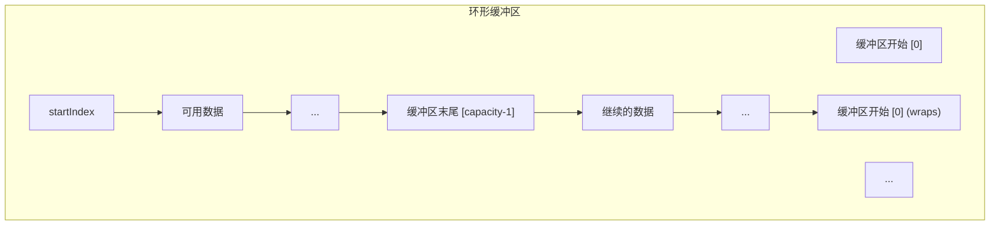

让我来详细解释这个AAudio框架中FIFO缓冲区的核心函数。
Ran tool

## FifoBuffer::fillWrappingBuffer() 函数详解

这是AAudio框架中处理**环形缓冲区(FIFO)**跨界问题的核心函数。让我详细解释其工作原理和实现逻辑。

### 1. 数据结构解析

#### **WrappingBuffer 结构**
```cpp
struct WrappingBuffer {
    enum { SIZE = 2 };
    void *data[SIZE];        // 两个数据指针
    int32_t numFrames[SIZE]; // 对应的帧数
};
```

这个结构设计用来处理环形缓冲区中数据可能**跨越边界**的情况。

### 2. 环形缓冲区跨界问题

#### **问题示意图**



当数据从 `startIndex` 开始，长度超过缓冲区剩余空间时，数据会**环绕**到缓冲区开头。

### 3. 函数逻辑详析

```cpp
void FifoBuffer::fillWrappingBuffer(WrappingBuffer *wrappingBuffer,
                                    int32_t framesAvailable,
                                    int32_t startIndex) {
```

#### **初始化第二部分**
```cpp
wrappingBuffer->data[1] = nullptr;
wrappingBuffer->numFrames[1] = 0;
```
- 默认假设数据不跨界，先清空第二部分

#### **检查是否有可用数据**
```cpp
if (framesAvailable > 0) {
    fifo_frames_t capacity = mFifo->getCapacity();
    uint8_t *source = &mStorage[convertFramesToBytes(startIndex)];
```
- `capacity`: 缓冲区总容量
- `source`: 计算起始位置的字节地址

#### **关键判断：是否跨界**
```cpp
// Does the available data cross the end of the FIFO?
if ((startIndex + framesAvailable) > capacity) {
```

这是核心判断条件：
- `startIndex + framesAvailable > capacity` 表示数据超出了缓冲区边界

### 4. 两种处理情况

#### **情况1：数据跨界** 
```cpp
wrappingBuffer->data[0] = source;
fifo_frames_t firstFrames = capacity - startIndex;  // 第一部分帧数
wrappingBuffer->numFrames[0] = firstFrames;

wrappingBuffer->data[1] = &mStorage[0];             // 从缓冲区开头
wrappingBuffer->numFrames[1] = framesAvailable - firstFrames;  // 剩余帧数
```

**跨界示例：**
```
缓冲区容量: 100 帧
startIndex: 80
framesAvailable: 30 帧

第一部分: [80-99] = 20 帧  
第二部分: [0-9] = 10 帧
总计: 30 帧
```

#### **情况2：数据不跨界**
```cpp
wrappingBuffer->data[0] = source;
wrappingBuffer->numFrames[0] = framesAvailable;
// data[1] 和 numFrames[1] 保持为null和0
```

**连续示例：**
```
缓冲区容量: 100 帧  
startIndex: 30
framesAvailable: 20 帧

第一部分: [30-49] = 20 帧
第二部分: 无
```

### 5. 使用场景

这个函数被两个公共方法调用：

#### **读取数据时**
```cpp
fifo_frames_t FifoBuffer::getFullDataAvailable(WrappingBuffer *wrappingBuffer) {
    fifo_frames_t framesAvailable = std::min(mFifo->getFullFramesAvailable(),
                                             mFifo->getCapacity());
    fifo_frames_t startIndex = mFifo->getReadIndex();  // 读指针位置
    fillWrappingBuffer(wrappingBuffer, framesAvailable, startIndex);
    return framesAvailable;
}
```

#### **写入数据时**
```cpp
fifo_frames_t FifoBuffer::getEmptyRoomAvailable(WrappingBuffer *wrappingBuffer) {
    fifo_frames_t framesAvailable = std::min(mFifo->getEmptyFramesAvailable(),
                                             mFifo->getCapacity());  
    fifo_frames_t startIndex = mFifo->getWriteIndex(); // 写指针位置
    fillWrappingBuffer(wrappingBuffer, framesAvailable, startIndex);
    return framesAvailable;
}
```

### 6. 实际读写操作中的应用

#### **读取操作示例**
```cpp
fifo_frames_t FifoBuffer::read(void *buffer, fifo_frames_t numFrames) {
    WrappingBuffer wrappingBuffer;
    uint8_t *destination = (uint8_t *) buffer;
    
    getFullDataAvailable(&wrappingBuffer);  // 调用fillWrappingBuffer
    
    // 分别处理两部分数据
    int partIndex = 0;
    while (framesLeft > 0 && partIndex < WrappingBuffer::SIZE) {
        if (wrappingBuffer.numFrames[partIndex] > 0) {
            // 拷贝当前部分的数据
            memcpy(destination, wrappingBuffer.data[partIndex], numBytes);
            destination += numBytes;
            framesLeft -= framesToRead;
        }
        partIndex++;  // 处理下一部分
    }
}
```

### 7. 设计优势

1. **零拷贝优化**：只返回指针，不进行数据拷贝
2. **统一接口**：无论是否跨界，使用相同的WrappingBuffer结构  
3. **效率优先**：最多只需要2次内存操作
4. **线程安全**：配合原子操作的读写指针实现无锁FIFO

### 8. 典型使用流程

```cpp
// 1. 获取可读数据的分布
WrappingBuffer wrappingBuffer;
fifo_frames_t available = fifoBuffer.getFullDataAvailable(&wrappingBuffer);

// 2. 处理第一部分数据
if (wrappingBuffer.numFrames[0] > 0) {
    processAudioData(wrappingBuffer.data[0], wrappingBuffer.numFrames[0]);
}

// 3. 处理第二部分数据（如果有跨界）
if (wrappingBuffer.numFrames[1] > 0) {
    processAudioData(wrappingBuffer.data[1], wrappingBuffer.numFrames[1]);
}

// 4. 更新读指针
fifoBuffer.advanceReadIndex(framesProcessed);
```

这个函数是AAudio实现低延迟、高效音频数据传输的关键组件，它巧妙地解决了环形缓冲区的跨界问题，为音频应用提供了简洁统一的数据访问接口。

让我分析一下`WrappingBuffer`这个概念。首先让我查看相关的代码来理解它的作用。
Read file: Audio相关/framework/libaaudio/src/client/AudioStreamInternalPlay.cpp
Ran tool
Read file: Audio相关/framework/libaaudio/src/fifo/FifoBuffer.h
Read file: Audio相关/framework/libaaudio/src/fifo/FifoBuffer.cpp
Read file: Audio相关/framework/libaaudio/src/fifo/FifoBuffer.cpp
Read file: Audio相关/framework/libaaudio/src/client/AudioEndpoint.cpp
基于我看到的代码，让我详细解释`WrappingBuffer`的概念：

## WrappingBuffer详解

### 定义与结构
```cpp
struct WrappingBuffer {
    enum {
        SIZE = 2  // 最多包含2个部分
    };
    void *data[SIZE];      // 指向数据的指针数组
    int32_t numFrames[SIZE]; // 每部分的帧数
};
```

### 核心概念：解决环形缓冲区的"分割问题"

`WrappingBuffer`是为了处理**环形缓冲区（Ring Buffer）**中数据可能被分割成两个不连续部分的问题而设计的。

## 问题场景

### 环形缓冲区的"绕圈"问题
```
环形缓冲区示意图：
┌─────┬─────┬─────┬─────┬─────┬─────┬─────┬─────┐
│  0  │  1  │  2  │  3  │  4  │  5  │  6  │  7  │
└─────┴─────┴─────┴─────┴─────┴─────┴─────┴─────┘
           ↑                               ↑
         Read                           Write

情况1：正常情况 - 数据连续
┌─────┬─────┬─────┬─────┬─────┬─────┬─────┬─────┐
│  ×  │  ×  │ ███ │ ███ │ ███ │ ███ │  ×  │  ×  │
└─────┴─────┴─────┴─────┴─────┴─────┴─────┴─────┘
           ↑               ↑
         Read            Write
可用数据：一个连续块 [2,3,4,5]

情况2：绕圈情况 - 数据被分割
┌─────┬─────┬─────┬─────┬─────┬─────┬─────┬─────┐
│ ███ │ ███ │  ×  │  ×  │  ×  │  ×  │ ███ │ ███ │
└─────┴─────┴─────┴─────┴─────┴─────┴─────┴─────┘
                           ↑       ↑
                        Write    Read
可用数据：两个分离的块 [6,7] + [0,1]
```

## WrappingBuffer的解决方案

### 统一接口处理分割情况
```cpp
// 在AudioStreamInternalPlay::writeNowWithConversion()中的使用
WrappingBuffer wrappingBuffer;

// 1. 获取可用空间（可能是1个或2个不连续的块）
mAudioEndpoint->getEmptyFramesAvailable(&wrappingBuffer);

// 2. 统一处理1个或2个块
int partIndex = 0;
while (framesLeft > 0 && partIndex < WrappingBuffer::SIZE) {
    int32_t framesAvailable = wrappingBuffer.numFrames[partIndex];
    if (framesAvailable > 0) {
        // 处理当前块
        mFlowGraph.process((void *)byteBuffer,
                          wrappingBuffer.data[partIndex],  // 当前块的数据指针
                          framesToWrite);
        
        // 移动到下一块
        byteBuffer += numBytes;
        framesLeft -= framesToWrite;
    }
    partIndex++;  // 处理下一个块（如果存在）
}
```

## 实际使用场景

### 1. 播放场景（写入数据）
```cpp
// 获取环形缓冲区中的空闲空间
mAudioEndpoint->getEmptyFramesAvailable(&wrappingBuffer);

// 可能的返回结果：
// 情况A：连续空间
// wrappingBuffer.data[0] = 指向连续空间的起始地址
// wrappingBuffer.numFrames[0] = 可写入的帧数
// wrappingBuffer.data[1] = nullptr
// wrappingBuffer.numFrames[1] = 0

// 情况B：分割空间（绕圈了）
// wrappingBuffer.data[0] = 指向第一段空间
// wrappingBuffer.numFrames[0] = 第一段的帧数
// wrappingBuffer.data[1] = 指向第二段空间（从缓冲区开头）
// wrappingBuffer.numFrames[1] = 第二段的帧数
```

### 2. 录音场景（读取数据）
```cpp
// AudioStreamInternalCapture中的使用
WrappingBuffer wrappingBuffer;
mAudioEndpoint->getFullFramesAvailable(&wrappingBuffer);

for (int partIndex = 0; framesLeft > 0 && partIndex < WrappingBuffer::SIZE; partIndex++) {
    int32_t framesAvailable = wrappingBuffer.numFrames[partIndex];
    if (framesAvailable > 0) {
        // 从当前块读取数据
        mFlowGraph.process(wrappingBuffer.data[partIndex],
                          (void *)byteBuffer,
                          framesToRead);
    }
}
```

## 优势分析

### 1. **统一的编程接口**
```cpp
// 不管环形缓冲区是否分割，都用同样的循环处理
for (int i = 0; i < WrappingBuffer::SIZE; i++) {
    if (wrappingBuffer.numFrames[i] > 0) {
        // 处理这个块
    }
}
```

### 2. **高效的内存访问**
- 避免额外的内存拷贝
- 直接操作环形缓冲区的原始内存
- 最多只需要2次内存操作（vs 潜在的多次拷贝）

### 3. **简化复杂逻辑**
```cpp
// 传统方式（复杂）
if (writePos + framesToWrite <= bufferSize) {
    // 一次性写入
    memcpy(buffer + writePos, data, framesToWrite * frameSize);
} else {
    // 分两次写入
    int firstPart = bufferSize - writePos;
    memcpy(buffer + writePos, data, firstPart * frameSize);
    memcpy(buffer, data + firstPart * frameSize, 
           (framesToWrite - firstPart) * frameSize);
}

// WrappingBuffer方式（简洁）
for (int i = 0; i < WrappingBuffer::SIZE; i++) {
    if (wrappingBuffer.numFrames[i] > 0) {
        process_data(wrappingBuffer.data[i], wrappingBuffer.numFrames[i]);
    }
}
```

## 总结

`WrappingBuffer`是AAudio中一个**巧妙的抽象设计**，它：

1. **解决了环形缓冲区的分割问题** - 统一处理连续和分割的内存区域
2. **提供了简洁的编程接口** - 不管底层是1个还是2个块，都用同样的循环
3. **保证了高性能** - 零拷贝，直接操作原始内存地址
4. **提高了代码可读性** - 复杂的环形缓冲区逻辑被封装在底层

这种设计让上层的音频处理代码变得**简单、统一、高效**！