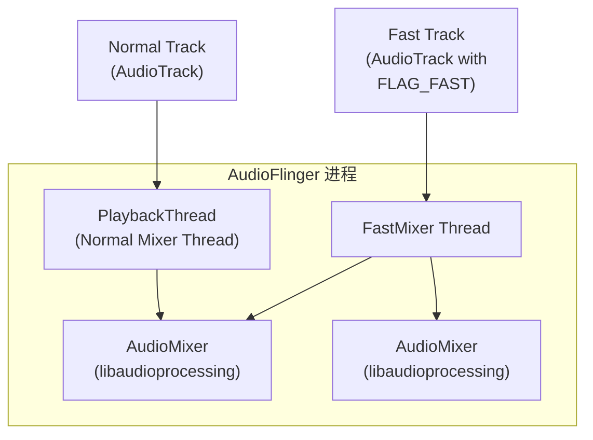
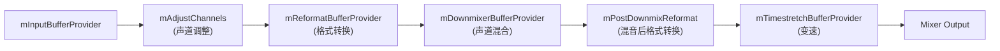
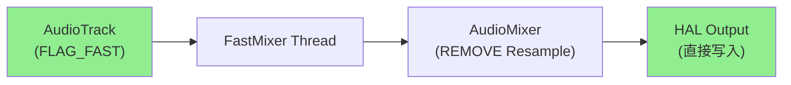
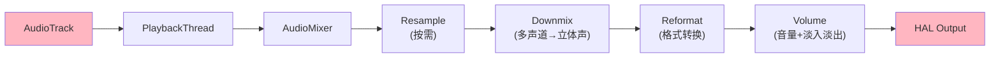

# FastMixer 与 AudioMixer 功能对比

## 概述

| 组件 | 位置 | 类型 | 定位 |
|------|------|------|------|
| **FastMixer** | `framework/audioflinger/FastMixer.cpp` | 独立线程类（继承 FastThread） | **低延迟音频混音**，服务于 Fast Track |
| **AudioMixer** | `framework/libaudioprocessing/AudioMixer.cpp` | 通用混音库（继承 AudioMixerBase） | **通用音频混音引擎**，被 Normal Mixer 和 FastMixer 共同使用 |

> **核心关系**：FastMixer 内部持有 `AudioMixer` 实例，FastMixer 是**线程/调度层**，AudioMixer 是**实际混音计算引擎**。



---

## 1. 架构层次对比

### FastMixer：独立线程，负责调度

FastMixer 是一个 **FastThread 子类**，运行在**高优先级实时线程**，专门处理 Fast Track。

**线程职责**（[FastMixer.cpp:355-569](Audio相关/framework/audioflinger/FastMixer.cpp#L355-L569)）：
- `onStateChange()` — 检测 track 增删/修改，更新 AudioMixer 配置
- `onWork()` — 执行混音和写入 HAL

```cpp
// FastMixer.cpp:272
mMixer = new AudioMixer(frameCount, mSampleRate);  // 创建 AudioMixer 实例
```

### AudioMixer：混音引擎，负责计算

AudioMixer 是**通用混音库**，被 FastMixer 和 Normal Mixer **共同使用**。

**核心职责**：
- `process()` — 执行音频混音计算
- 管理 Track 的各种处理链（Downmix、Reformat、Resample、Volume 等）

---

## 2. Resample（重采样）对比

| 特性 | FastMixer | Normal Mixer (AudioMixer) |
|------|-----------|---------------------------|
| **Resample 支持** | ❌ **禁止**，强制移除 | ✅ 支持，按需启用 |
| **代码位置** | `FastMixer.cpp:197` | `AudioMixer.cpp:436-439` |
| **关键语句** | `setParameter(RESAMPLE, REMOVE)` | `setParameter(RESAMPLE, SAMPLE_RATE)` |

### FastMixer 中 Resample 处理

```cpp
// FastMixer.cpp:197 — 强制移除 resampler
mMixer->setParameter(index, AudioMixer::RESAMPLE, AudioMixer::REMOVE, nullptr);
```

**Fast Track 要求采样率必须完全匹配硬件采样率**（[Threads.cpp:2312-2313](../audioflinger/Threads.cpp#L2312-L2313)）：
```cpp
(sampleRate == mSampleRate)  // 必须相等，否则降级为 Normal Track
```

### Normal Mixer 中 Resample 处理

```cpp
// AudioMixer.cpp:436-439 — 委托给 AudioMixerBase 处理
case RESAMPLE:
    AudioMixerBase::setParameter(name, target, param, value);
    break;
```

在 `prepareTracks_l()` 中设置重采样率（[Threads.cpp:6150-6162](../audioflinger/Threads.cpp#L6150-L6162)）：
```cpp
mAudioMixer->setParameter(trackId, AudioMixer::RESAMPLE, AudioMixer::SAMPLE_RATE,
                          (void *)(uintptr_t)reqSampleRate);
```

---

## 3. Downmix（声道转换）对比

| 特性 | FastMixer | Normal Mixer |
|------|-----------|--------------|
| **Downmix 支持** | ⚠️ **严格限制** | ✅ 完整支持 |
| **Downmix 条件** | 声道必须匹配或不需要 downmixer | 任意声道转换 |

### FastMixer 中 Downmix 限制

```cpp
// Threads.cpp:2305-2309
(channelMask == (mChannelMask | mHapticChannelMask) ||
 mChannelMask != AUDIO_CHANNEL_OUT_STEREO ||
 (channelMask == AUDIO_CHANNEL_OUT_MONO)) &&
```

这意味着 Fast Track 只能接受：
1. **声道完全匹配**硬件声道
2. **Stereo → Mono**（或不需要 downmixer）
3. 声道数较少可直接处理的场景

### Normal Mixer 中 Downmix 完整支持

```cpp
// AudioMixer.cpp:157-198
status_t AudioMixer::Track::prepareForDownmix() {
    // 支持 DownmixerBufferProvider（效果库）
    if (DownmixerBufferProvider::isMultichannelCapable()) {
        mDownmixerBufferProvider.reset(new DownmixerBufferProvider(...));
    }
    // 支持 RemixBufferProvider（软件转换）
    mDownmixerBufferProvider.reset(new RemixBufferProvider(...));
}
```

---

## 4. Format（格式转换）对比

| 特性 | FastMixer | Normal Mixer |
|------|-----------|--------------|
| **Format 转换** | ⚠️ **仅支持线性 PCM** | ✅ 支持多种格式 |
| **支持格式** | PCM_FLOAT, PCM_16_BIT | PCM_FLOAT, PCM_16_BIT, 压缩格式（通过解码） |

### FastMixer 中 Format 限制

```cpp
// Threads.cpp:2303
audio_is_linear_pcm(format)  // 必须是线性 PCM
```

### Normal Mixer 中 Format 转换

```cpp
// AudioMixer.cpp:216-253 — prepareForReformat()
if (mFormat != targetFormat) {
    mReformatBufferProvider.reset(new ReformatBufferProvider(...));
}
```

---

## 5. Buffer Provider 链对比

### FastMixer 的 Buffer Provider 链（简化版）

```
BufferProvider → AudioMixer (直接混音，无中间处理)
```

FastMixer 中 track 配置时只设置：
- BufferProvider（[FastMixer.cpp:180](Audio相关/framework/audioflinger/FastMixer.cpp#L180)）
- Volume（[FastMixer.cpp:194-195](Audio相关/framework/audioflinger/FastMixer.cpp#L194-L195)）
- REMOVE resampler（[FastMixer.cpp:197](Audio相关/framework/audioflinger/FastMixer.cpp#L197)）
- Main buffer（[FastMixer.cpp:198-199](Audio相关/framework/audioflinger/FastMixer.cpp#L198-L199)）

### Normal Mixer 的 Buffer Provider 链（完整版）



---

## 6. 处理能力对比

| 能力 | FastMixer | Normal Mixer (AudioMixer) |
|------|-----------|---------------------------|
| **Track 数量** | 有限（`sMaxFastTracks`），通常 8-32 个 | 几乎无限制 |
| **处理 hook** | 单一固定流程 | 动态选择优化流程 |
| **Volume Ramp** | ✅ 支持 | ✅ 支持 |
| **Timestretch** | ❌ 不支持 | ✅ 支持 |
| **触觉反馈** | ✅ 支持 | ✅ 支持 |
| **MONO_HACK** | 隐式处理 | 显式处理 |
| **Downmixer Effect** | ❌ 不使用 | ✅ 可用 |

### Timestretch（变速不变调）

```cpp
// AudioMixer.cpp:469-490 — 只有 Normal Mixer 支持
status_t AudioMixer::Track::setPlaybackRate(const AudioPlaybackRate &playbackRate) {
    mTimestretchBufferProvider.reset(new TimestretchBufferProvider(...));
}
```

FastMixer 不支持 Timestretch，因为其专注于低延迟直接输出。

---

## 7. 线程模型对比

### FastMixer：实时优先级线程

```cpp
// FastMixer.cpp:64-106
FastMixer::FastMixer(audio_io_handle_t parentIoHandle)
    : FastThread("cycle_ms", "load_us")  // 高优先级线程
```

- **SCHED_FIFO** 或 **SCHED_RR** 调度策略
- **确定性延迟**：周期固定为 `mPeriodNs`（[FastMixer.cpp:292](Audio相关/framework/audioflinger/FastMixer.cpp#L292)）
- 无锁设计：使用 StateQueue 在命令侧和控制侧之间传递状态

### Normal Mixer：普通线程

- 在 PlaybackThread 中运行（[Threads.cpp](../audioflinger/Threads.cpp)）
- 使用常规 mutex/lock 同步
- 处理延迟不严格限制

---

## 8. 配置参数对比

| 配置项 | FastMixer | Normal Mixer |
|--------|-----------|--------------|
| **采样率** | 固定 = HAL 采样率 | 可配置（最大 2x） |
| **声道数** | 固定 | 可配置 |
| **Buffer 大小** | 短（低延迟目标） | 可变 |
| **Track 优先级** | 高 | 普通 |

### FastMixer 的 HAL 配置获取

```cpp
// FastMixer.cpp:248-250
mFormat = mOutputSink->format();
mSampleRate = Format_sampleRate(mFormat);  // 从 HAL sink 获取采样率
mSinkChannelCount = Format_channelCount(mFormat);
```

### Normal Mixer 的 Track 配置

```cpp
// Threads.cpp:6150-6162
uint32_t maxSampleRate = mSampleRate * AUDIO_RESAMPLER_DOWN_RATIO_MAX;  // 最大 2x
```

---

## 9. 关键设计差异总结

| 维度 | FastMixer | Normal Mixer |
|------|-----------|--------------|
| **设计目标** | **最低延迟** | **最大灵活性** |
| **Resample** | 禁止 | 支持 |
| **Downmix** | 严格限制 | 完整支持 |
| **Format** | 仅线性 PCM | 多格式支持 |
| **线程** | 实时优先级独立线程 | 普通 PlaybackThread |
| **Track 槽位** | 有限（~8-32） | 无限制 |
| **Timestretch** | 不支持 | 支持 |
| **锁** | 无锁（StateQueue） | 常规锁 |
| **适用场景** | 游戏音效、UI 反馈、VoIP | 音乐、视频、导航播报 |

---

## 10. 数据流对比

### Fast Track 数据流



**特点**：
- 无 Resample
- 无复杂 Downmix
- 最短数据路径

### Normal Track 数据流



**特点**：
- 可选 Resample
- 完整 Downmix 支持
- 完整格式转换
- Volume Ramp 支持

---

## 11. 代码位置速查

| 功能 | FastMixer | AudioMixer |
|------|-----------|------------|
| 主类 | [FastMixer.cpp:64](../audioflinger/FastMixer.cpp#L64) | [AudioMixer.cpp:62](../libaudioprocessing/AudioMixer.cpp#L62) |
| Resample 移除 | [FastMixer.cpp:197](../audioflinger/FastMixer.cpp#L197) | [AudioMixer.cpp:436](../libaudioprocessing/AudioMixer.cpp#L436) |
| Downmix | 在 createTrack_l 限制 | [AudioMixer.cpp:157-198](../libaudioprocessing/AudioMixer.cpp#L157-L198) |
| Volume 设置 | [FastMixer.cpp:194-195](../audioflinger/FastMixer.cpp#L194-L195) | [AudioMixer.cpp:436-439](../libaudioprocessing/AudioMixer.cpp#L436-L439) |
| Buffer Provider | [FastMixer.cpp:180](../audioflinger/FastMixer.cpp#L180) | [AudioMixer.cpp:492-517](../libaudioprocessing/AudioMixer.cpp#L492-L517) |
| 混音执行 | [FastMixer.cpp:461](../audioflinger/FastMixer.cpp#L461) | 通过 AudioMixerBase |

---

## 12. 结论

1. **FastMixer** 和 **AudioMixer** 是**协作关系**，不是替代关系
   - FastMixer 是**线程调度层**
   - AudioMixer 是**混音计算引擎**

2. **Fast Track 禁用 Resample** 的根本原因：
   - 采样率必须在创建时匹配硬件（`sampleRate == mSampleRate`）
   - 即使匹配，FastMixer 也会主动调用 `REMOVE` 移除 resampler
   - 这是为了保证**确定性低延迟**

3. 选择 Fast Track vs Normal Track 的决策树：
   ```mermaid
   graph TD
       A["AudioTrack 创建"] --> B{"FLAG_FAST?"}
       B -->|"是"| C{"PCM格式?"}
       C -->|"是"| D{"采样率匹配?"}
       D -->|"是"| E{"Stereo声道?"}
       E -->|"是"| F["Fast Track ✓"]
       D -->|"否"| G["降级 Normal Track"]
       E -->|"否"| G
       C -->|"否"| G
       B -->|"否"| H["Normal Track"]
       F --> I["FastMixer → AudioMixer"]
       G --> J["Normal Mixer Thread → AudioMixer"]
       H --> J
   ```
