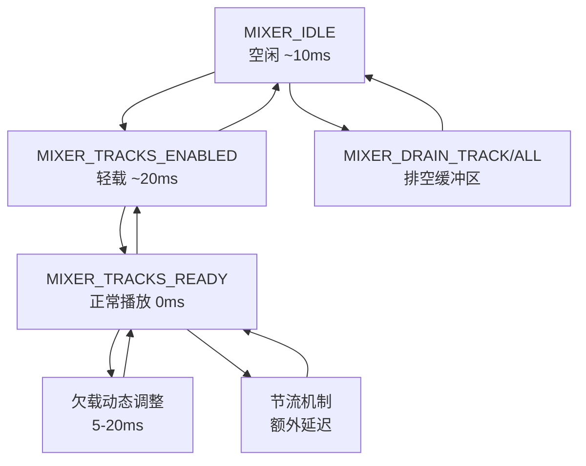

让我分析一下这五种情况具体在什么条件下出现。我需要查看代码中的状态判断逻辑。
Ran tool

Read file: Audio相关/framework/audioflinger/Threads.cpp

Read file: Audio相关/framework/audioflinger/Threads.cpp

Read file: Audio相关/framework/audioflinger/Threads.cpp

Read file: Audio相关/framework/audioflinger/Threads.cpp

Ran tool

Read file: Audio相关/framework/audioflinger/Threads.cpp

Read file: Audio相关/framework/audioflinger/Threads.cpp

Read file: Audio相关/framework/audioflinger/Threads.cpp

基于对代码的深入分析，让我详细解释这五种写入频率控制情况的具体触发条件：

## 五种频率控制情况的触发条件

### 1. **正常播放时** (`mSleepTimeUs = 0`)
**触发条件：**
- **混音状态为 `MIXER_TRACKS_READY`** - 至少有一个活跃track并且有数据准备好
- **在 `threadLoop_mix()` 中会设置**：
  ```cpp
  mSleepTimeUs = 0;  // 立即写入
  ```
- **具体场景：**
  - 应用程序正常播放音频
  - Track缓冲区有足够的音频数据
  - 音频数据混音完成，准备发送给HAL

### 2. **轻载时** (睡眠时间约20ms)
**触发条件：**
- **混音状态为 `MIXER_TRACKS_ENABLED`** - 有活跃track但没有数据准备好
- **在 `threadLoop_sleepTime()` 中设置**：
  ```cpp
  mSleepTimeUs = mActiveSleepTimeUs >> sleepTimeShift;
  // mActiveSleepTimeUs = (mNormalFrameCount * 1000) / mSampleRate * 1000
  ```
- **具体场景：**
  - 音频应用刚启动，还在填充缓冲区
  - 应用程序轻微欠载（underrun），但还在重试范围内
  - 缓冲区临时为空，等待应用程序提供更多数据

### 3. **空闲时** (睡眠时间约10ms)  
**触发条件：**
- **混音状态为 `MIXER_IDLE`** - 没有活跃的tracks
- **设置为 `mIdleSleepTimeUs`**：
  ```cpp
  mSleepTimeUs = mIdleSleepTimeUs;
  // MixerThread: mIdleSleepTimeUs = activeSleepTime / 2
  ```
- **具体场景：**
  - 所有音频应用都停止播放
  - 系统处于音频空闲状态
  - 等待新的音频track启动

### 4. **欠载时** (动态减少睡眠时间，最小5ms)
**触发条件：**
- **连续的应用程序underrun** - track重试次数未达到上限
- **动态调整机制**：
  ```cpp
  // 连续欠载时减少睡眠时间
  if (sleepTimeShift < kMaxThreadSleepTimeShift) {
      sleepTimeShift++;  // 最大移位2位，睡眠时间可降到1/4
  }
  mSleepTimeUs = mActiveSleepTimeUs >> sleepTimeShift;
  if (mSleepTimeUs < kMinThreadSleepTimeUs) {
      mSleepTimeUs = kMinThreadSleepTimeUs;  // 最小5ms
  }
  ```
- **具体场景：**
  - 应用程序写入音频数据速度跟不上播放速度
  - 系统负载高，应用程序被调度延迟
  - 网络音频流缓冲不足

### 5. **过载时** (通过节流机制增加额外延迟)
**触发条件：**
- **写入处理速度过快** - 实际写入时间比预期短很多
- **节流机制判断**：
  ```cpp
  if (mThreadThrottle
          && mMixerStatus == MIXER_TRACKS_READY  // 有数据要混音
          && writePeriodNs > 0) {                // 有写入周期信息
      const int32_t deltaMs = writePeriodNs / NANOS_PER_MILLISECOND;
      const int32_t throttleMs = (int32_t)mHalfBufferMs - deltaMs;
      if (throttleMs > 0) {
          usleep(throttleMs * 1000);  // 额外睡眠
      }
  }
  ```
- **具体场景：**
  - HAL写入速度异常快，可能导致underrun
  - 防止mixer thread处理速度超过预期的2倍
  - 保护使用最小缓冲区大小的应用程序

## 状态转换示意图



## 监控和调试

可以通过以下日志观察这些状态：
```cpp
ALOGV("mMixerStatus=%d mSleepTimeUs=%d", mMixerStatus, mSleepTimeUs);
```

这种多层次的频率控制机制确保了音频系统在各种负载条件下都能：
- 保证音频播放的连续性
- 优化功耗表现  
- 防止系统过载
- 适应不同应用程序的行为模式


# 第四与第五种状态对比
你的理解有一部分是对的，但这两种情况有重要区别。让我重新仔细分析一下代码中的这两种情况：
Ran tool

你的理解需要修正一下。这两种情况虽然都涉及生产者和消费者的速度匹配问题，但它们的**根本原因和表现完全不同**：
Read file: Audio相关/framework/audioflinger/Threads.cpp

## 欠载 vs 过载的本质区别

你的理解有部分正确，但这两种情况有**根本性区别**：

### 1. **欠载 (Underrun)** - 数据供应不足

**原因：** 应用程序(生产者)提供数据**太慢**，跟不上音频播放(消费者)的速度

**表现：**
```cpp
// 检测条件：可用帧数 < 需要的帧数
if (framesReady < desiredFrames && !track->isStopped() && !track->isPaused()) {
    ALOGW("track(%d) underrun, framesReady(%zu) < framesDesired(%zd)",
            trackId, framesReady, desiredFrames);
    underrunFrames = desiredFrames;
}
```

**具体场景：**
- 网络流媒体缓冲不足
- 应用程序被系统调度延迟
- CPU负载高，应用写入数据慢
- 存储I/O速度慢

**处理策略：** **加速检查** - 减少睡眠时间，更频繁地检查是否有新数据
```cpp
// 动态减少睡眠时间
if (sleepTimeShift < kMaxThreadSleepTimeShift) {
    sleepTimeShift++;  // 睡眠时间最少可降到1/4
}
mSleepTimeUs = mActiveSleepTimeUs >> sleepTimeShift;
```

### 2. **过载/节流 (Throttling)** - 处理速度过快

**原因：** Mixer thread处理数据**太快**，可能导致应用程序跟不上

**表现：**
```cpp
// 检测条件：实际处理时间 << 预期时间
const int32_t deltaMs = writePeriodNs / NANOS_PER_MILLISECOND;
const int32_t throttleMs = (int32_t)mHalfBufferMs - deltaMs;
if (throttleMs > 0) {
    // 处理太快了，需要减速
    usleep(throttleMs * 1000);
}
```

**具体场景：**
- HAL写入异常快速
- 设备从standby状态唤醒后的突然数据抽取
- 使用最小缓冲区的应用程序跟不上快速消耗
- 防止mixer线程处理速度超过预期的2倍

**处理策略：** **减速保护** - 强制增加延迟，保护应用程序

## 关键区别总结

| 方面 | 欠载 (Underrun) | 过载 (Throttling) |
|------|----------------|------------------|
| **问题本质** | 数据供应不足 | 处理速度过快 |
| **缓冲区状态** | 空的或不足 | 可能正常或过度消耗 |
| **音频表现** | 卡顿、静音、杂音 | 预防性措施，避免后续underrun |
| **处理方向** | 加速检查(减少睡眠) | 减速处理(增加延迟) |
| **触发条件** | `framesReady < desiredFrames` | `writePeriodNs < mHalfBufferMs` |
| **目标** | 尽快获取新数据 | 保护应用程序跟上节奏 |

## 为什么需要节流机制？

代码注释很清楚地解释了原因：

```cpp
// This helps prevent underruns with NuPlayer and other applications
// which may set up buffers that are close to the minimum size, or use
// deep buffers, and rely on a double-buffering sleep strategy to fill.
//
// The throttle smooths out sudden large data drains from the device,
// e.g. when it comes out of standby, which often causes problems with
// (1) mixer threads without a fast mixer (which has its own warm-up)  
// (2) minimum buffer sized tracks (even if the track is full,
//     the app won't fill fast enough to handle the sudden draw).
```

**节流机制实际上是为了防止underrun**！当mixer处理过快时，会快速消耗应用程序的缓冲区，导致应用程序来不及补充数据，最终还是会导致underrun。

所以这两种机制都是在**不同阶段**保护音频播放的连续性：
- **欠载处理**：已经发生数据不足，加速恢复
- **节流机制**：预防性措施，避免因处理过快导致的未来underrun