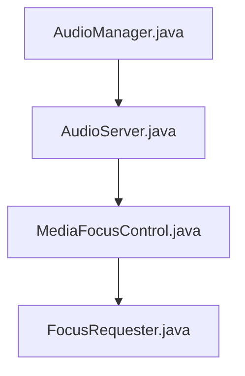
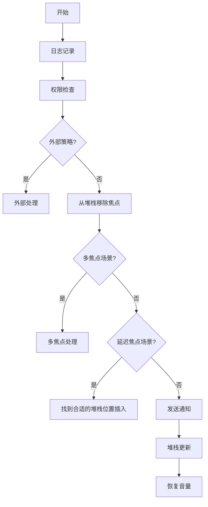

# Android Audio 焦点管理详解
## 1.概述
- **音频焦点**：Android 系统中用于管理多个应用同时播放音频的机制。
- **核心目标**：确保用户在不同应用之间切换时，音频播放行为合理且有序。

## 2.音频焦点的基本概念
### 2.1 什么是音频焦点？
- **定义**：音频焦点是系统为应用分配的一种资源，用于控制音频播放的优先级。
- **作用**：避免多个应用同时播放音频，导致声音混乱。

### 2.2音频焦点的类型

| 焦点类型                        | 使用场景                                                                 |
|----------------------------------|------------------------------------------------------------------------|
| `AUDIOFOCUS_NONE`                | 无焦点状态，通常用于初始化或未请求焦点时。                               |
| `AUDIOFOCUS_GAIN`                | 长时间占用音频焦点，如音乐播放器、视频播放器等。                         |
| `AUDIOFOCUS_GAIN_TRANSIENT`      | 短时获取焦点，失去焦点时暂停播放，如语音提示、通知音等。                 |
| `AUDIOFOCUS_GAIN_TRANSIENT_MAY_DUCK` | 短时获取焦点，失去焦点时降低音量，如导航提示音等。                       |
| `AUDIOFOCUS_GAIN_TRANSIENT_EXCLUSIVE` | 短时获取焦点，失去焦点时完全停止播放，如电话铃声、紧急提示音等。         |


## 3.获取与释放音频焦点
### 3.1获取音频焦点
- **方法**：使用 `AudioManager.requestAudioFocus`。
- **示例代码**：
  ```java
  AudioManager audioManager = (AudioManager) getSystemService(Context.AUDIO_SERVICE);
  int result = audioManager.requestAudioFocus(
      focusChangeListener,
      AudioManager.STREAM_MUSIC,
      AudioManager.AUDIOFOCUS_GAIN
  );
  if (result == AudioManager.AUDIOFOCUS_REQUEST_GRANTED) {
      // 成功获取焦点
  }
  ```
## 3.2释放音频焦点
- **方法**：使用 `AudioManager.abandonAudioFocus`。
- **示例代码**：
```java
  audioManager.abandonAudioFocus(focusChangeListener);
```
## 4.处理音频焦点变化
### 4.1焦点变化事件
| 焦点类型                        | 使用场景                                                                 |
|----------------------------------|------------------------------------------------------------------------|
| `AUDIOFOCUS_LOSS`                | 永久失去焦点，停止播放并释放资源。                                       |
| `AUDIOFOCUS_LOSS_TRANSIENT`      | 暂时失去焦点，暂停播放。                                                 |
| `AUDIOFOCUS_LOSS_TRANSIENT_CAN_DUCK` | 暂时失去焦点，降低音量。                                                 |


### 4.2实现 OnAudioFocusChangeListener
- **示例代码**：
```java
  AudioManager.OnAudioFocusChangeListener focusChangeListener = new AudioManager.OnAudioFocusChangeListener() {
    @Override
    public void onAudioFocusChange(int focusChange) {
        switch (focusChange) {
            case AudioManager.AUDIOFOCUS_GAIN:
                // 恢复播放
                break;
            case AudioManager.AUDIOFOCUS_LOSS:
                // 停止播放
                break;
            case AudioManager.AUDIOFOCUS_LOSS_TRANSIENT:
                // 暂停播放
                break;
            case AudioManager.AUDIOFOCUS_LOSS_TRANSIENT_CAN_DUCK:
                // 降低音量
                break;
        }
    }
};
```

## 5.代码分析
### 5.1requestAudioFocus分析

在AudioManager中做了如下工作：
- 检查传入的 AudioManager.OnAudioFocusChangeListener 是否为空。
- 检查音频流类型（如 AudioManager.STREAM_MUSIC）是否有效。
- 检查焦点请求类型（如 AUDIOFOCUS_GAIN）是否合法。
- 将传参打包成`AudioFocusRequest`对象，并且生成`FocusRequestInfo`存储到mAudioFocusIdListenerMap中便于后续管理和触发焦点变化事件。
- 通过binder调用`AudioService.java`接口`requestAudioFocus` 
在AudioService.java中做了如下工作：
- 初始化MediaMetrics,这说明这个方法有日志记录的功能，帮助开发者跟踪焦点请求的情况。
- 完成权限和参数校验

```java
    protected int requestAudioFocus(@NonNull AudioAttributes aa, int focusChangeHint, IBinder cb,
            IAudioFocusDispatcher fd, @NonNull String clientId, @NonNull String callingPackageName,
            int flags, int sdk, boolean forceDuck, int testUid) {

        // we need a valid binder callback for clients
        if (!cb.pingBinder()) {
            Log.e(TAG, " AudioFocus DOA client for requestAudioFocus(), aborting.");
            return AudioManager.AUDIOFOCUS_REQUEST_FAILED;
        }
        synchronized(mAudioFocusLock) {
            if (mFocusStack.size() > MAX_STACK_SIZE) {
                Log.e(TAG, "Max AudioFocus stack size reached, failing requestAudioFocus()");
                return AudioManager.AUDIOFOCUS_REQUEST_FAILED;
            }

            boolean enteringRingOrCall = !mRingOrCallActive
                    & (AudioSystem.IN_VOICE_COMM_FOCUS_ID.compareTo(clientId) == 0);
            if (enteringRingOrCall) { mRingOrCallActive = true; }

            final AudioFocusInfo afiForExtPolicy;
            if (mFocusPolicy != null) {
                // construct AudioFocusInfo as it will be communicated to audio focus policy
                afiForExtPolicy = new AudioFocusInfo(aa, uid,
                        clientId, callingPackageName, focusChangeHint, 0 /*lossReceived*/,
                        flags, sdk);
            } else {
                afiForExtPolicy = null;
            }
            // handle delayed focus
            boolean focusGrantDelayed = false;
            if (!canReassignAudioFocus()) {
                if ((flags & AudioManager.AUDIOFOCUS_FLAG_DELAY_OK) == 0) {
                    return AudioManager.AUDIOFOCUS_REQUEST_FAILED;
                } else {
                    // request has AUDIOFOCUS_FLAG_DELAY_OK: focus can't be
                    // granted right now, so the requester will be inserted in the focus stack
                    // to receive focus later
                    focusGrantDelayed = true;
                }
            }
            // external focus policy?
            if (mFocusPolicy != null) {
                if (notifyExtFocusPolicyFocusRequest_syncAf(afiForExtPolicy, fd, cb)) {
                    // stop handling focus request here as it is handled by external audio
                    // focus policy (return code will be handled in AudioManager)
                    return AudioManager.AUDIOFOCUS_REQUEST_WAITING_FOR_EXT_POLICY;
                } else {
                    // an error occured, client already dead, bail early
                    return AudioManager.AUDIOFOCUS_REQUEST_FAILED;
                }
            }
            AudioFocusDeathHandler afdh = new AudioFocusDeathHandler(cb);
            try {
                cb.linkToDeath(afdh, 0);
            } catch (RemoteException e) {
                // client has already died!
                Log.w(TAG, "AudioFocus  requestAudioFocus() could not link to "+cb+" binder death");
                return AudioManager.AUDIOFOCUS_REQUEST_FAILED;
            }
            if (!mFocusStack.empty() && mFocusStack.peek().hasSameClient(clientId)) {
                // if focus is already owned by this client and the reason for acquiring the focus
                // hasn't changed, don't do anything
                final FocusRequester fr = mFocusStack.peek();
                if (fr.getGainRequest() == focusChangeHint && fr.getGrantFlags() == flags) {
                    // unlink death handler so it can be gc'ed.
                    // linkToDeath() creates a JNI global reference preventing collection.
                    cb.unlinkToDeath(afdh, 0);
                    notifyExtPolicyFocusGrant_syncAf(fr.toAudioFocusInfo(),
                            AudioManager.AUDIOFOCUS_REQUEST_GRANTED);
                    return AudioManager.AUDIOFOCUS_REQUEST_GRANTED;
                }
                // the reason for the audio focus request has changed: remove the current top of
                // stack and respond as if we had a new focus owner
                if (!focusGrantDelayed) {
                    mFocusStack.pop();
                    // the entry that was "popped" is the same that was "peeked" above
                    fr.release();
                }
            }

            // focus requester might already be somewhere below in the stack, remove it
            removeFocusStackEntry(clientId, false /* signal */, false /*notifyFocusFollowers*/);

            final FocusRequester nfr = new FocusRequester(aa, focusChangeHint, flags, fd, cb,
                    clientId, afdh, callingPackageName, uid, this, sdk);

            if (mMultiAudioFocusEnabled
                    && (focusChangeHint == AudioManager.AUDIOFOCUS_GAIN)) {
                if (enteringRingOrCall) {
                    if (!mMultiAudioFocusList.isEmpty()) {
                        for (FocusRequester multifr : mMultiAudioFocusList) {
                            multifr.handleFocusLossFromGain(focusChangeHint, nfr, forceDuck);
                        }
                    }
                } else {
                    boolean needAdd = true;
                    if (!mMultiAudioFocusList.isEmpty()) {
                        for (FocusRequester multifr : mMultiAudioFocusList) {
                            if (multifr.getClientUid() == Binder.getCallingUid()) {
                                needAdd = false;
                                break;
                            }
                        }
                    }
                    if (needAdd) {
                        mMultiAudioFocusList.add(nfr);
                    }
                    nfr.handleFocusGainFromRequest(AudioManager.AUDIOFOCUS_REQUEST_GRANTED);
                    notifyExtPolicyFocusGrant_syncAf(nfr.toAudioFocusInfo(),
                            AudioManager.AUDIOFOCUS_REQUEST_GRANTED);
                    return AudioManager.AUDIOFOCUS_REQUEST_GRANTED;
                }
            }
            if (focusGrantDelayed) {
                //找到最后一个被锁定的焦点所有者（exclusive focus owner）的位置，然后将nfr插入到该位置之下
                final int requestResult = pushBelowLockedFocusOwners(nfr);
                if (requestResult != AudioManager.AUDIOFOCUS_REQUEST_FAILED) {
                    notifyExtPolicyFocusGrant_syncAf(nfr.toAudioFocusInfo(), requestResult);
                }
                return requestResult;
            } else {
                // propagate the focus change through the stack
                propagateFocusLossFromGain_syncAf(focusChangeHint, nfr, forceDuck);
                // push focus requester at the top of the audio focus stack
                mFocusStack.push(nfr);
                nfr.handleFocusGainFromRequest(AudioManager.AUDIOFOCUS_REQUEST_GRANTED);
            }
            notifyExtPolicyFocusGrant_syncAf(nfr.toAudioFocusInfo(),
                    AudioManager.AUDIOFOCUS_REQUEST_GRANTED);

            if (ENFORCE_MUTING_FOR_RING_OR_CALL & enteringRingOrCall) {
                runAudioCheckerForRingOrCallAsync(true/*enteringRingOrCall*/);
            }
        }//synchronized(mAudioFocusLock)

        return AudioManager.AUDIOFOCUS_REQUEST_GRANTED;
    }

```
在MediaFocusControl.java中做了如下工作：
- 检查Binder的存活状态来确保客户端有效，如果客户端已经死亡，则直接返回失败
- 电话或铃声场景的特殊情况，设置相关标志位 enteringRingOrCall
- 构建AudioFocusInfo
- 当存在外部焦点策略（mFocusPolicy）时，方法将焦点请求转发给外部策略处理，并根据返回结果决定是否继续内部处理  比如CarAudio
- 注册死亡通知，确保在客户端死亡时能正确释放焦点，避免资源泄漏。
- 如果当前堆栈顶部的焦点请求者与当前客户端相同且参数未变，则通知外部焦点策略然后直接返回已授予状态，避免重复处理，
- 移除旧的焦点请求从堆栈中
- 生成FocusRequester对象
- 根据是否启用多音频焦点（mMultiAudioFocusEnabled）来处理不同的场景
- 对于延迟授予焦点的情况（AUDIOFOCUS_FLAG_DELAY_OK），方法将新请求插入堆栈中的适当位置，等待后续处理。否则，立即传播焦点变化，并更新焦点堆栈。
- 最后，方法处理进入电话或铃声场景时的音频检查，确保系统音频状态正确更新，并返回焦点请求的结果。


### 5.2.propagateFocusLossFromGain_syncAf分析
这个函数的作用就是给注册的焦点发送焦点loss的消息。
```mermaid
graph TD
    A[MediaFocusControl.java]
     -->|handleFocusLossFromGain| B[FocusRequester.java]
    B -->|dispatchAudioFocusChange| C[AudioManager.java]
 ```  
直接来看FocusRequester.java中的代码
```java
    void handleFocusLossFromGain(int focusChange, FocusRequester requester, boolean forceDuck) {
        if (mAudioFocusDispatcher != null) {
            mAudioFocusDispatcher.dispatchAudioFocusChange(focusChange, requester);
        } else {
            dispatchAudioFocusChange(focusChange, requester);
        }
    }
```

- 1、2、3分别是A、B和C申请焦点，分别在栈中的位置以及其丢失焦点类型
3步骤C申请AUDIOFOCUS_GAIN_TRANSIENT_MAY_DUCK时，会根据MediaFocusControl的ENFORCE_DUCKING 来决定谁负责降音，true由framework进行降音，false将会以AUDIOFOCUS_LOSS_TRANSIENT_CAN_DUCK类型返回给B，由B自己负责降音
- 4步骤是再次申请焦点时，
1）如果申请者A再次申请，已经存在栈中但又不在栈顶，则先移除栈中的A，在从新push到栈顶
2）如果申请者C再次申请，已经存在且在栈顶，并且申请的焦点类型与之前相同就直接返回给C获得焦点；反之申请焦点类型不同，则会移除栈顶C，然后在重新push到栈顶
- 4步骤释放abandon焦点；何时释放焦点呢？
1）焦点使用者播放完音频资源后主动释放焦点
2）焦点使用者收到了LOSS_GAIN永久丢失焦点类型，主动释放焦点
释放规则如上图，自行查看
### 5.3frameworkHandleFocusLoss
frameworkHandleFocusLoss来负责framework的降音逻辑，如果返回值是true那么代表framework已经处理过了不需要通知app，如果是false那么就是需要通知app处理
**注意**
焦点切换发生在同一个应用内时，framework不会处理，而是直接返回false，由应用自己处理
框架处理焦点丢失的主要场景包括：
- 降低音量：当焦点丢失类型为 AUDIOFOCUS_LOSS_TRANSIENT_CAN_DUCK 且满足特定条件时，由框架强制处理 ducking。
- 淡出播放：当焦点丢失类型为 AUDIOFOCUS_LOSS 且满足特定条件时，由框架处理淡出逻辑。
其他情况：通常由应用自己处理焦点丢失事件。
### 5.4 dispatchAudioFocusChange
在AudioManager.java中dispatchAudioFocusChange会从mAudioFocusIdListenerMap找到指定的app,然后把焦点改变的消息通知给app。app在自身做相应的处理。

# 6.总结
音频焦点框架主要就是对各个APP的焦点进行注册、通知、释放。焦点释放可能会在framework完成那么app也就收不到相应的焦点通知了。
# 参考链接
https://blog.csdn.net/jackzhouyu/article/details/130527253?ops_request_misc=%257B%2522request%255Fid%2522%253A%25226a043c2db23192475d075cb14bd2cd11%2522%252C%2522scm%2522%253A%252220140713.130102334.pc%255Fblog.%2522%257D&request_id=6a043c2db23192475d075cb14bd2cd11&biz_id=0&utm_medium=distribute.pc_search_result.none-task-blog-2~blog~first_rank_ecpm_v1~rank_v31_ecpm-1-130527253-null-null.nonecase&utm_term=%E7%84%A6%E7%82%B9&spm=1018.2226.3001.4450
