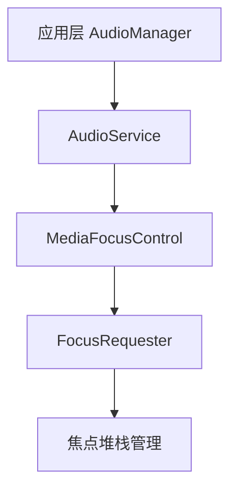

# 🎯 音频焦点管理知识卡片

## 📋 基本信息
- **主题**: Android音频焦点管理机制
- **核心概念**: 系统级音频播放优先级控制
- **重要性**: ⭐⭐⭐⭐⭐ (关键系统机制)
- **适用场景**: 多应用音频播放协调

## 🎯 核心概念

### 什么是音频焦点？
**定义**: Android系统中用于管理多个应用同时播放音频的机制，确保用户在不同应用间切换时音频行为合理有序。

**类比理解**: 就像会议室里的"发言权" - 同一时间只能有一个应用"发言"（播放音频），其他应用需要等待或降低音量。

## 📊 焦点类型速查表

| 焦点类型 | 代码常量 | 使用场景 | 失去焦点时的行为 |
|---------|---------|---------|----------------|
| **长时间焦点** | `AUDIOFOCUS_GAIN` | 音乐播放器、视频播放器 | 停止播放 |
| **短时焦点** | `AUDIOFOCUS_GAIN_TRANSIENT` | 语音提示、通知音 | 暂停播放 |
| **短时可降音** | `AUDIOFOCUS_GAIN_TRANSIENT_MAY_DUCK` | 导航提示音 | 降低音量 |
| **短时独占** | `AUDIOFOCUS_GAIN_TRANSIENT_EXCLUSIVE` | 电话铃声、紧急提示 | 完全停止 |

## 🔧 关键API使用

### 获取焦点
```java
AudioManager audioManager = (AudioManager) getSystemService(Context.AUDIO_SERVICE);
int result = audioManager.requestAudioFocus(
    focusChangeListener,
    AudioManager.STREAM_MUSIC,
    AudioManager.AUDIOFOCUS_GAIN
);
```

### 释放焦点
```java
audioManager.abandonAudioFocus(focusChangeListener);
```

### 焦点变化监听
```java
AudioManager.OnAudioFocusChangeListener listener = new AudioManager.OnAudioFocusChangeListener() {
    @Override
    public void onAudioFocusChange(int focusChange) {
        switch (focusChange) {
            case AudioManager.AUDIOFOCUS_GAIN:
                // 恢复播放
                break;
            case AudioManager.AUDIOFOCUS_LOSS:
                // 停止播放
                break;
            case AudioManager.AUDIOFOCUS_LOSS_TRANSIENT:
                // 暂停播放
                break;
            case AudioManager.AUDIOFOCUS_LOSS_TRANSIENT_CAN_DUCK:
                // 降低音量
                break;
        }
    }
};
```

## 🏗️ 系统架构理解

### 请求流程


### 核心组件
1. **AudioManager** - 应用层接口
2. **AudioService** - 系统服务
3. **MediaFocusControl** - 焦点控制中心
4. **FocusRequester** - 焦点请求者封装
5. **焦点堆栈** - LIFO结构管理焦点优先级

## 💡 关键机制

### 1. 焦点堆栈 (Focus Stack)
- **LIFO结构** - 后进先出
- **栈顶应用** - 拥有当前焦点
- **堆栈更新** - 新焦点请求触发重新评估

### 2. 多音频焦点 (Multi-Audio Focus)
- 特定场景支持多个应用同时播放
- 主要用于电话/铃声场景
- 通过`mMultiAudioFocusEnabled`控制

### 3. 延迟焦点授予
- 使用`AUDIOFOCUS_FLAG_DELAY_OK`标志
- 当前有独占焦点时排队等待
- 适合非紧急音频播放

### 4. 框架处理 vs 应用处理
- **框架处理**: 强制降音、淡出播放
- **应用处理**: 收到通知后自行调整
- **判断逻辑**: `frameworkHandleFocusLoss()`返回值

## 🚨 常见问题与解决方案

### 问题1: 音频无声
**可能原因**: 未成功获取焦点
**解决方案**: 检查`requestAudioFocus()`返回值

### 问题2: 多个应用同时播放
**可能原因**: 焦点释放不及时
**解决方案**: 播放结束后立即调用`abandonAudioFocus()`

### 问题3: 音量突然变化
**可能原因**: 其他应用获取`MAY_DUCK`焦点
**解决方案**: 正确处理`AUDIOFOCUS_LOSS_TRANSIENT_CAN_DUCK`

## 📈 学习要点总结

### 必须掌握
✅ 四种焦点类型的区别和应用场景
✅ `requestAudioFocus()`和`abandonAudioFocus()`的正确使用
✅ 焦点变化监听器的实现

### 深入理解
✅ 焦点堆栈的工作原理
✅ 框架处理与应用处理的区别
✅ 多音频焦点机制

### 高级应用
✅ 延迟焦点授予的使用场景
✅ 自定义焦点策略（如车载音频）
✅ 性能优化和资源管理

## 🔗 关联知识点

### 前置知识
- [[Android进程通信/AIDL/VolumeService/|Binder通信机制]]
- [[Audio/功能分析/AAudio/AAudio学习|AAudio基础]]

### 相关技术
- [[Audio/CarAudioDocument|车载音频焦点管理]]
- [[Audio/功能分析/配置加载/Android16配置加载|音频配置加载]]

### 扩展学习
- [[Audio/问题分析/audioserver如何找到android.hardware.audio.service|AudioServer服务发现]]
- [[Audio/功能分析/延时/latency|音频延迟控制]]

## 🧪 实践建议

### 代码练习
1. 实现一个简单的音乐播放器，正确处理焦点
2. 模拟多应用场景，测试焦点切换
3. 实现音量ducking效果

### 调试技巧
```bash
# 查看焦点相关日志
adb logcat -s AudioFocus:V

# 查看AudioService状态
adb shell dumpsys audio
```

### 测试场景
1. 播放音乐时接听电话
2. 导航提示与音乐播放共存
3. 多个媒体应用切换

## 📚 参考资料
- [Android官方文档 - 音频焦点](https://developer.android.com/guide/topics/media-apps/audio-focus)
- [[安卓audio焦点|详细源码分析笔记]]
- 相关代码位置: `frameworks/base/media/java/android/media/AudioManager.java`

---

**最后更新**: 2026-02-15
**掌握程度**: ⭐⭐⭐⭐☆ (4/5星)
**下次复习**: 2026-03-01
**学习心得**: 音频焦点是Android多任务音频管理的核心机制，理解其堆栈模型和状态转换对开发稳定的音频应用至关重要。