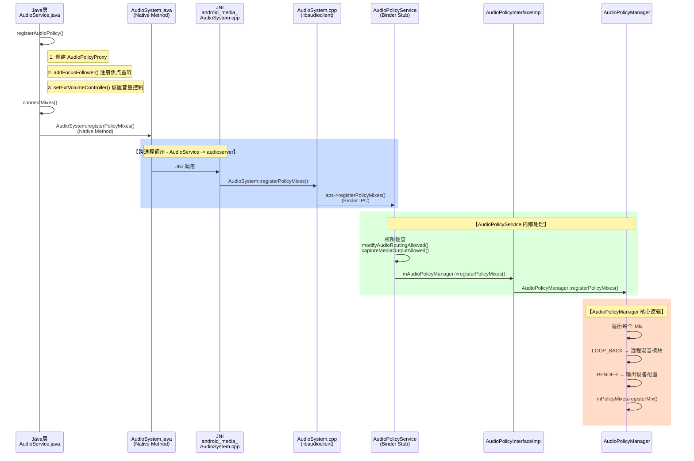

# AudioPolicy 注册到 APM 的完整流程

## 流程概览



---

## 1. Java 层入口

**文件**: `AudioService.java:9728`

```java
public String registerAudioPolicy(AudioPolicyConfig policyConfig, IAudioPolicyCallback pcb,
        boolean hasFocusListener, boolean isFocusPolicy, boolean isTestFocusPolicy,
        boolean isVolumeController, IMediaProjection projection) {

    // 1. 设置动态策略回调
    AudioSystem.setDynamicPolicyCallback(mDynPolicyCallback);

    // 2. 权限检查
    if (!isPolicyRegisterAllowed(policyConfig, ...)) {
        return null;
    }

    // 3. 创建 AudioPolicyProxy
    AudioPolicyProxy app = new AudioPolicyProxy(policyConfig, pcb, hasFocusListener,
            isFocusPolicy, isTestFocusPolicy, isVolumeController, projection);

    // 4. 关键：连接 Mixes（触发 Native 调用）
    int status = connectMixes();
    if (status != AudioSystem.SUCCESS) {
        release();
        throw new IllegalStateException("Could not connect mix, error: " + status);
    }

    return regId;
}
```

---

## 2. AudioPolicyProxy 构造

**文件**: `AudioService.java:10397`

```java
AudioPolicyProxy(AudioPolicyConfig config, IAudioPolicyCallback token, ...) {
    super(config);
    setRegistration(new String(config.hashCode() + ":ap:" + mAudioPolicyCounter++));

    // 注册焦点监听
    if (mHasFocusListener) {
        mMediaFocusControl.addFocusFollower(mPolicyCallback);
        if (isFocusPolicy) {
            mMediaFocusControl.setFocusPolicy(mPolicyCallback, isTestFocusPolicy);
        }
    }

    // 设置外部音量控制器
    if (mIsVolumeController) {
        setExtVolumeController(mPolicyCallback);
    }

    // MediaProjection 处理
    if (mProjection != null) {
        mProjectionCallback = new UnregisterOnStopCallback();
        mProjection.registerCallback(mProjectionCallback);
    }

    // 关键：连接 Mixes
    int status = connectMixes();
}
```

---

## 3. 连接 Mixes

**文件**: `AudioService.java:10526`

```java
int connectMixes() {
    final long identity = Binder.clearCallingIdentity();
    // 调用 Native 方法
    int status = mAudioSystem.registerPolicyMixes(mMixes, true);
    Binder.restoreCallingIdentity(identity);
    return status;
}
```

---

## 4. Native 层转换

**文件**: `AudioSystem.cpp:1724` (libaudioclient)

```cpp
status_t AudioSystem::registerPolicyMixes(const Vector<AudioMix>& mixes, bool registration) {
    // 获取 AudioPolicyService Binder 代理
    const sp<IAudioPolicyService>& aps = AudioSystem::get_audio_policy_service();
    if (aps == 0) return PERMISSION_DENIED;

    // 限制 Mix 数量
    size_t mixesSize = std::min(mixes.size(), size_t{MAX_MIXES_PER_POLICY});

    // 转换为 AIDL 格式
    std::vector<media::AudioMix> mixesAidl;
    RETURN_STATUS_IF_ERROR(
            convertRange(mixes.begin(), mixes.begin() + mixesSize, std::back_inserter(mixesAidl),
                         legacy2aidl_AudioMix));

    // Binder 调用到 AudioPolicyService
    return statusTFromBinderStatus(aps->registerPolicyMixes(mixesAidl, registration));
}
```

---

## 5. AudioPolicyService 处理

**文件**: `AudioPolicyInterfaceImpl.cpp:1228`

```cpp
status_t AudioPolicyService::registerPolicyMixes(const Vector<AudioMix>& mixes, bool registration)
{
    Mutex::Autolock _l(mLock);

    // 检查是否需要修改音频路由权限
    bool needModifyAudioRouting = std::any_of(mixes.begin(), mixes.end(), [](auto& mix) {
        return !is_mix_loopback_render(mix.mRouteFlags); });
    if (needModifyAudioRouting && !modifyAudioRoutingAllowed()) {
        return PERMISSION_DENIED;
    }

    // 检查媒体输出捕获权限
    bool needCaptureMediaOutput = std::any_of(mixes.begin(), mixes.end(), [](auto& mix) {
        return mix.mAllowPrivilegedPlaybackCapture; });
    if (needCaptureMediaOutput && !captureMediaOutputAllowed(callingPid, callingUid)) {
        return PERMISSION_DENIED;
    }

    // 转发到 AudioPolicyManager
    if (registration) {
        return mAudioPolicyManager->registerPolicyMixes(mixes);
    } else {
        return mAudioPolicyManager->unregisterPolicyMixes(mixes);
    }
}
```

---

## 6. AudioPolicyManager 核心逻辑

**文件**: `AudioPolicyManager.cpp:3376`

```cpp
AudioPolicyManager::registerPolicyMixes(const Vector<AudioMix> &mixes) {
    ALOGV("registerPolicyMixes() %zu mix(es)", mixes.size());
    status_t res = NO_ERROR;
    sp<HwModule> rSubmixModule;

    // 遍历每个 Mix
    for (size_t i = 0; i < mixes.size(); i++) {
        AudioMix mix = mixes[i];

        // LOOP_BACK 类型：远程混音录制
        if ((mix.mRouteFlags & MIX_ROUTE_FLAG_LOOP_BACK) == MIX_ROUTE_FLAG_LOOP_BACK) {
            // 查找远程混音模块
            rSubmixModule = mHwModules.getModuleFromName(
                AUDIO_HARDWARE_MODULE_ID_REMOTE_SUBMIX);

            // 设置设备类型
            if (mix.mMixType == MIX_TYPE_PLAYERS) {
                mix.mDeviceType = AUDIO_DEVICE_OUT_REMOTE_SUBMIX;
            } else {
                mix.mDeviceType = AUDIO_DEVICE_IN_REMOTE_SUBMIX;
            }

            // 注册 Mix
            mPolicyMixes.registerMix(mix, 0);
        }

        // RENDER 类型：音频渲染输出
        if ((mix.mRouteFlags & MIX_ROUTE_FLAG_RENDER) == MIX_ROUTE_FLAG_RENDER) {
            // 配置输出设备
            mPolicyMixes.registerMix(mix, outputDesc);
        }
    }
    return res;
}
```

---

## 总结

| 层级 | 文件 | 职责 |
|------|------|------|
| **Java** | `AudioService.java` | 创建 AudioPolicyProxy，调用 Native 方法 |
| **Framework** | `AudioSystem.java` | Native 方法声明 |
| **JNI** | `android_media_AudioSystem.cpp` | JNI 桥接 |
| **libaudioclient** | `AudioSystem.cpp` | 转换为 AIDL，发起 Binder 调用 |
| **AudioPolicyService** | `AudioPolicyInterfaceImpl.cpp` | 权限检查，转发请求 |
| **AudioPolicyManager** | `AudioPolicyManager.cpp` | **核心逻辑**：注册 Mixes 到策略引擎 |

**核心机制**：`registerPolicyMixes()` 将 Java 层的 `AudioMix` 配置通过 Binder IPC 传递到 `AudioPolicyService`，最终由 `AudioPolicyManager` 的 `mPolicyMixes` 集合管理，实现音频路由策略的动态配置。
