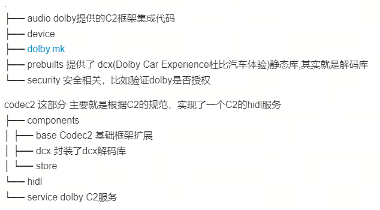

# Android C2 模块接入 Dolby 音效解码库技术文档

## 1. C2-Dolby集成图


## 2. C2-Dolby结构


    
## 3. 集成C2-Dolby服务

从第二部分可知在codec2目录下存在一个hidl目录，该目录中的内容就是一个HIDL服务。 主要工作也是将该服务在系统中跑起来，其实到这里dolby集成已经完成了一大部分了。

## 4. 文件配置

- 修改mediacodec配置文件
在集成完C2-dolby服务之后，还需要修改配置文件，告诉mediacodec现在有这种解码功能，根据dolby释放出来的解码功能有三种分别是ac3、eac3、eac3-joc。
星河中在media_codecs_sw.xml中增加如下内容
```xml
        <MediaCodec name="c2.dolby.dcx.decoder" >
            <Type name="audio/ac3">
                <Limit name="channel-count" max="16" />
                <Limit name="sample-rate" ranges="48000" />
                <Limit name="bitrate" range="256000-1024000" />
            </Type>
            <Type name="audio/eac3">
                <Limit name="channel-count" max="16" />
                <Limit name="sample-rate" ranges="48000" />
                <Limit name="bitrate" range="256000-1024000" />
            </Type>
            <Type name="audio/eac3-joc">
                <Limit name="channel-count" max="16" />
                <Limit name="sample-rate" ranges="48000" />
                <Limit name="bitrate" range="256000-1024000" />
            </Type>
        </MediaCodec>
```

- 修改APM配置文件 audio_policy_configuration.xml
需要将解码后的pcm数据绑定指定bus，例如解码后的数据是7.1.2声道更改如下

```xml
<mixPort name="media_hifi_712" role="source"
  flags="AUDIO_OUTPUT_FLAG_DIRECT">
  <profile name="" format="AUDIO_FORMAT_PCM_32_BIT"
    samplingRates="48000" channelMasks="AUDIO_CHANNEL_OUT_7POINT1POINT2"/>
  <profile name="" format="AUDIO_FORMAT_PCM_32_BIT"
    samplingRates="48000" channelMasks="AUDIO_CHANNEL_OUT_7POINT1POINT4"/>
  <profile name="" format="AUDIO_FORMAT_PCM_32_BIT"
    samplingRates="48000" channelMasks="AUDIO_CHANNEL_OUT_7POINT1"/>
  <profile name="" format="AUDIO_FORMAT_PCM_32_BIT"
    samplingRates="48000" channelMasks="AUDIO_CHANNEL_OUT_5POINT1POINT4"/>
  <profile name="" format="AUDIO_FORMAT_PCM_32_BIT"
    samplingRates="48000" channelMasks="AUDIO_CHANNEL_OUT_5POINT1POINT2"/>
  <profile name="" format="AUDIO_FORMAT_PCM_32_BIT"
    samplingRates="48000" channelMasks="AUDIO_CHANNEL_OUT_5POINT1"/>
</mixPort>

<devicePort tagName="Media Hifi 712 Bus" role="sink" type="AUDIO_DEVICE_OUT_BUS"
            address="BUS15_MEDIA_HIFI_712_OUT">
    <profile name="" format="AUDIO_FORMAT_PCM_32_BIT"
             samplingRates="48000" channelMasks="AUDIO_CHANNEL_OUT_7POINT1POINT2"/>
    <profile name="" format="AUDIO_FORMAT_PCM_32_BIT"
             samplingRates="48000" channelMasks="AUDIO_CHANNEL_OUT_7POINT1"/>
    <profile name="" format="AUDIO_FORMAT_PCM_32_BIT"
             samplingRates="48000" channelMasks="AUDIO_CHANNEL_OUT_5POINT1POINT4"/>
    <profile name="" format="AUDIO_FORMAT_PCM_32_BIT"
             samplingRates="48000" channelMasks="AUDIO_CHANNEL_OUT_5POINT1POINT2"/>
    <profile name="" format="AUDIO_FORMAT_PCM_32_BIT"
             samplingRates="48000" channelMasks="AUDIO_CHANNEL_OUT_5POINT1"/>
    <profile name="" format="AUDIO_FORMAT_PCM_32_BIT"
             samplingRates="48000" channelMasks="AUDIO_CHANNEL_OUT_7POINT1POINT4"/>
    <gains>
        <gain name="" mode="AUDIO_GAIN_MODE_JOINT"
              minValueMB="0" maxValueMB="39" defaultValueMB="15" stepValueMB="1"/>
    </gains>
</devicePort>
<route type="mix" sink="Media Hifi 712 Bus"
        sources="media_hifi_712"/>
```
理论上应该也需要修改car_audio_policy.configuration.xml 但是星河动态路由使用的是私有的模块，因此没有使用该文件
- 增加dolby_dcx_config.xml  该文件的作用就是配置dolby解码参数,如下配置输出7.1.2声道 类型为float的pcm数据
```xml
<?xml version="1.0" encoding="utf-8"?>
<dolbyCarExperienceConfiguration version="1.0">
    <globalConfiguration dynamicRangeCompressionMode="RF" outputChannelConfig="7.1.2" outputFormat="PCM_FLOAT"/>
</dolbyCarExperienceConfiguration>
```

到此配置就结束了