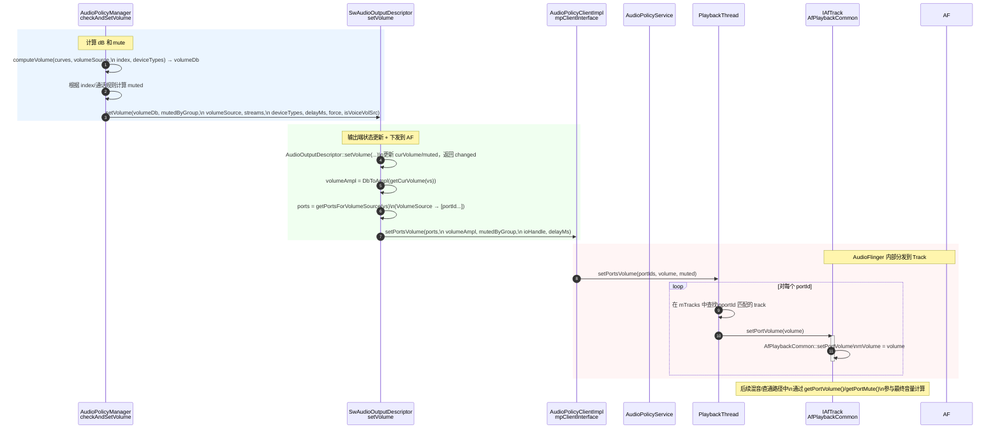

# 问题描述
写入audiohal反应送入dsp的数据过小。

# 分析过程
通过dump数据发现 audiotrack层与audioflinger层写入数据不同，因此确定是在AudioFlinge做了数据处理。因为使用的是Mixthread,那么也就是说在混音的时候做了音量操作。
查看代码发现如下流程

从流程图可知 在APM中会进行computeVolume的计算，然后将计算结果送入到Track中。 在AF中有如下逻辑：
```c++
PlaybackThread::mixer_state MixerThread::prepareTracks_l() {
     volume = masterVolume * track->getPortVolume();
     //AudioTrack中 setVolume设置的值
    gain_minifloat_packed_t vlr = proxy->getVolumeLR();
    vlf = float_from_gain(gain_minifloat_unpack_left(vlr));
    vrf = float_from_gain(gain_minifloat_unpack_right(vlr));
     vlf *= volume;
     vrf *= volume;
    mAudioMixer->setParameter(trackId, param, AudioMixer::VOLUME0, &vlf);
    mAudioMixer->setParameter(trackId, param, AudioMixer::VOLUME1, &vrf);
    mAudioMixer->setParameter(trackId, param, AudioMixer::AUXLEVEL, &vaf);
}
```
说白了就是在computeVolume通过index计算出来一个增益（一定是负的），然后设置给AudioMixer，在做混音的时候会把设置的这个负增益做计算，从而实现降音的功能。
那么接下来我们就看一下这个index是多少，通过使用命令adb shell dumpsys   media.audio_policy 
发现如下信息
*Android12 平台*
    -AUDIO_STREAM_MUSIC (id: 7)
      Volume Curves Streams/Attributes, Curve points Streams for device category (index, attenuation in millibel)
       Streams: AUDIO_STREAM_MUSIC(3)  
       Attributes: { Content type: AUDIO_CONTENT_TYPE_UNKNOWN Usage: AUDIO_USAGE_MEDIA Source: AUDIO_SOURCE_DEFAULT Flags: 0x0 Tags:  }
                    { Content type: AUDIO_CONTENT_TYPE_UNKNOWN Usage: AUDIO_USAGE_GAME Source: AUDIO_SOURCE_DEFAULT Flags: 0x0 Tags:  }
                    { Content type: AUDIO_CONTENT_TYPE_UNKNOWN Usage: AUDIO_USAGE_ASSISTANT Source: AUDIO_SOURCE_DEFAULT Flags: 0x0 Tags:  }
                    { Content type: AUDIO_CONTENT_TYPE_UNKNOWN Usage: AUDIO_USAGE_ASSISTANCE_NAVIGATION_GUIDANCE Source: AUDIO_SOURCE_DEFAULT Flags: 0x0 Tags:  }
                    { Any }
       DEVICE_CATEGORY_HEADSET : { (  1, -5800),  ( 20, -4000),  ( 60, -1700),  (100,     0) }
       DEVICE_CATEGORY_SPEAKER : { (  1, -5800),  ( 20, -4000),  ( 60, -1700),  (100,     0) }
       DEVICE_CATEGORY_EARPIECE : { (  1, -5800),  ( 20, -4000),  ( 60, -1700),  (100,     0) }
       DEVICE_CATEGORY_EXT_MEDIA : { (  1, -5800),  ( 20, -4000),  ( 60, -1700),  (100,     0) }
       DEVICE_CATEGORY_HEARING_AID : { (  1, -12700),  ( 20, -8000),  ( 60, -4000),  (100,     0) }
        Can be muted  Index Min  Index Max  Index Cur [device : index]...
        true          00         15         0004 : 15, 0008 : 15, 1000000 : 15, 4000000 : 15, 40000000 : 15, 

*Android16 平台*
    -AUDIO_STREAM_MUSIC (id: 11)
      Volume Curves Streams/Attributes, Curve points Streams for device category (index, attenuation in millibel)
       Streams: AUDIO_STREAM_MUSIC(3)  
       Attributes: { Content type: AUDIO_CONTENT_TYPE_UNKNOWN Usage: AUDIO_USAGE_MEDIA Source: AUDIO_SOURCE_DEFAULT Flags: 0x0 Tags:  }
                    { Content type: AUDIO_CONTENT_TYPE_UNKNOWN Usage: AUDIO_USAGE_GAME Source: AUDIO_SOURCE_DEFAULT Flags: 0x0 Tags:  }
                    { Content type: AUDIO_CONTENT_TYPE_UNKNOWN Usage: AUDIO_USAGE_ASSISTANT Source: AUDIO_SOURCE_DEFAULT Flags: 0x0 Tags:  }
                    { Content type: AUDIO_CONTENT_TYPE_UNKNOWN Usage: AUDIO_USAGE_ASSISTANCE_NAVIGATION_GUIDANCE Source: AUDIO_SOURCE_DEFAULT Flags: 0x0 Tags:  }
                    { Any }
       DEVICE_CATEGORY_HEADSET : { (  1, -5800),  ( 20, -4000),  ( 60, -1700),  (100,     0) }
       DEVICE_CATEGORY_SPEAKER : { (  1, -5800),  ( 20, -4000),  ( 60, -1700),  (100,     0) }
       DEVICE_CATEGORY_EARPIECE : { (  1, -5800),  ( 20, -4000),  ( 60, -1700),  (100,     0) }
       DEVICE_CATEGORY_EXT_MEDIA : { (  1, -5800),  ( 20, -4000),  ( 60, -1700),  (100,     0) }
       DEVICE_CATEGORY_HEARING_AID : { (  1, -12700),  ( 20, -8000),  ( 60, -4000),  (100,     0) }
        Can be muted  Index Min  Index Max  Index Cur [device : index]...
        true          00         15         0002 : 05, 0080 : 02, 0100 : 02, 4000000 : 03, 20000000 : 02, 20000002 : 02, 40000000 : 05, 
上面信息展示了*AUDIO_STREAM_MUSIC*音量曲线与当前的音量值。 从audio_policy_volumes.xml 与default_volume_tables.xml解析出来的。
对比发现AN12的cur_index 都是15，而AN16各不相同。那么看就是这个值导致的。

adb shell dumpsys   media.audio_flinger 
  Local log:
                                                         Type     Id Active Client(pid/uid) Session Port Id S  Flags   Format Chn mask  SRate ST Usg CT  G db  L dB  R dB  VS dB  PortVol dB  PortMuted   Server FrmCnt  FrmRdy F Underruns  Flushed BitPerfect InternalMute   Latency
   12-09 08:08:13.791 CFG_EVENT_CREATE_AUDIO_PATCH: old device  (Empty device types) new device 0x1000000 (AUDIO_DEVICE_OUT_BUS)
   12-09 08:08:19.998 CFG_EVENT_CREATE_AUDIO_PATCH: old device 0x1000000 (AUDIO_DEVICE_OUT_BUS) new device 0x1000000 (AUDIO_DEVICE_OUT_BUS)
   12-09 08:11:58.608 AT::add       (0xb400007a23a154a8)          56     no   28186/      0     289      49 A  0x000 00000001 00000003  48000  3   1  0  -inf     0     0     0          -33      false 00000000   8192       0 f         0        0      false        false       new
   12-09 08:12:01.984 AT::remove    (0xb400007a23a154a8)          56     no   28186/      0     289      49 T  0x600 00000001 00000003  48000  3   1  0   -33     0     0     0          -33      false 00025080   8192    7040 f         0        0      false        false  295.29 k
   12-09 08:12:01.985 removeTrack_l (0xb400007a23a154a8)          56     no   28186/      0     289      49 T  0x600 00000001 00000003  48000  3   1  0   -33     0     0     0          -33      false 00025080   8192    7040 f         0        0      false        false  295.29 k
   12-09 08:12:16.262 AT::add       (0xb400007a23a14088)          57     no   29985/      0     297      50 A  0x000 00000001 00000003  48000  3   1  0  -inf     0     0     0          -33      false 00000000   8192       0 f         0        0      false        false       new
   12-09 08:12:20.143 AT::remove    (0xb400007a23a14088)          57     no   29985/      0     297      50 T  0x600 00000001 00000003  48000  3   1  0   -33     0     0     0          -33      false 0002B200   8192    5632 f         0        0      false        false  265.29 k
   12-09 08:12:20.143 removeTrack_l (0xb400007a23a14088)          57     no   29985/      0     297      50 T  0x600 00000001 00000003  48000  3   1  0   -33     0     0     0          -33      false 0002B200   8192    5632 f         0        0      false        false  265.29 k
   12-09 08:12:30.503 AT::add       (0xb400007a23a0fa18)          58     no   31433/      0     305      51 A  0x000 00000001 00000003  48000  3   1  0  -inf     0     0     0          -33      false 00000000   8192       0 f         0        0      false        false       new
   12-09 08:12:50.622 AT::remove    (0xb400007a23a0fa18)          58     no   31433/      0     305      51 T  0x600 00000001 00000003  48000  3   1  0   -33     0     0     0          -33      false 000E9700   8192    3328 f         0        0      false        false  216.79 k
   12-09 08:12:50.622 removeTrack_l (0xb400007a23a0fa18)          58     no   31433/      0     305      51 T  0x600 00000001 00000003  48000  3   1  0   -33     0     0     0          -33      false 000E9700   8192    3328 f         0        0      false        false  216.79 k

-33db代表这个 track被降音-33db.
那么说一定有一个地方存了这个值并且设置下来了，但是APM解析的XML是没有这个音量值的。通过查阅资料发现AudioService.java 在AudioService初始化的时候会设置默认值。
```java 
AudioService.java

   /** Maximum volume index values for audio streams */
    protected static int[] MAX_STREAM_VOLUME = new int[] {
        5,  // STREAM_VOICE_CALL
        7,  // STREAM_SYSTEM
        7,  // STREAM_RING
        15, // STREAM_MUSIC
        7,  // STREAM_ALARM
        7,  // STREAM_NOTIFICATION
        15, // STREAM_BLUETOOTH_SCO
        7,  // STREAM_SYSTEM_ENFORCED
        15, // STREAM_DTMF
        15, // STREAM_TTS
        15, // STREAM_ACCESSIBILITY
        15  // STREAM_ASSISTANT
    };

    /** Minimum volume index values for audio streams */
    protected static int[] MIN_STREAM_VOLUME = new int[] {
        1,  // STREAM_VOICE_CALL
        0,  // STREAM_SYSTEM
        0,  // STREAM_RING
        0,  // STREAM_MUSIC
        1,  // STREAM_ALARM
        0,  // STREAM_NOTIFICATION
        0,  // STREAM_BLUETOOTH_SCO
        0,  // STREAM_SYSTEM_ENFORCED
        0,  // STREAM_DTMF
        0,  // STREAM_TTS
        1,  // STREAM_ACCESSIBILITY
        0   // STREAM_ASSISTANT
    };
```
看到这知道了AN12的index=15是哪里来的了，就是这个最大值。开机设置初始化音量的流程就不分析了，总之是会设置的通过函数`initVolumeGroupStates`。
那么就要分析为什么AN12都是设置的这个最大值呢。
通过查阅代码发现了mUseFixedVolume 这个值是控制是否使用自定义音量的，如果启动那么设置给APM的都是MAX_STREAM_VOLUME。
只有设置给APM是最大值，在经过computeVolume返回值才是0，意味这对PCM数据没有影响
# 原因
原因就是mUseFixedVolume没有设置导致没有使用自定义音量，走了原生逻辑。
# 解决方案
*framwork/base/core/res/res/values/config.xml*
```xml  
 <bool name="config_useFixedVolume">true</bool>
```

