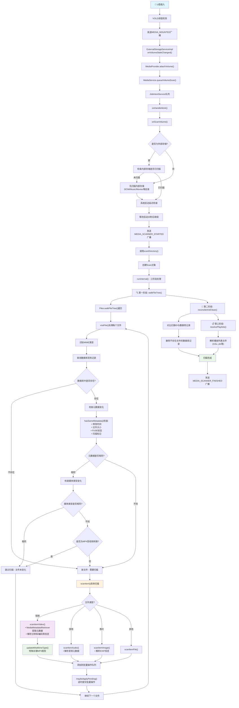
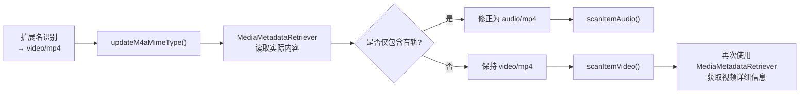

# 1. MediaProvider提供了哪些功能
# 2. Scan功能是如何触发的
我们使用USB拔插来分析scan与停止。代码如下:
```java
ExternalStorageServiceImpl.java
    public void onVolumeStateChanged(@NonNull StorageVolume vol) throws IOException {
        Objects.requireNonNull(vol);

        MediaProvider mediaProvider = getMediaProvider();
        Log.i(TAG, "onVolumeStateChanged: the new state is " + vol.getState());
        switch(vol.getState()) {
            case Environment.MEDIA_MOUNTED:
                MediaVolume volume = MediaVolume.fromStorageVolume(vol);
                mediaProvider.attachVolume(volume, /* validate */ false);
                MediaService.queueVolumeScan(mediaProvider.getContext(), volume, REASON_MOUNTED);
                break;
            case Environment.MEDIA_UNMOUNTED:
            case Environment.MEDIA_EJECTING:
            case Environment.MEDIA_REMOVED:
            case Environment.MEDIA_BAD_REMOVAL:
                mediaProvider.detachVolume(MediaVolume.fromStorageVolume(vol));
                break;
            default:
                Log.i(TAG, "Ignoring volume state for vol:" + vol.getMediaStoreVolumeName()
                        + ". State: " + vol.getState());
        }
        // Check for invalidation of cached volumes
        mediaProvider.updateVolumes();
    }
```
当插入U盘的时候，VOLD进程会发送广播mounted,`onVolumeStateChanged`会接受到该消息然后媒体扫描的流程。当拔下来U盘VOLD会发送`EJECTING`消息，然后停止扫描。我们先看扫描流程。
## 2.1 开始扫描
当插入U盘之后会打印如下log
```xml
ExternalStorageServiceImpl: onVolumeStateChanged: the new state is mounted
```
```java
MediaService.java
   public static MediaVolume fromStorageVolume(StorageVolume storageVolume) {
        String name = storageVolume.getMediaStoreVolumeName();
        UserHandle user = storageVolume.getOwner();
        File path = storageVolume.getDirectory();
        String id = storageVolume.getId();
        return new MediaVolume(name, user, path, id);
    }
```
`fromStorageVolume`函数没啥说的就是把参数StorageVolume中的信息作为参数，new 一个MediaVolume出来。
```java
MediaProvider.java
 /**
     * 挂载媒体卷到系统中
     * @param volume 要挂载的媒体卷对象
     * @param validate 是否验证卷的有效性
     * @return 挂载后的内容URI
     */
    public Uri attachVolume(MediaVolume volume, boolean validate) {
        // 安全检查：只允许系统进程调用此方法
        if (mCallingIdentity.get().pid != android.os.Process.myPid()) {
            throw new SecurityException(
                    "Opening and closing databases not allowed.");
        }

        // 获取卷名称
        final String volumeName = volume.getName();

        // 快速检查卷名称的合法性，防止恶意卷名
        MediaStore.checkArgumentVolumeName(volumeName);

        // 如果不是内部存储且需要验证，则检查卷是否真实存在
        if (!MediaStore.VOLUME_INTERNAL.equals(volumeName) && validate) {
            try {
                getVolumePath(volumeName); // 尝试获取卷路径
            } catch (IOException e) {
                throw new IllegalArgumentException(
                        "Volume " + volume + " currently unavailable", e);
            }
        }

        // 将卷添加到已挂载卷列表中（线程安全）
        synchronized (mAttachedVolumes) {
            mAttachedVolumes.add(volume);
        }

        // 获取内容解析器并构建基础URI
        final ContentResolver resolver = getContext().getContentResolver();
        final Uri uri = getBaseContentUri(volumeName);
        // TODO(b/182396009) 可能还需要通知克隆配置文件（反之亦然）
        resolver.notifyChange(getBaseContentUri(volumeName), null);

        // 记录卷挂载日志
        //MediaProvider: Attached volume: MediaVolume name: [a2c2-1723] id: [8:1] user: [UserHandle{0}] path: [/storage/usb1]
        if (LOGV) Log.v(TAG, "Attached volume: " + volume);
        
        // 如果不是内部存储，进行额外处理
        if (!MediaStore.VOLUME_INTERNAL.equals(volumeName)) {
            // 同时通知所有设备的合成视图
            resolver.notifyChange(getBaseContentUri(MediaStore.VOLUME_EXTERNAL), null);

            // 在后台线程执行数据库操作，避免阻塞主线程
            ForegroundThread.getExecutor().execute(() -> {
                mExternalDatabase.runWithTransaction((db) -> {
                    /*
                     * 仅获取模拟路径的路径
                     * 不包含USB路径
                     * 因为当USB状态不佳时，频繁访问USB会导致IO等待
                     */
                    if (MediaStore.VOLUME_EXTERNAL_PRIMARY.equals(volume)) {
                        // 对于主要外部存储，确保默认文件夹存在
                        ensureDefaultFolders(volume, db);
                        // 确保缩略图有效
                        ensureThumbnailsValid(volume, db);
                    } else { // USB存储卷
                        // 对于USB卷，跳过默认文件夹和缩略图检查以避免性能问题
                        Log.e(TAG, "not call ensureDefaultFolders and ensureThumbnailsValid: " + volume);
                    }
                    return null;
                });

                // 数据库操作完成后，通知DocumentProvider数据库已准备就绪
                // 这样它就可以安全地响应查询而不会导致ANR（应用无响应）
                MediaDocumentsProvider.onMediaStoreReady(getContext(), volumeName);
            });
        }
        return uri;
    }
```
```java
MediaService.java
    public static void queueVolumeScan(Context context, MediaVolume volume, int reason) {
        Intent intent = new Intent(ACTION_SCAN_VOLUME);
        intent.putExtra(EXTRA_MEDIAVOLUME, volume) ;
        intent.putExtra(EXTRA_SCAN_REASON, reason);
        enqueueWork(context, intent);
    }
       public static void enqueueWork(Context context, Intent work) {
        enqueueWork(context, MediaService.class, JOB_ID, work);
    }

        @Override
    protected void onHandleWork(Intent intent) {
        Trace.beginSection(intent.getAction());
        Log.i(TAG, "Begin " + intent);
        try {
            switch (intent.getAction()) {
                case ACTION_SCAN_VOLUME: {
                    final MediaVolume volume = intent.getParcelableExtra(EXTRA_MEDIAVOLUME);
                    int reason = intent.getIntExtra(EXTRA_SCAN_REASON, REASON_DEMAND);
                    onScanVolume(this, volume, reason);
                    break;
                }
                default: {
                    Log.w(TAG, "Unknown intent " + intent);
                    break;
                }
            }
        } catch (Exception e) {
            Log.w(TAG, "Failed operation " + intent, e);
        } finally {
            if (Log.isLoggable(TAG, Log.INFO)) {
                Log.i(TAG, "End " + intent);
            }
            Trace.endSection();
        }
    }
```  
`enqueueWork`用于将Intent任务加入到 JobIntentService 的工作队列中。注意`MediaService extends JobIntentService`

目的是如下
- 将各种媒体相关的Intent操作加入后台处理队列
- 确保重量级操作不会阻塞主线程
- 提供生命周期保护，避免任务被系统杀掉
`enqueueWork`发送消息会在`onHandleWork`中处理，然后调用`onScanVolume`函数。
```java

    /**
     * 扫描指定的媒体卷（存储卷）
     * 这是媒体扫描的核心方法，负责扫描内部存储或外部存储设备中的媒体文件
     * 
     * @param context 上下文对象
     * @param volume 要扫描的媒体卷
     * @param reason 扫描原因（如：挂载触发、手动触发等）
     * @throws IOException 如果扫描过程中发生IO异常
     */
    public static void onScanVolume(Context context, MediaVolume volume, int reason)
            throws IOException {
        // 获取卷名称（如：internal、external_primary等）
        final String volumeName = volume.getName();
        
        // 获取卷的用户句柄，用于多用户环境下的权限控制
        UserHandle owner = volume.getUser();
        if (owner == null) {
            // 内部存储卷可能没有特定用户，使用当前上下文的用户
            owner = context.getUser();
        }
        
        // 【优先级策略】如果要扫描外部存储，先确保内部存储已扫描
        // 这样做是为了确保在可能很长的外部存储扫描之前，铃声等系统资源已准备就绪
        // 注意：如果是由块设备挂载触发的内部扫描，则忽略此逻辑
        Log.i(TAG, "onScanVolume sInternalScanned = " + sInternalScanned);
        if (!MediaStore.VOLUME_INTERNAL.equals(volumeName) &&
                (reason != REASON_MOUNTED || !sInternalScanned)) {
            // 标记内部存储已扫描，避免重复扫描
            sInternalScanned = true;
            // 递归调用，先扫描内部存储
            onScanVolume(context, MediaVolume.fromInternal(), reason);
            // 确保默认铃声可用
            RingtoneManager.ensureDefaultRingtones(context);
        }

        // 为该卷相关的所有广播Intent解析Uri
        // 这样做是为了确保在卷被弹出的情况下仍能传递所有事件
        final Uri broadcastUri;
        if (!MediaStore.VOLUME_INTERNAL.equals(volumeName)) {
            // 外部存储：使用文件路径创建Uri
            broadcastUri = Uri.fromFile(volume.getPath());
        } else {
            // 内部存储：不需要广播Uri
            broadcastUri = null;
        }

        // 使用try-with-resources确保ContentProviderClient正确释放
        try (ContentProviderClient cpc = context.getContentResolver()
                .acquireContentProviderClient(MediaStore.AUTHORITY)) {
            // 获取MediaProvider实例
            final MediaProvider provider = ((MediaProvider) cpc.getLocalContentProvider());
            
            // 【重要】附加卷到MediaProvider，并进行验证
            provider.attachVolume(volume, /* validate */ true);

            // 包装ContentResolver用于数据库操作
            final ContentResolver resolver = ContentResolver.wrap(cpc.getLocalContentProvider());

            // 在媒体扫描表中插入扫描记录，标记扫描开始
            ContentValues values = new ContentValues();
            values.put(MediaStore.MEDIA_SCANNER_VOLUME, volumeName);
            Uri scanUri = resolver.insert(MediaStore.getMediaScannerUri(), values);

            // 【USB设备特殊处理】如果是USB存储设备
            if (broadcastUri != null && broadcastUri.toString().contains("/storage/usb")) {
                Log.i(TAG, "deleteItemsIfNecessary starting...");
                // 删除必要的过时条目（可能是之前未正确卸载的文件记录）
                provider.deleteItemsIfNecessary(context, broadcastUri);
                
                // 【启动延迟策略】确保系统启动完成后有足够的稳定时间
                long durationTimeMs = 0;
                if(sBootCompleteTimeMs != null){
                    // 计算从启动完成到现在的时间
                    durationTimeMs = Duration.between(sBootCompleteTimeMs, LocalDateTime.now()).toMillis();
                }
                // 如果启动时间不足20秒，等待到20秒再继续扫描
                if(durationTimeMs < sBootCompleteWaitTimeMs ) {
                    try {
                        Thread.sleep(sBootCompleteWaitTimeMs - durationTimeMs);
                    } catch (InterruptedException e) {
                        e.printStackTrace();
                    }
                }
            }

            // 【广播：扫描开始】通知系统和应用媒体扫描已开始
            if (broadcastUri != null) {
                context.sendBroadcastAsUser(
                        new Intent(Intent.ACTION_MEDIA_SCANNER_STARTED, broadcastUri), owner);
            }

            // 【核心扫描逻辑】根据卷类型执行不同的扫描策略
            if (MediaStore.VOLUME_INTERNAL.equals(volumeName)) {
                // 内部存储：扫描多个预定义目录（如DCIM、Music、Movies等）
                for (File dir : FileUtils.getVolumeScanPaths(context, volumeName)) {
                    provider.scanDirectory(dir, reason);
                }
            } else {
                // 外部存储：直接扫描整个卷的根目录
                provider.scanDirectory(volume.getPath(), reason);
            }

            // 删除扫描记录，标记扫描完成
            resolver.delete(scanUri, null, null);

        } finally {
            // 【广播：扫描完成】无论成功或失败，都要通知扫描结束
            if (broadcastUri != null) {
                context.sendBroadcastAsUser(
                        new Intent(Intent.ACTION_MEDIA_SCANNER_FINISHED, broadcastUri), owner);
            }
        }
    }
```
`onScanVolume`可知要先扫面内部存储才会扫描外部，并且还要等系统启动了20s之后才开始scan,scan之前会通知注册的app我要开始scan了，scan结束之后也会通知app我们这边看的是U盘因此关注函数。并且对于内部存储会扫描指定的几个目录，外部存储扫描整个根目录`scanDirectory`
```java
ModernMediaScanner.java
  public void scanDirectory(File file, int reason) {
        try (Scan scan = new Scan(file, reason, /*ownerPackage*/ null)) {
            scan.run();
        } catch (OperationCanceledException ignored) {
        } catch (FileNotFoundException e) {
           Log.e(TAG, "Couldn't find directory to scan", e) ;
        }
    }
    public Scan(File root, int reason, @Nullable String ownerPackage)
                throws FileNotFoundException {
            ·····
            mSignal = new CancellationSignal()
            ···
        }
    public void run() {
            addActiveScan(this);
            try {
                runInternal();
            } finally {
                removeActiveScan(this);
            }
        }
       /**
         * 媒体扫描的核心执行方法
         * 按照三个阶段完成完整的媒体库扫描和同步过程
         */
        private void runInternal() {
            // 【第一阶段】文件系统扫描
            // 遍历指定位置下所有应该可见的文件，并跟踪已扫描的文件ID
            walkFileTree();

            // 【第二阶段】数据库同步与清理
            // 将数据库中已知的所有条目与上面扫描到的条目进行对比和同步
            if (mSingleFile && mScannedIds.size() == 1) {
                // 性能优化：如果是单文件扫描且成功扫描到该文件，可以安全跳过此步骤
                // 因为单文件扫描不需要清理其他无关的数据库记录
            } else {
                // 执行数据库同步：添加新文件、更新修改的文件、删除不存在的文件记录
                reconcileAndClean();
            }

            // 【第三阶段】播放列表解析
            // 解析扫描过程中发现的所有播放列表文件（如m3u、pls等）
            resolvePlaylists();
        }

        /**
         * 遍历文件树，执行文件系统级别的媒体文件扫描
         * 这是媒体扫描的第一阶段，负责发现和处理文件系统中的媒体文件
         */
        private void walkFileTree() {
            // 【取消检查】确保扫描任务没有被取消
            mSignal.throwIfCanceled();
            
            // 【目录权限检查】判断目标目录是否可扫描以及是否为隐藏目录
            // 单文件扫描时检查父目录，目录扫描时检查根目录本身
            final Pair<Boolean, Boolean> isDirScannableAndHidden =
                    shouldScanPathAndIsPathHidden(mSingleFile ? mRoot.getParentFile() : mRoot);
            
            if (isDirScannableAndHidden.first) {
                // 该目录可以被扫描，开始执行文件遍历
                Trace.beginSection("walkFileTree");

                if (isDirScannableAndHidden.second) {
                    // 该目录是隐藏目录，增加隐藏目录计数
                    mHiddenDirCount++;
                }
                
                // 【文件锁处理】单文件扫描时需要获取父目录锁，防止并发访问冲突
                if (mSingleFile) {
                    acquireDirectoryLock(mRoot.getParentFile().toPath());
                }
                
                try {
                    // 【核心文件遍历】根据存储类型采用不同的遍历策略
                    if (mFilesUri.equals(MediaStore.Files.EXTERNAL_CONTENT_URI)) {
                        // USB外部存储：限制目录层级深度为mMaxScanDepth（通常为8层） 这个值是在integers.xml配置文件中定义的
                        // 这是根据SRD（系统需求文档）的要求，避免过深的目录结构导致性能问题
                        Files.walkFileTree(mRoot.toPath(), EnumSet.noneOf(FileVisitOption.class), mMaxScanDepth, this);
                    } else {
                        // 内部存储或其他存储：不限制深度，完整遍历
                        Files.walkFileTree(mRoot.toPath(), this);
                    }
                    
                    // 【批量处理】应用所有待处理的数据库操作
                    // 在文件遍历过程中，数据库操作被缓存起来，这里统一执行以提高性能
                    applyPending();
                    
                } catch (IOException e) {
                    // 【异常处理】文件遍历过程中发生IO异常
                    // 这种情况理论上不应该发生，如果发生说明有严重问题
                    throw new IllegalStateException(e);
                } finally {
                    // 【资源清理】确保在任何情况下都能正确释放资源
                    if (mSingleFile) {
                        // 释放单文件扫描时获取的目录锁
                        releaseDirectoryLock(mRoot.getParentFile().toPath());
                    }
                    // 结束性能跟踪
                    Trace.endSection();
                }
            }
        }
```
这么看主要的 扫描操作还要看函数`walkFileTree`,这个函数在文件Files.java中。注意这个传参this是不ModernMediaScanner这个对象类传了进去。在`walkFileTree`中会调用`this->visitFile`函数。
```java

        /**
         * 文件访问处理方法 - FileVisitor接口的核心实现
         * 负责处理文件树遍历过程中遇到的每个文件和目录
         * 
         * @param file 当前访问的文件路径
         * @param attrs 文件的基本属性信息
         * @return FileVisitResult.CONTINUE 继续遍历
         * @throws IOException 文件访问异常
         */
        @Override
        public FileVisitResult visitFile(Path file, BasicFileAttributes attrs)
                throws IOException {
            if (LOGV) Log.v(TAG, "Visiting " + file);
            
            // 【统计计数】增加已处理文件数量
            mFileCount++;

            // 【性能优化策略】跳过已扫描且未发生变化的文件
            // 避免重复处理相同内容，提高扫描效率
            final File realFile = file.toFile();
            long existingId = -1;  // 数据库中的现有记录ID

            // 【MIME类型识别】根据文件类型确定MIME类型
            String actualMimeType;
            if (attrs.isDirectory()) {
                // 目录没有MIME类型
                actualMimeType = null;
            } else {
                // 通过文件扩展名和内容识别MIME类型
                actualMimeType = MimeUtils.resolveMimeType(realFile);
            }

            // 【DRM文件特殊处理】解析受保护文件的原始MIME类型
            // DRM文件需要特殊处理以获取其真实的媒体类型
            final boolean isDrm = mDrmMimeTypes.contains(actualMimeType);
            if (isDrm) {
                // 获取DRM文件包装前的原始MIME类型
                actualMimeType = mDrmClient.getOriginalMimeType(realFile.getPath());
            }

            // 【媒体类型转换】将MIME类型映射到MediaStore的媒体类型常量
            int actualMediaType = mediaTypeFromMimeType(
                    realFile, actualMimeType, FileColumns.MEDIA_TYPE_NONE);

            // 【数据库查询阶段】检查文件是否已存在以及是否需要更新
            Trace.beginSection("checkChanged");

            // 【查询参数构建】设置数据库查询条件和选项
            final Bundle queryArgs = new Bundle();
            // 根据文件绝对路径查询现有记录
            queryArgs.putString(ContentResolver.QUERY_ARG_SQL_SELECTION,
                    FileColumns.DATA + "=?");
            queryArgs.putStringArray(ContentResolver.QUERY_ARG_SQL_SELECTION_ARGS,
                    new String[] { realFile.getAbsolutePath() });
            // 包含各种状态的文件：待处理、已删除、收藏等
            queryArgs.putInt(MediaStore.QUERY_ARG_MATCH_PENDING, MediaStore.MATCH_INCLUDE);
            queryArgs.putInt(MediaStore.QUERY_ARG_MATCH_TRASHED, MediaStore.MATCH_INCLUDE);
            queryArgs.putInt(MediaStore.QUERY_ARG_MATCH_FAVORITE, MediaStore.MATCH_INCLUDE);
            
            // 【投影字段】指定需要从数据库获取的列
            final String[] projection = new String[] {FileColumns._ID, FileColumns.DATE_MODIFIED,
                    FileColumns.SIZE, FileColumns.MIME_TYPE, FileColumns.MEDIA_TYPE,
                    FileColumns.IS_PENDING, FileColumns._MODIFIER};

            // 【FUSE待处理文件识别】检查文件是否来自FUSE且处于待处理状态
            final Matcher matcher = FileUtils.PATTERN_EXPIRES_FILE.matcher(realFile.getName());
            // FUSE设置的IS_PENDING文件需要扫描并将IS_PENDING更新为0
            // 来自FUSE的待处理文件不会重写为包含过期时间戳的形式
            boolean isPendingFromFuse = !matcher.matches();

            // 【数据库查询执行】查询现有文件记录并判断是否需要更新
            try (Cursor c = mResolver.query(mFilesUri, projection, queryArgs, mSignal)) {
                if (c.moveToFirst()) { //数据库找到了这个数据
                    // 【现有记录处理】从数据库获取文件的现有信息
                    existingId = c.getLong(0);              // 文件ID
                    final String mimeType = c.getString(3);  // 已存储的MIME类型
                    final int mediaType = c.getInt(4);       // 已存储的媒体类型
                    isPendingFromFuse &= c.getInt(5) != 0;   // 更新FUSE待处理状态

                    // 【扫描记录维护】记录已访问的文件ID，防止后续清理阶段误删
                    // 即使由于文件未变化而跳过处理，也需要记录该ID
                    mScannedIds.add(existingId);

                    // 【首个结果记录】记录扫描到的第一个文件ID
                    if (mFirstId == -1) {
                        mFirstId = existingId;
                    }

                    // 【目录特殊处理】目录不需要内容变化检查，直接跳过
                    if (attrs.isDirectory()) {
                        recordCountByMediaType(mediaType);
                        if (LOGV) {
                          Log.v(TAG, "Skipping unchanged " + file);
                        }
                        return FileVisitResult.CONTINUE;
                    }

                    // 【变化检测】检查文件元数据和媒体类型是否发生变化
                    final boolean sameMetadata =
                            hasSameMetadata(attrs, realFile, isPendingFromFuse, c);
                    final boolean sameMediaType = actualMediaType == mediaType;
                    
                    // 【性能优化】如果元数据和媒体类型都未变化，跳过处理
                    if (sameMetadata && sameMediaType) {
                        if (LOGV) Log.v(TAG, "Skipping unchanged " + file);
                        return FileVisitResult.CONTINUE;
                    }

                    // 【MP4特殊情况】处理MP4文件的video/audio类型转换
                    // 由于文件元数据可能导致MIME类型从audio/mp4变为video/mp4，这是安全的
                    // 因为MIME类型只能在扫描过程中改变
                    if (sameMetadata
                            && "video/mp4".equalsIgnoreCase(actualMimeType)
                            && "audio/mp4".equalsIgnoreCase(mimeType)) {
                        if (LOGV) Log.v(TAG, "Skipping unchanged video/audio " + file);
                        return FileVisitResult.CONTINUE;
                    }
                }

                // 【M4A MIME类型自定义】允许顶层MIME类型自定义，需要早期处理
                // 确保文件以正确的类型进行扫描（否则音频文件可能被当作视频扫描，
                // 导致缺失正确的元数据）
                actualMimeType = updateM4aMimeType(realFile, actualMimeType);
                actualMediaType =
                        mediaTypeFromMimeType(realFile, actualMimeType, actualMediaType);
            } finally {
                Trace.endSection();
            }

            // 【文件扫描处理】创建数据库操作以插入或更新文件信息
            final ContentProviderOperation.Builder op;
            Trace.beginSection("scanItem");
            try {
                // 执行具体的文件扫描，生成数据库操作
                op = scanItem(existingId, realFile, attrs, actualMimeType, actualMediaType,
                        mVolumeName);
            } finally {
                Trace.endSection();
            }
            
            // 【数据库操作构建】如果扫描成功，构建最终的数据库操作
            if (op != null) {
                // 【修改标记】标记操作来源为媒体扫描
                op.withValue(FileColumns._MODIFIER, FileColumns._MODIFIER_MEDIA_SCAN);
                
                // 【所有者包名】为新插入的文件添加所有者包名（如果提供）
                if (op.build().isInsert() && !attrs.isDirectory() && mOwnerPackage != null) {
                    op.withValue(MediaColumns.OWNER_PACKAGE_NAME, mOwnerPackage);
                }
                
                // 【DRM标记】强制标记DRM文件，因为底层协议栈可能不会正确设置
                if (isDrm) {
                    op.withValue(MediaColumns.IS_DRM, 1);
                }
                
                // 【统计记录】记录按媒体类型分类的文件数量
                recordCountByMediaType(actualMediaType);
                
                // 【批量操作】将操作添加到待处理队列
                addPending(op.build());
                
                // 【性能优化】适时应用待处理的批量操作
                maybeApplyPending();
            }
            
            // 【继续遍历】返回继续访问下一个文件
            return FileVisitResult.CONTINUE;
        }
```
我们这里关注的是mp4文件，我们看函数`updateM4aMimeType`
```java
        private String updateM4aMimeType(File file, String defaultMimeType) {
            if ("video/mp4".equalsIgnoreCase(defaultMimeType)) {
                try (
                    FileInputStream is = new FileInputStream(file);
                    MediaMetadataRetriever mmr = new MediaMetadataRetriever()) {
                    mmr.setDataSource(is.getFD());
                    String refinedMimeType = mmr.extractMetadata(METADATA_KEY_MIMETYPE);
                    if ("audio/mp4".equalsIgnoreCase(refinedMimeType)) {
                        return refinedMimeType;
                    }
                } catch (Exception e) {
                    return defaultMimeType;
                }
            }
            return defaultMimeType;
        }
```
MP4会默认将mime当作video/mp4,但是有种情况是mp4中只有音轨没有视频。那么这种情况我们需要retrieve一下文件的mime类型。如果仅有音轨那么mime改变成audio/mp4。
```java
    private static @Nullable ContentProviderOperation.Builder scanItem(long existingId, File file,
            BasicFileAttributes attrs, String mimeType, int mediaType, String volumeName) {
        if (Objects.equals(file.getName(), ".nomedia")) {
            if (LOGD) Log.d(TAG, "Ignoring .nomedia file: " + file);
            return null;
        }

        if (attrs.isDirectory()) {
            return scanItemDirectory(existingId, file, attrs, mimeType, volumeName);
        }

        switch (mediaType) {
            case FileColumns.MEDIA_TYPE_AUDIO:
                return scanItemAudio(existingId, file, attrs, mimeType, mediaType, volumeName);
            case FileColumns.MEDIA_TYPE_VIDEO:
                return scanItemVideo(existingId, file, attrs, mimeType, mediaType, volumeName);
            case FileColumns.MEDIA_TYPE_IMAGE:
                return scanItemImage(existingId, file, attrs, mimeType, mediaType, volumeName);
            case FileColumns.MEDIA_TYPE_PLAYLIST:
                return scanItemPlaylist(existingId, file, attrs, mimeType, mediaType, volumeName);
            case FileColumns.MEDIA_TYPE_SUBTITLE:
                return scanItemSubtitle(existingId, file, attrs, mimeType, mediaType, volumeName);
            case FileColumns.MEDIA_TYPE_DOCUMENT:
                return scanItemDocument(existingId, file, attrs, mimeType, mediaType, volumeName);
            default:
                return scanItemFile(existingId, file, attrs, mimeType, mediaType, volumeName);
        }
    }
        private static @NonNull ContentProviderOperation.Builder scanItemVideo(long existingId,
            File file, BasicFileAttributes attrs, String mimeType, int mediaType,
            String volumeName) {
        final ContentProviderOperation.Builder op = newUpsert(volumeName, existingId);
        withGenericValues(op, file, attrs, mimeType, mediaType);

        op.withValue(MediaColumns.ARTIST, UNKNOWN_STRING);
        op.withValue(MediaColumns.ALBUM, file.getParentFile().getName());
        op.withValue(VideoColumns.COLOR_STANDARD, null);
        op.withValue(VideoColumns.COLOR_TRANSFER, null);
        op.withValue(VideoColumns.COLOR_RANGE, null);
        op.withValue(FileColumns._VIDEO_CODEC_TYPE, null);

        try (FileInputStream is = new FileInputStream(file)) {
            try (MediaMetadataRetriever mmr = new MediaMetadataRetriever()) {
                mmr.setDataSource(is.getFD());

                withRetrieverValues(op, mmr, mimeType);

                withOptionalValue(op, MediaColumns.WIDTH,
                        parseOptional(mmr.extractMetadata(METADATA_KEY_VIDEO_WIDTH)));
                withOptionalValue(op, MediaColumns.HEIGHT,
                        parseOptional(mmr.extractMetadata(METADATA_KEY_VIDEO_HEIGHT)));
                withOptionalValue(op, MediaColumns.RESOLUTION,
                        parseOptionalVideoResolution(mmr));
                withOptionalValue(op, MediaColumns.ORIENTATION,
                        parseOptional(mmr.extractMetadata(METADATA_KEY_VIDEO_ROTATION)));

                withOptionalValue(op, VideoColumns.COLOR_STANDARD,
                        parseOptional(mmr.extractMetadata(METADATA_KEY_COLOR_STANDARD)));
                withOptionalValue(op, VideoColumns.COLOR_TRANSFER,
                        parseOptional(mmr.extractMetadata(METADATA_KEY_COLOR_TRANSFER)));
                withOptionalValue(op, VideoColumns.COLOR_RANGE,
                        parseOptional(mmr.extractMetadata(METADATA_KEY_COLOR_RANGE)));
                withOptionalValue(op, FileColumns._VIDEO_CODEC_TYPE,
                        parseOptional(mmr.extractMetadata(METADATA_KEY_VIDEO_CODEC_MIME_TYPE)));
            }

            // Also hunt around for XMP metadata
            final IsoInterface iso = IsoInterface.fromFileDescriptor(is.getFD());
            final XmpInterface xmp = XmpInterface.fromContainer(iso);
            withXmpValues(op, xmp, mimeType);

        } catch (Exception e) {
            logTroubleScanning(file, e);
        }
        return op;
    }
```
那么什么文件会创建MediaMetadataRetriever呢？
首先这个文件必须是一个媒体文件，并且这个文件之前没有被扫描过，如果被扫描过那么只有在该文件发生改变才会再次创建MediaMetadataRetriever。另外mp4文件会创建两次MediaMetadataRetriever，在第二次会去获取video的各种信息。
到这里我们的文件扫描的流程就已经结束了。关于存储目前没有遇到相关的问题就不分析了。

我来为您总结MediaProvider的媒体扫描流程并绘制详细的流程图：
Ran tool
## **📊 MediaProvider媒体扫描流程总结**

### **🎯 核心流程概述**

MediaProvider的媒体扫描是一个**三阶段**的完整过程：
1. **🔍 文件系统扫描**：遍历目录发现媒体文件
2. **🔄 数据库同步**：对比并更新数据库记录  
3. **📋 播放列表解析**：处理播放列表文件

### **🚀 触发机制**

**U盘插入触发链路**：
```
VOLD进程 → Environment.MEDIA_MOUNTED广播 → ExternalStorageServiceImpl.onVolumeStateChanged() 
→ MediaProvider.attachVolume() → MediaService.queueVolumeScan() → JobIntentService队列处理
```

### **⚙️ 关键技术特性**

#### **🎨 智能扫描策略**
- **优先级扫描**：外部存储扫描前必须先完成内部存储扫描
- **启动延迟**：系统启动后等待20秒再开始扫描，确保系统稳定
- **深度限制**：USB存储限制扫描深度为8层，避免性能问题

#### **🔧 性能优化机制**
- **变化检测**：只处理修改时间、文件大小、媒体类型发生变化的文件
- **批量操作**：数据库操作采用批量提交提高效率
- **并发控制**：通过文件锁防止并发访问冲突

#### **🎵 MP4特殊处理**
- **双重检测**：先按扩展名识别为video/mp4，再通过MediaMetadataRetriever检测实际内容
- **类型纠正**：纯音频MP4文件自动调整为audio/mp4类型
- **容错机制**：video/mp4 ↔ audio/mp4转换被视为安全变化，不触发重新扫描

### **🎵 MediaMetadataRetriever使用场景**

#### **创建时机**
1. **🆕 新发现的媒体文件**
2. **🔄 元数据发生变化的文件**
3. **🎬 MP4文件的二次检测**（类型确认）

#### **MP4双重检测流程**


## 2.2 Scan功能如何停止呢.
这里我们关注函数 `detachVolume`
```java
    private void detachVolume(Uri uri) {
        final String volumeName = MediaStore.getVolumeName(uri);
        try {
            detachVolume(getVolume(volumeName));
        } catch (FileNotFoundException e) {
            Log.e(TAG, "Couldn't find volume for URI " + uri, e) ;
        }
    }
```