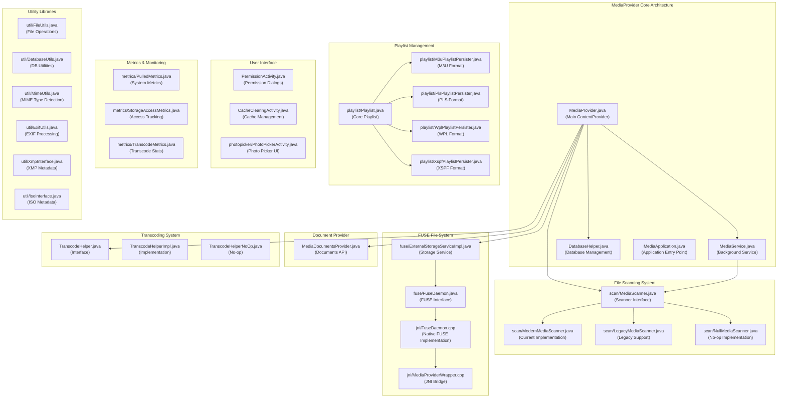

# @ModernMediaScanner.java 我发现在扫描到非音视频文件不会new MediaMetadataRetriever ,而且也不是所有的音视频文件会new MediaMetadataRetriever什么时候会new MediaMetadataRetriever
## MediaMetadataRetriever 的创建时机

### 1. **根据媒体类型判断**

`MediaMetadataRetriever` 只在以下媒体类型的文件扫描时创建：

```1319:1360:CarMediaCenter/MediaProvider/src/com/android/providers/media/scan/ModernMediaScanner.java
private static @NonNull ContentProviderOperation.Builder scanItemAudio(long existingId,
        File file, BasicFileAttributes attrs, String mimeType, int mediaType,
        String volumeName) {
    // ...省略其他代码...
    try (FileInputStream is = new FileInputStream(file)) {
        try (MediaMetadataRetriever mmr = new MediaMetadataRetriever()) {
            mmr.setDataSource(is.getFD());
            withRetrieverValues(op, mmr, mimeType);
            // ...
        }
    } catch (Exception e) {
        logTroubleScanning(file, e);
    }
    return op;
}
```

```1394:1441:CarMediaCenter/MediaProvider/src/com/android/providers/media/scan/ModernMediaScanner.java
private static @NonNull ContentProviderOperation.Builder scanItemVideo(long existingId,
        File file, BasicFileAttributes attrs, String mimeType, int mediaType,
        String volumeName) {
    // ...省略其他代码...
    try (FileInputStream is = new FileInputStream(file)) {
        try (MediaMetadataRetriever mmr = new MediaMetadataRetriever()) {
            mmr.setDataSource(is.getFD());
            withRetrieverValues(op, mmr, mimeType);
            // ...
        }
    } catch (Exception e) {
        logTroubleScanning(file, e);
    }
    return op;
}
```

### 2. **scanItem 方法的路由逻辑**

```1082:1098:CarMediaCenter/MediaProvider/src/com/android/providers/media/scan/ModernMediaScanner.java
switch (mediaType) {
    case FileColumns.MEDIA_TYPE_AUDIO:
        return scanItemAudio(existingId, file, attrs, mimeType, mediaType, volumeName);
    case FileColumns.MEDIA_TYPE_VIDEO:
        return scanItemVideo(existingId, file, attrs, mimeType, mediaType, volumeName);
    case FileColumns.MEDIA_TYPE_IMAGE:
        return scanItemImage(existingId, file, attrs, mimeType, mediaType, volumeName);
    case FileColumns.MEDIA_TYPE_PLAYLIST:
        return scanItemPlaylist(existingId, file, attrs, mimeType, mediaType, volumeName);
    case FileColumns.MEDIA_TYPE_SUBTITLE:
        return scanItemSubtitle(existingId, file, attrs, mimeType, mediaType, volumeName);
    case FileColumns.MEDIA_TYPE_DOCUMENT:
        return scanItemDocument(existingId, file, attrs, mimeType, mediaType, volumeName);
    default:
        return scanItemFile(existingId, file, attrs, mimeType, mediaType, volumeName);
}
```

### 3. **什么时候不会创建 MediaMetadataRetriever**

以下文件类型不会创建 `MediaMetadataRetriever`：

- **图片文件** (`MEDIA_TYPE_IMAGE`) - 使用 `ExifInterface` 代替
- **播放列表** (`MEDIA_TYPE_PLAYLIST`) 
- **字幕文件** (`MEDIA_TYPE_SUBTITLE`)
- **文档文件** (`MEDIA_TYPE_DOCUMENT`)
- **其他类型文件** (`default` 分支)
- **目录** (使用 `scanItemDirectory`)

### 4. **即使是音视频文件也不一定创建的情况**

在 `visitFile` 方法中，即使文件是音视频类型，如果满足以下条件也会跳过扫描（不创建 `MediaMetadataRetriever`）：

```802:817:CarMediaCenter/MediaProvider/src/com/android/providers/media/scan/ModernMediaScanner.java
final boolean sameMetadata =
        hasSameMetadata(attrs, realFile, isPendingFromFuse, c);
final boolean sameMediaType = actualMediaType == mediaType;
if (sameMetadata && sameMediaType) {
    if (LOGV) Log.v(TAG, "Skipping unchanged " + file);
    return FileVisitResult.CONTINUE;
}

// 特殊情况：video/mp4 和 audio/mp4 之间的转换
if (sameMetadata
        && "video/mp4".equalsIgnoreCase(actualMimeType)
        && "audio/mp4".equalsIgnoreCase(mimeType)) {
    if (LOGV) Log.v(TAG, "Skipping unchanged video/audio " + file);
    return FileVisitResult.CONTINUE;
}
```

### 5. **总结**

**会创建 MediaMetadataRetriever 的情况：**
- 文件类型为 `MEDIA_TYPE_AUDIO` 或 `MEDIA_TYPE_VIDEO`
- 且文件内容发生了变化（时间戳、大小等不同）
- 且扫描过程中没有异常

**不会创建 MediaMetadataRetriever 的情况：**
- 非音视频文件（图片、文档、字幕等）
- 文件内容未发生变化的音视频文件
- 目录
- 扫描过程中发生异常的文件

这样设计的原因是 `MediaMetadataRetriever` 主要用于提取音视频文件的元数据（如时长、比特率、艺术家等），对于其他类型的文件使用相应的专门工具（如图片用 `ExifInterface`）更加高效和准确。


Ran tool

Ran tool
Ran tool

Ran tool
Ran tool
# walkFileTree这个方法的flow会触发visitFile吗
是的，`walkFileTree()` 方法的流程**会触发 `visitFile` 方法**。

让我解释一下具体的流程：

## 1. **Scan 类实现了 FileVisitor 接口**
```java
// 第328行
private class Scan implements Runnable, FileVisitor<Path>, AutoCloseable {
```

## 2. **walkFileTree 调用会自动触发 visitFile**
在 `walkFileTree()` 方法中：
```java
// 第468-470行
if (mFilesUri.equals(MediaStore.Files.EXTERNAL_CONTENT_URI)) {
    Files.walkFileTree(mRoot.toPath(), EnumSet.noneOf(FileVisitOption.class), mMaxScanDepth, this);
} else {
    Files.walkFileTree(mRoot.toPath(), this);
}
```

这里传入的 `this` 就是当前 `Scan` 实例，`Files.walkFileTree()` 会在遍历文件树时自动调用 `FileVisitor` 接口的相应方法。

## 3. **visitFile 方法的触发时机**

**a) 对每个文件自动调用：**
```java
// 第731行
@Override
public FileVisitResult visitFile(Path file, BasicFileAttributes attrs) throws IOException {
    if (LOGV) Log.v(TAG, "Visiting " + file);
    mFileCount++;
    // ... 具体的文件扫描逻辑
}
```

**b) 对目录也会调用：**
```java
// 第725-727行，在 preVisitDirectory 中
// Scan this directory as a normal file so that "parent" database
// entries are created
return visitFile(dir, attrs);
```

## 4. **完整的调用链**
```
walkFileTree() 
  ↓
Files.walkFileTree() (Java NIO API)
  ↓
自动调用 FileVisitor 接口方法：
  ├─ preVisitDirectory() → 调用 visitFile(dir, attrs)
  ├─ visitFile() → 处理每个文件
  ├─ postVisitDirectory()
  └─ visitFileFailed() (如果有异常)
```

所以，**`walkFileTree()` 方法通过 Java NIO 的文件遍历机制，会对目录树中的每个文件和目录都触发 `visitFile` 方法调用**。


# MediaProvider中都提供了哪些功能 比如 文件扫描这种，是哪些文件组成了一个功能

# MediaProvider 功能完整分析

## **核心功能模块及文件组成**

### **1. 📁 内容提供者核心 (Content Provider Core)**
**主要功能：** 作为Android系统的媒体数据访问入口

| 文件 | 功能描述 |
|------|----------|
| `MediaProvider.java` | 主要的ContentProvider实现，处理所有媒体查询、插入、更新、删除操作 |
| `DatabaseHelper.java` | 数据库架构管理，处理数据库创建、升级、迁移 |
| `MediaApplication.java` | 应用程序入口点，负责组件初始化 |
| `LocalCallingIdentity.java` | 权限管理和调用者身份验证 |
| `MediaVolume.java` | 存储卷管理 |
| `VolumeCache.java` | 卷信息缓存 |

### **2. 🔍 文件扫描系统 (File Scanning System)**
**主要功能：** 自动发现和索引媒体文件，提取元数据

| 文件 | 功能描述 |
|------|----------|
| `scan/MediaScanner.java` | 扫描器接口定义 |
| `scan/ModernMediaScanner.java` | **当前主要实现**，使用MediaMetadataRetriever提取元数据 |
| `scan/LegacyMediaScanner.java` | 旧版扫描器支持 |
| `scan/NullMediaScanner.java` | 空操作扫描器 |
| `MediaService.java` | 后台服务，协调扫描任务 |
| `IdleService.java` | 空闲时间扫描服务 |
| `MediaReceiver.java` | 广播接收器，响应系统事件触发扫描 |

### **3. 💾 FUSE文件系统 (FUSE File System)**
**主要功能：** 提供用户空间文件系统，支持媒体文件的透明访问和转码

| 文件 | 功能描述 |
|------|----------|
| `fuse/ExternalStorageServiceImpl.java` | 外部存储服务实现 |
| `fuse/FuseDaemon.java` | Java层FUSE守护进程 |
| `jni/FuseDaemon.cpp` | **Native层FUSE实现** |
| `jni/FuseUtils.cpp` | FUSE工具函数 |
| `jni/MediaProviderWrapper.cpp` | JNI桥接层 |
| `jni/node.cpp` | FUSE节点实现 |
| `jni/ReaddirHelper.cpp` | 目录读取助手 |
| `jni/RedactionInfo.cpp` | 数据脱敏处理 |

### **4. 🎵 播放列表管理 (Playlist Management)**
**主要功能：** 支持多种播放列表格式的解析和生成

| 文件 | 功能描述 |
|------|----------|
| `playlist/Playlist.java` | 播放列表核心抽象 |
| `playlist/M3uPlaylistPersister.java` | M3U格式支持 |
| `playlist/PlsPlaylistPersister.java` | PLS格式支持 |
| `playlist/WplPlaylistPersister.java` | WPL格式支持 |
| `playlist/XspfPlaylistPersister.java` | XSPF格式支持 |
| `playlist/PlaylistPersister.java` | 持久化接口 |

### **5. 🔄 媒体转码系统 (Transcoding System)**
**主要功能：** 实时媒体格式转换，支持不同应用的兼容性需求

| 文件 | 功能描述 |
|------|----------|
| `TranscodeHelper.java` | 转码接口定义 |
| `TranscodeHelperImpl.java` | **实际转码实现** |
| `TranscodeHelperNoOp.java` | 空操作实现 |

### **6. 📄 文档提供者 (Document Provider)**
**主要功能：** 通过Documents API提供文件访问

| 文件 | 功能描述 |
|------|----------|
| `MediaDocumentsProvider.java` | **DocumentsProvider实现**，集成到系统文件管理器 |

### **7. 🖼️ 用户界面组件 (User Interface)**
**主要功能：** 权限管理、缓存清理、照片选择器

| 文件 | 功能描述 |
|------|----------|
| `PermissionActivity.java` | 权限请求对话框 |
| `CacheClearingActivity.java` | 缓存清理界面 |
| `photopicker/PhotoPickerActivity.java` | **照片选择器UI** |

### **8. 📊 指标和监控 (Metrics & Monitoring)**
**主要功能：** 性能监控、使用统计、系统指标收集

| 文件 | 功能描述 |
|------|----------|
| `metrics/PulledMetrics.java` | 系统拉取指标 |
| `metrics/StorageAccessMetrics.java` | 存储访问统计 |
| `metrics/TranscodeMetrics.java` | 转码性能指标 |

### **9. 🛠️ 工具库 (Utility Libraries)**
**主要功能：** 通用工具函数和辅助类

| 分类 | 文件 | 功能描述 |
|------|------|----------|
| **文件操作** | `util/FileUtils.java` | 文件路径处理、权限检查 |
| **数据库** | `util/DatabaseUtils.java` | 数据库查询构建、优化 |
| **MIME类型** | `util/MimeUtils.java` | MIME类型检测和映射 |
| **元数据** | `util/ExifUtils.java` | EXIF数据处理 |
| | `util/XmpInterface.java` | XMP元数据处理 |
| | `util/IsoInterface.java` | ISO元数据处理 |
| **线程管理** | `util/BackgroundThread.java` | 后台线程池 |
| | `util/ForegroundThread.java` | 前台线程管理 |
| **其他** | `util/Logging.java` | 日志工具 |
| | `util/Memory.java` | 内存管理 |
| | `util/PermissionUtils.java` | 权限工具 |

## **关键功能流程**

### **文件扫描流程 (以MP4为例)**
1. **触发扫描** → `MediaReceiver` 接收系统广播
2. **任务调度** → `MediaService` 创建扫描任务
3. **文件发现** → `ModernMediaScanner` 遍历目录
4. **元数据提取** → 使用 `MediaMetadataRetriever`
5. **数据库更新** → `DatabaseHelper` 存储元数据
6. **通知系统** → 通过 `ContentResolver` 通知变更

### **FUSE文件系统访问流程**
1. **应用请求** → 应用访问媒体文件
2. **FUSE拦截** → `FuseDaemon.cpp` 拦截文件系统调用
3. **权限检查** → 通过JNI调用Java层权限验证
4. **文件处理** → 可能触发实时转码
5. **返回数据** → 向应用返回文件内容

这个架构确保了MediaProvider能够：
- **高效扫描**大量媒体文件
- **安全控制**应用对媒体的访问
- **透明转码**不兼容的媒体格式
- **统一接口**为所有媒体相关操作提供一致的API


# 停止scan

根据对代码的分析，MediaProvider中**没有一个直接对应的"停止扫描"函数**，但有以下几种停止机制：

## **停止扫描的方式**

### **1. 🛑 卷分离时自动停止 - `onDetachVolume()`**

```280:290:CarMediaCenter/MediaProvider/src/com/android/providers/media/scan/ModernMediaScanner.java
@Override
public void onDetachVolume(MediaVolume volume) {
    Log.i(TAG, "onDetachVolume volumeName=" + volume);
    synchronized (mActiveScans) {
        for (Scan scan : mActiveScans) {
            Log.i(TAG, "       scan volumeName=" + volume);
            if (volume.equals(scan.mVolume)) {
                Log.i(TAG, "        match successful " + volume);
                scan.mSignal.cancel();
            }
        }
    }
}
```

**触发场景**: 当存储卷被卸载/移除时，系统会自动调用此方法停止该卷的所有扫描。

### **2. 🔄 空闲扫描停止 - `onIdleScanStopped()`**

```293:301:CarMediaCenter/MediaProvider/src/com/android/providers/media/scan/ModernMediaScanner.java
@Override
public void onIdleScanStopped() {
    synchronized (mActiveScans) {
        for (Scan scan : mActiveScans) {
            if (scan.mReason == REASON_IDLE) {
                scan.mSignal.cancel();
            }
        }
    }
}
```

**触发场景**: 当系统不再空闲时，停止所有空闲时进行的扫描任务。

### **3. ⏹️ JobIntentService 生命周期停止**

`MediaService` 继承自 `JobIntentService`，当服务被系统终止时：

- **系统资源不足** → 自动停止扫描任务
- **应用被杀死** → 所有扫描自动终止
- **设备重启** → 扫描进程自然结束

### **4. 🚫 CancellationSignal 机制**

每个扫描任务都有自己的取消信号：

```404:404:CarMediaCenter/MediaProvider/src/com/android/providers/media/scan/ModernMediaScanner.java
mSignal = new CancellationSignal();
```

当 `mSignal.cancel()` 被调用时，会抛出 `OperationCanceledException`：

```254:258:CarMediaCenter/MediaProvider/src/com/android/providers/media/scan/ModernMediaScanner.java
try (Scan scan = new Scan(file, reason, /*ownerPackage*/ null)) {
    scan.run();
} catch (OperationCanceledException ignored) {
} catch (FileNotFoundException e) {
   Log.e(TAG, "Couldn't find directory to scan", e) ;
}
```

## **总结**

**MediaProvider 设计哲学**：
- **没有主动停止API** - 扫描是为了保持数据库一致性，通常应该完成
- **被动停止机制** - 只在必要时停止（卷卸载、系统资源不足等）
- **自然终止** - 扫描完成后自动结束

如果你需要**强制停止特定卷的扫描**，可以调用：
```java
mediaProvider.onDetachVolume(targetVolume);
```

这是最接近"停止扫描函数"的方法。