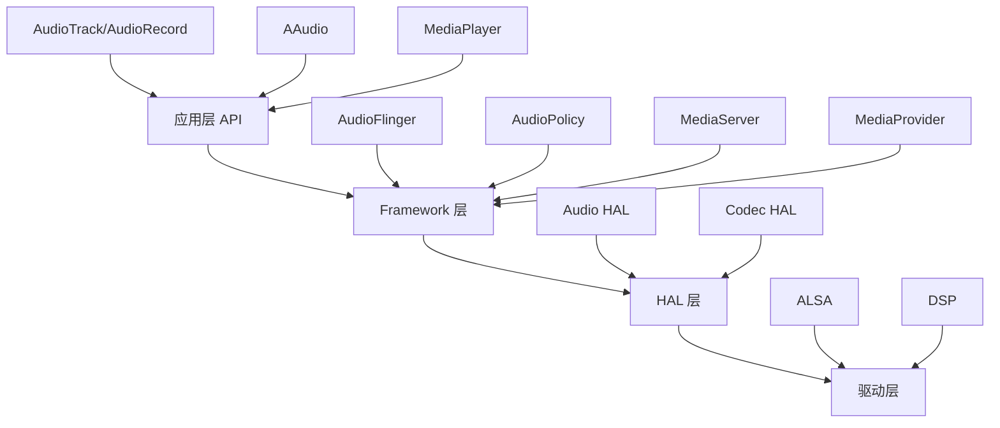

# Android Audio/Media 知识库索引

> 📊 **可视化图谱**: [[Android Audio Media 知识图谱.canvas|打开知识图谱]]

## 📚 知识库概览

本知识库包含 **46 个学习笔记**，涵盖 Android 音视频系统从应用层到驱动层的完整技术栈。

---

## 🎯 快速导航

### 📱 应用层 API

#### AudioTrack & 按键音
- [[按键音/AudioTrack_Static模式数据流转分析|AudioTrack Static 模式数据流转]]
- [[按键音/按键音|按键音实现]]

#### AAudio 低延迟 API
- [[Audio/功能分析/AAudio/AAudio学习|AAudio 学习笔记]]
- [[Audio/功能分析/AAudio/学习大纲|AAudio 学习大纲]]
- [[Audio/功能分析/AAudio/独占与共享模式|独占与共享模式对比]]
- [[Audio/功能分析/AAudio/FifoBuffer|FIFO 缓冲机制]]
- [[Audio/功能分析/AAudio/AAudioFlowGraph|AAudio 数据流图]]

#### MediaPlayer 媒体播放
- [[mediaserver/mediaplayer控制流|MediaPlayer 控制流程]]
- [[mediaserver/Mediaserver数据流|MediaServer 数据流]]
- [[mediaserver/carmeidiaserver学习|车载 MediaServer]]
- [[mediaserver/查询过的问题|MediaServer 问题记录]]

---

### 🎛️ Framework 层

#### Playback 播放
- [[Audio/功能分析/playback/Mixthread与MmapThread对比|MixThread 与 MmapThread 对比]]
- [[Audio/功能分析/playback/混音器状态|混音器状态分析]]
- [[Audio/功能分析/playback/输出流对比,|输出流对比]]
- [[周报笔记整理/Playback|Playback 周报整理]]

#### Record 录音
- [[Audio/功能分析/Record/RecordBufferConverter|录音缓冲转换器]]
- [[周报笔记整理/Record|Record 周报整理]]

#### 焦点管理
- [[Audio/功能分析/焦点/安卓audio焦点|Android 音频焦点完整分析]] ⭐
- [[Audio/功能分析/焦点/fouces_compare|焦点机制对比]]

#### 配置加载
- [[Audio/功能分析/配置加载/Android16配置加载|Android 16 配置加载]]
- [[Audio/功能分析/配置加载/dump_AudioFlinger|AudioFlinger Dump 分析]]
- [[Audio/功能分析/配置加载/dump_AudioPolicyManage|AudioPolicyManager Dump 分析]]

---

### 🔧 HAL 层 & 驱动层

#### ALSA 驱动
- [[Audio/ALSA/ALSA|ALSA MMAP 架构]] ⭐
- [[Audio/ALSA/dsp与alsa交互|DSP 与 ALSA 交互]]

#### Audio HAL
- [[Audio/功能分析/AudioHal/3588|3588 平台 HAL 实现]]
- [[Audio/功能分析/AudioPatch/AudioPatch|AudioPatch 路由机制]]

---

### 🚗 车载音频 & 特殊功能

#### 车载音频
- [[Audio/CarAudioDocument|CarAudioManager API 文档]] 📖

#### Dolby 音效方案
- [[Audio/方案分析/dolby/dolbyc2|Dolby C2 模块方案]]
- [[Audio/方案分析/dolby/dolby集成方案对比|Dolby 三种集成方案对比]] ⭐

---

### 📂 MediaProvider 媒体扫描

- [[MediaProvider/MediaProvider_scan|MediaProvider 扫描流程]] ⭐
- [[MediaProvider/疑惑点记录|疑惑点记录]]
- [[周报笔记整理/MediaScan|MediaScan 周报整理]]
- [[周报笔记整理/MediaServer|MediaServer 周报整理]]

---

### 🐛 问题分析 & 调试

- [[Audio/问题分析/使用Visualizer接口返回dolby数据振幅弱问题分析|Visualizer Dolby 数据振幅问题]]
- [[Audio/问题分析/audioserver如何找到android.hardware.audio.service|AudioServer 服务发现机制]]
- [[Audio/问题分析/设置到AudioHal的PCM音量低|PCM 音量问题]]
- [[杂七杂八/双重释放问题分析|双重释放问题]]

---

### 🛠️ 工具类 & 其他

- [[Audio/功能分析/Utils/TimeCheck|TimeCheck 时间检查工具]]
- [[Audio/功能分析/延时/latency|音频延时分析]]
- [[Audio/功能分析/threadlood状态分析|线程池状态分析]]
- [[Android特殊用法/ALooper与AMessage|ALooper 与 AMessage 消息机制]]

---

## 🗺️ 技术栈架构

---

## 📊 学习路径建议

### 🟢 初级阶段
1. [[Audio/功能分析/AAudio/学习大纲|AAudio 学习大纲]] - 了解基本概念
2. [[按键音/AudioTrack_Static模式数据流转分析|AudioTrack 数据流]] - 理解播放流程
3. [[mediaserver/mediaplayer控制流|MediaPlayer 控制流]] - 掌握媒体播放

### 🟡 中级阶段
4. [[Audio/功能分析/playback/Mixthread与MmapThread对比|线程模型对比]] - 深入 AudioFlinger
5. [[Audio/功能分析/焦点/安卓audio焦点|音频焦点机制]] - 理解策略管理
6. [[Audio/ALSA/ALSA|ALSA 架构]] - 了解 HAL 层交互

### 🔴 高级阶段
7. [[Audio/CarAudioDocument|车载音频]] - 车载定制实现
8. [[Audio/方案分析/dolby/dolby集成方案对比|Dolby 方案对比]] - 音效集成
9. [[MediaProvider/MediaProvider_scan|媒体扫描]] - 完整系统理解

---

## 🔍 按主题分类

### 音频播放
- [[Audio/功能分析/playback/Mixthread与MmapThread对比]]
- [[Audio/功能分析/playback/混音器状态]]
- [[Audio/功能分析/playback/输出流对比,]]
- [[按键音/AudioTrack_Static模式数据流转分析]]

### 音频录制
- [[Audio/功能分析/Record/RecordBufferConverter]]
- [[周报笔记整理/Record]]

### 低延迟技术
- [[Audio/功能分析/AAudio/AAudio学习]]
- [[Audio/功能分析/AAudio/独占与共享模式]]
- [[Audio/功能分析/AAudio/FifoBuffer]]
- [[Audio/功能分析/延时/latency]]

### 媒体框架
- [[mediaserver/mediaplayer控制流]]
- [[mediaserver/Mediaserver数据流]]
- [[MediaProvider/MediaProvider_scan]]

### 车载音频
- [[Audio/CarAudioDocument]]
- [[mediaserver/carmeidiaserver学习]]

### 音效处理
- [[Audio/方案分析/dolby/dolbyc2]]
- [[Audio/方案分析/dolby/dolby集成方案对比]]
- [[Audio/问题分析/使用Visualizer接口返回dolby数据振幅弱问题分析]]

---

## 📈 统计信息

- **总笔记数**: 46 个
- **主要分类**: 8 个
- **技术栈层级**: 4 层（应用层 → Framework → HAL → 驱动）
- **覆盖模块**: AudioFlinger, AudioPolicy, MediaServer, MediaProvider, AAudio, ALSA, Car Audio

---

## 🎨 可视化工具

- 📊 [[Android Audio Media 知识图谱.canvas|完整知识图谱]] - 可视化所有笔记关联关系
- 🗂️ [[未命名.canvas|其他 Canvas]]
- 📋 [[未命名 2.base|Base 数据库视图]]

---

## 💡 使用建议

1. **从图谱开始**: 打开 [[Android Audio Media 知识图谱.canvas]] 了解整体结构
2. **按路径学习**: 根据你的水平选择初级/中级/高级路径
3. **关联阅读**: 点击笔记中的 wikilink 跳转到相关内容
4. **问题驱动**: 遇到问题时查看"问题分析"分类
5. **定期回顾**: 查看周报笔记整理，巩固知识

---

**最后更新**: 2026-02-13
**维护者**: Android Audio/Media 学习项目