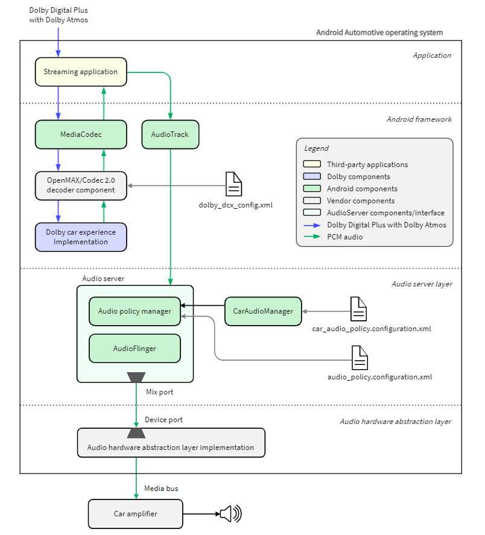
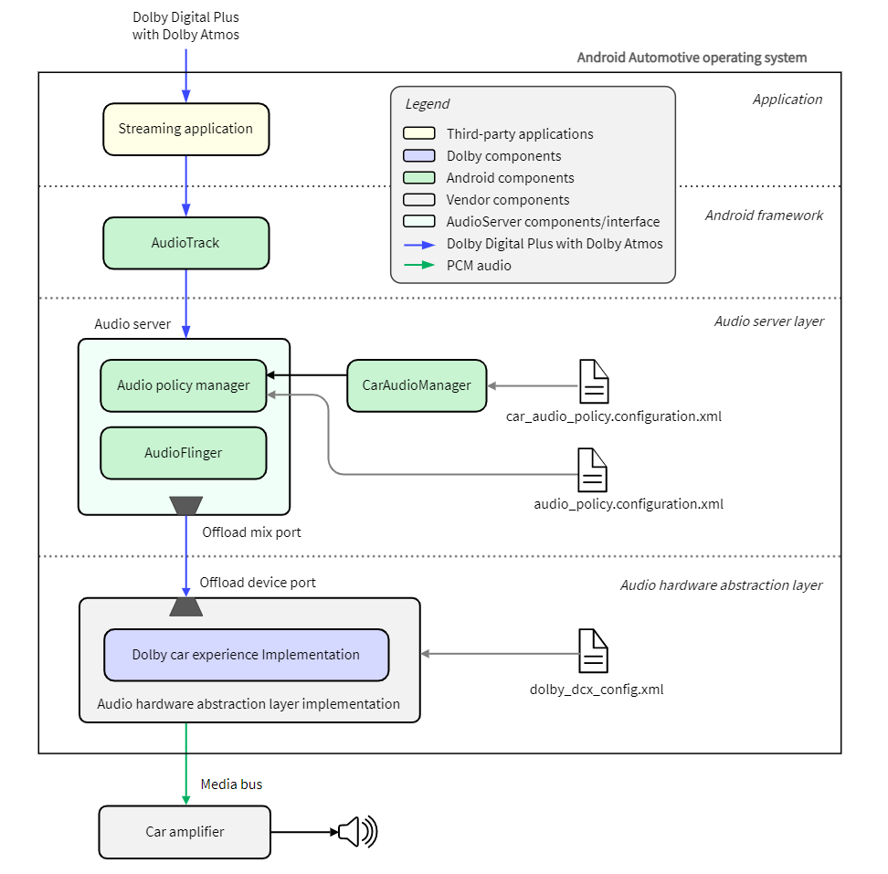
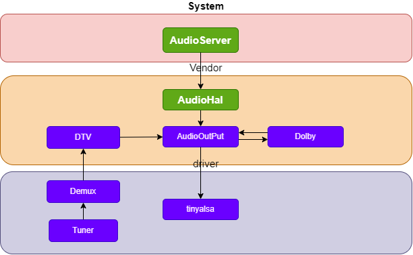
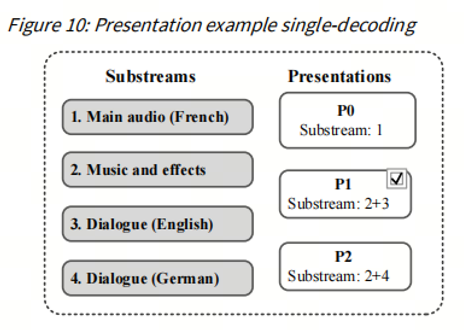
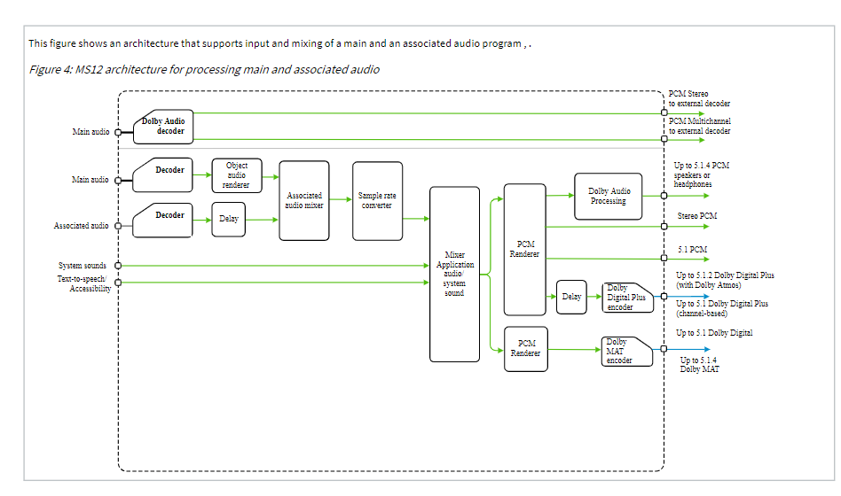
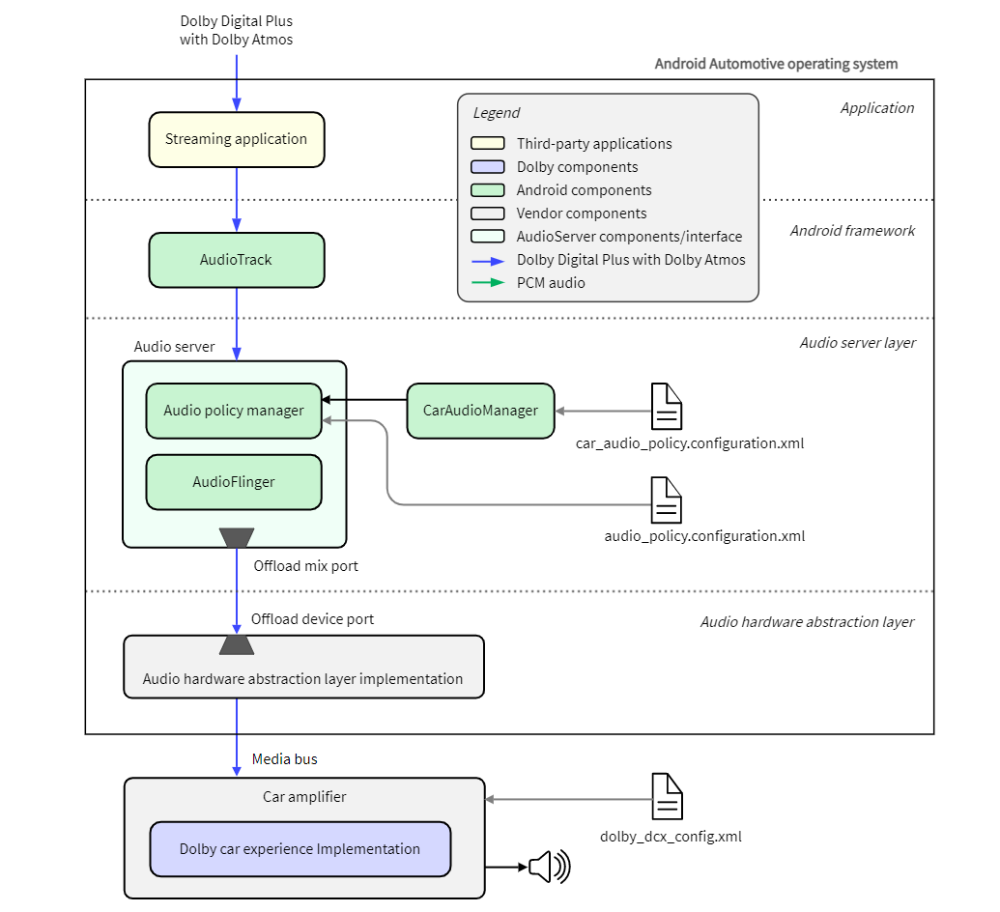

## dolby包含哪些音频格式
| 编码技术          | 声道支持 | 特点*                        | 主要用途             |
|-----------------------|--------------|-----------------------------------|----------------------------|
| Dolby Digital （AC-3）| 5.1          | 有损压缩，经典环绕声               | DVD、蓝光、数字电视        |
| Dolby Digital Plus  （EAC3）  | 7.1          | 更高音质和压缩效率                 | 流媒体、蓝光               |
| Dolby TrueHD          | 7.1          | 无损音频，高保真                   | 蓝光、高端影院             |
| Dolby AC-4            | 无限         | 高效压缩，支持三维音频             | 广播、流媒体               |
| Dolby MAT             | 无限         | 实时传输，无损 PCM，支持 Dolby Atmos | 游戏主机、HDMI 音频传输     |

在星河车机上目前支持eac3、eac3-joc、ac3。
其他的几种音频格式在电视上常用，比如Dolby TrueHD会出现在蓝光光盘中、AC4出现在广播电视或者流媒体中，Mat出现在XBOX输送到TV的音频流中。
## 为什么需要dolby解码
对于客户来说是为了获取更好的听觉体验。
对于我们研发来说使用dolby解码库不用其他免费的解码库如ffmpeg，是因为其他解码库能力不够，解析不了ac4、TrueHD、Mat。就算支持ac3、eac3但是也解析不出来该音频格式中专业的杜比特性比如动态范围控制、atmos信息等。 
对于产品本身来说需要过杜比认证，使产品打上杜比认证的标志那就不得不用dolby提供的解码库了。
## 解码方案对比
### 1. 集成在 C2 模块
C2（Codec 2.0）模块是 Android 音频框架的一部分，负责音频/视频编解码和处理。目前星河使用该方案集成dobly库。
- 
#### 优点：
- **框架层集成**：
  - 集成在 C2 模块意味着杜比库直接嵌入 Android 多媒体框架，能够处理来自应用层的音频流。
- **跨平台支持**：
  - C2 模块是 Android 的一部分，适配性较好，便于移植到不同硬件平台。
- **灵活性**：
  - 可以支持不同的音频格式和场景（如媒体播放、视频流等），适合需要对多种音频流进行统一处理的场景。
- **开发效率高**：
  - 利用 Android 音频框架现有的 API 和接口，减少底层开发工作。

#### 缺点：
- **性能开销较高**：
  - 传输给AudioServer的数据为解码后的PCM数据，相比解码前的数据，数据量要更大。因此需要更大的内存空间传输数据。
- **实时性较差**：
  - 由于音频流需要经过 Android 音频框架的多个层级（应用层 → Audio HAL → DSP），可能会引入延迟，不适合对实时性要求极高的场景。

#### 适用场景：
- 媒体播放、导航语音等非实时性要求较高的场景。
- 项目开发周期紧张，优先考虑快速集成的场景。

### 2. 集成在 Audio HAL
Audio HAL（Hardware Abstraction Layer）是 Android 音频框架与硬件之间的抽象层，负责音频数据的传递和处理。

一些电视厂商使用类似的方案，方案结构图如下：

对于电视而言需要有两大功能需要dobly的能力，一种就是本地播放、网络播放这种数据从audiohal送下来的情况。另一种就是传统的广播电视，该数据可以不通过audiohal,在vendor区直传给输出模块（AudioOutPut）。
电视厂商把dobly编解码库集成在了AudioOutput模块中，该模块不仅可以处理Audiohal送下来的数据，还可以处理DTV的送过来的数据。另外电视的很多功能是需要dolby音效库支持的，比如音频描述、对话增强、自定义最佳听觉位置等。
音频描述功能是基于AC4音频格式来完成的，AC4格式会会有Substream与Presentations的概念，音频描述可以使某个Substream的音量降低。

从下图可知dolby释放出来的功能不仅有decode还有encodec功能、Mix、resampled 功能。

#### 优点：
- **较高的性能**：
  - Audio HAL 位于音频框架的中间层，直接与硬件交互，可以减少数据处理的层级，提升性能。
- **灵活性适中**：
  - 可以根据具体硬件平台优化杜比库的性能，例如针对不同的音频设备（扬声器、耳机）进行调优。
- **实时性较好**：
  - 相比集成在 C2 模块，音频数据在 HAL 层处理可以减少延迟，适合实时性要求较高的场景。
- **硬件适配性增强**：
  - 可以直接调用硬件相关的接口，部分杜比算法可以结合硬件特性优化。

#### 缺点：
- **开发复杂度较高**：
  - Audio HAL 的集成需要对 Android 音频框架和硬件驱动有深入了解，开发和调试成本较高。
- **硬件依赖性增强**：
  - HAL 层的实现通常与具体硬件平台绑定，移植性较差，可能需要针对不同硬件平台进行适配。
- **灵活性不如 C2 模块**：
  - HAL 层主要处理音频输出，无法轻松支持复杂的多媒体场景（如视频播放中的杜比音频解码）。

#### 适用场景：
- 对实时性要求较高的场景，如导航语音、通话音频处理。
- 硬件资源有限，需要优化性能的场景。

---

### 3. 集成在 DSP Server
DSP Server 是运行于 DSP（Digital Signal Processor）上的音频处理服务，专门用于音频处理和优化。

#### 优点：
- **最高的性能**：
  - 音频处理直接在 DSP 上完成，利用专用硬件加速能力，性能远高于 CPU 处理。
- **最低的延迟**：
  - 音频数据直接在 DSP 中处理，避免了数据在多个框架层级间的传递，延迟最低。
- **硬件资源优化**：
  - 减轻了主 CPU 的负载，释放更多资源给其他任务。
- **专业音频处理能力**：
  - DSP 通常针对音频处理进行了优化，适合复杂的音频算法（如杜比的环绕声、动态范围控制等）。

#### 缺点：
- **硬件依赖性强**：
  - 集成在 DSP 上需要针对特定的硬件平台进行适配，移植性差。
- **开发复杂度最高**：
  - 需要深入了解 DSP 硬件架构和编程模型，同时可能需要编写低层驱动和接口。
- **灵活性较低**：
  - DSP 的资源通常有限，可能无法同时处理多种音频流或支持复杂的场景。
- **调试难度大**：
  - DSP 上的代码调试工具有限，调试过程复杂。

#### 适用场景：
- 对性能和实时性要求极高的场景，例如车载娱乐系统中的高品质音频播放或主动降噪。
- 硬件资源丰富且项目周期允许进行底层开发的场景。

---

### 对比总结

| 集成位置   | 优点                                                                | 缺点                                                                | 适用场景                                                               |
|----------------|--------------------------------------------------------------------------|--------------------------------------------------------------------------|------------------------------------------------------------------------------|
| C2 模块    | - 开发效率高 - 跨平台支持好 - 适合多种音频场景                          | - 性能开销较高 - 延迟较大 - 无法利用硬件加速                             | 媒体播放、导航语音等非实时场景                                                |
| Audio HAL  | - 性能较高 - 延迟较低 - 硬件适配能力较强                              | - 开发复杂度较高 - 硬件依赖性增强 - 灵活性低于 C2 模块                   | 导航语音、通话音频、对实时性要求较高的场景                                     |
| DSP Server | - 性能最高 - 延迟最低 - 减轻 CPU 负载 - 适合复杂音频算法处理          | - 硬件依赖性强 - 开发复杂度最高 - 灵活性较低 - 调试难度大              | 高品质音频播放、主动降噪、对实时性和性能要求极高的场景                         |

---

### **推荐选择**

1. **项目优先级为快速集成且硬件资源有限**：
   - **选择 C2 模块**，开发效率高，适合快速交付的项目。
   
2. **对实时性和性能有一定要求，且硬件资源充足**：
   - **选择 Audio HAL**，在性能和开发复杂度之间取得平衡。

3. **对性能和实时性要求极高，且硬件平台支持 DSP**：
   - **选择 DSP Server**，充分利用硬件加速能力，适合高端车载娱乐系统。

最终的选择应根据项目的具体需求、硬件平台能力、开发周期和团队技术能力综合考虑。

