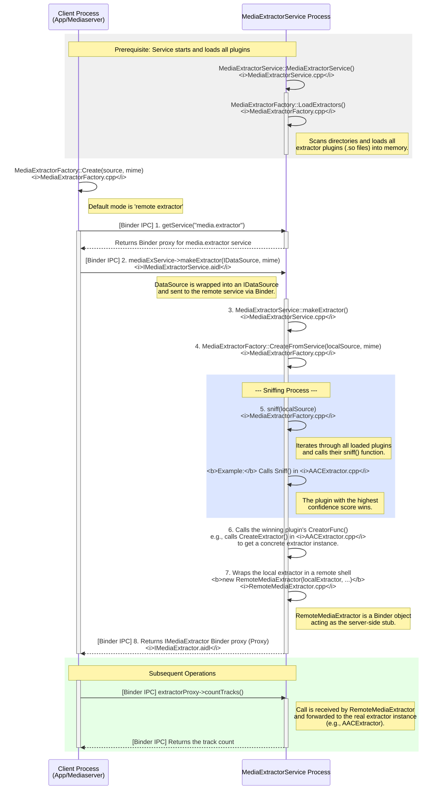

# MediaExtractorService的构造
```c++
MediaExtractorService::MediaExtractorService() {
    MediaExtractorFactory::LoadExtractors();
}
void MediaExtractorFactory::LoadExtractors() {
    std::shared_ptr<std::list<sp<ExtractorPlugin>>> newList(new std::list<sp<ExtractorPlugin>>());
    
    //pach  = 
    const android_dlextinfo dlextinfo = {
            .flags = ANDROID_DLEXT_USE_NAMESPACE,
            .library_namespace = mediaNs,
        };
        // 1. 在下列目录下找到符合条件的so 并且加载so创建对应的extractor放入到newList中 
    RegisterExtractors("/apex/com.android.media/lib(64)/extractors/"&dlextinfo, *newList);
    path = /system/lib(64)/extractors/  /system_ext/lib(64)/extractors/  /product/lib(64)/extractors/;
    RegisterExtractors("path，NULL, *newList")
    // 2. 按照extractor名字库的名字来排序
    newList->sort(compareFunc);
    gPlugins = newList;

    for (auto it = gPlugins->begin(); it != gPlugins->end(); ++it) {
        if ((*it)->def.def_version == EXTRACTORDEF_VERSION_NDK_V2) {
            for (size_t i = 0;; i++) {
                const char* ext = (*it)->def.u.v3.supported_types[i];
                if (ext == nullptr) {
                    break;
                }
                gSupportedExtensions.push_back(std::string(ext));
            }
        }
    }
    gPluginsRegistered = true;
}

void MediaExtractorFactory::RegisterExtractors(
        const char *libDirPath, const android_dlextinfo* dlextinfo,
        std::list<sp<ExtractorPlugin>> &pluginList) {
    // 1. libDirPath目录下的所有文件
    DIR *libDir = opendir(libDirPath);
    if (libDir) {
        struct dirent* libEntry;
        // 2. 遍历libDirPath目录下的所有文件
        while ((libEntry = readdir(libDir))) {
            if (libEntry->d_name[0] == '.') {
                continue;
            }
            String8 libPath = String8(libDirPath) + "/" + libEntry->d_name;
            if (!libPath.contains("extractor.so")) {
                continue;
            }
            // 3. 加载so
            void *libHandle = android_dlopen_ext(
                    libPath.string(),
                    RTLD_NOW | RTLD_LOCAL, dlextinfo);
            if (libHandle == nullptr) {
                ALOGI("dlopen(%s) reported error %s", libPath.string(), strerror(errno));
                continue;
            }
            // 4. 获取extractor的定义
            // 使用dlsym函数从已加载的动态库中查找名为"GETEXTRACTORDEF"的函数符号
            // GetExtractorDef是一个函数指针类型，指向获取提取器定义的函数
            // 这个函数将返回媒体提取器的定义信息，包括名称、版本、UUID和支持的媒体类型等
            GetExtractorDef getDef =
                (GetExtractorDef) dlsym(libHandle, "GETEXTRACTORDEF");
            ALOGV("registering sniffer for %s", libPath.string());
            // 5. 注册extractor
            RegisterExtractor(
                    new ExtractorPlugin(getDef(), libHandle, libPath), pluginList);
        }
        closedir(libDir);
    } else {
        ALOGI("plugin directory not present (%s)", libDirPath);
    }
}


void MediaExtractorFactory::RegisterExtractor(const sp<ExtractorPlugin> &plugin,
        std::list<sp<ExtractorPlugin>> &pluginList) {
    // 1. 检查extractor的版本、uuid、name
    if (plugin->def.def_version != EXTRACTORDEF_VERSION_NDK_V1 &&
            plugin->def.def_version != EXTRACTORDEF_VERSION_NDK_V2) {
        ALOGW("don't understand extractor format %u, ignoring.", plugin->def.def_version);
        return;
    }
    if (memcmp(&plugin->def.extractor_uuid, "\0\0\0\0\0\0\0\0\0\0\0\0\0\0\0\0", 16) == 0) {
        ALOGW("invalid UUID, ignoring");
        return;
    }
    if (plugin->def.extractor_name == NULL || strlen(plugin->def.extractor_name) == 0) {
        ALOGE("extractors should have a name, ignoring");
        return;
    }
    // 2.遍历plugList 获取其中对象与plugin比较，如果uuid相同那么久比较version，保留version大的
    for (auto it = pluginList.begin(); it != pluginList.end(); ++it) {
        if (memcmp(&((*it)->def.extractor_uuid), &plugin->def.extractor_uuid, 16) == 0) {
            // there's already an extractor with the same uuid
            if (gIgnoreVersion || (*it)->def.extractor_version < plugin->def.extractor_version) {
                // this one is newer, replace the old one
                ALOGW("replacing extractor '%s' version %u with version %u",
                        plugin->def.extractor_name,
                        (*it)->def.extractor_version,
                        plugin->def.extractor_version);
                pluginList.erase(it);
                break;
            } else {
                ALOGW("ignoring extractor '%s' version %u in favor of version %u",
                        plugin->def.extractor_name,
                        plugin->def.extractor_version,
                        (*it)->def.extractor_version);
                return;
            }
        }
    }
    ALOGV("registering extractor for %s", plugin->def.extractor_name);
    // 3. 将plugin添加到pluginList中
    pluginList.push_back(plugin);
}
```
```c++ 
AACExtractor.cpp
__attribute__ ((visibility ("default")))
ExtractorDef GETEXTRACTORDEF() {
    return {
        EXTRACTORDEF_VERSION,
        UUID("4fd80eae-03d2-4d72-9eb9-48fa6bb54613"),
        1, // version
        "AAC Extractor",
        { .v3 = {Sniff, extensions} },
    };
}
```
这段代码是文件AACExtractor.cpp中截取的。
总结一下LoadExtractors 做了那几件事 
1. 在指定目录下找到符合条件的so 并且加载so创建对应的extractor放入到newList中 
2. 按照extractor名字库的名字来排序
3. 将extractor的定义信息存储到gSupportedExtensions中
目前只是创建了ExtractorPlugin获取了对应extractor的函数符号，还并没有真正的初始化extractor
# Extractor初始化与选择
```c++ 
MediaExtractorFactory.cpp
sp<IMediaExtractor> MediaExtractorFactory::Create(
        const sp<DataSource> &source, const char *mime) {
    /*
     * 本地（local）extractor与远程（remote）extractor的区别：
     *
     * 1. local extractor（本地提取器）：
     *    - 直接在当前调用进程（如mediaserver或app进程）中加载和运行媒体提取器插件（extractor）。
     *    - 通过CreateFromService函数实现，实际是直接在本地进程内调用extractor插件的so库。
     *    - 优点：无需跨进程通信，效率高，调试方便。
     *    - 缺点：安全性较低，容易被恶意媒体文件利用本地so漏洞攻击进程（如提权、崩溃等）。
     *    - 适用场景：仅在明确信任输入数据或调试开发时使用。
     *
     * 2. remote extractor（远程提取器）：
     *    - 通过binder机制，将媒体提取操作委托给独立的“media.extractor”服务进程（MediaExtractorService）。
     *    - 当前进程只负责数据源的传递和结果的获取，实际的媒体解析和so插件加载都在远程服务进程中完成。
     *    - 优点：安全隔离，防止恶意媒体文件攻击主进程，提高系统稳定性。
     *    - 缺点：有一定的跨进程通信开销。
     *    - 适用场景：生产环境下的默认选择，尤其是面对不可信媒体数据时。
     *
     * 为什么还保留local extractor？
     * - 主要用于兼容性、调试、开发和某些特殊场景（如远程服务不可用时的兜底方案）。
     * - 通过系统属性"media.stagefright.extractremote"控制，默认true（即优先使用remote）。
     * - 某些情况下（如开发调试、远程服务崩溃、性能测试等）可以临时切换为local extractor。
     *
     * 代码流程说明如下图：
     *
     *   ┌──────────────┐
     *   │  调用Create  │
     *   └─────┬────────┘
     *         │
     *         ▼
     *   判断"media.stagefright.extractremote"
     *     │true（默认）           │false
     *     ▼                      ▼
     *  远程extractor         本地extractor
     *  ┌─────────────┐      ┌─────────────┐
     *  │ binder调用  │      │ 直接调用    │
     *  │ media.extractor│   │ CreateFromService │
     *  └─────────────┘      └─────────────┘
     *
     */

    ALOGI("MediaExtractorFactory::Create %s", mime);

    if (!property_get_bool("media.stagefright.extractremote", true)) {
        // 使用本地extractor（不推荐，除非调试或特殊场景）
        ALOGW("creating media extractor in calling process (local extractor)");
        return CreateFromService(source, mime);
    } else {
        // 使用远程extractor（推荐，默认）
        ALOGV("get service manager for remote extractor");
        sp<IBinder> binder = defaultServiceManager()->getService(String16("media.extractor"));

        if (binder != 0) {
            sp<IMediaExtractorService> mediaExService(
                    interface_cast<IMediaExtractorService>(binder));
            sp<IMediaExtractor> ex;
            mediaExService->makeExtractor(
                    CreateIDataSourceFromDataSource(source),
                    mime ? std::optional<std::string>(mime) : std::nullopt,
                    &ex);
            return ex;
        } else {
            ALOGE("extractor service not running");
            return NULL;
        }
    }
    return NULL;
}

::android::binder::Status MediaExtractorService::makeExtractor(
        const ::android::sp<::android::IDataSource>& remoteSource,
        const ::std::optional< ::std::string> &mime,
        ::android::sp<::android::IMediaExtractor>* _aidl_return) {
    ALOGV("@@@ MediaExtractorService::makeExtractor for %s", mime ? mime->c_str() : nullptr);

    sp<DataSource> localSource = CreateDataSourceFromIDataSource(remoteSource);

    MediaBuffer::useSharedMemory();
    sp<IMediaExtractor> extractor = MediaExtractorFactory::CreateFromService(
            localSource,
            mime ? mime->c_str() : nullptr);

    if (extractor != nullptr) {
        registerMediaExtractor(extractor, localSource, mime ? mime->c_str() : nullptr);
    }
    *_aidl_return = extractor;
    return binder::Status::ok();
}

sp<IMediaExtractor> MediaExtractorFactory::CreateFromService(
        const sp<DataSource> &source, const char *mime) {

    void *meta = nullptr;
    void *creator = NULL;
    FreeMetaFunc freeMeta = nullptr;
    float confidence;
    sp<ExtractorPlugin> plugin;
    uint32_t creatorVersion = 0;
    // 这一行代码的意思是：调用sniff函数来检测输入的DataSource（媒体数据源），
    // 以判断其媒体类型，并返回相应的extractor创建函数指针（creator）。
    // sniff函数会分析数据源内容，输出置信度（confidence）、元数据（meta）、释放元数据的函数指针（freeMeta），
    // 还会返回插件信息（plugin）和创建函数的版本号（creatorVersion）。
    //1. 获取创建目标extractor的函数指针
    creator = sniff(source, &confidence, &meta, &freeMeta, plugin, &creatorVersion);
    if (!creator) {
        ALOGV("FAILED to autodetect media content.");
        return NULL;
    }

    MediaExtractor *ex = nullptr;
    if (creatorVersion == EXTRACTORDEF_VERSION_NDK_V1 ||
            creatorVersion == EXTRACTORDEF_VERSION_NDK_V2) {
                //2. 创建目标函数
        CMediaExtractor *ret = ((CreatorFunc)creator)(source->wrap(), meta);
        if (meta != nullptr && freeMeta != nullptr) {
            freeMeta(meta);
        }
        ex = ret != nullptr ? new MediaExtractorCUnwrapper(ret) : nullptr;
    }

    ALOGV("Created an extractor '%s' with confidence %.2f",
         ex != nullptr ? ex->name() : "<null>", confidence);

    return CreateIMediaExtractorFromMediaExtractor(ex, source, plugin);
}
```
```c++
AACExtractor.cpp
static CreatorFunc Sniff(
        CDataSource *source, float *confidence, void **meta,
        FreeMetaFunc *freeMeta) {
    off64_t pos = 0;

    DataSourceHelper helper(source);
    for (;;) {
        uint8_t id3header[10];
        if (helper.readAt(pos, id3header, sizeof(id3header))
                < (ssize_t)sizeof(id3header)) {
            return NULL;
        }

        if (memcmp("ID3", id3header, 3)) {
            break;
        }

    }
    ......
    // ADTS syncword
    if ((header[0] == 0xff) && ((header[1] & 0xf6) == 0xf0)) {
        *confidence = 0.2;

        off64_t *offPtr = (off64_t*) malloc(sizeof(off64_t));
        *offPtr = pos;
        *meta = offPtr;
        *freeMeta = ::free;

        return CreateExtractor;
    }

    return NULL;
}
static CMediaExtractor* CreateExtractor(
        CDataSource *source,
        void *meta) {
    off64_t offset = *static_cast<off64_t*>(meta);
    return wrap(new AACExtractor(new DataSourceHelper(source), offset));
}

```
可以看到这个Sniff的工作分为两个步骤：
1. 读取AAC头自己个数，然后判断当前数据是否符合AAC的头数据
2. 创建一个Extractor，这个Extractor可谓是层层封装.
经过sniff就获取了创建目标Extractor的函数指针。

到此为止我们知道了如何创建目标Extractor。

# 数据流