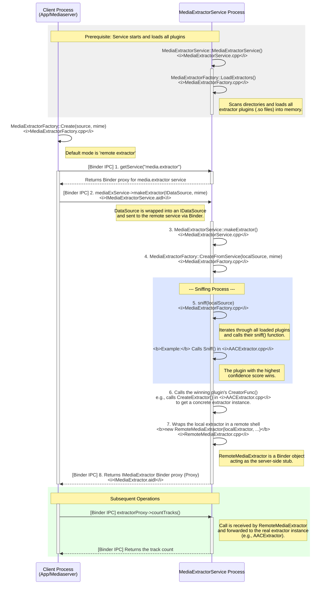
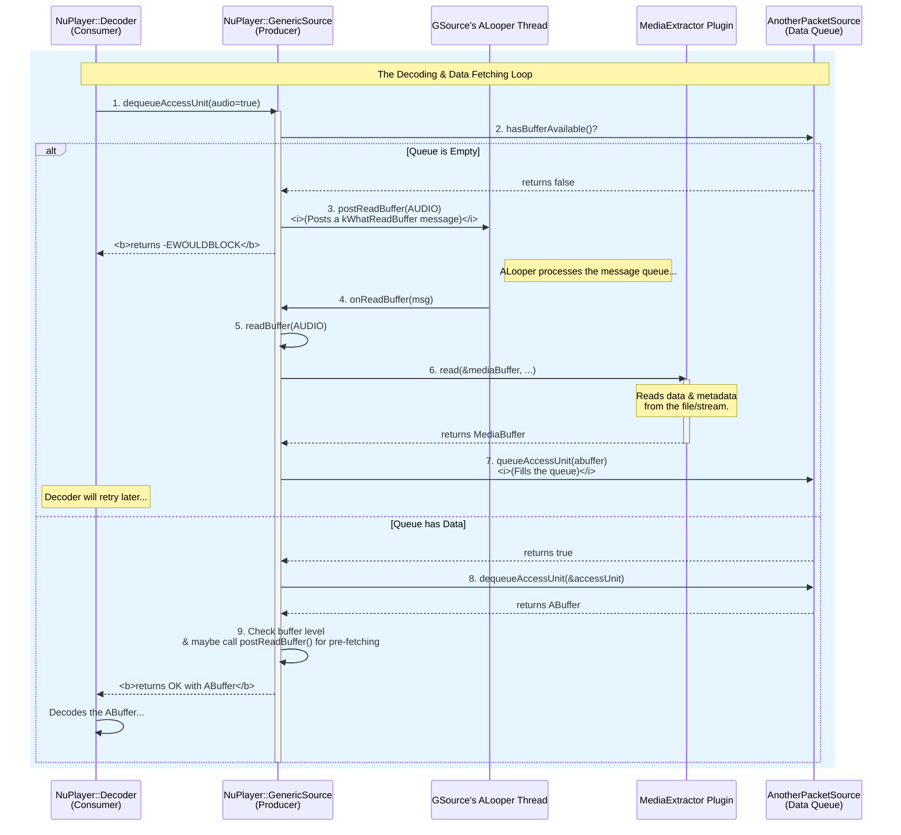

# MediaExtractorService的构造
```c++
MediaExtractorService::MediaExtractorService() {
    MediaExtractorFactory::LoadExtractors();
}
void MediaExtractorFactory::LoadExtractors() {
    std::shared_ptr<std::list<sp<ExtractorPlugin>>> newList(new std::list<sp<ExtractorPlugin>>());
    
    //pach  = 
    const android_dlextinfo dlextinfo = {
            .flags = ANDROID_DLEXT_USE_NAMESPACE,
            .library_namespace = mediaNs,
        };
        // 1. 在下列目录下找到符合条件的so 并且加载so创建对应的extractor放入到newList中 
    RegisterExtractors("/apex/com.android.media/lib(64)/extractors/"&dlextinfo, *newList);
    path = /system/lib(64)/extractors/  /system_ext/lib(64)/extractors/  /product/lib(64)/extractors/;
    RegisterExtractors("path，NULL, *newList")
    // 2. 按照extractor名字库的名字来排序
    newList->sort(compareFunc);
    gPlugins = newList;

    for (auto it = gPlugins->begin(); it != gPlugins->end(); ++it) {
        if ((*it)->def.def_version == EXTRACTORDEF_VERSION_NDK_V2) {
            for (size_t i = 0;; i++) {
                const char* ext = (*it)->def.u.v3.supported_types[i];
                if (ext == nullptr) {
                    break;
                }
                gSupportedExtensions.push_back(std::string(ext));
            }
        }
    }
    gPluginsRegistered = true;
}

void MediaExtractorFactory::RegisterExtractors(
        const char *libDirPath, const android_dlextinfo* dlextinfo,
        std::list<sp<ExtractorPlugin>> &pluginList) {
    // 1. libDirPath目录下的所有文件
    DIR *libDir = opendir(libDirPath);
    if (libDir) {
        struct dirent* libEntry;
        // 2. 遍历libDirPath目录下的所有文件
        while ((libEntry = readdir(libDir))) {
            if (libEntry->d_name[0] == '.') {
                continue;
            }
            String8 libPath = String8(libDirPath) + "/" + libEntry->d_name;
            if (!libPath.contains("extractor.so")) {
                continue;
            }
            // 3. 加载so
            void *libHandle = android_dlopen_ext(
                    libPath.string(),
                    RTLD_NOW | RTLD_LOCAL, dlextinfo);
            if (libHandle == nullptr) {
                ALOGI("dlopen(%s) reported error %s", libPath.string(), strerror(errno));
                continue;
            }
            // 4. 获取extractor的定义
            // 使用dlsym函数从已加载的动态库中查找名为"GETEXTRACTORDEF"的函数符号
            // GetExtractorDef是一个函数指针类型，指向获取提取器定义的函数
            // 这个函数将返回媒体提取器的定义信息，包括名称、版本、UUID和支持的媒体类型等
            GetExtractorDef getDef =
                (GetExtractorDef) dlsym(libHandle, "GETEXTRACTORDEF");
            ALOGV("registering sniffer for %s", libPath.string());
            // 5. 注册extractor
            RegisterExtractor(
                    new ExtractorPlugin(getDef(), libHandle, libPath), pluginList);
        }
        closedir(libDir);
    } else {
        ALOGI("plugin directory not present (%s)", libDirPath);
    }
}


void MediaExtractorFactory::RegisterExtractor(const sp<ExtractorPlugin> &plugin,
        std::list<sp<ExtractorPlugin>> &pluginList) {
    // 1. 检查extractor的版本、uuid、name
    if (plugin->def.def_version != EXTRACTORDEF_VERSION_NDK_V1 &&
            plugin->def.def_version != EXTRACTORDEF_VERSION_NDK_V2) {
        ALOGW("don't understand extractor format %u, ignoring.", plugin->def.def_version);
        return;
    }
    if (memcmp(&plugin->def.extractor_uuid, "\0\0\0\0\0\0\0\0\0\0\0\0\0\0\0\0", 16) == 0) {
        ALOGW("invalid UUID, ignoring");
        return;
    }
    if (plugin->def.extractor_name == NULL || strlen(plugin->def.extractor_name) == 0) {
        ALOGE("extractors should have a name, ignoring");
        return;
    }
    // 2.遍历plugList 获取其中对象与plugin比较，如果uuid相同那么久比较version，保留version大的
    for (auto it = pluginList.begin(); it != pluginList.end(); ++it) {
        if (memcmp(&((*it)->def.extractor_uuid), &plugin->def.extractor_uuid, 16) == 0) {
            // there's already an extractor with the same uuid
            if (gIgnoreVersion || (*it)->def.extractor_version < plugin->def.extractor_version) {
                // this one is newer, replace the old one
                ALOGW("replacing extractor '%s' version %u with version %u",
                        plugin->def.extractor_name,
                        (*it)->def.extractor_version,
                        plugin->def.extractor_version);
                pluginList.erase(it);
                break;
            } else {
                ALOGW("ignoring extractor '%s' version %u in favor of version %u",
                        plugin->def.extractor_name,
                        plugin->def.extractor_version,
                        (*it)->def.extractor_version);
                return;
            }
        }
    }
    ALOGV("registering extractor for %s", plugin->def.extractor_name);
    // 3. 将plugin添加到pluginList中
    pluginList.push_back(plugin);
}
```
```c++ 
AACExtractor.cpp
__attribute__ ((visibility ("default")))
ExtractorDef GETEXTRACTORDEF() {
    return {
        EXTRACTORDEF_VERSION,
        UUID("4fd80eae-03d2-4d72-9eb9-48fa6bb54613"),
        1, // version
        "AAC Extractor",
        { .v3 = {Sniff, extensions} },
    };
}
```
这段代码是文件AACExtractor.cpp中截取的。
总结一下LoadExtractors 做了那几件事 
1. 在指定目录下找到符合条件的so 并且加载so创建对应的extractor放入到newList中 
2. 按照extractor名字库的名字来排序
3. 将extractor的定义信息存储到gSupportedExtensions中
目前只是创建了ExtractorPlugin获取了对应extractor的函数符号，还并没有真正的初始化extractor
# Extractor初始化与选择
```c++ 
MediaExtractorFactory.cpp
sp<IMediaExtractor> MediaExtractorFactory::Create(
        const sp<DataSource> &source, const char *mime) {
    /*
     * 本地（local）extractor与远程（remote）extractor的区别：
     *
     * 1. local extractor（本地提取器）：
     *    - 直接在当前调用进程（如mediaserver或app进程）中加载和运行媒体提取器插件（extractor）。
     *    - 通过CreateFromService函数实现，实际是直接在本地进程内调用extractor插件的so库。
     *    - 优点：无需跨进程通信，效率高，调试方便。
     *    - 缺点：安全性较低，容易被恶意媒体文件利用本地so漏洞攻击进程（如提权、崩溃等）。
     *    - 适用场景：仅在明确信任输入数据或调试开发时使用。
     *
     * 2. remote extractor（远程提取器）：
     *    - 通过binder机制，将媒体提取操作委托给独立的“media.extractor”服务进程（MediaExtractorService）。
     *    - 当前进程只负责数据源的传递和结果的获取，实际的媒体解析和so插件加载都在远程服务进程中完成。
     *    - 优点：安全隔离，防止恶意媒体文件攻击主进程，提高系统稳定性。
     *    - 缺点：有一定的跨进程通信开销。
     *    - 适用场景：生产环境下的默认选择，尤其是面对不可信媒体数据时。
     *
     * 为什么还保留local extractor？
     * - 主要用于兼容性、调试、开发和某些特殊场景（如远程服务不可用时的兜底方案）。
     * - 通过系统属性"media.stagefright.extractremote"控制，默认true（即优先使用remote）。
     * - 某些情况下（如开发调试、远程服务崩溃、性能测试等）可以临时切换为local extractor。
     *
     * 代码流程说明如下图：
     *
     *   ┌──────────────┐
     *   │  调用Create  │
     *   └─────┬────────┘
     *         │
     *         ▼
     *   判断"media.stagefright.extractremote"
     *     │true（默认）           │false
     *     ▼                      ▼
     *  远程extractor         本地extractor
     *  ┌─────────────┐      ┌─────────────┐
     *  │ binder调用  │      │ 直接调用    │
     *  │ media.extractor│   │ CreateFromService │
     *  └─────────────┘      └─────────────┘
     *
     */

    ALOGI("MediaExtractorFactory::Create %s", mime);

    if (!property_get_bool("media.stagefright.extractremote", true)) {
        // 使用本地extractor（不推荐，除非调试或特殊场景）
        ALOGW("creating media extractor in calling process (local extractor)");
        return CreateFromService(source, mime);
    } else {
        // 使用远程extractor（推荐，默认）
        ALOGV("get service manager for remote extractor");
        sp<IBinder> binder = defaultServiceManager()->getService(String16("media.extractor"));

        if (binder != 0) {
            sp<IMediaExtractorService> mediaExService(
                    interface_cast<IMediaExtractorService>(binder));
            sp<IMediaExtractor> ex;
            mediaExService->makeExtractor(
                    CreateIDataSourceFromDataSource(source),
                    mime ? std::optional<std::string>(mime) : std::nullopt,
                    &ex);
            return ex;
        } else {
            ALOGE("extractor service not running");
            return NULL;
        }
    }
    return NULL;
}

::android::binder::Status MediaExtractorService::makeExtractor(
        const ::android::sp<::android::IDataSource>& remoteSource,
        const ::std::optional< ::std::string> &mime,
        ::android::sp<::android::IMediaExtractor>* _aidl_return) {
    ALOGV("@@@ MediaExtractorService::makeExtractor for %s", mime ? mime->c_str() : nullptr);

    sp<DataSource> localSource = CreateDataSourceFromIDataSource(remoteSource);

    MediaBuffer::useSharedMemory();
    sp<IMediaExtractor> extractor = MediaExtractorFactory::CreateFromService(
            localSource,
            mime ? mime->c_str() : nullptr);

    if (extractor != nullptr) {
        registerMediaExtractor(extractor, localSource, mime ? mime->c_str() : nullptr);
    }
    *_aidl_return = extractor;
    return binder::Status::ok();
}

sp<IMediaExtractor> MediaExtractorFactory::CreateFromService(
        const sp<DataSource> &source, const char *mime) {

    void *meta = nullptr;
    void *creator = NULL;
    FreeMetaFunc freeMeta = nullptr;
    float confidence;
    sp<ExtractorPlugin> plugin;
    uint32_t creatorVersion = 0;
    // 这一行代码的意思是：调用sniff函数来检测输入的DataSource（媒体数据源），
    // 以判断其媒体类型，并返回相应的extractor创建函数指针（creator）。
    // sniff函数会分析数据源内容，输出置信度（confidence）、元数据（meta）、释放元数据的函数指针（freeMeta），
    // 还会返回插件信息（plugin）和创建函数的版本号（creatorVersion）。
    //1. 获取创建目标extractor的函数指针
    creator = sniff(source, &confidence, &meta, &freeMeta, plugin, &creatorVersion);
    if (!creator) {
        ALOGV("FAILED to autodetect media content.");
        return NULL;
    }

    MediaExtractor *ex = nullptr;
    if (creatorVersion == EXTRACTORDEF_VERSION_NDK_V1 ||
            creatorVersion == EXTRACTORDEF_VERSION_NDK_V2) {
                //2. 创建目标函数
        CMediaExtractor *ret = ((CreatorFunc)creator)(source->wrap(), meta);
        if (meta != nullptr && freeMeta != nullptr) {
            freeMeta(meta);
        }
        ex = ret != nullptr ? new MediaExtractorCUnwrapper(ret) : nullptr;
    }

    ALOGV("Created an extractor '%s' with confidence %.2f",
         ex != nullptr ? ex->name() : "<null>", confidence);

    return CreateIMediaExtractorFromMediaExtractor(ex, source, plugin);
}
```
```c++
AACExtractor.cpp
static CreatorFunc Sniff(
        CDataSource *source, float *confidence, void **meta,
        FreeMetaFunc *freeMeta) {
    off64_t pos = 0;

    DataSourceHelper helper(source);
    for (;;) {
        uint8_t id3header[10];
        if (helper.readAt(pos, id3header, sizeof(id3header))
                < (ssize_t)sizeof(id3header)) {
            return NULL;
        }

        if (memcmp("ID3", id3header, 3)) {
            break;
        }

    }
    ......
    // ADTS syncword
    if ((header[0] == 0xff) && ((header[1] & 0xf6) == 0xf0)) {
        *confidence = 0.2;

        off64_t *offPtr = (off64_t*) malloc(sizeof(off64_t));
        *offPtr = pos;
        *meta = offPtr;
        *freeMeta = ::free;

        return CreateExtractor;
    }

    return NULL;
}
static CMediaExtractor* CreateExtractor(
        CDataSource *source,
        void *meta) {
    off64_t offset = *static_cast<off64_t*>(meta);
    return wrap(new AACExtractor(new DataSourceHelper(source), offset));
}

```
可以看到这个Sniff的工作分为两个步骤：
1. 读取AAC头自己个数，然后判断当前数据是否符合AAC的头数据
2. 创建一个Extractor，这个Extractor可谓是层层封装.
经过sniff就获取了创建目标Extractor的函数指针。

到此为止我们知道了如何创建目标Extractor。

# 数据流


从上图可知数据是从source->mediaextractor->decoder->renderer这一个流程，因为我们接下来就按照这个流程分为三小结来分析。并且要关注进程之间的通信。
## Source->Extractor
在创建Extractor的时候函数如下
```c++
sp<IMediaExtractorService> mediaExService(
                    interface_cast<IMediaExtractorService>(binder));
            sp<IMediaExtractor> ex;
            mediaExService->makeExtractor(
                    CreateIDataSourceFromDataSource(source),
                    mime ? std::optional<std::string>(mime) : std::nullopt,
                    &ex);
```
ex是IMediaExtractor的Binder代理对与客户端其实就是BpMediaEXtractor,由于进程之间存在地址隔离因此要把mediaserver进程的source传入给mediaextractor那么就需要使用Binder进行跨进程通信,把source封装成RemoteDataSource.
```c++
    explicit RemoteDataSource(const sp<DataSource> &source) {
        Mutex::Autolock lock(mLock);
        mSource = source;
        //kBufferSize = 64k
        sp<MemoryDealer> memoryDealer = new MemoryDealer(kBufferSize, "RemoteDataSource");
        mMemory = memoryDealer->allocate(kBufferSize);
        if (mMemory.get() == nullptr) {
            ALOGE("Failed to allocate memory!");
        }
        mName = String8::format("RemoteDataSource(%s)", mSource->toString().string());
    }
```
在RemoteDataSource的构造函数中创建了一个64k的共享内存,这样就可以做到两个进程之间共享内存。接下来mediaextractor进程.

```c++
::android::binder::Status MediaExtractorService::makeExtractor(
        const ::android::sp<::android::IDataSource>& remoteSource,
        const ::std::optional< ::std::string> &mime,
        ::android::sp<::android::IMediaExtractor>* _aidl_return) {
    ALOGV("@@@ MediaExtractorService::makeExtractor for %s", mime ? mime->c_str() : nullptr);
    //这里在重新转换成DataSource是为了保存extractor的兼容性
    sp<DataSource> localSource = CreateDataSourceFromIDataSource(remoteSource);

    MediaBuffer::useSharedMemory();
    sp<IMediaExtractor> extractor = MediaExtractorFactory::CreateFromService(
            localSource,
            mime ? mime->c_str() : nullptr);

    ALOGV("extractor service created %p (%s)",
            extractor.get(),
            extractor == nullptr ? "" : extractor->name());

            //这个主要为了dump信息用的
    if (extractor != nullptr) {
        registerMediaExtractor(extractor, localSource, mime ? mime->c_str() : nullptr);
    }
    *_aidl_return = extractor;
    return binder::Status::ok();
}

sp<DataSource> CreateDataSourceFromIDataSource(const sp<IDataSource> &source) {
    if (source == nullptr) {
        return nullptr;
    }
    return new TinyCacheSource(new CallbackDataSource(source));
}
```
又搞这一套层层包围,bnDataSource作为CallbackDataSource的参数,在作为TinyCacheSource的参数,我们来看看这两个类的构造函数.
```c++
CallbackDataSource::CallbackDataSource(
    const sp<IDataSource>& binderDataSource)
    : mIDataSource(binderDataSource),
      mIsClosed(false) {
    // Set up the buffer to read into.
    //注意这个mMemory就是我们之前申请的共享内存
    mMemory = mIDataSource->getIMemory();
    mName = String8::format("CallbackDataSource(%d->%d, %s)",
            getpid(),
            IPCThreadState::self()->getCallingPid(),
            mIDataSource->toString().string());

}
TinyCacheSource::TinyCacheSource(const sp<DataSource>& source)
    : mSource(source), mCachedOffset(0), mCachedSize(0) {
    mName = String8::format("TinyCacheSource(%s)", mSource->toString().string());
}
```
我们来看一下TinyCacheSource中的readAt().
```c++
                 Cache Block
<--------------------------------------------->
+=============================================+
|                                             |
+=============================================+
^                                             ^
|                                             |
mCachedOffset                          (mCachedOffset + mCachedSize)

      ^
      |
    offset (The position you want to read from)

ssize_t TinyCacheSource::readAt(off64_t offset, void* data, size_t size) {
    // 检查请求的数据是否在缓存中
    // 首先判断请求的偏移量是否在当前缓存范围内
    if (mCachedOffset <= offset
            && offset < (off64_t) (mCachedOffset + mCachedSize)) {
        // 情况1: 请求的数据完全在缓存中
        if (offset + size <= mCachedOffset + mCachedSize) {
            // 直接从缓存中复制数据到目标缓冲区
            memcpy(data, &mCache[offset - mCachedOffset], size);
            return size;
        } else {
            // 情况2: 请求的数据部分在缓存中（缓存命中部分）
            // 计算缓存中可用的数据量
            const ssize_t remaining = mCachedOffset + mCachedSize - offset;
            // 先复制缓存中已有的部分
            memcpy(data, &mCache[offset - mCachedOffset], remaining);
            // 递归调用readAt获取剩余部分数据
            const ssize_t readMore = readAt(offset + remaining,
                    (uint8_t*)data + remaining, size - remaining);
            // 处理读取错误情况
            if (readMore < 0) {
                return readMore;
            }
            // 返回总共读取的字节数
            return remaining + readMore;
        }
    }

    // 情况3: 请求的数据量大于等于缓存大小，直接从源读取不经过缓存
    if (size >= kCacheSize) {
        return mSource->readAt(offset, data, size);
    }

    // 情况4: 缓存未命中且请求数据量小于缓存大小，填充缓存
    // 从数据源读取kCacheSize大小的数据到缓存中
    const ssize_t numRead = mSource->readAt(offset, mCache, kCacheSize);
    // 处理读取错误或文件结束情况
    if (numRead <= 0) {
        // 出错时清空缓存状态
        mCachedSize = 0;
        mCachedOffset = 0;
        return numRead;
    }
    // 检查读取的数据量是否超出范围（这通常不应该发生）
    if ((size_t)numRead > kCacheSize) {
        // 出错时清空缓存状态
        mCachedSize = 0;
        mCachedOffset = 0;
        return ERROR_OUT_OF_RANGE;
    }

    // 更新缓存状态
    mCachedSize = numRead;
    mCachedOffset = offset;
    // 确保缓存状态有效
    CHECK(mCachedSize <= kCacheSize && mCachedOffset >= 0);
    // 计算实际返回给调用者的数据量（可能小于请求的size）
    const size_t numToReturn = std::min(size, (size_t)numRead);
    // 从缓存复制数据到目标缓冲区
    memcpy(data, mCache, numToReturn);

    return numToReturn;
}
```
可以看出来这个TinyCacheSource的readAt()函数主要是为了缓存数据，这样就可以做到减少Binder的通信次数,在TinyCacheSource中readAt()函数会调用CallbackDataSource的readAt()函数
```c++
ssize_t CallbackDataSource::readAt(off64_t offset, void* data, size_t size) {
    if (mMemory == NULL || data == NULL) {
        return -1;
    }

    // IDataSource can only read up to mMemory->size() bytes at a time, but this
    // method should be able to read any number of bytes, so read in a loop.
    size_t totalNumRead = 0;
    size_t numLeft = size;
    const size_t bufferSize = mMemory->size();

    while (numLeft > 0) {
        size_t numToRead = std::min(numLeft, bufferSize);
        ssize_t numRead =
            mIDataSource->readAt(offset + totalNumRead, numToRead);
        // A negative return value represents an error. Pass it on.
        if (numRead < 0) {
            return numRead == ERROR_END_OF_STREAM && totalNumRead > 0 ? totalNumRead : numRead;
        }
        // A zero return value signals EOS. Return the bytes read so far.
        if (numRead == 0) {
            return totalNumRead;
        }
        if ((size_t)numRead > numToRead) {
            return ERROR_OUT_OF_RANGE;
        }
        CHECK(numRead >= 0 && (size_t)numRead <= bufferSize);
        // 这行代码的意思是将从IDataSource读取的数据复制到调用者提供的缓冲区中
        // ((uint8_t*)data) + totalNumRead：计算目标缓冲区的当前写入位置，data是基址，totalNumRead是已经写入的字节数
        // mMemory->unsecurePointer()：获取共享内存的指针，这里存放着从IDataSource读取的数据
        // 整个memcpy操作是将共享内存中的数据复制到调用者的缓冲区中
        memcpy(((uint8_t*)data) + totalNumRead, mMemory->unsecurePointer(),
            numRead);
        numLeft -= numRead;
        totalNumRead += numRead;
    }

    return totalNumRead;
}
```
在CalkbackDataSource中调用的 mIDataSource->readAt(offset + totalNumRead, numToRead);其实是调用RemoteDataSource的readAt()函数.可以看到是把数据copy到共享内存中.在RemoteDataSource中的mSource就是真正的source了 比如FileSource这种,这个代码我就补贴出来了,时机内容就是把本地文件copy到共享内存中.
```c++
    virtual ssize_t readAt(off64_t offset, size_t size) {
        ALOGV("readAt(%lld, %zu)", (long long)offset, size);
        if (size > kBufferSize) {
            size = kBufferSize;
        }

        Mutex::Autolock lock(mLock);
        if (mSource.get() == nullptr || mMemory.get() == nullptr) {
            ALOGE("readAt() failed, mSource is nullptr");
            return 0;
        }
        return mSource->readAt(offset, mMemory->unsecurePointer(), size);
    }
```
到此为止我们知道了数据是如何从本地文件中copy到extractor中的了.现在还有一个问题就是数据是如何源源不断的送入到extractor呢,目前也只是知道数据是如何read跟extractor使用sniff函数来探测数据.
### 数据源源不断的送入到extractor
我们来看一下postReadBuffer函数,该函数在PrepareAsync与Start流程都会调用.NuPlayer 的数据读取是一个事件驱动的循环，而不是一个阻塞的 while 循环。它需要一种机制来触发“下一次数据读取”这个动作。这个函数就是用来“提交一个读取请求到消息队列”的。  接下来我们只分析readBuffer获取audio的情况
```c++
void NuPlayer::GenericSource::postReadBuffer(media_track_type trackType) {
    // 1. 检查是否已有“待处理”的读取请求
    if ((mPendingReadBufferTypes & (1 << trackType)) == 0) {
        
        // 2. 标记当前轨道为“待处理”
        mPendingReadBufferTypes |= (1 << trackType);
        
        // 3. 创建一个消息
        sp<AMessage> msg = new AMessage(kWhatReadBuffer, this);
        msg->setInt32("trackType", trackType);
        
        // 4. 将消息投递到当前对象的消息队列
        msg->post();
    }
}

void NuPlayer::GenericSource::onReadBuffer(const sp<AMessage> &msg) {
  int32_t tmpType;
  CHECK(msg->findInt32("trackType", &tmpType));
  media_track_type trackType = (media_track_type)tmpType;
  mPendingReadBufferTypes &= ~(1 << trackType);
  readBuffer(trackType);
}


// NuPlayer::GenericSource::readBuffer
// 功能：从源读取指定轨道的数据，并将其放入相应的包队列中。
// 参数：
//   trackType:    要读取的轨道类型（视频、音频等）。
//   seekTimeUs:   如果 >= 0，表示这是一个 seek 请求，需要跳转到这个时间点。
//   mode:         seek 的模式 (SEEK_PREVIOUS_SYNC, SEEK_CLOSEST 等)。
//   actualTimeUs: 用于传出 seek 后实际跳转到的时间点。
//   formatChange: 是否有格式变化，用于处理不连续性。
void NuPlayer::GenericSource::readBuffer(media_track_type trackType,
                                         int64_t seekTimeUs,
                                         MediaPlayerSeekMode mode,
                                         int64_t *actualTimeUs,
                                         bool formatChange) {
  Track *track;
  size_t maxBuffers = 1; // 默认一次只读一个 buffer

  // 1. 根据轨道类型，获取对应的 Track 结构体指针和设置一次最多读取的 buffer 数量
  switch (trackType) {
    case MEDIA_TRACK_TYPE_VIDEO:
      track = &mVideoTrack;
      maxBuffers = 8; // 视频轨道一次最多读8个，这个值不能太大，否则可能影响 seek 响应速度
      break;
    case MEDIA_TRACK_TYPE_AUDIO:
      track = &mAudioTrack;
      maxBuffers = 64; // 音频轨道数据量小，可以多读一些以提高效率
      break;
    case MEDIA_TRACK_TYPE_SUBTITLE:
      track = &mSubtitleTrack;
      break;
    case MEDIA_TRACK_TYPE_TIMEDTEXT:
      track = &mTimedTextTrack;
      break;
    default:
      TRESPASS(); // 不应出现其他类型
  }

  // 如果这个轨道没有源 (比如文件没有视频轨)，直接返回
  if (track->mSource == NULL) {
    return;
  }

  // 如果需要返回实际跳转时间，先用请求的 seek 时间初始化
  if (actualTimeUs) {
    *actualTimeUs = seekTimeUs;
  }

  // 如果视频解码器之前出错了，就不再读取视频数据
  if (mVideoDecoderError && trackType == MEDIA_TRACK_TYPE_VIDEO) {
    return;
  }

  MediaSource::ReadOptions options; // 创建读取选项对象

  bool seeking = false;
  // 2. 如果 seekTimeUs >= 0，说明这是一个 seek 操作
  if (seekTimeUs >= 0) {
    // 设置 seek 选项，包括目标时间和模式
    options.setSeekTo(seekTimeUs, mode);
    seeking = true;
  }

  // 检查底层的 MediaSource 是否支持一次读取多个 buffer
  const bool couldReadMultiple = (track->mSource->supportReadMultiple());

  if (couldReadMultiple) {
    // 如果支持，设置为非阻塞读取，这样 readMultiple 可以立即返回它能拿到的所有数据
    options.setNonBlocking();
  }

  // 获取当前轨道的数据代数（generation），用于检测轨道是否在中途被切换
  int32_t generation = getDataGeneration(trackType);

  // 3. 循环读取数据，直到达到 maxBuffers 上限或没有更多数据
  for (size_t numBuffers = 0; numBuffers < maxBuffers;) {
    Vector<MediaBufferBase *> mediaBuffers;
    status_t err = NO_ERROR;
    //souce是MediaTrackCUnwrapper
    sp<IMediaSource> source = track->mSource;
    // 重要：在调用可能阻塞的 read 操作前，解锁 mLock，避免死锁
    mLock.unlock();
    if (couldReadMultiple) {
      // 尝试一次性读取多个 buffer
      err = source->readMultiple(&mediaBuffers, maxBuffers - numBuffers, &options);
    } else {
      // 传统的、一次只读一个 buffer
      MediaBufferBase *mbuf = NULL;
      err = source->read(&mbuf, &options);
      if (err == OK && mbuf != NULL) {
        mediaBuffers.push_back(mbuf);
      }
    }
    // 读取操作完成，重新加锁
    mLock.lock();

    // 清除非持久性的读取选项（比如 seek 选项只在第一次读取时有效）
    options.clearNonPersistent();

    size_t id = 0;
    size_t count = mediaBuffers.size(); // 获取本次实际读取到的 buffer 数量

    // 4. 检查在解锁期间，轨道是否被更换了（比如用户切换了音轨）
    if (generation != getDataGeneration(trackType)) {
      // 如果代数变了，说明轨道已更换，本次读取的数据全部作废
      for (; id < count; ++id) {
        mediaBuffers[id]->release();
      }
      break; // 退出循环
    }

    // 5. 遍历本次读取到的所有 buffer
    for (; id < count; ++id) {
      int64_t timeUs;
      MediaBufferBase *mbuf = mediaBuffers[id];
      // 检查 buffer 中是否包含时间戳 (kKeyTime)
      if (!mbuf->meta_data().findInt64(kKeyTime, &timeUs)) {
        // 如果没有时间戳，这是个错误，认为是码流损坏
        mbuf->meta_data().dumpToLog();
        track->mPackets->signalEOS(ERROR_MALFORMED);
        break; // 退出内部循环
      }
      // 更新当前轨道的最新时间戳
      if (trackType == MEDIA_TRACK_TYPE_AUDIO) {
        mAudioTimeUs = timeUs;
      } else if (trackType == MEDIA_TRACK_TYPE_VIDEO) {
        mVideoTimeUs = timeUs;
      }

      // 如果是 seek 或格式变化，需要向队列中插入一个不连续性标记
      queueDiscontinuityIfNeeded(seeking, formatChange, trackType, track);

      // 将 MediaBuffer 转换为 ABuffer (NuPlayer 内部使用的数据结构)
      sp<ABuffer> buffer = mediaBufferToABuffer(mbuf, trackType);

      // 如果是 seek 操作，将第一帧的实际时间戳传出去
      if (numBuffers == 0 && actualTimeUs != nullptr) {
        *actualTimeUs = timeUs;
      }
      
      // 特殊处理：如果 seek 模式是 SEEK_CLOSEST，且目标时间比当前帧晚
      // （意味着解码器需要追赶），则在 buffer 中附加一个元数据，
      // 告诉 Renderer 在解码后要从 seekTimeUs 开始渲染。
      if (seeking && buffer != nullptr) {
        sp<AMessage> meta = buffer->meta();
        if (meta != nullptr && mode == MediaPlayerSeekMode::SEEK_CLOSEST &&
            seekTimeUs > timeUs) {
          sp<AMessage> extra = new AMessage;
          extra->setInt64("resume-at-mediaTimeUs", seekTimeUs);
          meta->setMessage("extra", extra);
        }
      }

      // 6. 将处理好的 ABuffer 放入对应轨道的包队列 (mPackets)
      track->mPackets->queueAccessUnit(buffer);

      // 状态重置：不连续性标记只插一次
      formatChange = false;
      seeking = false;
      ++numBuffers;
    }

    // 如果内部循环是因为错误（如缺少时间戳）而中断的，释放剩余的 buffer
    if (id < count) {
      for (; id < count; ++id) {
        mediaBuffers[id]->release();
      }
      break;
    }

    // 7. 根据 read 操作的返回值进行后续处理
    if (err == WOULD_BLOCK) {
      // 数据暂时读不出来（比如网络卡了），正常，直接退出循环等待下一次被唤醒
      break;
    } else if (err == INFO_FORMAT_CHANGED) {
      // 码流格式发生变化（比如分辨率变了），这里可以插入一个格式变化的不连续性标记
#if 0
            track->mPackets->queueDiscontinuity(
                    ATSParser::DISCONTINUITY_FORMATCHANGE,
                    NULL,
                    false /* discard */);
#endif
    } else if (err != OK) {
      // 其他错误，认为是流结束（EOS）
      queueDiscontinuityIfNeeded(seeking, formatChange, trackType, track);
      track->mPackets->signalEOS(err);
      break;
    }
  }

  // 8. 流媒体播放时的缓冲逻辑
  if (mIsStreaming && (trackType == MEDIA_TRACK_TYPE_VIDEO ||
                       trackType == MEDIA_TRACK_TYPE_AUDIO)) {
    status_t finalResult;
    // 获取当前已缓冲的数据时长
    int64_t durationUs = track->mPackets->getBufferedDurationUs(&finalResult);

    // 计算需要缓冲的目标时长 (mInitialMarkMs 或 mResumePlaybackMarkMs)
    int64_t markUs = (mPreparing ? mBufferingSettings.mInitialMarkMs
                                 : mBufferingSettings.mResumePlaybackMarkMs) * 1000LL;
                                 
    // 如果已经缓冲够了，或者已经到流末尾了
    if (finalResult == ERROR_END_OF_STREAM || durationUs >= markUs) {
      // 如果之前是因为缓冲而暂停的
      if (mPreparing || mSentPauseOnBuffering) {
        // 检查另一个轨道（视频或音频）是否也缓冲好了
        Track *counterTrack =
            (trackType == MEDIA_TRACK_TYPE_VIDEO ? &mAudioTrack : &mVideoTrack);
        if (counterTrack->mSource != NULL) {
          durationUs =
              counterTrack->mPackets->getBufferedDurationUs(&finalResult);
        }
        
        // 如果两个轨道都缓冲好了
        if (finalResult == ERROR_END_OF_STREAM || durationUs >= markUs) {
          if (mPreparing) {
            // 如果是首次准备，则通知上层 Player 准备完毕
            notifyPrepared();
            mPreparing = false;
          } else {
            // 如果是播放中缓冲，则通知上层 Player 恢复播放
            sendCacheStats();
            mSentPauseOnBuffering = false;
            sp<AMessage> notify = dupNotify();
            notify->setInt32("what", kWhatResumeOnBufferingEnd);
            notify->post();
          }
        }
      }
      return; // 缓冲够了，不再继续请求读取
    }

    // 如果还没缓冲够，继续 post 一个读取请求
    postReadBuffer(trackType);
  }
}
```
但目前位置我们已经知道了数据是如何从source到extrator,然后在GenericSource中把demux之后的数据存入到AnotherPacketSource中的buff中,那么还要在看一下这个数据是如何连续的流动起来的的.那么就要看哪里调用了postReadBuffer,在GenericSource.cpp中dequeueAccessUnit函数会多次调用.
`NuPlayer::GenericSource::dequeueAccessUnit` 是连接*数据生产者（`GenericSource`）* 和*数据消费者（`Decoder`）*的桥梁。这个函数不仅提供数据，还包含了触发后续数据读取和缓冲管理的关键逻辑。
```c++
// NuPlayer::GenericSource::dequeueAccessUnit
// 功能：从音频或视频轨道的数据包队列中取出一个访问单元(Access Unit)给消费者(如Decoder)。
// 参数：
//   audio:      布尔值，true 表示获取音频数据，false 表示获取视频数据。
//   accessUnit: 输出参数，用于存储获取到的数据缓冲区 (ABuffer)。
// 返回值：
//   OK:              成功取出一个访问单元。
//   -EWOULDBLOCK:    队列暂时为空，但流没有结束，消费者应稍后重试。
//   ERROR_END_OF_STREAM: 队列已空且已到达流末尾 (EOS)。
//   其他错误码:       发生了其他错误。
status_t NuPlayer::GenericSource::dequeueAccessUnit(bool audio,
                                                    sp<ABuffer> *accessUnit) {
  // 加锁以保证线程安全
  Mutex::Autolock _l(mLock);
  
  // 特殊情况处理：如果播放器已停止并且DRM已释放，不再发送任何数据。
  // 这是因为解码器的加密对象可能已经销毁，发送加密数据会导致崩溃。
  if (!mStarted && mIsDrmReleased) {
    return -EWOULDBLOCK;
  }

  // 1. 根据 'audio' 参数，选择要操作的轨道（音频或视频）
  Track *track = audio ? &mAudioTrack : &mVideoTrack;

  // 如果该轨道不存在 (例如，视频文件没有音频轨)，则直接返回
  if (track->mSource == NULL) {
    return -EWOULDBLOCK;
  }

  status_t finalResult;
  // 2. 检查数据包队列 (mPackets) 是否有可用的 buffer
  if (!track->mPackets->hasBufferAvailable(&finalResult)) {
    // 如果队列为空...
    if (finalResult == OK) {
      // ...且流没有结束，说明只是数据还没读进来。
      // 触发一次新的读取请求，让 GenericSource 去填充队列。
      postReadBuffer(audio ? MEDIA_TRACK_TYPE_AUDIO : MEDIA_TRACK_TYPE_VIDEO);
      // 返回 -EWOULDBLOCK，告知消费者“请稍后再试”。
      return -EWOULDBLOCK;
    }
    // 如果 finalResult 不是 OK (比如是 ERROR_END_OF_STREAM)，
    // 说明流已经结束或出错，直接将这个状态返回给消费者。
    return finalResult;
  }

  // 3. 队列中有数据，实际执行出队操作
  status_t result = track->mPackets->dequeueAccessUnit(accessUnit);

  // 4. 缓冲管理与预读取逻辑
  // 这部分的核心思想是：在队列中的数据快要被耗尽时，提前触发下一次读取，
  // 从而让数据流尽可能平滑，防止解码器“饿肚子”。
  if (!mIsStreaming) {
    // 对于本地播放：如果队列中的 buffer 数量少于2个，就该去读更多数据了。
    if (track->mPackets->getAvailableBufferCount(&finalResult) < 2) {
      postReadBuffer(audio ? MEDIA_TRACK_TYPE_AUDIO : MEDIA_TRACK_TYPE_VIDEO);
    }
  } else {
    // 对于流媒体播放 (情况更复杂)：
    int64_t durationUs = track->mPackets->getBufferedDurationUs(&finalResult);
    
    // 计算一个“重新开始缓冲”的水位线，通常是恢复播放所需缓冲时长的一半。
    int64_t restartBufferingMarkUs =
        mBufferingSettings.mResumePlaybackMarkMs * 1000LL / 2;
        
    if (finalResult == OK) {
      // 如果已缓冲的时长低于水位线，立即触发读取。
      if (durationUs < restartBufferingMarkUs) {
        postReadBuffer(audio ? MEDIA_TRACK_TYPE_AUDIO : MEDIA_TRACK_TYPE_VIDEO);
      }
      // 如果 buffer 数量低于2个，并且我们当前没有因为缓冲而暂停播放，
      // 这可能是一个危险信号，说明网络跟不上消耗速度了。
      if (track->mPackets->getAvailableBufferCount(&finalResult) < 2 &&
          !mSentPauseOnBuffering && !mPreparing) {
        // 主动通知上层暂停播放，进入缓冲状态。
        mCachedSource->resumeFetchingIfNecessary(); // 继续下载
        sendCacheStats(); // 发送缓存状态
        mSentPauseOnBuffering = true;
        sp<AMessage> notify = dupNotify();
        notify->setInt32("what", kWhatPauseOnBufferingStart);
        notify->post();
      }
    }
  }

  // 5. 错误处理与字幕同步
  if (result != OK) {
    // 如果出队失败 (例如读到了 EOS)，清空所有字幕轨道的队列，
    // 因为音视频流结束了，字幕也应该重新同步。
    if (mSubtitleTrack.mSource != NULL) {
      mSubtitleTrack.mPackets->clear();
      mFetchSubtitleDataGeneration++; // 增加代数，使旧的字幕请求失效
    }
    if (mTimedTextTrack.mSource != NULL) {
      mTimedTextTrack.mPackets->clear();
      mFetchTimedTextDataGeneration++;
    }
    return result; // 将错误码返回给消费者
  }

  // 6. 成功出队，记录时间戳并触发字幕读取
  int64_t timeUs;
  status_t eosResult; // (此处忽略)
  // 从取出的 buffer 的元数据中，读出它的时间戳
  CHECK((*accessUnit)->meta()->findInt64("timeUs", &timeUs));
  
  // 更新对应轨道的“最后一次出队时间戳”，这个值在 seek 或切轨时非常有用
  if (audio) {
    mAudioLastDequeueTimeUs = timeUs;
  } else {
    mVideoLastDequeueTimeUs = timeUs;
  }

  // 根据当前音视频的时间戳，检查是否需要去抓取新的字幕数据。
  // 这确保了字幕总是与当前的播放进度同步。
  if (mSubtitleTrack.mSource != NULL &&
      !mSubtitleTrack.mPackets->hasBufferAvailable(&eosResult)) {
    sp<AMessage> msg = new AMessage(kWhatFetchSubtitleData, this);
    msg->setInt64("timeUs", timeUs); // 告诉字幕读取器要从哪个时间点开始读
    msg->setInt32("generation", mFetchSubtitleDataGeneration);
    msg->post();
  }

  if (mTimedTextTrack.mSource != NULL &&
      !mTimedTextTrack.mPackets->hasBufferAvailable(&eosResult)) {
    sp<AMessage> msg = new AMessage(kWhatFetchTimedTextData, this);
    msg->setInt64("timeUs", timeUs);
    msg->setInt32("generation", mFetchTimedTextDataGeneration);
    msg->post();
  }

  // 7. 返回成功
  return result;
}
```
现在我们清楚了是通过dequeueAccessUnit来触发从extractor中获取数据的,这个函数在NuPlayerDecoder模块来触发,那么这个生产者与消费者模式我们就搞通了.

我们关注数据走向如下:
+----------------+                            +-------------------------+
| NuPlayer Proc  |      (1) Give Access       | MediaExtractorService   |
| (GenericSource)|--------------------------->| (Extractor Plugin)      |
|                |      (via Binder)          |                         |
| FileSource     |                            | BpDataSource            |
| RemoteDataSrc  |<----(readAt() request)-----|                         |
| (SharedMemory) |-----(file chunk data)----->| (SharedMemory)          |
|                |                            |                         |
|                |      (2) Get AU Data       |                         |
| BpMediaSource  |------------(read())-------->| MediaTrack             |
| (MediaBuffer)  |<----(AU data + meta)-------| (MediaBuffer)           |
+----------------+                            +-------------------------+
元数据输入到extractor使用的是共享内存,这里共享内存没有当作ringbuffer使用.
demux之后的数据送入到MediaBuffer中使用的是binder通信,并且是按照一帧一帧存到MediaBuffer中.比较形象的比喻是我给你遥控器(把source送给了extractor)，你通过共享内存来我家取东西”，另一个是“我直接把处理好的小包裹通过快递寄给你

## Extractor->Decoder
## Decoder->Renderer