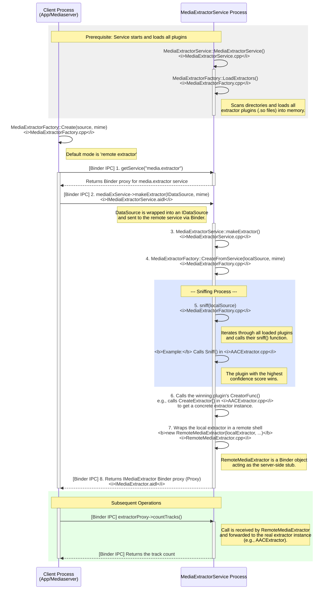
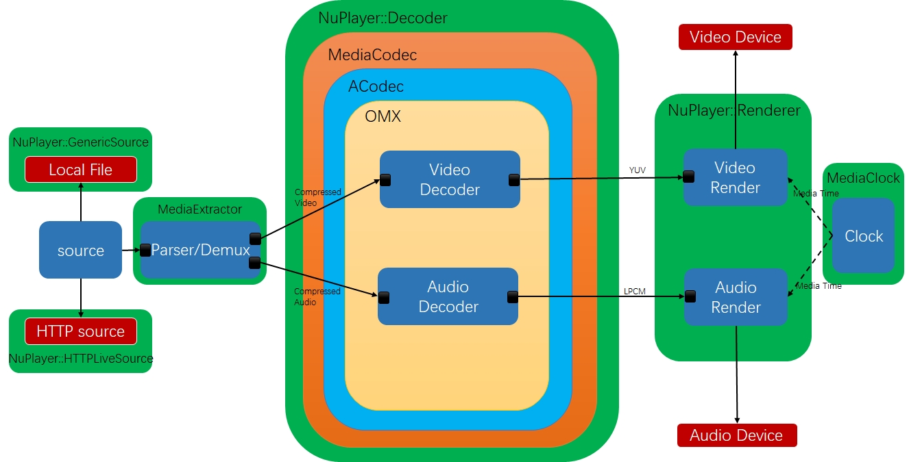
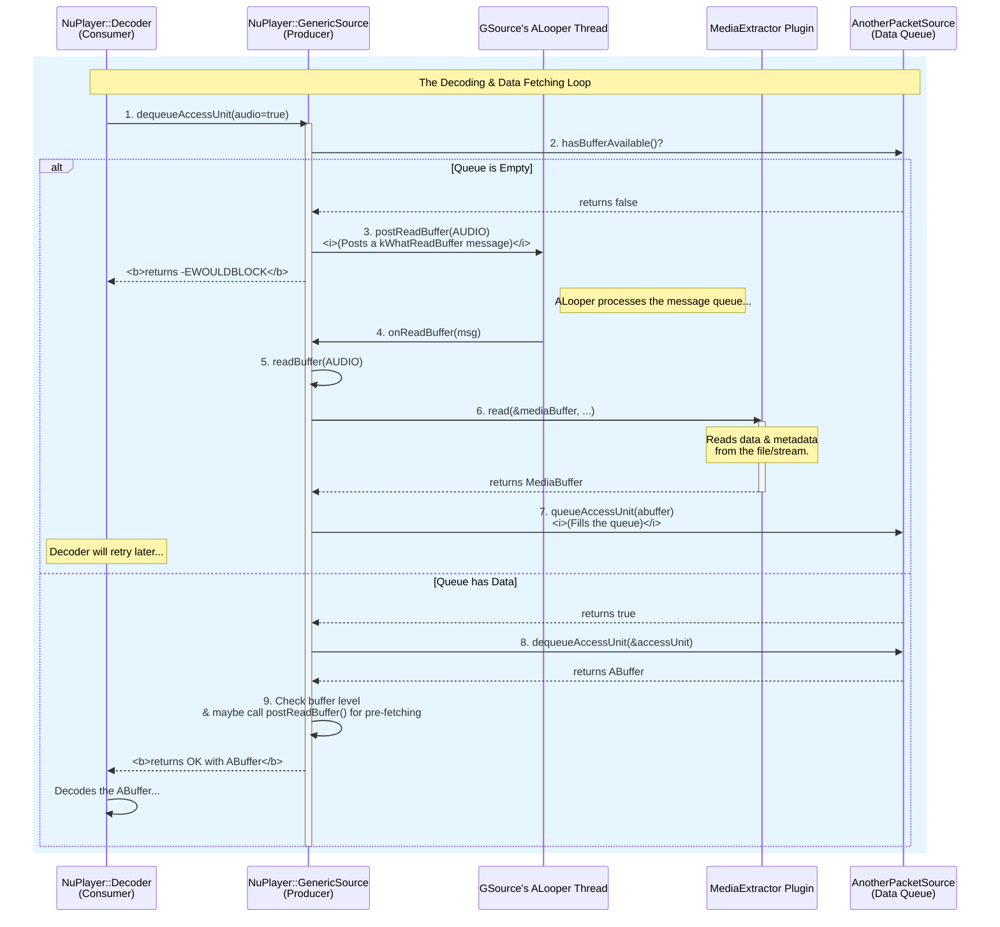
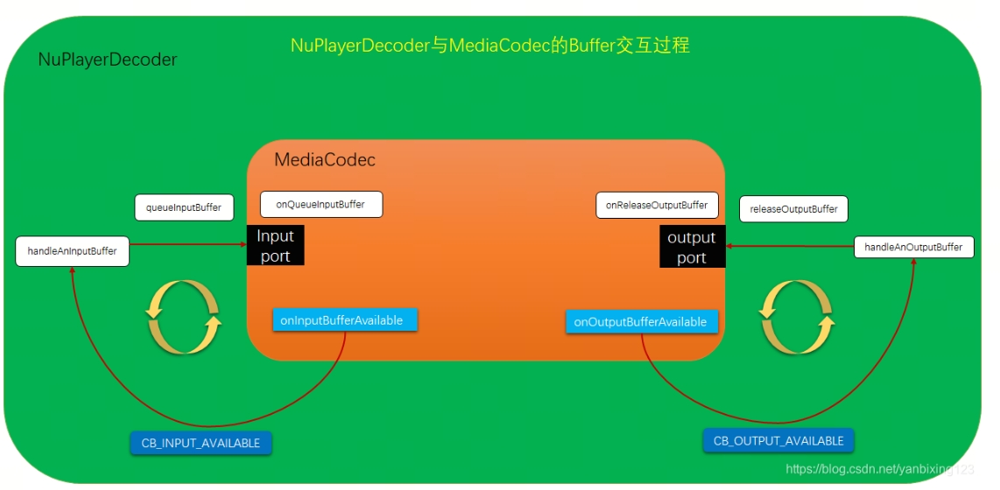
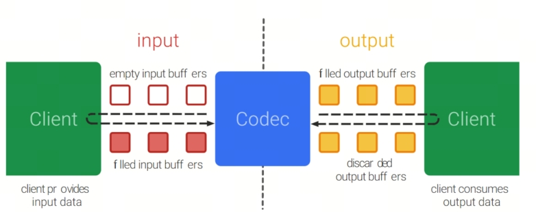
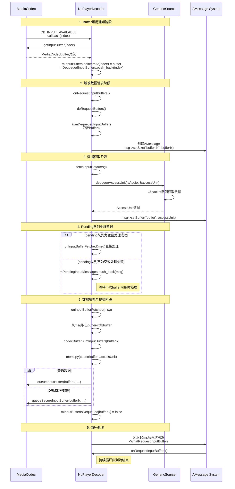
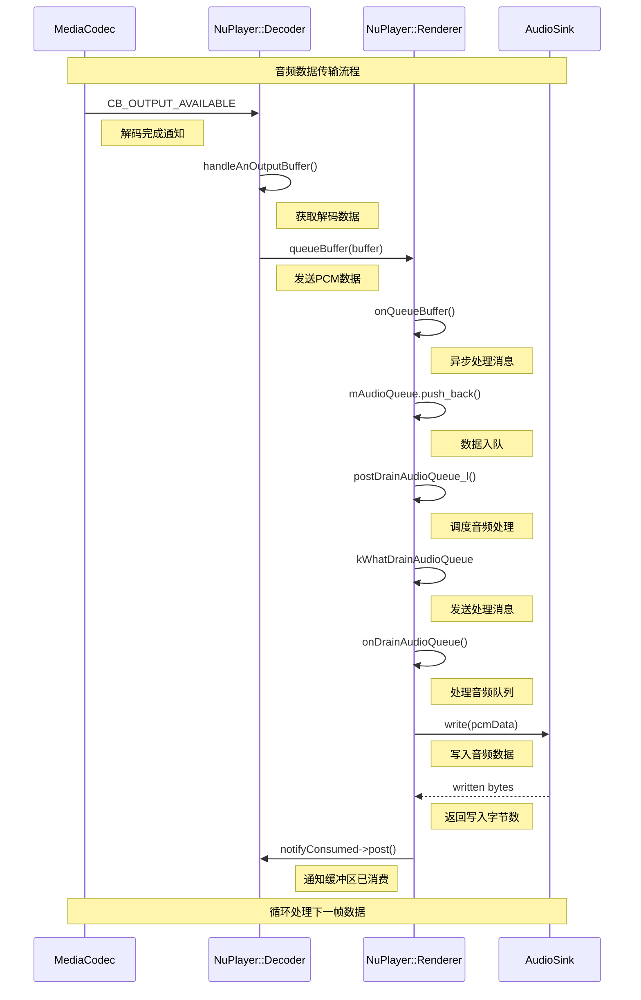

# MediaExtractorService的构造
```c++
MediaExtractorService::MediaExtractorService() {
    MediaExtractorFactory::LoadExtractors();
}
void MediaExtractorFactory::LoadExtractors() {
    std::shared_ptr<std::list<sp<ExtractorPlugin>>> newList(new std::list<sp<ExtractorPlugin>>());
    
    //pach  = 
    const android_dlextinfo dlextinfo = {
            .flags = ANDROID_DLEXT_USE_NAMESPACE,
            .library_namespace = mediaNs,
        };
        // 1. 在下列目录下找到符合条件的so 并且加载so创建对应的extractor放入到newList中 
    RegisterExtractors("/apex/com.android.media/lib(64)/extractors/"&dlextinfo, *newList);
    path = /system/lib(64)/extractors/  /system_ext/lib(64)/extractors/  /product/lib(64)/extractors/;
    RegisterExtractors("path，NULL, *newList")
    // 2. 按照extractor名字库的名字来排序
    newList->sort(compareFunc);
    gPlugins = newList;

    for (auto it = gPlugins->begin(); it != gPlugins->end(); ++it) {
        if ((*it)->def.def_version == EXTRACTORDEF_VERSION_NDK_V2) {
            for (size_t i = 0;; i++) {
                const char* ext = (*it)->def.u.v3.supported_types[i];
                if (ext == nullptr) {
                    break;
                }
                gSupportedExtensions.push_back(std::string(ext));
            }
        }
    }
    gPluginsRegistered = true;
}

void MediaExtractorFactory::RegisterExtractors(
        const char *libDirPath, const android_dlextinfo* dlextinfo,
        std::list<sp<ExtractorPlugin>> &pluginList) {
    // 1. libDirPath目录下的所有文件
    DIR *libDir = opendir(libDirPath);
    if (libDir) {
        struct dirent* libEntry;
        // 2. 遍历libDirPath目录下的所有文件
        while ((libEntry = readdir(libDir))) {
            if (libEntry->d_name[0] == '.') {
                continue;
            }
            String8 libPath = String8(libDirPath) + "/" + libEntry->d_name;
            if (!libPath.contains("extractor.so")) {
                continue;
            }
            // 3. 加载so
            void *libHandle = android_dlopen_ext(
                    libPath.string(),
                    RTLD_NOW | RTLD_LOCAL, dlextinfo);
            if (libHandle == nullptr) {
                ALOGI("dlopen(%s) reported error %s", libPath.string(), strerror(errno));
                continue;
            }
            // 4. 获取extractor的定义
            // 使用dlsym函数从已加载的动态库中查找名为"GETEXTRACTORDEF"的函数符号
            // GetExtractorDef是一个函数指针类型，指向获取提取器定义的函数
            // 这个函数将返回媒体提取器的定义信息，包括名称、版本、UUID和支持的媒体类型等
            GetExtractorDef getDef =
                (GetExtractorDef) dlsym(libHandle, "GETEXTRACTORDEF");
            ALOGV("registering sniffer for %s", libPath.string());
            // 5. 注册extractor
            RegisterExtractor(
                    new ExtractorPlugin(getDef(), libHandle, libPath), pluginList);
        }
        closedir(libDir);
    } else {
        ALOGI("plugin directory not present (%s)", libDirPath);
    }
}


void MediaExtractorFactory::RegisterExtractor(const sp<ExtractorPlugin> &plugin,
        std::list<sp<ExtractorPlugin>> &pluginList) {
    // 1. 检查extractor的版本、uuid、name
    if (plugin->def.def_version != EXTRACTORDEF_VERSION_NDK_V1 &&
            plugin->def.def_version != EXTRACTORDEF_VERSION_NDK_V2) {
        ALOGW("don't understand extractor format %u, ignoring.", plugin->def.def_version);
        return;
    }
    if (memcmp(&plugin->def.extractor_uuid, "\0\0\0\0\0\0\0\0\0\0\0\0\0\0\0\0", 16) == 0) {
        ALOGW("invalid UUID, ignoring");
        return;
    }
    if (plugin->def.extractor_name == NULL || strlen(plugin->def.extractor_name) == 0) {
        ALOGE("extractors should have a name, ignoring");
        return;
    }
    // 2.遍历plugList 获取其中对象与plugin比较，如果uuid相同那么久比较version，保留version大的
    for (auto it = pluginList.begin(); it != pluginList.end(); ++it) {
        if (memcmp(&((*it)->def.extractor_uuid), &plugin->def.extractor_uuid, 16) == 0) {
            // there's already an extractor with the same uuid
            if (gIgnoreVersion || (*it)->def.extractor_version < plugin->def.extractor_version) {
                // this one is newer, replace the old one
                ALOGW("replacing extractor '%s' version %u with version %u",
                        plugin->def.extractor_name,
                        (*it)->def.extractor_version,
                        plugin->def.extractor_version);
                pluginList.erase(it);
                break;
            } else {
                ALOGW("ignoring extractor '%s' version %u in favor of version %u",
                        plugin->def.extractor_name,
                        plugin->def.extractor_version,
                        (*it)->def.extractor_version);
                return;
            }
        }
    }
    ALOGV("registering extractor for %s", plugin->def.extractor_name);
    // 3. 将plugin添加到pluginList中
    pluginList.push_back(plugin);
}
```
```c++ 
AACExtractor.cpp
__attribute__ ((visibility ("default")))
ExtractorDef GETEXTRACTORDEF() {
    return {
        EXTRACTORDEF_VERSION,
        UUID("4fd80eae-03d2-4d72-9eb9-48fa6bb54613"),
        1, // version
        "AAC Extractor",
        { .v3 = {Sniff, extensions} },
    };
}
```
这段代码是文件AACExtractor.cpp中截取的。
总结一下LoadExtractors 做了那几件事 
1. 在指定目录下找到符合条件的so 并且加载so创建对应的extractor放入到newList中 
2. 按照extractor名字库的名字来排序
3. 将extractor的定义信息存储到gSupportedExtensions中
目前只是创建了ExtractorPlugin获取了对应extractor的函数符号，还并没有真正的初始化extractor
# Extractor初始化与选择
```c++ 
MediaExtractorFactory.cpp
sp<IMediaExtractor> MediaExtractorFactory::Create(
        const sp<DataSource> &source, const char *mime) {
    /*
     * 本地（local）extractor与远程（remote）extractor的区别：
     *
     * 1. local extractor（本地提取器）：
     *    - 直接在当前调用进程（如mediaserver或app进程）中加载和运行媒体提取器插件（extractor）。
     *    - 通过CreateFromService函数实现，实际是直接在本地进程内调用extractor插件的so库。
     *    - 优点：无需跨进程通信，效率高，调试方便。
     *    - 缺点：安全性较低，容易被恶意媒体文件利用本地so漏洞攻击进程（如提权、崩溃等）。
     *    - 适用场景：仅在明确信任输入数据或调试开发时使用。
     *
     * 2. remote extractor（远程提取器）：
     *    - 通过binder机制，将媒体提取操作委托给独立的"media.extractor"服务进程（MediaExtractorService）。
     *    - 当前进程只负责数据源的传递和结果的获取，实际的媒体解析和so插件加载都在远程服务进程中完成。
     *    - 优点：安全隔离，防止恶意媒体文件攻击主进程，提高系统稳定性。
     *    - 缺点：有一定的跨进程通信开销。
     *    - 适用场景：生产环境下的默认选择，尤其是面对不可信媒体数据时。
     *
     * 为什么还保留local extractor？
     * - 主要用于兼容性、调试、开发和某些特殊场景（如远程服务不可用时的兜底方案）。
     * - 通过系统属性"media.stagefright.extractremote"控制，默认true（即优先使用remote）。
     * - 某些情况下（如开发调试、远程服务崩溃、性能测试等）可以临时切换为local extractor。
     *
     * 代码流程说明如下图：
     *
     *   ┌──────────────┐
     *   │  调用Create  │
     *   └─────┬────────┘
     *         │
     *         ▼
     *   判断"media.stagefright.extractremote"
     *     │true（默认）           │false
     *     ▼                      ▼
     *  远程extractor         本地extractor
     *  ┌─────────────┐      ┌─────────────┐
     *  │ binder调用  │      │ 直接调用    │
     *  │ media.extractor│   │ CreateFromService │
     *  └─────────────┘      └─────────────┘
     *
     */

    ALOGI("MediaExtractorFactory::Create %s", mime);

    if (!property_get_bool("media.stagefright.extractremote", true)) {
        // 使用本地extractor（不推荐，除非调试或特殊场景）
        ALOGW("creating media extractor in calling process (local extractor)");
        return CreateFromService(source, mime);
    } else {
        // 使用远程extractor（推荐，默认）
        ALOGV("get service manager for remote extractor");
        sp<IBinder> binder = defaultServiceManager()->getService(String16("media.extractor"));

        if (binder != 0) {
            sp<IMediaExtractorService> mediaExService(
                    interface_cast<IMediaExtractorService>(binder));
            sp<IMediaExtractor> ex;
            mediaExService->makeExtractor(
                    CreateIDataSourceFromDataSource(source),
                    mime ? std::optional<std::string>(mime) : std::nullopt,
                    &ex);
            return ex;
        } else {
            ALOGE("extractor service not running");
            return NULL;
        }
    }
    return NULL;
}

::android::binder::Status MediaExtractorService::makeExtractor(
        const ::android::sp<::android::IDataSource>& remoteSource,
        const ::std::optional< ::std::string> &mime,
        ::android::sp<::android::IMediaExtractor>* _aidl_return) {
    ALOGV("@@@ MediaExtractorService::makeExtractor for %s", mime ? mime->c_str() : nullptr);

    sp<DataSource> localSource = CreateDataSourceFromIDataSource(remoteSource);

    MediaBuffer::useSharedMemory();
    sp<IMediaExtractor> extractor = MediaExtractorFactory::CreateFromService(
            localSource,
            mime ? mime->c_str() : nullptr);

    if (extractor != nullptr) {
        registerMediaExtractor(extractor, localSource, mime ? mime->c_str() : nullptr);
    }
    *_aidl_return = extractor;
    return binder::Status::ok();
}

sp<IMediaExtractor> MediaExtractorFactory::CreateFromService(
        const sp<DataSource> &source, const char *mime) {

    void *meta = nullptr;
    void *creator = NULL;
    FreeMetaFunc freeMeta = nullptr;
    float confidence;
    sp<ExtractorPlugin> plugin;
    uint32_t creatorVersion = 0;
    // 这一行代码的意思是：调用sniff函数来检测输入的DataSource（媒体数据源），
    // 以判断其媒体类型，并返回相应的extractor创建函数指针（creator）。
    // sniff函数会分析数据源内容，输出置信度（confidence）、元数据（meta）、释放元数据的函数指针（freeMeta），
    // 还会返回插件信息（plugin）和创建函数的版本号（creatorVersion）。
    //1. 获取创建目标extractor的函数指针
    creator = sniff(source, &confidence, &meta, &freeMeta, plugin, &creatorVersion);
    if (!creator) {
        ALOGV("FAILED to autodetect media content.");
        return NULL;
    }

    MediaExtractor *ex = nullptr;
    if (creatorVersion == EXTRACTORDEF_VERSION_NDK_V1 ||
            creatorVersion == EXTRACTORDEF_VERSION_NDK_V2) {
                //2. 创建目标函数
        CMediaExtractor *ret = ((CreatorFunc)creator)(source->wrap(), meta);
        if (meta != nullptr && freeMeta != nullptr) {
            freeMeta(meta);
        }
        ex = ret != nullptr ? new MediaExtractorCUnwrapper(ret) : nullptr;
    }

    ALOGV("Created an extractor '%s' with confidence %.2f",
         ex != nullptr ? ex->name() : "<null>", confidence);

    return CreateIMediaExtractorFromMediaExtractor(ex, source, plugin);
}
```
```c++
AACExtractor.cpp
static CreatorFunc Sniff(
        CDataSource *source, float *confidence, void **meta,
        FreeMetaFunc *freeMeta) {
    off64_t pos = 0;

    DataSourceHelper helper(source);
    for (;;) {
        uint8_t id3header[10];
        if (helper.readAt(pos, id3header, sizeof(id3header))
                < (ssize_t)sizeof(id3header)) {
            return NULL;
        }

        if (memcmp("ID3", id3header, 3)) {
            break;
        }

    }
    ......
    // ADTS syncword
    if ((header[0] == 0xff) && ((header[1] & 0xf6) == 0xf0)) {
        *confidence = 0.2;

        off64_t *offPtr = (off64_t*) malloc(sizeof(off64_t));
        *offPtr = pos;
        *meta = offPtr;
        *freeMeta = ::free;

        return CreateExtractor;
    }

    return NULL;
}
static CMediaExtractor* CreateExtractor(
        CDataSource *source,
        void *meta) {
    off64_t offset = *static_cast<off64_t*>(meta);
    return wrap(new AACExtractor(new DataSourceHelper(source), offset));
}

```
可以看到这个Sniff的工作分为两个步骤：
1. 读取AAC头自己个数，然后判断当前数据是否符合AAC的头数据
2. 创建一个Extractor，这个Extractor可谓是层层封装.
经过sniff就获取了创建目标Extractor的函数指针。

到此为止我们知道了如何创建目标Extractor。

# 数据流


从上图可知数据是从source->mediaextractor->decoder->renderer这一个流程，因为我们接下来就按照这个流程分为三小结来分析。并且要关注进程之间的通信。
## Source->Extractor
在创建Extractor的时候函数如下
```c++
sp<IMediaExtractorService> mediaExService(
                    interface_cast<IMediaExtractorService>(binder));
            sp<IMediaExtractor> ex;
            mediaExService->makeExtractor(
                    CreateIDataSourceFromDataSource(source),
                    mime ? std::optional<std::string>(mime) : std::nullopt,
                    &ex);
```
ex是IMediaExtractor的Binder代理对与客户端其实就是BpMediaEXtractor,由于进程之间存在地址隔离因此要把mediaserver进程的source传入给mediaextractor那么就需要使用Binder进行跨进程通信,把source封装成RemoteDataSource.
```c++
    explicit RemoteDataSource(const sp<DataSource> &source) {
        Mutex::Autolock lock(mLock);
        mSource = source;
        //kBufferSize = 64k
        sp<MemoryDealer> memoryDealer = new MemoryDealer(kBufferSize, "RemoteDataSource");
        mMemory = memoryDealer->allocate(kBufferSize);
        if (mMemory.get() == nullptr) {
            ALOGE("Failed to allocate memory!");
        }
        mName = String8::format("RemoteDataSource(%s)", mSource->toString().string());
    }
```
在RemoteDataSource的构造函数中创建了一个64k的共享内存,这样就可以做到两个进程之间共享内存。接下来mediaextractor进程.

```c++
::android::binder::Status MediaExtractorService::makeExtractor(
        const ::android::sp<::android::IDataSource>& remoteSource,
        const ::std::optional< ::std::string> &mime,
        ::android::sp<::android::IMediaExtractor>* _aidl_return) {
    ALOGV("@@@ MediaExtractorService::makeExtractor for %s", mime ? mime->c_str() : nullptr);
    //这里在重新转换成DataSource是为了保存extractor的兼容性
    sp<DataSource> localSource = CreateDataSourceFromIDataSource(remoteSource);

    MediaBuffer::useSharedMemory();
    sp<IMediaExtractor> extractor = MediaExtractorFactory::CreateFromService(
            localSource,
            mime ? mime->c_str() : nullptr);

    ALOGV("extractor service created %p (%s)",
            extractor.get(),
            extractor == nullptr ? "" : extractor->name());

            //这个主要为了dump信息用的
    if (extractor != nullptr) {
        registerMediaExtractor(extractor, localSource, mime ? mime->c_str() : nullptr);
    }
    *_aidl_return = extractor;
    return binder::Status::ok();
}

sp<DataSource> CreateDataSourceFromIDataSource(const sp<IDataSource> &source) {
    if (source == nullptr) {
        return nullptr;
    }
    return new TinyCacheSource(new CallbackDataSource(source));
}
```
又搞这一套层层包围,bnDataSource作为CallbackDataSource的参数,在作为TinyCacheSource的参数,我们来看看这两个类的构造函数.
```c++
CallbackDataSource::CallbackDataSource(
    const sp<IDataSource>& binderDataSource)
    : mIDataSource(binderDataSource),
      mIsClosed(false) {
    // Set up the buffer to read into.
    //注意这个mMemory就是我们之前申请的共享内存
    mMemory = mIDataSource->getIMemory();
    mName = String8::format("CallbackDataSource(%d->%d, %s)",
            getpid(),
            IPCThreadState::self()->getCallingPid(),
            mIDataSource->toString().string());

}
TinyCacheSource::TinyCacheSource(const sp<DataSource>& source)
    : mSource(source), mCachedOffset(0), mCachedSize(0) {
    mName = String8::format("TinyCacheSource(%s)", mSource->toString().string());
}
```
我们来看一下TinyCacheSource中的readAt().
```c++
                 Cache Block
<--------------------------------------------->
+=============================================+
|                                             |
+=============================================+
^                                             ^
|                                             |
mCachedOffset                          (mCachedOffset + mCachedSize)

      ^
      |
    offset (The position you want to read from)

ssize_t TinyCacheSource::readAt(off64_t offset, void* data, size_t size) {
    // 检查请求的数据是否在缓存中
    // 首先判断请求的偏移量是否在当前缓存范围内
    if (mCachedOffset <= offset
            && offset < (off64_t) (mCachedOffset + mCachedSize)) {
        // 情况1: 请求的数据完全在缓存中
        if (offset + size <= mCachedOffset + mCachedSize) {
            // 直接从缓存中复制数据到目标缓冲区
            memcpy(data, &mCache[offset - mCachedOffset], size);
            return size;
        } else {
            // 情况2: 请求的数据部分在缓存中（缓存命中部分）
            // 计算缓存中可用的数据量
            const ssize_t remaining = mCachedOffset + mCachedSize - offset;
            // 先复制缓存中已有的部分
            memcpy(data, &mCache[offset - mCachedOffset], remaining);
            // 递归调用readAt获取剩余部分数据
            const ssize_t readMore = readAt(offset + remaining,
                    (uint8_t*)data + remaining, size - remaining);
            // 处理读取错误情况
            if (readMore < 0) {
                return readMore;
            }
            // 返回总共读取的字节数
            return remaining + readMore;
        }
    }

    // 情况3: 请求的数据量大于等于缓存大小，直接从源读取不经过缓存
    if (size >= kCacheSize) {
        return mSource->readAt(offset, data, size);
    }

    // 情况4: 缓存未命中且请求数据量小于缓存大小，填充缓存
    // 从数据源读取kCacheSize大小的数据到缓存中
    const ssize_t numRead = mSource->readAt(offset, mCache, kCacheSize);
    // 处理读取错误或文件结束情况
    if (numRead <= 0) {
        // 出错时清空缓存状态
        mCachedSize = 0;
        mCachedOffset = 0;
        return numRead;
    }
    // 检查读取的数据量是否超出范围（这通常不应该发生）
    if ((size_t)numRead > kCacheSize) {
        // 出错时清空缓存状态
        mCachedSize = 0;
        mCachedOffset = 0;
        return ERROR_OUT_OF_RANGE;
    }

    // 更新缓存状态
    mCachedSize = numRead;
    mCachedOffset = offset;
    // 确保缓存状态有效
    CHECK(mCachedSize <= kCacheSize && mCachedOffset >= 0);
    // 计算实际返回给调用者的数据量（可能小于请求的size）
    const size_t numToReturn = std::min(size, (size_t)numRead);
    // 从缓存复制数据到目标缓冲区
    memcpy(data, mCache, numToReturn);

    return numToReturn;
}
```
可以看出来这个TinyCacheSource的readAt()函数主要是为了缓存数据，这样就可以做到减少Binder的通信次数,在TinyCacheSource中readAt()函数会调用CallbackDataSource的readAt()函数
```c++
ssize_t CallbackDataSource::readAt(off64_t offset, void* data, size_t size) {
    if (mMemory == NULL || data == NULL) {
        return -1;
    }

    // IDataSource can only read up to mMemory->size() bytes at a time, but this
    // method should be able to read any number of bytes, so read in a loop.
    size_t totalNumRead = 0;
    size_t numLeft = size;
    const size_t bufferSize = mMemory->size();

    while (numLeft > 0) {
        size_t numToRead = std::min(numLeft, bufferSize);
        ssize_t numRead =
            mIDataSource->readAt(offset + totalNumRead, numToRead);
        // A negative return value represents an error. Pass it on.
        if (numRead < 0) {
            return numRead == ERROR_END_OF_STREAM && totalNumRead > 0 ? totalNumRead : numRead;
        }
        // A zero return value signals EOS. Return the bytes read so far.
        if (numRead == 0) {
            return totalNumRead;
        }
        if ((size_t)numRead > numToRead) {
            return ERROR_OUT_OF_RANGE;
        }
        CHECK(numRead >= 0 && (size_t)numRead <= bufferSize);
        // 这行代码的意思是将从IDataSource读取的数据复制到调用者提供的缓冲区中
        // ((uint8_t*)data) + totalNumRead：计算目标缓冲区的当前写入位置，data是基址，totalNumRead是已经写入的字节数
        // mMemory->unsecurePointer()：获取共享内存的指针，这里存放着从IDataSource读取的数据
        // 整个memcpy操作是将共享内存中的数据复制到调用者的缓冲区中
        memcpy(((uint8_t*)data) + totalNumRead, mMemory->unsecurePointer(),
            numRead);
        numLeft -= numRead;
        totalNumRead += numRead;
    }

    return totalNumRead;
}
```
在CalkbackDataSource中调用的 mIDataSource->readAt(offset + totalNumRead, numToRead);其实是调用RemoteDataSource的readAt()函数.可以看到是把数据copy到共享内存中.在RemoteDataSource中的mSource就是真正的source了 比如FileSource这种,这个代码我就补贴出来了,时机内容就是把本地文件copy到共享内存中.
```c++
    virtual ssize_t readAt(off64_t offset, size_t size) {
        ALOGV("readAt(%lld, %zu)", (long long)offset, size);
        if (size > kBufferSize) {
            size = kBufferSize;
        }

        Mutex::Autolock lock(mLock);
        if (mSource.get() == nullptr || mMemory.get() == nullptr) {
            ALOGE("readAt() failed, mSource is nullptr");
            return 0;
        }
        return mSource->readAt(offset, mMemory->unsecurePointer(), size);
    }
```
到此为止我们知道了数据是如何从本地文件中copy到extractor中的了.现在还有一个问题就是数据是如何源源不断的送入到extractor呢,目前也只是知道数据是如何read跟extractor使用sniff函数来探测数据.
### 数据源源不断的送入到extractor
我们来看一下postReadBuffer函数,该函数在PrepareAsync与Start流程都会调用.NuPlayer 的数据读取是一个事件驱动的循环，而不是一个阻塞的 while 循环。它需要一种机制来触发"下一次数据读取"这个动作。这个函数就是用来"提交一个读取请求到消息队列"的。  接下来我们只分析readBuffer获取audio的情况
```c++
void NuPlayer::GenericSource::postReadBuffer(media_track_type trackType) {
    // 1. 检查是否已有"待处理"的读取请求
    if ((mPendingReadBufferTypes & (1 << trackType)) == 0) {
        
        // 2. 标记当前轨道为"待处理"
        mPendingReadBufferTypes |= (1 << trackType);
        
        // 3. 创建一个消息
        sp<AMessage> msg = new AMessage(kWhatReadBuffer, this);
        msg->setInt32("trackType", trackType);
        
        // 4. 将消息投递到当前对象的消息队列
        msg->post();
    }
}

void NuPlayer::GenericSource::onReadBuffer(const sp<AMessage> &msg) {
  int32_t tmpType;
  CHECK(msg->findInt32("trackType", &tmpType));
  media_track_type trackType = (media_track_type)tmpType;
  mPendingReadBufferTypes &= ~(1 << trackType);
  readBuffer(trackType);
}


// NuPlayer::GenericSource::readBuffer
// 功能：从源读取指定轨道的数据，并将其放入相应的包队列中。
// 参数：
//   trackType:    要读取的轨道类型（视频、音频等）。
//   seekTimeUs:   如果 >= 0，表示这是一个 seek 请求，需要跳转到这个时间点。
//   mode:         seek 的模式 (SEEK_PREVIOUS_SYNC, SEEK_CLOSEST 等)。
//   actualTimeUs: 用于传出 seek 后实际跳转到的时间点。
//   formatChange: 是否有格式变化，用于处理不连续性。
void NuPlayer::GenericSource::readBuffer(media_track_type trackType,
                                         int64_t seekTimeUs,
                                         MediaPlayerSeekMode mode,
                                         int64_t *actualTimeUs,
                                         bool formatChange) {
  Track *track;
  size_t maxBuffers = 1; // 默认一次只读一个 buffer

  // 1. 根据轨道类型，获取对应的 Track 结构体指针和设置一次最多读取的 buffer 数量
  switch (trackType) {
    case MEDIA_TRACK_TYPE_VIDEO:
      track = &mVideoTrack;
      maxBuffers = 8; // 视频轨道一次最多读8个，这个值不能太大，否则可能影响 seek 响应速度
      break;
    case MEDIA_TRACK_TYPE_AUDIO:
      track = &mAudioTrack;
      maxBuffers = 64; // 音频轨道数据量小，可以多读一些以提高效率
      break;
    case MEDIA_TRACK_TYPE_SUBTITLE:
      track = &mSubtitleTrack;
      break;
    case MEDIA_TRACK_TYPE_TIMEDTEXT:
      track = &mTimedTextTrack;
      break;
    default:
      TRESPASS(); // 不应出现其他类型
  }

  // 如果这个轨道没有源 (比如文件没有视频轨)，直接返回
  if (track->mSource == NULL) {
    return;
  }

  // 如果需要返回实际跳转时间，先用请求的 seek 时间初始化
  if (actualTimeUs) {
    *actualTimeUs = seekTimeUs;
  }

  // 如果视频解码器之前出错了，就不再读取视频数据
  if (mVideoDecoderError && trackType == MEDIA_TRACK_TYPE_VIDEO) {
    return;
  }

  MediaSource::ReadOptions options; // 创建读取选项对象

  bool seeking = false;
  // 2. 如果 seekTimeUs >= 0，说明这是一个 seek 操作
  if (seekTimeUs >= 0) {
    // 设置 seek 选项，包括目标时间和模式
    options.setSeekTo(seekTimeUs, mode);
    seeking = true;
  }

  // 检查底层的 MediaSource 是否支持一次读取多个 buffer
  const bool couldReadMultiple = (track->mSource->supportReadMultiple());

  if (couldReadMultiple) {
    // 如果支持，设置为非阻塞读取，这样 readMultiple 可以立即返回它能拿到的所有数据
    options.setNonBlocking();
  }

  // 获取当前轨道的数据代数（generation），用于检测轨道是否在中途被切换
  int32_t generation = getDataGeneration(trackType);

  // 3. 循环读取数据，直到达到 maxBuffers 上限或没有更多数据
  for (size_t numBuffers = 0; numBuffers < maxBuffers;) {
    Vector<MediaBufferBase *> mediaBuffers;
    status_t err = NO_ERROR;
    //souce是MediaTrackCUnwrapper
    sp<IMediaSource> source = track->mSource;
    // 重要：在调用可能阻塞的 read 操作前，解锁 mLock，避免死锁
    mLock.unlock();
    if (couldReadMultiple) {
      // 尝试一次性读取多个 buffer
      err = source->readMultiple(&mediaBuffers, maxBuffers - numBuffers, &options);
    } else {
      /* 传统的、一次只读一个 buffer，另外注意这个buffer实在各个extractor中new出来的，
      每个extractor都会继承一个MediaTrackHelper，在MediaTrackHelper中存在mBufferGroup，
      使用这个申请内存的 代码如下：
          MediaBufferHelper* mediaBuffer;
    mBufferGroup->acquire_buffer(&mediaBuffer, false, pkt->size + AV_INPUT_BUFFER_PADDING_SIZE);  在acquire_buffer中创建了一个MediaBuffer
*/
      MediaBufferBase *mbuf = NULL;
      err = source->read(&mbuf, &options);
      if (err == OK && mbuf != NULL) {
        mediaBuffers.push_back(mbuf);
      }
    }
    // 读取操作完成，重新加锁
    mLock.lock();

    // 清除非持久性的读取选项（比如 seek 选项只在第一次读取时有效）
    options.clearNonPersistent();

    size_t id = 0;
    size_t count = mediaBuffers.size(); // 获取本次实际读取到的 buffer 数量

    // 4. 检查在解锁期间，轨道是否被更换了（比如用户切换了音轨）
    if (generation != getDataGeneration(trackType)) {
      // 如果代数变了，说明轨道已更换，本次读取的数据全部作废
      for (; id < count; ++id) {
        mediaBuffers[id]->release();
      }
      break; // 退出循环
    }

    // 5. 遍历本次读取到的所有 buffer
    for (; id < count; ++id) {
      int64_t timeUs;
      MediaBufferBase *mbuf = mediaBuffers[id];
      // 检查 buffer 中是否包含时间戳 (kKeyTime)
      if (!mbuf->meta_data().findInt64(kKeyTime, &timeUs)) {
        // 如果没有时间戳，这是个错误，认为是码流损坏
        mbuf->meta_data().dumpToLog();
        track->mPackets->signalEOS(ERROR_MALFORMED);
        break; // 退出内部循环
      }
      // 更新当前轨道的最新时间戳
      if (trackType == MEDIA_TRACK_TYPE_AUDIO) {
        mAudioTimeUs = timeUs;
      } else if (trackType == MEDIA_TRACK_TYPE_VIDEO) {
        mVideoTimeUs = timeUs;
      }

      // 如果是 seek 或格式变化，需要向队列中插入一个不连续性标记
      queueDiscontinuityIfNeeded(seeking, formatChange, trackType, track);

      // 将 MediaBuffer 转换为 ABuffer (NuPlayer 内部使用的数据结构)
      sp<ABuffer> buffer = mediaBufferToABuffer(mbuf, trackType);

      // 如果是 seek 操作，将第一帧的实际时间戳传出去
      if (numBuffers == 0 && actualTimeUs != nullptr) {
        *actualTimeUs = timeUs;
      }
      
      // 特殊处理：如果 seek 模式是 SEEK_CLOSEST，且目标时间比当前帧晚
      // （意味着解码器需要追赶），则在 buffer 中附加一个元数据，
      // 告诉 Renderer 在解码后要从 seekTimeUs 开始渲染。
      if (seeking && buffer != nullptr) {
        sp<AMessage> meta = buffer->meta();
        if (meta != nullptr && mode == MediaPlayerSeekMode::SEEK_CLOSEST &&
            seekTimeUs > timeUs) {
          sp<AMessage> extra = new AMessage;
          extra->setInt64("resume-at-mediaTimeUs", seekTimeUs);
          meta->setMessage("extra", extra);
        }
      }

      // 6. 将处理好的 ABuffer 放入对应轨道的包队列 (mPackets)
      track->mPackets->queueAccessUnit(buffer);

      // 状态重置：不连续性标记只插一次
      formatChange = false;
      seeking = false;
      ++numBuffers;
    }

    // 如果内部循环是因为错误（如缺少时间戳）而中断的，释放剩余的 buffer
    if (id < count) {
      for (; id < count; ++id) {
        mediaBuffers[id]->release();
      }
      break;
    }

    // 7. 根据 read 操作的返回值进行后续处理
    if (err == WOULD_BLOCK) {
      // 数据暂时读不出来（比如网络卡了），正常，直接退出循环等待下一次被唤醒
      break;
    } else if (err == INFO_FORMAT_CHANGED) {
      // 码流格式发生变化（比如分辨率变了），这里可以插入一个格式变化的不连续性标记
#if 0
            track->mPackets->queueDiscontinuity(
                    ATSParser::DISCONTINUITY_FORMATCHANGE,
                    NULL,
                    false /* discard */);
#endif
    } else if (err != OK) {
      // 其他错误，认为是流结束（EOS）
      queueDiscontinuityIfNeeded(seeking, formatChange, trackType, track);
      track->mPackets->signalEOS(err);
      break;
    }
  }

  // 8. 流媒体播放时的缓冲逻辑
  if (mIsStreaming && (trackType == MEDIA_TRACK_TYPE_VIDEO ||
                       trackType == MEDIA_TRACK_TYPE_AUDIO)) {
    status_t finalResult;
    // 获取当前已缓冲的数据时长
    int64_t durationUs = track->mPackets->getBufferedDurationUs(&finalResult);

    // 计算需要缓冲的目标时长 (mInitialMarkMs 或 mResumePlaybackMarkMs)
    int64_t markUs = (mPreparing ? mBufferingSettings.mInitialMarkMs
                                 : mBufferingSettings.mResumePlaybackMarkMs) * 1000LL;
                                 
    // 如果已经缓冲够了，或者已经到流末尾了
    if (finalResult == ERROR_END_OF_STREAM || durationUs >= markUs) {
      // 如果之前是因为缓冲而暂停的
      if (mPreparing || mSentPauseOnBuffering) {
        // 检查另一个轨道（视频或音频）是否也缓冲好了
        Track *counterTrack =
            (trackType == MEDIA_TRACK_TYPE_VIDEO ? &mAudioTrack : &mVideoTrack);
        if (counterTrack->mSource != NULL) {
          durationUs =
              counterTrack->mPackets->getBufferedDurationUs(&finalResult);
        }
        
        // 如果两个轨道都缓冲好了
        if (finalResult == ERROR_END_OF_STREAM || durationUs >= markUs) {
          if (mPreparing) {
            // 如果是首次准备，则通知上层 Player 准备完毕
            notifyPrepared();
            mPreparing = false;
          } else {
            // 如果是播放中缓冲，则通知上层 Player 恢复播放
            sendCacheStats();
            mSentPauseOnBuffering = false;
            sp<AMessage> notify = dupNotify();
            notify->setInt32("what", kWhatResumeOnBufferingEnd);
            notify->post();
          }
        }
      }
      return; // 缓冲够了，不再继续请求读取
    }

    // 如果还没缓冲够，继续 post 一个读取请求
    postReadBuffer(trackType);
  }
}
```
但目前位置我们已经知道了数据是如何从source到extrator,然后在GenericSource中把demux之后的数据存入到AnotherPacketSource中的buff中,那么还要在看一下这个数据是如何连续的流动起来的的.那么就要看哪里调用了postReadBuffer,在GenericSource.cpp中dequeueAccessUnit函数会多次调用.
`NuPlayer::GenericSource::dequeueAccessUnit` 是连接*数据生产者（`GenericSource`）* 和*数据消费者（`Decoder`）*的桥梁。这个函数不仅提供数据，还包含了触发后续数据读取和缓冲管理的关键逻辑。
```c++
// NuPlayer::GenericSource::dequeueAccessUnit
// 功能：从音频或视频轨道的数据包队列中取出一个访问单元(Access Unit)给消费者(如Decoder)。
// 参数：
//   audio:      布尔值，true 表示获取音频数据，false 表示获取视频数据。
//   accessUnit: 输出参数，用于存储获取到的数据缓冲区 (ABuffer)。
// 返回值：
//   OK:              成功取出一个访问单元。
//   -EWOULDBLOCK:    队列暂时为空，但流没有结束，消费者应稍后重试。
//   ERROR_END_OF_STREAM: 队列已空且已到达流末尾 (EOS)。
//   其他错误码:       发生了其他错误。
status_t NuPlayer::GenericSource::dequeueAccessUnit(bool audio,
                                                    sp<ABuffer> *accessUnit) {
  // 加锁以保证线程安全
  Mutex::Autolock _l(mLock);
  
  // 特殊情况处理：如果播放器已停止并且DRM已释放，不再发送任何数据。
  // 这是因为解码器的加密对象可能已经销毁，发送加密数据会导致崩溃。
  if (!mStarted && mIsDrmReleased) {
    return -EWOULDBLOCK;
  }

  // 1. 根据 'audio' 参数，选择要操作的轨道（音频或视频）
  Track *track = audio ? &mAudioTrack : &mVideoTrack;

  // 如果该轨道不存在 (例如，视频文件没有音频轨)，则直接返回
  if (track->mSource == NULL) {
    return -EWOULDBLOCK;
  }

  status_t finalResult;
  // 2. 检查数据包队列 (mPackets) 是否有可用的 buffer
  if (!track->mPackets->hasBufferAvailable(&finalResult)) {
    // 如果队列为空...
    if (finalResult == OK) {
      // ...且流没有结束，说明只是数据还没读进来。
      // 触发一次新的读取请求，让 GenericSource 去填充队列。
      postReadBuffer(audio ? MEDIA_TRACK_TYPE_AUDIO : MEDIA_TRACK_TYPE_VIDEO);
      // 返回 -EWOULDBLOCK，告知消费者"请稍后再试"。
      return -EWOULDBLOCK;
    }
    // 如果 finalResult 不是 OK (比如是 ERROR_END_OF_STREAM)，
    // 说明流已经结束或出错，直接将这个状态返回给消费者。
    return finalResult;
  }

  // 3. 队列中有数据，实际执行出队操作
  status_t result = track->mPackets->dequeueAccessUnit(accessUnit);

  // 4. 缓冲管理与预读取逻辑
  // 这部分的核心思想是：在队列中的数据快要被耗尽时，提前触发下一次读取，
  // 从而让数据流尽可能平滑，防止解码器"饿肚子"。
  if (!mIsStreaming) {
    // 对于本地播放：如果队列中的 buffer 数量少于2个，就该去读更多数据了。
    if (track->mPackets->getAvailableBufferCount(&finalResult) < 2) {
      postReadBuffer(audio ? MEDIA_TRACK_TYPE_AUDIO : MEDIA_TRACK_TYPE_VIDEO);
    }
  } else {
    // 对于流媒体播放 (情况更复杂)：
    int64_t durationUs = track->mPackets->getBufferedDurationUs(&finalResult);
    
    // 计算一个"重新开始缓冲"的水位线，通常是恢复播放所需缓冲时长的一半。
    int64_t restartBufferingMarkUs =
        mBufferingSettings.mResumePlaybackMarkMs * 1000LL / 2;
        
    if (finalResult == OK) {
      // 如果已缓冲的时长低于水位线，立即触发读取。
      if (durationUs < restartBufferingMarkUs) {
        postReadBuffer(audio ? MEDIA_TRACK_TYPE_AUDIO : MEDIA_TRACK_TYPE_VIDEO);
      }
      // 如果 buffer 数量低于2个，并且我们当前没有因为缓冲而暂停播放，
      // 这可能是一个危险信号，说明网络跟不上消耗速度了。
      if (track->mPackets->getAvailableBufferCount(&finalResult) < 2 &&
          !mSentPauseOnBuffering && !mPreparing) {
        // 主动通知上层暂停播放，进入缓冲状态。
        mCachedSource->resumeFetchingIfNecessary(); // 继续下载
        sendCacheStats(); // 发送缓存状态
        mSentPauseOnBuffering = true;
        sp<AMessage> notify = dupNotify();
        notify->setInt32("what", kWhatPauseOnBufferingStart);
        notify->post();
      }
    }
  }

  // 5. 错误处理与字幕同步
  if (result != OK) {
    // 如果出队失败 (例如读到了 EOS)，清空所有字幕轨道的队列，
    // 因为音视频流结束了，字幕也应该重新同步。
    if (mSubtitleTrack.mSource != NULL) {
      mSubtitleTrack.mPackets->clear();
      mFetchSubtitleDataGeneration++; // 增加代数，使旧的字幕请求失效
    }
    if (mTimedTextTrack.mSource != NULL) {
      mTimedTextTrack.mPackets->clear();
      mFetchTimedTextDataGeneration++;
    }
    return result; // 将错误码返回给消费者
  }

  // 6. 成功出队，记录时间戳并触发字幕读取
  int64_t timeUs;
  status_t eosResult; // (此处忽略)
  // 从取出的 buffer 的元数据中，读出它的时间戳
  CHECK((*accessUnit)->meta()->findInt64("timeUs", &timeUs));
  
  // 更新对应轨道的"最后一次出队时间戳"，这个值在 seek 或切轨时非常有用
  if (audio) {
    mAudioLastDequeueTimeUs = timeUs;
  } else {
    mVideoLastDequeueTimeUs = timeUs;
  }

  // 根据当前音视频的时间戳，检查是否需要去抓取新的字幕数据。
  // 这确保了字幕总是与当前的播放进度同步。
  if (mSubtitleTrack.mSource != NULL &&
      !mSubtitleTrack.mPackets->hasBufferAvailable(&eosResult)) {
    sp<AMessage> msg = new AMessage(kWhatFetchSubtitleData, this);
    msg->setInt64("timeUs", timeUs); // 告诉字幕读取器要从哪个时间点开始读
    msg->setInt32("generation", mFetchSubtitleDataGeneration);
    msg->post();
  }

  if (mTimedTextTrack.mSource != NULL &&
      !mTimedTextTrack.mPackets->hasBufferAvailable(&eosResult)) {
    sp<AMessage> msg = new AMessage(kWhatFetchTimedTextData, this);
    msg->setInt64("timeUs", timeUs);
    msg->setInt32("generation", mFetchTimedTextDataGeneration);
    msg->post();
  }

  // 7. 返回成功
  return result;
}
```
**现在我们清楚了是通过dequeueAccessUnit来触发从extractor中获取数据的**,这个函数在NuPlayerDecoder模块来触发,那么这个生产者与消费者模式我们就搞通了.

我们关注数据走向如下:
```
+----------------+                            +-------------------------+
| NuPlayer Proc  |      (1) Give Access       | MediaExtractorService   |
| (GenericSource)|--------------------------->| (Extractor Plugin)      |
|                |      (via Binder)          |                         |
| FileSource     |                            | BpDataSource            |
| RemoteDataSrc  |<----(readAt() request)-----|                         |
| (SharedMemory) |-----(file chunk data)----->| (SharedMemory)          |
|                |                            |                         |
|                |      (2) Get AU Data       |                         |
| BpMediaSource  |------------(read())-------->| MediaTrack             |
| (MediaBuffer)  |<----(AU data + meta)-------| (MediaBuffer)           |
+----------------+                            +-------------------------+
```
好的，我来详细解释这个数据流图，它展示了 NuPlayer 进程和 MediaExtractorService 进程之间的数据交互。

### 整体架构说明

这个图展示了 Android 多媒体框架中的**跨进程数据流**，分为两个主要阶段：

1. **第一阶段**：原始媒体文件数据的访问（通过共享内存）
2. **第二阶段**：解复用后的音视频数据传递（通过 Binder）

### 详细流程解析

#### 第一阶段：原始数据访问（共享内存方式）

```
+----------------+                            +-------------------------+
| NuPlayer Proc  |      (1) Give Access       | MediaExtractorService   |
| (GenericSource)|--------------------------->| (Extractor Plugin)      |
|                |      (via Binder)          |                         |
| FileSource     |                            | BpDataSource            |
| RemoteDataSrc  |<----(readAt() request)-----|                         |
| (SharedMemory) |-----(file chunk data)----->| (SharedMemory)          |
+----------------+                            +-------------------------+
```

**步骤详解：**

1. **`(1) Give Access`**：
   - NuPlayer 进程中的 `GenericSource` 通过 Binder 调用 `MediaExtractorService::makeExtractor()`
   - 将本地的 `DataSource`（如 `FileSource`）包装成 `RemoteDataSource`
   - `RemoteDataSource` 创建 64KB 的共享内存区域
   - 通过 Binder 将共享内存的 `IMemory` 对象传递给 MediaExtractorService 进程

2. **`readAt() request`**：
   - MediaExtractorService 进程中的 Extractor 插件需要读取文件数据
   - 通过 `BpDataSource`（Binder 代理）调用 `readAt()`
   - 这个调用会跨进程到达 NuPlayer 进程的 `RemoteDataSource::readAt()`

3. **`file chunk data`**：
   - `RemoteDataSource::readAt()` 调用真正的 `FileSource::readAt()`
   - 从本地文件读取数据块（最大 64KB）
   - 将数据写入共享内存区域
   - 通过共享内存将数据传递给 MediaExtractorService 进程

#### 第二阶段：解复用数据传递（Binder 方式）

```
+----------------+                            +-------------------------+
|                |      (2) Get AU Data       |                         |
| BpMediaSource  |------------(read())-------->| MediaTrack             |
| (MediaBuffer)  |<----(AU data + meta)-------| (MediaBuffer)           |
+----------------+                            +-------------------------+
```

**步骤详解：**

1. **`read()` 调用**：
   - NuPlayer 进程中的 `GenericSource::readBuffer()` 调用 `BpMediaSource::read()`
   - 通过 Binder 跨进程调用 MediaExtractorService 进程中的 `MediaTrack::read()`

2. **`AU data + meta`**：
   - Extractor 插件（如 `AACExtractor`）解析原始数据
   - 提取出单个访问单元（Access Unit，如一个音频帧）
   - 创建 `MediaBuffer` 对象，包含：
     - 音频/视频数据
     - 元数据（时间戳、格式信息等）
   - 通过 Binder 将 `MediaBuffer` 返回给 NuPlayer 进程

### 为什么使用两种不同的通信方式？

#### 共享内存用于原始数据访问的原因：
1. **数据量大**：原始媒体文件可能很大，频繁的 Binder 拷贝开销巨大
2. **顺序访问**：文件读取通常是顺序的，适合批量传输
3. **效率高**：共享内存避免了数据拷贝，直接内存映射

#### Binder 用于解复用数据的原因：
1. **数据量小**：单个音频/视频帧相对较小
2. **结构化数据**：需要传递复杂的元数据（时间戳、格式等）
3. **类型安全**：Binder 提供类型安全的序列化机制
4. **生命周期管理**：Binder 对象有自动的引用计数和清理机制


这种设计既保证了大数据传输的效率，又确保了结构化数据传递的可靠性和类型安全。
元数据输入到extractor使用的是共享内存,这里共享内存没有当作ringbuffer使用.
demux之后的数据送入到MediaBuffer中使用的是binder通信,并且是按照一帧一帧存到MediaBuffer中.比较形象的比喻是我给你遥控器(把source送给了extractor)，你通过共享内存来我家取东西"，另一个是"我直接把处理好的小包裹通过快递寄给你

## Extractor->Decoder



我的理解是NuPlayerDecoder是包装在MediaCodec外面的一层，而这个input和output都是相对于MediaCodec来说的，NuPlayerDecoder与MediaCodec交互发生在两个port，MediaCodec中也维护着一个BufferQueue，当inputport端口有buffer时，就会调用MediaCodec::onInputBufferAvailable()函数，这个函数就会发送一个CB_INPUT_AVAILABLE msg到NuPlayerDecoder中，通知它在MediaCodec的input port有一个buffer，那么NuPlayerDecoder就会相应的调用NuPlayer::Decoder::handleAnInputBuffer()函数来处理这个事情，怎么处理呢？MediaCodec的作用就是解码，Decoder就是从demux（MediaExtractor）中取数据，交给MediaCodec去处理。

当MediaCodec处理完这些数据后（怎么处理？把H264的码流解析成YUV格式的），数据在内部从input port流到ouput port，这时候就会触发MediaCodec::onOutputBufferAvailable()函数，来告诉NuPlayerDecoder在MediaCodec的ouput port有一个buffer，通过发送一个CB_OUTPUT_AVAILABLE msg，当NuPlayerDecoder接收到这个msg后，调用NuPlayer::Decoder::handleAnOutputBuffer()函数来处理，怎么处理呢？
带着上面的两个疑问我们继续分析代码。

--- 
我们先来分析一下handleAnInputBuffer函数
```c++
bool NuPlayer::Decoder::handleAnInputBuffer(size_t index) {
    // 1. 检查是否有格式变化或时间变化等待处理
    // 如果有discontinuity pending，暂时不处理新的input buffer
    if (isDiscontinuityPending()) {
        return false;
    }

    // 2. 确保MediaCodec对象有效
    if (mCodec == NULL) {
        ALOGE("[%s] handleAnInputBuffer without a valid codec", mComponentName.c_str());
        handleError(NO_INIT);
        return false;
    }

    // 3. 根据index从MediaCodec获取实际的input buffer对象
    // 这个index是MediaCodec通过CB_INPUT_AVAILABLE回调提供的
    sp<MediaCodecBuffer> buffer;
    mCodec->getInputBuffer(index, &buffer);

    if (buffer == NULL) {
        ALOGE("[%s] handleAnInputBuffer, failed to get input buffer", mComponentName.c_str());
        handleError(UNKNOWN_ERROR);
        return false;
    }

    // 4. 动态扩展buffer管理数组的大小
    // 如果当前index超出了数组大小，需要扩展相关的管理数组
    if (index >= mInputBuffers.size()) {
        for (size_t i = mInputBuffers.size(); i <= index; ++i) {
            mInputBuffers.add();           // MediaCodec buffer数组
            mMediaBuffers.add();           // MediaBuffer数组（用于DRM等）
            mInputBufferIsDequeued.add();  // buffer是否已dequeued的状态数组
            mMediaBuffers.editItemAt(i) = NULL;
            mInputBufferIsDequeued.editItemAt(i) = false;
        }
    }
    
    // 5. 将获取到的MediaCodec buffer保存到管理数组中
    // 后续可以通过index快速访问这个buffer
    // editItemAt是Android中Vector类的方法，不是标准STL的用法
    // 它返回指定索引位置元素的引用，允许直接修改该元素
    // 这里用于将MediaCodec buffer存储到mInputBuffers数组的指定位置
    mInputBuffers.editItemAt(index) = buffer;


    // 6. 清理该位置上可能存在的旧MediaBuffer
    // MediaBuffer主要用于DRM加密数据的处理
    if (mMediaBuffers[index] != NULL) {
        mMediaBuffers[index]->release();
        mMediaBuffers.editItemAt(index) = NULL;
    }
    
    // 7. 标记该buffer为已dequeued状态
    // 表示这个buffer已经从MediaCodec获取，可以被使用
    mInputBufferIsDequeued.editItemAt(index) = true;

    // 8. 优先处理CSD（Codec Specific Data）
    // CSD包含解码器初始化所需的配置数据，必须优先发送
    if (!mCSDsToSubmit.isEmpty()) {
        sp<AMessage> msg = new AMessage();
        msg->setSize("buffer-ix", index);  // 传递buffer索引

        sp<ABuffer> buffer = mCSDsToSubmit.itemAt(0);
        ALOGV("[%s] resubmitting CSD", mComponentName.c_str());
        msg->setBuffer("buffer", buffer);
        mCSDsToSubmit.removeAt(0);
        
        // 直接处理CSD数据，如果失败则报错
        if (!onInputBufferFetched(msg)) {
            handleError(UNKNOWN_ERROR);
            return false;
        }
        return true;
    }

    // 9. 处理pending队列中等待的消息
    // 这些消息之前因为没有可用buffer而被搁置
    while (!mPendingInputMessages.empty()) {
        sp<AMessage> msg = *mPendingInputMessages.begin();
        // 尝试处理pending消息，如果失败就停止（保持队列中剩余消息）
        if (!onInputBufferFetched(msg)) {
            break;
        }
        // 处理成功，从队列中移除该消息
        mPendingInputMessages.erase(mPendingInputMessages.begin());
    }

    // 10. 检查buffer是否仍然处于dequeued状态
    // 如果在处理pending消息时该buffer已被使用，就不需要继续处理
    if (!mInputBufferIsDequeued.editItemAt(index)) {
        return true;
    }

    // 11. 将可用的buffer index添加到dequeued队列
    // doRequestBuffers()会从这个队列中取出index来请求数据
    mDequeuedInputBuffers.push_back(index);

    // 12. 主动请求更多input buffer数据
    // 这会触发doRequestBuffers()，开始新一轮的数据获取流程
    onRequestInputBuffers();
    return true;
}
```
handleAnInputBuffer这个函数体现了MediaCodec异步处理机制的核心思想：通过索引管理buffer池，用消息队列处理异步事件，确保数据流的顺序和完整性。
```c++
void NuPlayer::DecoderBase::onRequestInputBuffers() {
    if (mRequestInputBuffersPending) {
        return;
    }

    // doRequestBuffers() return true if we should request more data
    if (doRequestBuffers()) {
        mRequestInputBuffersPending = true;

        sp<AMessage> msg = new AMessage(kWhatRequestInputBuffers, this);
        msg->post(10 * 1000LL);
    }
}

void NuPlayer::DecoderBase::onMessageReceived(const sp<AMessage> &msg) {

    switch (msg->what()) {
        case kWhatConfigure:
        {
        case kWhatRequestInputBuffers:
        {
            mRequestInputBuffersPending = false;
            onRequestInputBuffers();
            break;
        }
        }
    }
}
```
可以看到onRequestInputBuffers发送消息是本身被循环调用。

```c++
bool NuPlayer::Decoder::doRequestBuffers() {
    if (isDiscontinuityPending()) {
        return false;
    }
    status_t err = OK;
    while (err == OK && !mDequeuedInputBuffers.empty()) {
        size_t bufferIx = *mDequeuedInputBuffers.begin();
        sp<AMessage> msg = new AMessage();
        msg->setSize("buffer-ix", bufferIx);
        err = fetchInputData(msg);
        if (err != OK && err != ERROR_END_OF_STREAM) {
            // if EOS, need to queue EOS buffer
            break;
        }
        mDequeuedInputBuffers.erase(mDequeuedInputBuffers.begin());

        // 这段代码处理输入缓冲区消息的逻辑：
        // 1. 如果已有待处理的输入消息队列不为空，将当前消息也加入队列，保持消息处理顺序
        // 2. 或者如果尝试处理当前输入缓冲区失败(onInputBufferFetched返回false)，
        //    也将消息加入待处理队列，以便稍后重试
        // 这确保了所有输入缓冲区消息都能按顺序处理，且失败的处理会被保存起来而不是丢弃
        if (!mPendingInputMessages.empty()
                || !onInputBufferFetched(msg)) {
            mPendingInputMessages.push_back(msg);
        }
    }
    return err == -EWOULDBLOCK
            && mSource->feedMoreTSData() == OK;
}
```
这个if判断逻辑是先判断mPendingInputMessages,如果不为空那就把数据直接放在尾部，如果为空那就说明可以直接处理了，那么就调用onInputBufferFetched函数。
```c++
/**
 * 处理已获取的输入缓冲区数据
 * 这是解码器输入缓冲区处理的核心函数，负责将获取的数据送入解码器
 * 
 * @param msg 包含缓冲区索引和数据的消息
 * @return true 表示处理成功，false 表示处理失败
 */
bool NuPlayer::Decoder::onInputBufferFetched(const sp<AMessage> &msg) {
    // 检查解码器是否有效
    if (mCodec == NULL) {
        ALOGE("[%s] onInputBufferFetched without a valid codec", mComponentName.c_str());
        handleError(NO_INIT);
        return false;
    }

    // 从消息中提取缓冲区索引
    size_t bufferIx;
    CHECK(msg->findSize("buffer-ix", &bufferIx));
    CHECK_LT(bufferIx, mInputBuffers.size());
    sp<MediaCodecBuffer> codecBuffer = mInputBuffers[bufferIx];

    // 尝试从消息中获取实际的媒体数据缓冲区
    sp<ABuffer> buffer;
    bool hasBuffer = msg->findBuffer("buffer", &buffer);
    bool needsCopy = true;

    // 情况1: 没有缓冲区数据（通常是流结束或错误）
    if (buffer == NULL /* includes !hasBuffer */) {
        int32_t streamErr = ERROR_END_OF_STREAM;
        CHECK(msg->findInt32("err", &streamErr) || !hasBuffer);

        CHECK(streamErr != OK);

        // 尝试向解码器队列发送EOS（End of Stream）标志
        status_t err = mCodec->queueInputBuffer(
                bufferIx,
                0,  // offset
                0,  // size
                0,  // timeUs
                MediaCodec::BUFFER_FLAG_EOS);  // 流结束标志
        if (err == OK) {
            // 标记此缓冲区不再被解码器拥有
            mInputBufferIsDequeued.editItemAt(bufferIx) = false;
        } else if (streamErr == ERROR_END_OF_STREAM) {
            streamErr = err;
            // err will not be ERROR_END_OF_STREAM
        }

        // 处理流错误
        if (streamErr != ERROR_END_OF_STREAM) {
            ALOGE("Stream error for [%s] (err=%d), EOS %s queued",
                    mComponentName.c_str(),
                    streamErr,
                    err == OK ? "successfully" : "unsuccessfully");
            handleError(streamErr);
        } else if (mIsFlushed) {
            // 针对Renesas硬件解码器的EOS问题的工作区
            // 由于某些视频流seek时的EOS问题，Renesas OMX硬件视频解码器存在EOS问题
            // 之前的nuplayer EOS工作区无法覆盖某些没有音频流的视频文件
            // 所以使用这个工作区来修复Renesas视频解码器无EOS的问题
            const char * hwDecName = "OMX.RENESAS.VIDEO.DECODER";
            if (strncmp(mComponentName.c_str(), hwDecName, strlen(hwDecName)) == 0) {
                ALOGD("onInputBufferFetched Activated EOS workaournd for decoder [%s]", mComponentName.c_str());
                if (mRenderer != NULL) {
                    mRenderer->queueEOS(mIsAudio, ERROR_END_OF_STREAM);
                }
            }
        }
    } 
    // 情况2: 有实际的媒体数据缓冲区
    else {
        // 处理额外的元数据信息
        sp<AMessage> extra;
        if (buffer->meta()->findMessage("extra", &extra) && extra != NULL) {
            int64_t resumeAtMediaTimeUs;
            if (extra->findInt64(
                        "resume-at-mediaTimeUs", &resumeAtMediaTimeUs)) {
                ALOGI("[%s] suppressing rendering until %lld us",
                        mComponentName.c_str(), (long long)resumeAtMediaTimeUs);
                mSkipRenderingUntilMediaTimeUs = resumeAtMediaTimeUs;
            }
        }

        // 提取时间戳和标志位
        int64_t timeUs = 0;
        uint32_t flags = 0;
        CHECK(buffer->meta()->findInt64("timeUs", &timeUs));
        
        // Renesas解码器的特殊处理：在flush完成后抑制渲染
        if (mFlushCompleted && timeUs && (!strncmp(mComponentName.c_str(), "OMX.RENESAS.VIDEO.DECODER.MPEG2", 31) || !strncmp(mComponentName.c_str(), "OMX.RENESAS.VIDEO.DECODER.H264", 30) || !strncmp(mComponentName.c_str(), "OMX.RENESAS.VIDEO.DECODER.RV", 28))) {
            ALOGI("[%s] suppressing rendering until %lld us",
            mComponentName.c_str(), (long long)timeUs + 150000);
            mSkipRenderingUntilMediaTimeUs = timeUs + 150000;
            mFlushCompleted = false;
        }

        // 解析缓冲区标志位
        int32_t eos, csd, cvo;
        // 我们不对解码器期望SYNCFRAME
        if (buffer->meta()->findInt32("eos", &eos) && eos) {
            flags |= MediaCodec::BUFFER_FLAG_EOS;  // 流结束标志
        } else if (buffer->meta()->findInt32("csd", &csd) && csd) {
            flags |= MediaCodec::BUFFER_FLAG_CODECCONFIG;  // 编解码器配置数据
        }

        // 处理CVO（Content Video Orientation）旋转信息
        if (buffer->meta()->findInt32("cvo", (int32_t*)&cvo)) {
            ALOGV("[%s] cvo(%d) found at %lld us", mComponentName.c_str(), cvo, (long long)timeUs);
            switch (cvo) {
                case 0:
                    codecBuffer->meta()->setInt32("cvo", MediaCodec::CVO_DEGREE_0);
                    break;
                case 1:
                    codecBuffer->meta()->setInt32("cvo", MediaCodec::CVO_DEGREE_90);
                    break;
                case 2:
                    codecBuffer->meta()->setInt32("cvo", MediaCodec::CVO_DEGREE_180);
                    break;
                case 3:
                    codecBuffer->meta()->setInt32("cvo", MediaCodec::CVO_DEGREE_270);
                    break;
            }
        }

        // 模块化DRM处理
        MediaBufferBase *mediaBuf = NULL;
        NuPlayerDrm::CryptoInfo *cryptInfo = NULL;

        // 将数据复制到编解码器缓冲区
        if (needsCopy) {
            // 检查缓冲区大小是否足够
            if (buffer->size() > codecBuffer->capacity()) {
                ALOGE("can't copy, au size:%zu, codec size:%zu",
                        buffer->size(), codecBuffer->capacity());
                handleError(ERROR_BUFFER_TOO_SMALL);
                mDequeuedInputBuffers.push_back(bufferIx);  // 将缓冲区索引重新放回队列
                return false;
            }

            // 情况2a: 缓冲区有直接数据
            if (buffer->data() != NULL) {
                codecBuffer->setRange(0, buffer->size());
                memcpy(codecBuffer->data(), buffer->data(), buffer->size());
            } 
            // 情况2b: 缓冲区没有直接数据（可能是DRM保护的内容）
            else { // No buffer->data()
                // 模块化DRM处理
                sp<RefBase> holder;
                if (buffer->meta()->findObject("mediaBufferHolder", &holder)) {
                    mediaBuf = (holder != nullptr) ?
                        static_cast<MediaBufferHolder*>(holder.get())->mediaBuffer() : nullptr;
                }
                if (mediaBuf != NULL) {
                    if (mediaBuf->size() > codecBuffer->capacity()) {
                        handleError(ERROR_BUFFER_TOO_SMALL);
                        mDequeuedInputBuffers.push_back(bufferIx);
                        return false;
                    }

                    codecBuffer->setRange(0, mediaBuf->size());
                    memcpy(codecBuffer->data(), mediaBuf->data(), mediaBuf->size());

                    // 提取DRM加密信息
                    MetaDataBase &meta_data = mediaBuf->meta_data();
                    cryptInfo = NuPlayerDrm::getSampleCryptoInfo(meta_data);
                } else { // No mediaBuf
                    ALOGE("onInputBufferFetched: buffer->data()/mediaBuf are NULL for %p",
                            buffer.get());
                    handleError(UNKNOWN_ERROR);
                    return false;
                }
            } // buffer->data()
        } // needsCopy

        // 将缓冲区送入解码器
        status_t err;
        AString errorDetailMsg;
        if (cryptInfo != NULL) {
            // 安全缓冲区：用于DRM保护的内容
            err = mCodec->queueSecureInputBuffer(
                    bufferIx,
                    codecBuffer->offset(),
                    cryptInfo->subSamples,
                    cryptInfo->numSubSamples,
                    cryptInfo->key,
                    cryptInfo->iv,
                    cryptInfo->mode,
                    cryptInfo->pattern,
                    timeUs,
                    flags,
                    &errorDetailMsg);
            // 同步调用，这里完成对cryptInfo的使用
            free(cryptInfo);
        } else {
            // 普通缓冲区：用于未加密的内容
            err = mCodec->queueInputBuffer(
                    bufferIx,
                    codecBuffer->offset(),
                    codecBuffer->size(),
                    timeUs,
                    flags,
                    &errorDetailMsg);
        } // no cryptInfo

        // 处理队列化错误
        if (err != OK) {
            ALOGE("onInputBufferFetched: queue%sInputBuffer failed for [%s] (err=%d, %s)",
                    (cryptInfo != NULL ? "Secure" : ""),
                    mComponentName.c_str(), err, errorDetailMsg.c_str());
            handleError(err);
        } else {
            // 标记此缓冲区不再被解码器拥有
            mInputBufferIsDequeued.editItemAt(bufferIx) = false;
        }

    }   // buffer != NULL
    return true;
}
```
*原来是在onInputBufferFetched中执行了送入解码库的操作*。

目前我们知道数据已经到了GenericSource中,那么数据是如何送到Decoder中的呢,我们来看一下GenericSource.cpp中的dequeueAccessUnit函数.
```c++
// 该函数用于从音频或视频轨道的数据包队列中取出一个访问单元(AccessUnit)
// 参数audio: true表示获取音频数据，false表示获取视频数据
// 参数accessUnit: 输出参数，用于存储获取到的数据缓冲区
// 返回值: 成功返回OK，失败返回相应错误码，如果暂时没有数据可用则返回-EWOULDBLOCK
status_t NuPlayer::GenericSource::dequeueAccessUnit(bool audio,
                                                    sp<ABuffer> *accessUnit) {
  // 加锁保证线程安全
  Mutex::Autolock _l(mLock);
  
  // 特殊处理：如果播放器已停止并且DRM已释放，不再发送任何数据
  // 这是因为解码器的加密对象可能已经销毁，发送加密数据会导致崩溃
  if (!mStarted && mIsDrmReleased) {
    return -EWOULDBLOCK;
  }

  // 根据audio参数选择要操作的轨道（音频或视频）
  Track *track = audio ? &mAudioTrack : &mVideoTrack;

  // 如果该轨道不存在（例如，视频文件没有音频轨），则直接返回
  if (track->mSource == NULL) {
    return -EWOULDBLOCK;
  }

  status_t finalResult;
  // 检查数据包队列是否有可用的buffer
  if (!track->mPackets->hasBufferAvailable(&finalResult)) {
    if (finalResult == OK) {
      // 队列为空但流没有结束，说明只是数据还没读进来
      // 触发一次新的读取请求，让GenericSource去填充队列
      postReadBuffer(audio ? MEDIA_TRACK_TYPE_AUDIO : MEDIA_TRACK_TYPE_VIDEO);
      return -EWOULDBLOCK; // 告知消费者"请稍后再试"
    }
    // 如果finalResult不是OK（比如是ERROR_END_OF_STREAM），
    // 说明流已经结束或出错，直接返回这个状态
    return finalResult;
  }

  status_t result = track->mPackets->dequeueAccessUnit(accessUnit);

  // 缓冲管理与预读取逻辑
  // 核心思想：在队列中的数据快要被耗尽时，提前触发下一次读取
  if (!mIsStreaming) {
    // 对于本地播放：如果队列中的buffer数量少于2个，就该去读更多数据了
    if (track->mPackets->getAvailableBufferCount(&finalResult) < 2) {
      postReadBuffer(audio ? MEDIA_TRACK_TYPE_AUDIO : MEDIA_TRACK_TYPE_VIDEO);
    }
  } else {
    int64_t durationUs = track->mPackets->getBufferedDurationUs(&finalResult);
    // 计算一个"重新开始缓冲"的水位线，通常是恢复播放所需缓冲时长的一半
    int64_t restartBufferingMarkUs =
        mBufferingSettings.mResumePlaybackMarkMs * 1000LL / 2;
    if (finalResult == OK) {
      // 如果已缓冲的时长低于水位线，立即触发读取
      if (durationUs < restartBufferingMarkUs) {
        postReadBuffer(audio ? MEDIA_TRACK_TYPE_AUDIO : MEDIA_TRACK_TYPE_VIDEO);
      }
      // 如果buffer数量低于2个，并且我们当前没有因为缓冲而暂停播放
      // 这可能是一个危险信号，说明网络跟不上消耗速度了
      if (track->mPackets->getAvailableBufferCount(&finalResult) < 2 &&
          !mSentPauseOnBuffering && !mPreparing) {
        // 主动通知上层暂停播放，进入缓冲状态
        mCachedSource->resumeFetchingIfNecessary(); // 继续下载
        sendCacheStats(); // 发送缓存状态
        mSentPauseOnBuffering = true;
        sp<AMessage> notify = dupNotify();
        notify->setInt32("what", kWhatPauseOnBufferingStart);
        notify->post();
      }
    }
  }

  // 错误处理与字幕同步
  if (result != OK) {
    // 如果出队失败（例如读到了EOS），清空所有字幕轨道的队列
    // 因为音视频流结束了，字幕也应该重新同步
    if (mSubtitleTrack.mSource != NULL) {
      mSubtitleTrack.mPackets->clear();
      mFetchSubtitleDataGeneration++; // 增加代数，使旧的字幕请求失效
    }
    if (mTimedTextTrack.mSource != NULL) {
      mTimedTextTrack.mPackets->clear();
      mFetchTimedTextDataGeneration++;
    }
    return result; // 将错误码返回给消费者
  }

  // 成功出队，记录时间戳并触发字幕读取
  int64_t timeUs;
  status_t eosResult; // 忽略
  // 从取出的buffer的元数据中，读出它的时间戳
  CHECK((*accessUnit)->meta()->findInt64("timeUs", &timeUs));
  
  // 更新对应轨道的"最后一次出队时间戳"，这个值在seek或切轨时非常有用
  if (audio) {
    mAudioLastDequeueTimeUs = timeUs;
  } else {
    mVideoLastDequeueTimeUs = timeUs;
  }

  // 根据当前音视频的时间戳，检查是否需要去抓取新的字幕数据
  // 这确保了字幕总是与当前的播放进度同步
  if (mSubtitleTrack.mSource != NULL &&
      !mSubtitleTrack.mPackets->hasBufferAvailable(&eosResult)) {
    sp<AMessage> msg = new AMessage(kWhatFetchSubtitleData, this);
    msg->setInt64("timeUs", timeUs); // 告诉字幕读取器要从哪个时间点开始读
    msg->setInt32("generation", mFetchSubtitleDataGeneration);
    msg->post();
  }

  if (mTimedTextTrack.mSource != NULL &&
      !mTimedTextTrack.mPackets->hasBufferAvailable(&eosResult)) {
    sp<AMessage> msg = new AMessage(kWhatFetchTimedTextData, this);
    msg->setInt64("timeUs", timeUs);
    msg->setInt32("generation", mFetchTimedTextDataGeneration);
    msg->post();
  }

  return result;
}
```
该函数是从AVPacktet中取数据,那么是如何调用NuPlayer::GenericSource::dequeueAccessUnit函数呢，我们接下来看一下NuPlayer::Decoder::fetchInputData函数。
```c++
status_t NuPlayer::Decoder::fetchInputData(sp<AMessage> &reply) {
    // 访问单元（Access Unit），通常指一个编码后的音频或视频帧
    sp<ABuffer> accessUnit;
    // 标记是否需要丢弃当前获取的访问单元，默认为true，进入循环
    bool dropAccessUnit = true;
    // 循环获取数据，直到找到一个不需要被丢弃的帧
    do {
        // 从数据源（mSource）中取出一个访问单元
        status_t err = mSource->dequeueAccessUnit(mIsAudio, &accessUnit);

        // 如果数据源暂时没有可用的数据，返回-EWOULDBLOCK，通知调用者稍后重试
        if (err == -EWOULDBLOCK) {
            return err;
        // 如果发生错误或流结束
        } else if (err != OK) {
            // 如果是"不连续"（discontinuity）信息，通常发生在自适应流（如HLS）切换码率或seek时
            if (err == INFO_DISCONTINUITY) {
              1.判断是否是audioformat发生改变
              2.是否是时间戳发生改变
              3.是否支持无缝audioformat切换
            }

            reply->setInt32("err", err);
            return ERROR_END_OF_STREAM;
        }
        // 如果代码执行到这里，说明成功获取了一个数据包，默认不丢弃
        dropAccessUnit = false;
        // 以下是针对未加密视频的性能优化和丢帧策略
        if (!mIsAudio && !mIsEncrypted) {
            // 安全检查：如果之前观察到流是加密的，但现在突然变成未加密，说明状态异常，返回错误
            if (mIsEncryptedObservedEarlier) {
                ALOGE("fetchInputData: mismatched mIsEncrypted/mIsEncryptedObservedEarlier (0/1)");

                return INVALID_OPERATION;
            }

            int32_t layerId = 0;
            // 检查是否存在时间分层信息（用于SVC等编码）
            bool haveLayerId = accessUnit->meta()->findInt32("temporal-layer-id", &layerId);
            
            // 丢帧策略1：如果视频渲染延迟超过100ms，并且是AVC编码的非参考帧（如B帧），
            // 则丢弃此帧以尽快追上音频，减少延迟。
            if (mRenderer->getVideoLateByUs() > 100000LL
                    && mIsVideoAVC
                    && !IsAVCReferenceFrame(accessUnit)) {
                dropAccessUnit = true;
            // 丢帧策略2：处理时间分层视频流
            } else if (haveLayerId && mNumVideoTemporalLayerTotal > 1) {
                // 如果当前帧的层级高于允许播放的层级（通常因带宽限制），则丢弃
                if (layerId > mCurrentMaxVideoTemporalLayerId + 1
                        || layerId >= mNumVideoTemporalLayerAllowed) {
                    dropAccessUnit = true;
                    ALOGV("dropping layer(%d), speed=%g, allowed layer count=%d, max layerId=%d",
                            layerId, mPlaybackSpeed, mNumVideoTemporalLayerAllowed,
                            mCurrentMaxVideoTemporalLayerId);
                // 更新当前处理的最大层ID
                } else if (layerId > mCurrentMaxVideoTemporalLayerId) {
                    mCurrentMaxVideoTemporalLayerId = layerId;
                // 如果是基础层（layerId=0）的IDR帧，重置最大层ID，允许从最高层开始重新评估
                } else if (layerId == 0 && mNumVideoTemporalLayerTotal > 1
                        && IsIDR(accessUnit->data(), accessUnit->size())) {
                    mCurrentMaxVideoTemporalLayerId = mNumVideoTemporalLayerTotal - 1;
                }
            }

            // 如果决定丢弃该帧
            if (dropAccessUnit) {
                // 如果丢弃的不是基础层，则将最大允许层级降低到当前丢弃层的前一层
                if (layerId <= mCurrentMaxVideoTemporalLayerId && layerId > 0) {
                    mCurrentMaxVideoTemporalLayerId = layerId - 1;
                }
                // 增加丢帧计数
                ++mNumInputFramesDropped;
            }
        }
    } while (dropAccessUnit); // 如果帧被丢弃，则继续循环获取下一帧

    // （Closed Caption）解码器，将数据送入解码
    if (mCCDecoder != NULL) {
        mCCDecoder->decode(accessUnit);
    }

    // 将成功获取的访问单元放入reply消息中
    reply->setBuffer("buffer", accessUnit);

    return OK;
}
```
- 1. 判断数据是否连续 如果不连续就做一系列的处理
- 2. 视频帧丢弃策略为了avsync
- 3. 如果存在字幕解码器，将数据送进去
- 4. 将accessUnit放入到replay单元中


我来总结一下NuPlayer数据到MediaCodec的完整流程，并制作时序图帮助你理解和复习。

### 数据流转流程总结

#### 核心组件
- **MediaCodec**: 硬件/软件解码器
- **NuPlayerDecoder**: NuPlayer的解码器封装
- **GenericSource**: 数据源管理器，维护packet队列
- **AMessage**: Android异步消息系统

#### 主要流程步骤

1. **MediaCodec通知阶段**: MediaCodec有可用input buffer时发出回调
2. **Buffer管理阶段**: NuPlayer管理MediaCodec的buffer池
3. **数据获取阶段**: 从GenericSource获取编码后的音视频数据
4. **数据传输阶段**: 将数据填充到MediaCodec buffer并提交解码

### 关键设计要点

#### 1. **异步处理机制**
```cpp
// MediaCodec回调是异步的，通过AMessage系统处理
case MediaCodec::CB_INPUT_AVAILABLE:
{
    int32_t index;  // MediaCodec分配的buffer索引
    CHECK(msg->findInt32("index", &index));
    handleAnInputBuffer(index);
}
```

#### 2. **Buffer池管理**
```cpp
// 维护三个关键的数组
Vector<sp<MediaCodecBuffer> > mInputBuffers;     // buffer对象池
Vector<bool> mInputBufferIsDequeued;             // buffer状态跟踪
Vector<size_t> mDequeuedInputBuffers;            // 可用buffer索引队列
```

#### 3. **消息队列缓冲**
```cpp
// 保证消息处理顺序和失败重试
if (!mPendingInputMessages.empty() || !onInputBufferFetched(msg)) {
    mPendingInputMessages.push_back(msg);  // 入队等待
}
```

#### 4. **循环驱动机制**
```cpp
// 自循环的消息驱动
void onRequestInputBuffers() {
    if (doRequestBuffers()) {
        sp<AMessage> msg = new AMessage(kWhatRequestInputBuffers, this);
        msg->post(10 * 1000LL);  // 延迟10ms后再次触发
    }
}
```

#### 重要特性

**🔄 持续循环**: 通过消息自循环，持续处理数据直到流结束  
**📦 批量处理**: 一次处理多个可用buffer，提高效率  
**🛡️ 容错机制**: 失败的消息会重新排队，不会丢失数据  
**⚡ 异步高效**: 全异步处理，不阻塞主线程  
**🎯 顺序保证**: 通过pending队列确保数据处理顺序  

#### 流程记忆要点

1. **"通知→管理→获取→传输→循环"** 五个核心阶段
2. **buffer-ix是连接各个阶段的关键索引**
3. **pending队列是保证顺序和重试的核心机制**
4. **GenericSource是数据的最终来源**
5. **整个流程是MediaCodec pull模式的体现**

这个设计充分体现了Android媒体框架的**异步、高效、容错**的设计理念！

到目前为止清楚了数据是如何从source->extractor->decoder的了 我们来简单说一下这个流程：
首先这是一个生产者与消费者模式，生产者是source,消费者是decoder,当然也可以说extractor是生产者但我觉得对于整个流程来说他是一个加工者哈哈。
整个模型数据流动起来的动力就是mediacodec的*CB_INPUT_AVAILABLE*信号，每当mediacodec有了可用的inputbuff就会向Nuplay::codec发送这个信号，然后Nuplay::codec就会调用NuPlayer::Decoder::handleAnInputBuffer函数来处理这个事情。在handleAnInputBuffer其实就是做了一件事，就是把demux之后的数据扔到inputbuff中，然后在送入mediacodec中。这个demux数据从哪来的呢?在函数doRequestBuffers中，会去从一个AnotherPacketSource::mbuffer中取数据，当mbuffer中没有数据的时候这时候会去从source中拿数据，比如 本地文件就是从filesource中read数据。
接下来我们再来看一下decoder是如何把处理过的数据送入到render中的

---

##  Decoder->render
这一节我们关注的内容是解码之后的数据是如何获取到的，并且数据是如何送到Render的这两个问题。
当mediacodec有解码出来的会发送消息*CB_OUTPUT_AVAILABLE*通知Nuplayer::Decoder::handleAnOutputBuffer函数来处理这个事情。我们来看看这个handleAnOutputBuffer函数.
```c++
/**
 * 处理解码器输出缓冲区的函数
 * @param index 缓冲区索引
 * @param offset 数据在缓冲区中的偏移量
 * @param size 数据大小
 * @param timeUs 时间戳（微秒）
 * @param flags 标志位（如EOS等）
 * @return 处理成功返回true，失败返回false
 */
bool NuPlayer::Decoder::handleAnOutputBuffer(
        size_t index,
        size_t offset,
        size_t size,
        int64_t timeUs,
        int32_t flags) {
    
    // 检查codec是否有效，无效则报错并返回失败
    if (mCodec == NULL) {
        ALOGE("[%s] handleAnOutputBuffer without a valid codec", mComponentName.c_str());
        handleError(NO_INIT);
        return false;
    }

    // 从MediaCodec获取指定索引的输出缓冲区
    sp<MediaCodecBuffer> buffer;
    mCodec->getOutputBuffer(index, &buffer);

    // 检查是否成功获取到缓冲区
    if (buffer == NULL) {
        ALOGE("[%s] handleAnOutputBuffer, failed to get output buffer", mComponentName.c_str());
        handleError(UNKNOWN_ERROR);
        return false;
    }

    // 如果当前索引超出了输出缓冲区数组的大小，需要扩展数组
    if (index >= mOutputBuffers.size()) {
        for (size_t i = mOutputBuffers.size(); i <= index; ++i) {
            mOutputBuffers.add();  // 添加空的缓冲区槽位
        }
    }

    // 将获取到的缓冲区保存到输出缓冲区数组中
    mOutputBuffers.editItemAt(index) = buffer;

    // 尝试获取帧索引信息（用于帧率统计等）
    int64_t frameIndex;
    bool frameIndexFound = buffer->meta()->findInt64("frameIndex", &frameIndex);

    // 设置缓冲区的数据范围和元数据
    buffer->setRange(offset, size);           // 设置有效数据的偏移量和大小
    buffer->meta()->clear();                  // 清除之前的元数据
    buffer->meta()->setInt64("timeUs", timeUs); // 设置时间戳
    
    // 如果之前有帧索引信息，重新设置回去
    if (frameIndexFound) {
        buffer->meta()->setInt64("frameIndex", frameIndex);
    }

    // 检查是否为流结束标志
    bool eos = flags & MediaCodec::BUFFER_FLAG_EOS;
    // 注意：解码器不应该收到CODECCONFIG或SYNCFRAME标志

    // 创建渲染消息，准备将缓冲区发送给渲染器
    sp<AMessage> reply = new AMessage(kWhatRenderBuffer, this);
    reply->setSize("buffer-ix", index);              // 缓冲区索引
    reply->setInt32("generation", mBufferGeneration); // 缓冲区生成ID
    reply->setSize("size", size);                    // 数据大小

    // 处理流结束情况
    if (eos) {
        ALOGI("[%s] saw output EOS", mIsAudio ? "audio" : "video");
        
        buffer->meta()->setInt32("eos", true);  // 在缓冲区元数据中标记EOS
        reply->setInt32("eos", true);           // 在渲染消息中标记EOS
    }

    // 统计帧数（仅针对视频帧，音频不统计）
    mNumFramesTotal += !mIsAudio;

    // 跳帧逻辑：如果设置了跳帧时间阈值
    if (mSkipRenderingUntilMediaTimeUs >= 0) {
        // 如果当前帧时间戳小于跳帧阈值，则丢弃这一帧
        if (timeUs < mSkipRenderingUntilMediaTimeUs) {
            ALOGV("[%s] dropping buffer at time %lld as requested.",
                     mComponentName.c_str(), (long long)timeUs);

            reply->post();  // 直接发送渲染消息（但不会真正渲染）
            
            // 如果是EOS帧，需要特殊处理
            if (eos) {
                notifyResumeCompleteIfNecessary();  // 通知恢复完成
                // 向渲染器发送EOS信号
                if (mRenderer != NULL && !isDiscontinuityPending()) {
                    mRenderer->queueEOS(mIsAudio, ERROR_END_OF_STREAM);
                }
            }
            return true;  // 跳帧处理完成
        }

        // 已经跳过了需要跳过的帧，重置跳帧标志
        mSkipRenderingUntilMediaTimeUs = -1;
    }

    // 等到第一帧输出后再通知恢复完成
    notifyResumeCompleteIfNecessary();

    // 将缓冲区发送给渲染器进行渲染
    if (mRenderer != NULL) {
        // 将缓冲区排队给渲染器
        mRenderer->queueBuffer(mIsAudio, buffer, reply);
        
        // 如果是EOS且没有待处理的不连续性，通知渲染器流结束
        if (eos && !isDiscontinuityPending()) {
            mRenderer->queueEOS(mIsAudio, ERROR_END_OF_STREAM);
        }
    }

    return true;  // 处理成功
}
```
可以到看数据通过queueBuffer送给了Renderer中
```c++
/**
 * 向渲染器排队缓冲区的公共接口函数
 * @param audio 是否为音频缓冲区（true=音频，false=视频）
 * @param buffer 解码后的媒体数据缓冲区
 * @param notifyConsumed 缓冲区消费完成后的通知消息
 */
void NuPlayer::Renderer::queueBuffer(
        bool audio,
        const sp<MediaCodecBuffer> &buffer,
        const sp<AMessage> &notifyConsumed) {
    // 创建内部消息，用于异步处理缓冲区排队
    sp<AMessage> msg = new AMessage(kWhatQueueBuffer, this);
    
    // 设置队列生成ID，用于检测过时的缓冲区（防止flush后仍有旧缓冲区到达）
    msg->setInt32("queueGeneration", getQueueGeneration(audio));
    
    // 设置缓冲区类型标识（音频或视频）
    msg->setInt32("audio", static_cast<int32_t>(audio));
    
    // 将MediaCodecBuffer缓冲区对象传递到消息中
    msg->setObject("buffer", buffer);
    
    // 设置消费完成通知消息（用于释放缓冲区和统计）
    msg->setMessage("notifyConsumed", notifyConsumed);
    
    // 异步投递消息到渲染器线程处理
    msg->post();
}

/**
 * 实际处理缓冲区排队的内部函数
 * @param msg 包含缓冲区信息的消息
 */
void NuPlayer::Renderer::onQueueBuffer(const sp<AMessage> &msg) {
    int32_t audio;
    // 从消息中提取音频/视频类型标识
    CHECK(msg->findInt32("audio", &audio));

    // 检查缓冲区是否过时（可能是flush之前的旧缓冲区）
    if (dropBufferIfStale(audio, msg)) {
        return;  // 丢弃过时缓冲区
    }

    // 根据缓冲区类型设置相应的媒体流状态标志
    if (audio) {
        mHasAudio = true;   // 标记存在音频流
    } else {
        mHasVideo = true;   // 标记存在视频流
    }

    // 如果存在视频流，初始化视频帧调度器
    if (mHasVideo) {
        if (mVideoScheduler == NULL) {
            mVideoScheduler = new VideoFrameScheduler();  // 创建视频帧调度器
            mVideoScheduler->init();                       // 初始化调度器
        }
    }

    // 从消息中提取MediaCodecBuffer缓冲区对象
    sp<RefBase> obj;
    CHECK(msg->findObject("buffer", &obj));
    sp<MediaCodecBuffer> buffer = static_cast<MediaCodecBuffer *>(obj.get());

    // 从消息中提取消费完成通知消息
    sp<AMessage> notifyConsumed;
    CHECK(msg->findMessage("notifyConsumed", &notifyConsumed));

    // 创建队列条目，包含缓冲区和相关信息
    QueueEntry entry;
    entry.mBuffer = buffer;                        // 缓冲区数据
    entry.mNotifyConsumed = notifyConsumed;        // 消费完成通知
    entry.mOffset = 0;                             // 缓冲区读取偏移量（初始为0）
    entry.mFinalResult = OK;                       // 最终结果状态
    entry.mBufferOrdinal = ++mTotalBuffersQueued;  // 缓冲区序号（用于统计和调试）

    // 根据缓冲区类型将条目加入对应的队列
    if (audio) {
        Mutex::Autolock autoLock(mLock);    // 音频队列需要加锁保护
        mAudioQueue.push_back(entry);       // 加入音频队列
        postDrainAudioQueue_l();            // 调度音频队列处理
    } else {
        mVideoQueue.push_back(entry);       // 加入视频队列（视频队列不需要此处加锁）
        postDrainVideoQueue();              // 调度视频队列处理
    }

    // 音视频同步处理逻辑
    Mutex::Autolock autoLock(mLock);
    // 检查是否需要进行音视频队列同步，以及两个队列都有数据
    if (!mSyncQueues || mAudioQueue.empty() || mVideoQueue.empty()) {
        return;  // 不需要同步或某个队列为空，直接返回
    }

    // 获取音频和视频队列中的第一个缓冲区
    sp<MediaCodecBuffer> firstAudioBuffer = (*mAudioQueue.begin()).mBuffer;
    sp<MediaCodecBuffer> firstVideoBuffer = (*mVideoQueue.begin()).mBuffer;

    // 检查是否有EOS（流结束）信号
    if (firstAudioBuffer == NULL || firstVideoBuffer == NULL) {
        // 任一队列收到EOS信号，结束同步过程
        syncQueuesDone_l();
        return;
    }

    // 提取音频和视频缓冲区的时间戳
    int64_t firstAudioTimeUs;
    int64_t firstVideoTimeUs;
    CHECK(firstAudioBuffer->meta()
            ->findInt64("timeUs", &firstAudioTimeUs));  // 音频时间戳
    CHECK(firstVideoBuffer->meta()
            ->findInt64("timeUs", &firstVideoTimeUs));  // 视频时间戳

    // 计算音视频时间戳差值
    int64_t diff = firstVideoTimeUs - firstAudioTimeUs;

    // 打印时间差信息（用于调试）
    ALOGV("queueDiff = %.2f secs", diff / 1E6);

    // 如果音频比视频早超过100ms（0.1秒）
    if (diff > 100000LL) {
        // 音频数据比视频数据早超过0.1秒
        // 丢弃一些早期的音频数据来实现同步
        
        (*mAudioQueue.begin()).mNotifyConsumed->post();  // 通知音频缓冲区消费完成
        mAudioQueue.erase(mAudioQueue.begin());          // 从音频队列中移除第一个条目
        return;  // 继续等待下一个音频缓冲区进行同步检查
    }

    // 音视频时间戳差异在可接受范围内，完成同步过程
    syncQueuesDone_l();
}
```
可以看到在onQueueBuffer中也并没有真正的把数据送入的渲染器中，做了如下几件事
1. 检查缓冲区是否过时（可能是flush之前的旧缓冲区）
2. 判断当前是音频还是视频帧，如果是视频创建VideoFrameScheduler
3. 将数据存入到mAudioQueue或mVideoQueue中
4. 如果两个队列都有数据那么进行音视频同步，音频比视频早0.1s就直接post
5. 然后AV pts在可接受的范围内进行同步syncQueuesDone_l

```c++
void NuPlayer::Renderer::syncQueuesDone_l() {
    if (!mSyncQueues) {
        return;
    }

    mSyncQueues = false;

    if (!mAudioQueue.empty()) {
        postDrainAudioQueue_l();
    }

    if (!mVideoQueue.empty()) {
        mLock.unlock();
        postDrainVideoQueue();
        mLock.lock();
    }
}

/**
 * 调度音频队列消费处理的函数
 * @param delayUs 延迟时间（微秒），默认为0表示立即执行
 */
void NuPlayer::Renderer::postDrainAudioQueue_l(int64_t delayUs) {
    // 检查是否满足调度条件
    if (mDrainAudioQueuePending ||   // 已有待处理的音频队列消费任务
        mSyncQueues ||               // 正在进行音视频队列同步
        mUseAudioCallback) {         // 使用音频回调模式（offload模式）
        return;  // 不满足条件，直接返回
    }

    // 音频队列为空，无需调度
    if (mAudioQueue.empty()) {
        return;
    }

    // 处理暂停状态下的特殊逻辑
    if (mPaused) {
        // 计算暂停期间允许消费音频的时间差
        const int64_t diffUs = mPauseDrainAudioAllowedUs - ALooper::GetNowUs();
        if (diffUs > delayUs) {
            delayUs = diffUs;  // 调整延迟时间，等到允许的时间再处理
        }
    }

    // 标记音频队列消费任务为待处理状态
    mDrainAudioQueuePending = true;
    
    // 创建音频队列消费消息
    sp<AMessage> msg = new AMessage(kWhatDrainAudioQueue, this);
    msg->setInt32("drainGeneration", mAudioDrainGeneration);  // 设置生成ID防止过时消息
    
    // 延迟投递消息（delayUs微秒后执行）
    msg->post(delayUs);
}

/**
 * 渲染器消息处理函数中的音频队列消费处理部分
 */
void NuPlayer::Renderer::onMessageReceived(const sp<AMessage> &msg) {
    switch (msg->what()) {
        case kWhatDrainAudioQueue:  // 处理音频队列消费消息
        {
            // 清除音频队列消费待处理标志，表示开始处理
            mDrainAudioQueuePending = false;

            // 检查消息的生成ID，防止处理过时的消息
            int32_t generation;
            CHECK(msg->findInt32("drainGeneration", &generation));
            
            // 如果消息的生成ID与当前音频消费生成ID不匹配，说明是过时消息
            if (generation != getDrainGeneration(true /* audio */)) {
                break;  // 丢弃过时消息，避免在flush等操作后处理旧的消费请求
            }

            // 调用实际的音频队列处理函数
            if (onDrainAudioQueue()) {  // 如果成功处理了音频数据，返回true表示需要继续调度
                
                // 获取AudioSink已播放的帧数，用于计算缓冲区状态
                uint32_t numFramesPlayed;
                CHECK_EQ(mAudioSink->getPosition(&numFramesPlayed),
                         (status_t)OK);

                // 处理AudioTrack在flush后立即start时的竞态问题
                // 计算待播放的帧数（已写入但未播放的帧数）
                uint32_t numFramesPendingPlayout =
                    (mNumFramesWritten > numFramesPlayed ?
                        mNumFramesWritten - numFramesPlayed : 0);

                // 计算AudioSink缓冲区中剩余数据的播放时长
                // 这表示AudioSink还有多长时间的数据可以播放
                int64_t delayUs =
                    mAudioSink->msecsPerFrame()           // 每帧的时长（毫秒）
                        * numFramesPendingPlayout * 1000LL;  // 转换为微秒

                // 如果播放速度大于1.0（快放），调整延迟时间
                if (mPlaybackRate > 1.0f) {
                    delayUs /= mPlaybackRate;  // 快放时数据消耗更快，延迟时间相应减少
                }

                // 在缓冲区数据消耗到一半时就开始准备下一批数据
                // 这样可以确保AudioSink不会出现underrun（缓冲区空）
                delayUs /= 2;
                
                // 检查缓冲区大小，估算允许的最大延迟时间
                // 取AudioSink缓冲区时长和0.5秒中的较大值作为最大延迟
                const int64_t maxDrainDelayUs = std::max(
                        mAudioSink->getBufferDurationInUs(), (int64_t)500000 /* half second */);
                
                // 如果计算出的延迟时间超过最大允许延迟，记录警告日志
                ALOGD_IF(delayUs > maxDrainDelayUs, "postDrainAudioQueue long delay: %lld > %lld",
                        (long long)delayUs, (long long)maxDrainDelayUs);
                
                // 加锁保护，重新调度下一轮音频队列处理
                Mutex::Autolock autoLock(mLock);
                postDrainAudioQueue_l(delayUs);  // 延迟delayUs微秒后继续处理音频队列
            }
            break;
        }
    }
}

/**
 * 实际处理音频队列数据的核心函数
 * @return true表示需要重新调度下次处理，false表示暂停调度
 */
bool NuPlayer::Renderer::onDrainAudioQueue() {
    // 在音频tear down期间不处理音频队列，因为队列中的缓冲区可能已无效
    if (mAudioTornDown) {
        return false;
    }
    
    // TODO: 在处理音频前检查AudioTrack是否已创建
    // 如果AudioTrack不存在，getPosition调用会失败
    // 需要进一步调查为什么在调用此函数时AudioTrack还未创建
    // 可能的原因：1）遗留的音频数据 2）decoder在AudioSink打开前就收到INFO_FORMAT_CHANGED
    // 3）flush后立即start的交互问题。需要调查"vorbis_dsp_synthesis returned -135"错误
    uint32_t numFramesPlayed;
    if (mAudioSink->getPosition(&numFramesPlayed) != OK) {
        // getPosition失败时，渲染器不会重新调度处理，除非有新样本入队
        // 如果有待处理的EOS（或不连续性的"eos"标记），需要立即发送
        // 因为NuPlayerDecoder可能正在等待这些信号
        drainAudioQueueUntilLastEOS();

        ALOGW("onDrainAudioQueue(): audio sink is not ready");
        return false;
    }

    // 记录处理前已写入的帧数，用于判断是否需要重新调度
    uint32_t prevFramesWritten = mNumFramesWritten;
    
    // 循环处理音频队列中的每个条目
    while (!mAudioQueue.empty()) {
        QueueEntry *entry = &*mAudioQueue.begin();

        // 处理空缓冲区条目（可能是EOS或格式变更标记）
        if (entry->mBuffer == NULL) {
            // 如果有通知消息，说明这是格式变更标记
            if (entry->mNotifyConsumed != nullptr) {
                // 标记：重新打开AudioSink（格式发生变化）
                onChangeAudioFormat(entry->mMeta, entry->mNotifyConsumed);
                mAudioQueue.erase(mAudioQueue.begin());
                continue;  // 继续处理下一个条目
            }

            // 处理EOS（流结束）
            if (mPaused) {
                // 暂停时不通知EOS，避免在暂停状态下切换到下一个片段
                ALOGV("onDrainAudioQueue(): Do not notify EOS when paused");
                return false;
            }

            // 计算EOS后的延迟时间（用于等待剩余音频播放完成）
            int64_t postEOSDelayUs = 0;
            if (mAudioSink->needsTrailingPadding()) {
                postEOSDelayUs = getPendingAudioPlayoutDurationUs(ALooper::GetNowUs());
            }
            
            // 通知EOS事件
            notifyEOS(true /* audio */, entry->mFinalResult, postEOSDelayUs);
            
            // 计算最后的音频媒体时间
            mLastAudioMediaTimeUs = getDurationUsIfPlayedAtSampleRate(mNumFramesWritten);

            // 移除EOS条目
            mAudioQueue.erase(mAudioQueue.begin());
            entry = NULL;
            
            // 处理trailing padding（用于确保短文件能完整播放）
            if (mAudioSink->needsTrailingPadding()) {
                // 如果不是gapless播放（即通过setNextPlayer），需要停止AudioTrack
                // 这样可以播放完文件末尾的最后一小部分数据，否则短文件不会播放
                mAudioSink->stop();
                mNumFramesWritten = 0;
            }
            return false;  // EOS处理完成，不需要重新调度
        }

        // 记录最后处理的音频缓冲区序号（用于统计和调试）
        mLastAudioBufferDrained = entry->mBufferOrdinal;

        // 忽略大小为0的缓冲区（可能是没有数据的EOS标记）
        if (entry->mOffset == 0 && entry->mBuffer->size() > 0) {
            // 提取媒体时间戳并更新音频时间同步
            int64_t mediaTimeUs;
            CHECK(entry->mBuffer->meta()->findInt64("timeUs", &mediaTimeUs));
            ALOGV("onDrainAudioQueue: rendering audio at media time %.2f secs",
                    mediaTimeUs / 1E6);
            
            // 更新音频媒体时间，用于音视频同步
            onNewAudioMediaTime(mediaTimeUs);
        }

        // 计算需要复制的数据大小
        size_t copy = entry->mBuffer->size() - entry->mOffset;

        // 将音频数据写入AudioSink（非阻塞模式）
        ssize_t written = mAudioSink->write(entry->mBuffer->data() + entry->mOffset,
                                            copy, false /* blocking */);
        if (written < 0) {
            // AudioSink写入错误，可能AudioSink未正确打开
            if (written == WOULD_BLOCK) {
                // AudioSink缓冲区满，稍后重试
                ALOGV("AudioSink write would block when writing %zu bytes", copy);
            } else {
                // 其他写入错误
                ALOGE("AudioSink write error(%zd) when writing %zu bytes", written, copy);
                // 只有在AudioSink以doNotReconnect标志打开时才会发生
                // 此时NuPlayer将处理重连
                notifyAudioTearDown(kDueToError);
            }
            break;  // 退出处理循环
        }

        // 更新缓冲区偏移量
        entry->mOffset += written;
        
        // 计算剩余未处理的数据
        size_t remainder = entry->mBuffer->size() - entry->mOffset;
        
        // 检查是否处理完整个缓冲区
        if ((ssize_t)remainder < mAudioSink->frameSize()) {
            if (remainder > 0) {
                // 有不完整的帧数据，丢弃这些碎片帧
                ALOGW("Corrupted audio buffer has fractional frames, discarding %zu bytes.",
                        remainder);
                entry->mOffset += remainder;
                copy -= remainder;
            }

            // 缓冲区处理完成，通知消费完毕并从队列中移除
            entry->mNotifyConsumed->post();
            mAudioQueue.erase(mAudioQueue.begin());
            entry = NULL;
        }

        // 计算实际写入的帧数并更新统计
        size_t copiedFrames = written / mAudioSink->frameSize();
        mNumFramesWritten += copiedFrames;

        // 更新媒体时钟和时间同步信息
        {
            Mutex::Autolock autoLock(mLock);
            
            // 计算当前的最大媒体时间
            int64_t maxTimeMedia;
            maxTimeMedia =
                mAnchorTimeMediaUs +  // 锚点媒体时间
                        (int64_t)(max((long long)mNumFramesWritten - mAnchorNumFramesWritten, 0LL)
                                * 1000LL * mAudioSink->msecsPerFrame());
            
            // 更新媒体时钟的最大时间
            mMediaClock->updateMaxTimeMedia(maxTimeMedia);

            // 检查是否需要通知媒体渲染开始
            notifyIfMediaRenderingStarted_l();
        }

        // 检查是否出现短写入（实际写入字节数小于请求写入字节数）
        if (written != (ssize_t)copy) {
            // AudioSink::write()返回了短计数
            //
            // AudioSink写入以非阻塞模式调用
            // 在以下情况下可能返回短计数：
            //
            // 1) 要复制的大小不是帧大小的倍数，碎片帧被丢弃
            // 2) 要复制的数据超过了AudioSink中的可用缓冲区
            // 3) 发生错误，数据只是部分复制到AudioSink缓冲区
            // 4) AudioSink是用于数据检索的AudioCache，AudioCache被超出

            // （情况1）必须是帧大小的倍数
            // 如果不是帧大小的倍数就需要失败，因为不应该在调用之间携带碎片帧
            CHECK_EQ(copy % mAudioSink->frameSize(), 0u);

            // （情况2, 3, 4）提前返回给调用者
            // 注意不要立即再次调用，因为如果不小心可能会导致忙等循环
            ALOGV("AudioSink write short frame count %zd < %zu", written, copy);
            break;  // 退出处理循环，等待下次调度
        }
    }

    // 计算是否需要重新调度下一次写入
    bool reschedule = !mAudioQueue.empty()                    // 队列不为空
            && (!mPaused                                       // 且未暂停
                || prevFramesWritten != mNumFramesWritten);    // 或者在暂停时仍有数据写入（允许暂停时填充缓冲区）
    
    return reschedule;  // 返回是否需要重新调度
}
```
好这下子终于找到在哪里把数据写入了AudioTrack了，那么我们来总结一下这个过程都经历了哪些操作。
根据代码分析，我来生成一个简化的音频数据传输时序图：



## 关键数据传输点说明

### 1. **MediaCodec → Decoder**
- **触发**：`CB_OUTPUT_AVAILABLE` 回调
- **数据**：解码后的PCM音频数据

### 2. **Decoder → Renderer** 
- **接口**：`queueBuffer(buffer, notifyConsumed)`
- **数据**：`MediaCodecBuffer` + 时间戳等元数据

### 3. **Renderer内部处理**
- **队列化**：数据进入 `mAudioQueue`
- **调度**：`postDrainAudioQueue_l()` 触发处理

### 4. **Renderer → AudioSink**
- **接口**：`AudioSink::write(pcmData, size)`
- **数据**：原始PCM音频数据

### 5. **反馈机制**
- **通知**：`notifyConsumed` 告知Decoder缓冲区已处理完
- **循环**：触发下一轮数据处理

这个流程体现了Android媒体框架中典型的**生产者-消费者**模式和**异步处理**机制，确保音频数据能够连续稳定地传输到硬件播放。    