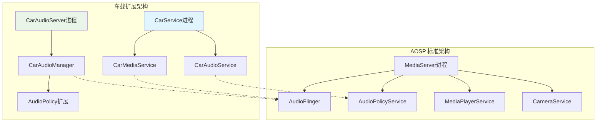

让我帮你了解CarMediaServer的学习路径，以及它与AOSP MediaServer的关系。
Search files...

Ran tool

Ran tool

Read file: etc/car_audio_configuration.xml

基于代码分析，我来为你详细解答CarMediaServer的学习路径和它与AOSP MediaServer的关系：

## CarMediaServer与AOSP MediaServer的关系

### **1. 概念澄清**
严格来说，**没有单独的"CarMediaServer"进程**，而是有以下几个车载媒体相关的服务：

- **CarMediaService**: 车载媒体源管理服务
- **CarAudioService**: 车载音频管理服务  
- **CarAudioServer/CarAudioManager**: 车载音频控制服务

### **2. 架构关系对比**



### **3. 层次关系**

| 层次 | AOSP标准 | 车载扩展 |
|------|---------|---------|
| **应用层** | MediaPlayer, AudioManager | CarMediaManager, CarAudioManager |
| **框架层** | MediaServer, AudioFlinger | CarService, CarMediaService |
| **策略层** | AudioPolicyService | CarAudioService + 动态路由 |
| **HAL层** | Audio HAL | Car Audio HAL + 总线路由 |

## 学习路径建议

### **第一阶段：基础理解**

1. **先掌握AOSP MediaServer基础**
   ```cpp
   // 重点理解这些核心组件
   - AudioFlinger (音频混音和输出)
   - AudioPolicyService (音频策略管理)
   - MediaPlayerService (媒体播放服务)
   ```

2. **了解Android车载框架**
   ```java
   // 学习Car API基础
   - android.car.Car
   - android.car.media.CarMediaManager  
   - android.car.audio.CarAudioManager
   ```

### **第二阶段：车载特性理解**
Read file: etc/car_audio_configuration.xml

3. **掌握车载音频特殊概念**
   ```xml
   <!-- 理解车载音频的关键概念 -->
   - Audio Zone (音频区域): 主驾、副驾、后排等不同区域
   - Audio Bus (音频总线): BUS00_MEDIA, BUS01_NAVIGATION等
   - Context (音频上下文): music, navigation, call等用途分类
   - Volume Group (音量组): 不同用途的音量独立控制
   ```

4. **学习动态音频路由**
   ```java
   // CarAudioService核心功能
   - 多区域音频路由 (Multi-zone audio routing)
   - 动态音频焦点管理 (Dynamic audio focus)
   - 音量组管理 (Volume group management)
   ```

### **第三阶段：代码实践**

1. **分析CarMediaService源码**
   ```java
   // 重点理解这些类
   car/CarMediaService.java        // 媒体源管理
   car/audio/CarAudioService.java  // 音频服务管理
   ```

2. **研究车载音频配置**
   ```xml
   car_audio_configuration.xml  // 车载音频配置
   audio_policy_configuration.xml // 音频策略配置
   ```

3. **实践HAL层扩展**
   ```cpp
   // 了解车载HAL扩展
   Audio相关/audiohal/          // 车载音频HAL实现
   Audio相关/daemon/            // 车载音频守护进程
   ```

### **第四阶段：高级特性**

1. **多用户音频管理**
2. **音频焦点仲裁**
3. **车载特定音效处理**
4. **与车载其他系统集成**

## 主要区别总结

| 特性 | AOSP MediaServer | Car Media Services |
|------|------------------|-------------------|
| **架构** | 单一进程集中处理 | 分布式服务架构 |
| **音频路由** | 单一输出设备 | 多区域、多总线路由 |
| **焦点管理** | 应用级焦点 | 区域级+上下文级焦点 |
| **音量控制** | 流类型音量 | 音量组+区域音量 |
| **配置方式** | 代码+简单配置 | 复杂XML配置驱动 |

## 推荐学习顺序

1. **AOSP MediaServer基础** (2-3周)
2. **Android Car API了解** (1周) 
3. **车载音频配置分析** (1周)
4. **CarMediaService源码** (2-3周)
5. **CarAudioService深入** (2-3周)
6. **实际项目练习** (持续)

建议从你现有的MediaServer知识基础上，重点关注车载环境下的**多区域路由**和**动态配置**这两个核心差异点开始学习。