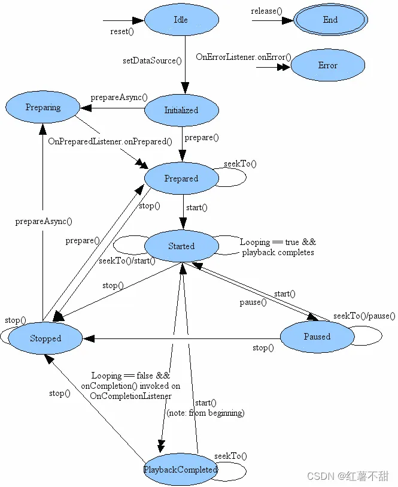

# MediaServer启动流程
在main_demaiserver.cpp启动的该服务，这部分代码没什么内容分为两部分
- 创建MMediaPlayerService
    创建一个NuPlayerFactory注册到，map容器sFactoryMap中。key是字符串比如NU_PLAYER
- ResourceManagerService
    创建ResourceObserverService对象，然后注册到ResourceManagerService中。
# MediaPlayer播放流程分析
## 使用 MediaPlayer API 播放音视频的流程
```java
        // 初始化MediaPlayer
        // MediaPlayer类位于frameworks/base/media/java/android/media/MediaPlayer.java
        mediaPlayer = new MediaPlayer();
        try {
            // 设置音频资源 (本地文件或网络URL)
            mediaPlayer.setDataSource("https://www.example.com/audio.mp3"); // 网络音频文件
            // mediaPlayer.setDataSource("/sdcard/Music/sample.mp3");       // 本地音频文件
            // 异步准备播放器
            mediaPlayer.setOnPreparedListener(mp ->{
                Log.d(TAG, "MediaPlayer准备完成，开始播放")
                mediaPlayer.start();// 开始播放
            });
            prepareAsync(); // 异步准备
        } catch (Exception e) {
            Log.e("MediaPlayer", "初始化失败：" + e.getMessage());
        }
        //播放进行中
        mediaPlayer.pause(); // 暂停播放
        mediaPlayer.stop(); // 停止播放
        mediaPlayer.prepare(); // 停止后需要重新准备播放器
```
上面就是使用MediaPlayer API的简化的播放流程。MediaPlayer是支持同步准备的，该代码使用了异步准备，目的是为了不会卡住UI，当准备完成之后会触发MediaPlayer中的函数OnPreparedListener，然后开始播放。
有AudioTrack的播放流程不同的是，不需要write。数据的读写都是MediaPlayer控制，这大大减少了APP的开发难度
接下来我们就按照播放流程来分析MediaServer的控制流。
## 状态图

### New MeidaPlayer
```java
MediaPlayer.java
   public MediaPlayer() {
        this(/*context=*/null, AudioSystem.AUDIO_SESSION_ALLOCATE);
    }
    private MediaPlayer(Context context, int sessionId) {
        // 调用父类构造函数,设置默认的音频属性
        super(new AudioAttributes.Builder().build(),
                AudioPlaybackConfiguration.PLAYER_TYPE_JAM_MEDIAPLAYER);

        // 初始化事件处理Handler,优先使用当前线程Looper
        // 如果当前线程没有Looper则使用主线程Looper
        Looper looper;
        if ((looper = Looper.myLooper()) != null) {
            mEventHandler = new EventHandler(this, looper);
        } else if ((looper = Looper.getMainLooper()) != null) {
            mEventHandler = new EventHandler(this, looper);
        } else {
            mEventHandler = null;
        }

        // 创建TimeProvider对象用于管理媒体播放时间戳和同步
        mTimeProvider = new TimeProvider(this);
        // 创建字幕源输入流列表,用于管理外挂字幕文件
        mOpenSubtitleSources = new Vector<InputStream>();

        // 获取Attribution信息,包含调用者身份信息
        // 如果context为null则使用默认Attribution
        AttributionSource attributionSource =
                context == null ? AttributionSource.myAttributionSource()
                        : context.getAttributionSource();
        if (attributionSource.getPackageName() == null) {
            attributionSource = attributionSource.withPackageName("");
        }

        // 初始化native层MediaPlayer
        try (ScopedParcelState attributionSourceState = attributionSource.asScopedParcelState()) {
            // native_setup用于初始化native层MediaPlayer
            // 参数1: 将Java层MediaPlayer对象的弱引用传递给native层,避免内存泄漏
            // 参数2: attributionSourceState.getParcel()获取包含调用者身份信息的Parcel对象
            //        Parcel是Android中用于序列化数据的容器,可以跨进程传输
            // 参数3: 解析音频会话ID,用于音频焦点管理
            native_setup(new WeakReference<>(this), attributionSourceState.getParcel(),
                    resolvePlaybackSessionId(context, sessionId));
        }
        
        // 注册到音频系统,注册到AudioServer中的mPlaybackMonitor
        baseRegisterPlayer(getAudioSessionId());
    }
```
```c++
android_media_MediaPlayer.cpp
android_media_MediaPlayer_native_setup(JNIEnv *env, jobject thiz, jobject weak_this,
                                       jobject jAttributionSource,
                                       jint jAudioSessionId)
{
    sp<MediaPlayer> mp = sp<MediaPlayer>::make(
        attributionSource, static_cast<audio_session_t>(jAudioSessionId));
    // create new listener and give it to MediaPlayer
    sp<JNIMediaPlayerListener> listener = new JNIMediaPlayerListener(env, thiz, weak_this);
    mp->setListener(listener);
    // Stow our new C++ MediaPlayer in an opaque field in the Java object.
    // 将native层MediaPlayer对象保存到Java层MediaPlayer的mNativeContext成员变量中

    setMediaPlayer(env, thiz, mp);
}

MediaPlayer::MediaPlayer(const AttributionSourceState& attributionSource,
    const audio_session_t sessionId) : mAttributionSource(attributionSource)
{
    ALOGV("constructor");
    mListener = NULL;
    mCookie = NULL;
    //默认赋值AUDIO_STREAM_MUSIC
    mStreamType = AUDIO_STREAM_MUSIC;
    //mediaplay初始状态
    mCurrentState = MEDIA_PLAYER_IDLE;
    mPrepareSync = false;
    if (sessionId == AUDIO_SESSION_ALLOCATE) {
        //在AF中获取一个唯一的mAudioSessionId
        mAudioSessionId = static_cast<audio_session_t>(
            AudioSystem::newAudioUniqueId(AUDIO_UNIQUE_ID_USE_SESSION));
    } else {
        mAudioSessionId = sessionId;
    }
    //在AF中记录在mAudioSessionRefs中，大概浏览了一下这个SessionId之后可能跟音效的操作有关
    AudioSystem::acquireAudioSessionId(mAudioSessionId, (pid_t)-1, (uid_t)-1); // always in client.
    mSendLevel = 0;
    mRetransmitEndpointValid = false;
}

```
#### 总结
构造流程其实就是完成了一些对象的创建比如TimeProvider、InputStream，然后生成一个AudioSession设置到AF中。

### SetDataSource
我们这里分析参数是网址的情况
```java
    private void setDataSource(String path, String[] keys, String[] values,
            List<HttpCookie> cookies)
            throws IOException, IllegalArgumentException, SecurityException, IllegalStateException {
        final Uri uri = Uri.parse(path);
        final String scheme = uri.getScheme();
        if ("file".equals(scheme)) {
            path = uri.getPath();
        } else if (scheme != null) {
            // handle non-file sources
            nativeSetDataSource(
                MediaHTTPService.createHttpServiceBinderIfNecessary(path, cookies),
                path,
                keys,
                values);
            return;
        }

        final File file = new File(path);
        try (FileInputStream is = new FileInputStream(file)) {
            setDataSource(is.getFD());
        }
    }
```
```c++
android_media_MediaPlayer.cpp
static void
android_media_MediaPlayer_setDataSourceAndHeaders(
        JNIEnv *env, jobject thiz, jobject httpServiceBinderObj, jstring path,
        jobjectArray keys, jobjectArray values) {

    sp<MediaPlayer> mp = getMediaPlayer(env, thiz);

    const char *tmp = env->GetStringUTFChars(path, NULL);
    String8 pathStr(tmp);
    env->ReleaseStringUTFChars(path, tmp);
    tmp = NULL;

    // 将Java层传入的HTTP请求头键值对数组转换为KeyedVector
    // headersVector用于存储HTTP请求头信息,比如:
    // User-Agent: MediaPlayer
    // Accept: */*
    // Connection: Keep-Alive 
    // 等HTTP标准请求头
    //该例子是null
    KeyedVector<String8, String8> headersVector;
    if (!ConvertKeyValueArraysToKeyedVector(
            env, keys, values, &headersVector)) {
        return;
    }

    sp<IMediaHTTPService> httpService;
    if (httpServiceBinderObj != NULL) {
        sp<IBinder> binder = ibinderForJavaObject(env, httpServiceBinderObj);
        httpService = interface_cast<IMediaHTTPService>(binder);
    }

    status_t opStatus =
        mp->setDataSource(
                httpService,
                pathStr.c_str(),
                headersVector.size() > 0? &headersVector : NULL);

    process_media_player_call(
            env, thiz, opStatus, "java/io/IOException",
            "setDataSource failed." );
}
```
```c++
mediaplayer.cpp
status_t MediaPlayer::setDataSource(
        const sp<IMediaHTTPService> &httpService,
        const char *url, const KeyedVector<String8, String8> *headers)
{
    ALOGV("setDataSource(%s)", url);
    status_t err = BAD_VALUE;
    if (url != NULL) {
        const sp<IMediaPlayerService> service(getMediaPlayerService());
        if (service != 0) {
            sp<IMediaPlayer> player(service->create(this, mAudioSessionId, mAttributionSource));
            if ((NO_ERROR != doSetRetransmitEndpoint(player)) ||
                (NO_ERROR != player->setDataSource(httpService, url, headers))) {
                player.clear();
            }
            err = attachNewPlayer(player);
        }
    }
    return err;
}
```
```c++
MediaPlayerService.cpp
sp<IMediaPlayer> MediaPlayerService::create(const sp<IMediaPlayerClient>& client,
        audio_session_t audioSessionId, const AttributionSourceState& attributionSource)
{
    int32_t connId = android_atomic_inc(&mNextConnId);
    // TODO b/182392769: use attribution source util
    AttributionSourceState verifiedAttributionSource = attributionSource;
    verifiedAttributionSource.pid = VALUE_OR_FATAL(
        legacy2aidl_pid_t_int32_t(IPCThreadState::self()->getCallingPid()));
    verifiedAttributionSource.uid = VALUE_OR_FATAL(
        legacy2aidl_uid_t_int32_t(IPCThreadState::self()->getCallingUid()));
        //Client 集成BnMediaPlayer
    sp<Client> c = new Client(
            this, verifiedAttributionSource, connId, client, audioSessionId);

    ALOGV("Create new client(%d) from %s, ", connId,
        verifiedAttributionSource.toString().c_str());
    //算是记录一下有哪些mediaplayer，注意这里使用弱指针。
    wp<Client> w = c;
    {
        Mutex::Autolock lock(mLock);
        mClients.add(w);
    }
    return c;
}
```
```c++
status_t MediaPlayerService::Client::setDataSource(
        const sp<IMediaHTTPService> &httpService,
        const char *url,
        const KeyedVector<String8, String8> *headers)
{
    ALOGV("setDataSource(%s)", url);
    if (url == NULL)
        return UNKNOWN_ERROR;

    if ((strncmp(url, "http://", 7) == 0) ||
        (strncmp(url, "https://", 8) == 0) ||
        (strncmp(url, "rtsp://", 7) == 0)) {
        if (!checkPermission("android.permission.INTERNET")) {
            return PERMISSION_DENIED;
        }
    }

//ContentProvider是Android系统中四大组件之一，用于在不同应用之间安全地共享数据
    if (strncmp(url, "content://", 10) == 0) {
        // get a filedescriptor for the content Uri and
        // pass it to the setDataSource(fd) method

        String16 url16(url);
        int fd = android::openContentProviderFile(url16);
        if (fd < 0)
        {
            ALOGE("Couldn't open fd for %s", url);
            return UNKNOWN_ERROR;
        }
        status_t status = setDataSource(fd, 0, 0x7fffffffffLL); // this sets mStatus
        close(fd);
        return mStatus = status;
    } else {
        //获取player的种类，目前只有nuplayer、testplayer 
        //获取哪种的方法 时使用打分制度来评比的，看哪种player更适合当前的url
        player_type playerType = MediaPlayerFactory::getPlayerType(this, url);
        sp<MediaPlayerBase> p = setDataSource_pre(playerType);
        if (p == NULL) {
            return NO_INIT;
        }

        return mStatus =
                setDataSource_post(
                p, p->setDataSource(httpService, url, headers));
    }
} 
```
#### MediaPlayerService.cpp setDataSource_pre
```c++
// setDataSource_pre函数主要完成以下工作:
sp<MediaPlayerBase> MediaPlayerService::Client::setDataSource_pre(player_type playerType) {
    ALOGV("player type = %d", playerType);

    // 1. 根据playerType创建对应的播放器实例(NuPlayer或TestPlayer)
    sp<MediaPlayerBase> p = createPlayer(playerType);
    if (p == NULL) {
        return p;
    }

    std::vector<DeathNotifier> deathNotifiers;

    // 2. 监听media.extractor服务的死亡通知
    // 3. 监听OMX服务的死亡通知
    // 4. 监听所有Codec2服务的死亡通知
    // 5. 更新死亡通知列表
    mDeathNotifiers.clear();
    mDeathNotifiers.swap(deathNotifiers);
    // 6. 创建音频设备更新监听器
    mAudioDeviceUpdatedListener = new AudioDeviceUpdatedNotifier(p);

    // 7. 如果不是硬件输出,创建音频输出并设置音频接收器
    if (!p->hardwareOutput()) {
        mAudioOutput = new AudioOutput(mAudioSessionId, mAttributionSource, mAudioAttributes,
                                       mAudioDeviceUpdatedListener);
        //8.mAudioOutput 设置到Nuplayer中
        static_cast<MediaPlayerInterface*>(p.get())->setAudioSink(mAudioOutput);
    }

    return p;
}

sp<MediaPlayerBase> MediaPlayerService::Client::createPlayer(player_type playerType) {
    // determine if we have the right player type
    sp<MediaPlayerBase> p = getPlayer();

    if (p == NULL) {
        //该函数会根据playerType找对对应的playerfactory类调用对应的createPlayer
        p = MediaPlayerFactory::createPlayer(
                playerType, mListener,
                VALUE_OR_FATAL(aidl2legacy_int32_t_pid_t(mAttributionSource.pid)));
    }
    return p;
}
//MediaPlayerFactory.cpp 中的NuPlayerFactory
//先分析到这里 ，之后在深入分析NuPlayerDriver做了什么
virtual sp<MediaPlayerBase> createPlayer(pid_t pid) {
        ALOGV(" create NuPlayer");
        //这个pid应该是app的 进程号
        return new NuPlayerDriver(pid);
    }
```
#### NuPlayerDriver
```C++
NuPlayerDriver::NuPlayerDriver(pid_t pid)
    : mState(STATE_IDLE),
      mIsAsyncPrepare(false),
      mAsyncResult(UNKNOWN_ERROR),
      mSetSurfaceInProgress(false),
      mDurationUs(-1),
      mPositionUs(-1),
      mSeekInProgress(false),
      mPlayingTimeUs(0),
      mRebufferingTimeUs(0),
      mRebufferingEvents(0),
      mRebufferingAtExit(false),
      mLooper(new ALooper),
      mMediaClock(new MediaClock),
      mPlayer(new NuPlayer(pid, mMediaClock)),
      mPlayerFlags(0),
      mCachedPlayerIId(PLAYER_PIID_INVALID),
      mMetricsItem(NULL),
      mClientUid(-1),
      mAtEOS(false),
      mLooping(false),
      mAutoLoop(false) {
    ALOGD("NuPlayerDriver(%p) created, clientPid(%d)", this, pid);
    mLooper->setName("NuPlayerDriver Looper");

    mMediaClock->init();

    // set up an analytics record
    mMetricsItem = mediametrics::Item::create(kKeyPlayer);

    mLooper->start(
            false, /* runOnCallingThread */
            true,  /* canCallJava */
            PRIORITY_AUDIO);

    mLooper->registerHandler(mPlayer);
    //会调用到Nuplayer.init中
    mPlayer->init(this);
}
``` 
#### NuPlayerDriver.cpp setDataSource
```c++
status_t NuPlayerDriver::setDataSource(
        const sp<IMediaHTTPService> &httpService,
        const char *url,
        const KeyedVector<String8, String8> *headers) {
    ALOGV("setDataSource(%p) url(%s)", this, uriDebugString(url, false).c_str());
    ATRACE_BEGIN(StringPrintf("setDataSource(%p)", this).c_str());
    Mutex::Autolock autoLock(mLock);

    if (mState != STATE_IDLE) {
        ATRACE_END();
        return INVALID_OPERATION;
    }
    //设置状态 media中状态很重要
    mState = STATE_SET_DATASOURCE_PENDING;

    mPlayer->setDataSourceAsync(httpService, url, headers);
    //通过while循环来模拟同步
    while (mState == STATE_SET_DATASOURCE_PENDING) {
        mCondition.wait(mLock);
    }
    ATRACE_END();

    return mAsyncResult;
}
```
#### NuPlayer.cpp setDataSourceAync
```c++
// NuPlayer::setDataSourceAsync 函数分析
void NuPlayer::setDataSourceAsync(
        const sp<IMediaHTTPService> &httpService, // HTTP服务
        const char *url,                         // 媒体文件URL
        const KeyedVector<String8, String8> *headers) { // HTTP头部信息

    // 创建一个消息,类型为kWhatSetDataSource
    sp<AMessage> msg = new AMessage(kWhatSetDataSource, this);
    size_t len = strlen(url);

    // 创建一个通知消息,用于Source回调通知
    sp<AMessage> notify = new AMessage(kWhatSourceNotify, this);

    // 根据URL类型创建不同的Source对象
    sp<Source> source;
    
    // 1. 如果是HTTP Live流(m3u8)
    // m3u8是HTTP Live Streaming(HLS)协议的媒体播放列表文件
    // HLS协议将媒体内容切分成小片段(.ts文件)
    // m3u8文件包含了这些媒体片段的索引信息
    // 客户端可以通过HTTP协议下载m3u8和对应的媒体片段进行播放
    if (IsHTTPLiveURL(url)) {
        source = new HTTPLiveSource(notify, httpService, url, headers);
        ALOGV("setDataSourceAsync HTTPLiveSource %s", url);
        mDataSourceType = DATA_SOURCE_TYPE_HTTP_LIVE;
    } 
    // 2. 如果是RTSP流
    else if (!strncasecmp(url, "rtsp://", 7)) {
        source = new RTSPSource(
                notify, httpService, url, headers, mUIDValid, mUID);
        ALOGV("setDataSourceAsync RTSPSource %s", url);
        mDataSourceType = DATA_SOURCE_TYPE_RTSP;
    }
    // 3. 如果是HTTP/HTTPS的SDP文件(也是RTSP流)
    else if ((!strncasecmp(url, "http://", 7)
                || !strncasecmp(url, "https://", 8))
                    && ((len >= 4 && !strcasecmp(".sdp", &url[len - 4]))
                    || strstr(url, ".sdp?"))) {
        source = new RTSPSource(
                notify, httpService, url, headers, mUIDValid, mUID, true);
        ALOGV("setDataSourceAsync RTSPSource http/https/.sdp %s", url);
        mDataSourceType = DATA_SOURCE_TYPE_RTSP;
    }
    // 4. 其他普通URL(如本地文件、HTTP普通文件等)
    else {
        ALOGV("setDataSourceAsync GenericSource %s", url);

        // 创建通用Source
        sp<GenericSource> genericSource =
                new GenericSource(notify, mUIDValid, mUID, mMediaClock);

        // 设置数据源
        status_t err = genericSource->setDataSource(httpService, url, headers);

        if (err == OK) {
            source = genericSource;
        } else {
            ALOGE("Failed to set data source!");
        }

        mDataSourceType = DATA_SOURCE_TYPE_GENERIC_URL;
    }

    // 将创建的Source对象设置到消息中并发送
    msg->setObject("source", source);
    msg->post();
}
```

#### GenericSource.cpp setDataSource
```c++
status_t NuPlayer::GenericSource::setDataSource(
        const sp<IMediaHTTPService> &httpService,
        const char *url,
        const KeyedVector<String8, String8> *headers) {
    Mutex::Autolock _l(mLock);
    ALOGV("setDataSource url: %s", url);

    resetDataSource();

    mHTTPService = httpService;
    mUri = url;

    if (headers) {
        mUriHeaders = *headers;
    }
    return OK;
}
```
#### SetDataSource 流程总结

`setDataSource` 的整个流程横跨了Java应用层、JNI、C++客户端框架以及服务端的MediaPlayerService，最终由具体的播放器引擎（如NuPlayer）执行。其核心思想是：**通过Binder机制将客户端的同步调用转化为服务端的异步处理，并在服务端通过同步阻塞的方式等待异步操作完成**。

##### 1. 应用层到客户端 (Java -> JNI -> C++)
-   Java层的 `MediaPlayer.setDataSource(String path, ...)` 方法根据URL协议类型（如http/https）调用到JNI层的 `nativeSetDataSource`。
-   JNI层 (`android_media_MediaPlayer.cpp`) 将Java数据类型转换为C++类型，然后调用C++ `MediaPlayer` 对象的 `setDataSource` 方法。

##### 2. 客户端到服务端 (MediaPlayer -> MediaPlayerService)
-   C++ `MediaPlayer` 首先通过 `getMediaPlayerService()` 获取到 `MediaPlayerService` 的Binder代理。
-   调用 `service->create()` 请求 `MediaPlayerService` 创建一个播放器实例。`MediaPlayerService` 会创建一个 `MediaPlayerService::Client` 对象（它本身是一个Binder服务端），并将其返回给客户端。
-   客户端拿到这个 `Client` 的代理后，调用其 `setDataSource` 方法，这是一次跨进程的Binder调用，将请求发送到 `mediaserver` 进程。

##### 3. 服务端分发 (MediaPlayerService::Client)
-   `MediaPlayerService::Client` 接收到 `setDataSource` 请求后，首先进行权限检查。
-   通过 `MediaPlayerFactory::getPlayerType` 判断应该使用哪种播放器（通常是 `NuPlayer`）。
-   调用 `createPlayer` 方法，通过 `NuPlayerFactory` 创建一个 `NuPlayerDriver` 实例。`NuPlayerDriver` 在其构造函数中会创建核心的 `NuPlayer` 对象和一个 `ALooper` 消息循环线程。
-   最后，调用 `NuPlayerDriver` 的 `setDataSource` 方法。

##### 4. 同步接口与异步实现 (NuPlayerDriver -> NuPlayer)
-   `NuPlayerDriver::setDataSource` 是一个 **同步阻塞** 的接口。它将自身状态设置为 `STATE_SET_DATASOURCE_PENDING`。
-   它调用 `NuPlayer::setDataSourceAsync` 发起 **异步** 请求。
-   `NuPlayer::setDataSourceAsync` 内部会根据URL创建对应的 `Source`（如`GenericSource`、`HTTPLiveSource`等），然后将这个 `Source` 对象包装在一个 `AMessage` 消息中，通过 `msg->post()` 发送到 `NuPlayer` 内部的 `ALooper` 线程进行处理，然后立即返回。
-   `NuPlayerDriver` 在调用完异步方法后，会立刻在 `while` 循环中调用 `mCondition.wait(mLock)` **阻塞等待**，直到 `NuPlayer` 的异步操作完成并通过回调通知它。

##### 5. 异步处理与完成通知
-   `NuPlayer` 的 `ALooper` 线程收到消息后，在 `onMessageReceived` 中处理 `kWhatSetDataSource` 消息，开始真正的数据源准备工作。
-   当异步操作完成后，`NuPlayer` 会回调 `NuPlayerDriver` 的 `notifySetDataSourceCompleted` 方法。
-   `NuPlayerDriver` 在这个回调中，将 `mState` 修改为完成状态，并调用 `mCondition.signal()` **唤醒** 之前阻塞的线程。
-   `setDataSource` 调用至此完成，并逐层返回结果给应用。


##### 思考
##### 为什么要有一个NuPlayerDriver类，直接使用NuPlay不行吗
总结：为什么必须分离？
如果将 `NuPlayerDriver` 和 `NuPlayer` 合并成一个类，会带来灾难性的后果：

| 方面 | 分离式设计 (Driver + Player) | 合并式设计 (只有一个Player) |
| :--- | :--- | :--- |
| **线程模型** | **清晰、安全**。Binder线程只负责发号施令并等待，媒体工作线程负责执行。避免了阻塞`mediaserver`。 | **混乱、危险**。耗时操作会直接在Binder线程上执行，导致`mediaserver`无响应，最终被系统`watchdog`杀死。 |
| **代码职责** | **单一、明确**。`Driver`负责对外接口和线程同步，`Player`负责内部媒体逻辑。 | **高度耦合**。API接口逻辑、线程同步逻辑、媒体处理逻辑全部混在一起，极难维护和调试。 |
| **状态管理** | **分层、简化**。`Driver`管理简单的外部状态，`Player`管理复杂的内部状态，两者解耦。 | **极其复杂**。一个类要处理两种维度的状态机，代码会充满`if/else`和`switch`，难以理解。 |
| **可维护性** | **高**。可以独立修改`NuPlayer`的内部实现（比如更换渲染器逻辑），而完全不影响`NuPlayerDriver`的API接口。 | **低**。任何微小的修改都可能影响到API行为或线程安全，牵一发而动全身。|

一个形象的比喻：
`NuPlayerDriver`就像一家餐厅的前台经理。他负责接待顾客（MediaPlayerService::Client）、接下菜单（start(), seekTo()），并告诉顾客“请稍等”。
`NuPlayer` 就像是后厨的总厨。经理把菜单通过内部系统（AMessage）发给总厨。总厨在自己的厨房里（ALooper线程）异步地进行洗、切、炒、装盘等一系列复杂操作，完成后通知经理可以上菜了。
你不能让总厨直接去前台接待顾客，否则厨房就没人干活了，整个餐厅也会陷入混乱。同理，NuPlayer也不能直接去响应Binder调用。
#### 遗留
接下来会对AMessage与ALooper写一篇分析文章
### prepareAsync/prepare
#### android_media_MediaPlayer_prepareAsync  prepareAsync
```c++
static void
android_media_MediaPlayer_prepareAsync(JNIEnv *env, jobject thiz)
{
    sp<MediaPlayer> mp = getMediaPlayer(env, thiz);
    // Handle the case where the display surface was set before the mp was
    // initialized. We try again to make it stick.
    sp<IGraphicBufferProducer> st = getVideoSurfaceTexture(env, thiz);
    mp->setVideoSurfaceTexture(st);
    process_media_player_call( env, thiz, mp->prepareAsync(), "java/io/IOException", "Prepare Async failed." );
}
```
#### mediaplayer.cpp prepareAsync
```c++
status_t MediaPlayer::prepareAsync()
{
    ALOGV("prepareAsync");
    Mutex::Autolock _l(mLock);
    return prepareAsync_l();
}
status_t MediaPlayer::prepareAsync_l()
{
    //setDataSource过程中会把状态设置为MEDIA_PLAYER_INITIALIZED
    if ( (mPlayer != 0) && ( mCurrentState & (MEDIA_PLAYER_INITIALIZED | MEDIA_PLAYER_STOPPED) ) ) {
        if (mAudioAttributesParcel != NULL) {
            mPlayer->setParameter(KEY_PARAMETER_AUDIO_ATTRIBUTES, *mAudioAttributesParcel);
        } else {
            //默认AUDIO_STREAM_MUSIC,设置到了AudioOutput中,这个AudioOutput是MediaPlayerService.h中的一个类
            mPlayer->setAudioStreamType(mStreamType);
        }
        mCurrentState = MEDIA_PLAYER_PREPARING;
        return mPlayer->prepareAsync();
    }
    ALOGE("prepareAsync called in state %d, mPlayer(%p)", mCurrentState, mPlayer.get());
    return INVALID_OPERATION;
}
```
#### MediaPlayerService.cpp  prepareAsync
```c++
status_t MediaPlayerService::Client::prepareAsync()
{
    ALOGV("[%d] prepareAsync", mConnId);
    sp<MediaPlayerBase> p = getPlayer();
    if (p == 0) return UNKNOWN_ERROR;
    status_t ret = p->prepareAsync();
#if CALLBACK_ANTAGONIZER
    ALOGD("start Antagonizer");
    if (ret == NO_ERROR) mAntagonizer->start();
#endif
    return ret;
}
```
#### NuPlayerDriver.cpp prepareAsync
```c++
status_t NuPlayerDriver::prepareAsync() {
    //与setDataSource不同这块没有使用while开始等待
    ALOGV("prepareAsync(%p)", this);
    Mutex::Autolock autoLock(mLock);

    switch (mState) {
        case STATE_UNPREPARED:
            mState = STATE_PREPARING;
            mIsAsyncPrepare = true;
            mPlayer->prepareAsync();
            return OK;
        case STATE_STOPPED:
            // this is really just paused. handle as seek to start
            mAtEOS = false;
            mState = STATE_STOPPED_AND_PREPARING;
            mIsAsyncPrepare = true;
            mPlayer->seekToAsync(0, MediaPlayerSeekMode::SEEK_PREVIOUS_SYNC /* mode */,
                    true /* needNotify */);
            return OK;
        default:
            return INVALID_OPERATION;
    };
}
```
#### NuPlayer.cpp prepareAsync
```c++
void NuPlayer::prepareAsync() {
    ALOGV("prepareAsync");
    //可以看到在NuPlayer做了异步操作
    (new AMessage(kWhatPrepare, this))->post();
}
void NuPlayer::onMessageReceived(const sp<AMessage> &msg) {
    switch (msg->what()) {
        
        case kWhatPrepare:
        {
            ALOGV("onMessageReceived kWhatPrepare");

            mSource->prepareAsync();
            break;
        }
    }
}
```
#### GenericSource.cpp prepareAsync
```c++
void NuPlayer::GenericSource::prepareAsync() {
  Mutex::Autolock _l(mLock);
  ALOGV("prepareAsync: (looper: %d)", (mLooper != NULL));

  if (fe == NULL) {
    mLooper = new ALooper;
    mLooper->setName("generic");
    mLooper->start();

    mLooper->registerHandler(this);
  }

  sp<AMessage> msg = new AMessage(kWhatPrepareAsync, this);
  msg->post();
}
void NuPlayer::GenericSource::onMessageReceived(const sp<AMessage> &msg) {
  Mutex::Autolock _l(mLock);
  switch (msg->what()) {
  case kWhatPrepareAsync: {
    onPrepareAsync();
    break;
  }}
}

void NuPlayer::GenericSource::onPrepareAsync() {

  // 延迟创建数据源（如果数据源还未创建）使用 网址或者本地路径都是没有创建数据源的
  if (mDataSource == NULL) {
    // 初始设置为非安全，如果提取器返回安全标志，再设为true
    mIsSecure = false;

    // 从URI创建数据源（通常是HTTP/HTTPS流媒体或本地文件URI）
    if (!mUri.empty()) {
      const char *uri = mUri.c_str();
      String8 contentType;
      // 处理HTTP/HTTPS流媒体
      if (!strncasecmp("http://", uri, 7) || !strncasecmp("https://", uri, 8)) {
        sp<DataSource> httpSource;
        // 创建HTTP数据源
        httpSource =
            PlayerServiceDataSourceFactory::getInstance()->CreateMediaHTTP(
                mHTTPService);
        // 如果在创建过程中没有断开连接，保存HTTP源
        if (!mDisconnected) {
          mHttpSource = httpSource;
        }
      }
      // 从URI创建数据源（可能耗时较长，特别是网络连接不稳定时）
      // 这里的mHttpSource并不是最终用于解码的“数据源”，而是作为底层HTTP连接的实现对象（HTTPBase），
      // 真正的DataSource（如NuCachedSource2）会基于这个HTTPBase对象进行缓存和数据读取等高级操作。
      // 因此，这里需要通过CreateFromURI再创建一层“包装”后的DataSource，供后续Extractor等模块使用。
      sp<DataSource> dataSource =
          PlayerServiceDataSourceFactory::getInstance()->CreateFromURI(
              mHTTPService, uri, &mUriHeaders, &contentType,
              static_cast<HTTPBase *>(mHttpSource.get()));
      if (!mDisconnected) {
        mDataSource = dataSource;  // 设置数据源
      }
    } else {
      // 处理文件描述符（fd）方式的数据源

      if (property_get_bool("media.stagefright.extractremote", true) &&
          !PlayerServiceFileSource::requiresDrm(mFd.get(), mOffset, mLength,
                                                nullptr /* mime */)) {
        // 尝试获取媒体提取器服务
        sp<IBinder> binder =
            defaultServiceManager()->getService(String16("media.extractor"));

          ALOGD("FileSource remote");  // 使用远程提取器
          // 获取媒体提取器服务接口
          sp<IMediaExtractorService> mediaExService(
              interface_cast<IMediaExtractorService>(binder));
          sp<IDataSource> source;
          // 通过提取器服务创建IDataSource
          mediaExService->makeIDataSource(base::unique_fd(dup(mFd.get())),
                                          mOffset, mLength, &source);
            mDataSource = CreateDataSourceFromIDataSource(source);
      }
      // 如果远程提取器失败或不可用，创建本地文件源
      if (mDataSource == nullptr) {
        ALOGD("FileSource local");  // 使用本地文件源
        mDataSource =
            new PlayerServiceFileSource(dup(mFd.get()), mOffset, mLength);
      }
    }

  }


  // 从数据源初始化提取器（这里进行实际的媒体解析，包括获取通道信息等元数据）
  status_t err = initFromDataSource();
  // 处理视频轨道信息（如果存在）
  if (mVideoTrack.mSource != NULL) {
    // 获取视频格式元数据
    sp<MetaData> meta = getFormatMeta_l(false /* audio */);
    sp<AMessage> msg = new AMessage;
    // 将元数据转换为消息格式
    err = convertMetaDataToMessage(meta, &msg);
    // 通知视频尺寸变化（向上层报告视频分辨率信息）
    notifyVideoSizeChanged(msg);
  }

  // 设置播放器能力标志
  uint32_t flags = FLAG_CAN_PAUSE | FLAG_CAN_SEEK_BACKWARD |
                   FLAG_CAN_SEEK_FORWARD | FLAG_CAN_SEEK;
                   
  // 检查是否为VBR（可变比特率）音频，设置动态时长标志
  if (mExtractor != NULL) {
    sp<MetaData> meta = mExtractor->getMetaData();
    if (meta != NULL) {
      int32_t isVBR = 0;
      if (meta->findInt32('iVbr', &isVBR) && isVBR != 0) {
        ALOGV("Is VBR");  // 是可变比特率
        mIsDynamicDuration = true;
        flags |= FLAG_DYNAMIC_DURATION;  // 设置动态时长标志
      }
    }
  }

  // FLAG_SECURE 和 FLAG_PROTECTED 将在应用调用 prepareDrm 时确定
  
  // 检查提取器是否支持跳转
  if (!(mExtractor->flags() & FLAG_CAN_SEEK)) {
    flags &= ~FLAG_CAN_SEEK;  // 清除跳转标志
  }
  // 通知标志变更 更新NuPlayterDriver的状态
  notifyFlagsChanged(flags);
  // 完成异步准备过程
  finishPrepareAsync();
  ALOGV("onPrepareAsync: Done");  // 异步准备完成
}


status_t NuPlayer::GenericSource::initFromDataSource() {
    //1.创建extractor  //在MediaExtractorFactory.cpp sniff中判断哪一个so最合适
    extractor = MediaExtractorFactory::Create(dataSource, NULL);
    //2.获取meta数据 用来获取duration
    sp<MetaData> fileMeta = extractor->getMetaData();

    //3. 获取音视频轨道数量,包括音频轨道(如AAC/MP3)和视频轨道(如H264/HEVC)
    size_t numtracks = extractor->countTracks();

    mFileMeta = fileMeta;
    if (mFileMeta != NULL) {
        int64_t duration;
        if (mFileMeta->findInt64(kKeyDuration, &duration)) {
            mDurationUs = duration;
        }
    }

    int32_t totalBitrate = 0;
    //4. 记录AVTrack 的信息到mSource中
    for (size_t i = 0; i < numtracks; ++i) {
        sp<IMediaSource> track = extractor->getTrack(i);
        sp<MetaData> meta = extractor->getTrackMetaData(i);
// mime保存的数据为 audio/aac   video/mp4  image/jpeg这种
        const char *mime;
        CHECK(meta->findCString(kKeyMIMEType, &mime));
        // 只保存第一个音频轨道和视频轨道的原因:
        // 1. Android MediaPlayer默认只支持同时播放一个音频和一个视频轨道
        // 2. 如果有多个音视频轨道,只选择第一个作为默认播放轨道
        // 3. 后续可以通过selectTrack()接口切换到其他轨道播放
        if (!strncasecmp(mime, "audio/", 6)) {
            // mAudioTrack.mSource为空表示还未设置过音频轨道
            if (mAudioTrack.mSource == NULL) {
                mAudioTrack.mIndex = i;
                mAudioTrack.mSource = track;
                mAudioTrack.mPackets =
                    new AnotherPacketSource(mAudioTrack.mSource->getFormat());

                // 判断音频编码格式是否为Vorbis格式
                // strcasecmp用于比较两个字符串,忽略大小写
                // MEDIA_MIMETYPE_AUDIO_VORBIS 定义为 "audio/vorbis"
                // Vorbis是一种开源的音频压缩编码格式,常用于OGG容器格式
                if (!strcasecmp(mime, MEDIA_MIMETYPE_AUDIO_VORBIS)) {
                    mAudioIsVorbis = true;
                } else {
                    mAudioIsVorbis = false;
                }

                mMimes.add(String8(mime));
            }
            // 如果mAudioTrack.mSource不为空,表示已经设置过音频轨道,则忽略后续的音频轨道
        } else if (!strncasecmp(mime, "video/", 6)) {
            // mVideoTrack.mSource为空表示还未设置过视频轨道
            if (mVideoTrack.mSource == NULL) {
                mVideoTrack.mIndex = i;
                mVideoTrack.mSource = track;
                mVideoTrack.mPackets =
                    new AnotherPacketSource(mVideoTrack.mSource->getFormat());

                // video always at the beginning
                mMimes.insertAt(String8(mime), 0);
            }
            // 如果mVideoTrack.mSource不为空,表示已经设置过视频轨道,则忽略后续的视频轨道
        }
        mSources.push(track);
        int64_t durationUs;
        if (meta->findInt64(kKeyDuration, &durationUs)) {
            if (durationUs > mDurationUs) {
                mDurationUs = durationUs;
            }
        }
        int32_t bitrate;
        if (totalBitrate >= 0 && meta->findInt32(kKeyBitRate, &bitrate)) {
            totalBitrate += bitrate;
        } else {
            totalBitrate = -1;
        }
    }
    mBitrate = totalBitrate;

    return OK;
}
```

```c++

void NuPlayer::GenericSource::finishPrepareAsync() { 
    // 启动音视频数据源，主要就是向MediaBufferGroup申请buffer
    status_t err = startSources();

    // 如果是流媒体数据
    if (mIsStreaming) {
        // 恢复缓存源的数据获取
        mCachedSource->resumeFetchingIfNecessary();
        // 设置准备状态标志,表示正在准备中
        mPreparing = true;
        // 调度缓冲区轮询
        // 对于流媒体数据,需要等待缓冲足够的数据才能通知准备完成
        // 在onPollBuffering()中会检查缓冲进度
        // 当缓冲达到要求时会调用notifyPrepared()通知准备完成
        schedulePollBuffering();
    } else {
        // 非流媒体直接通知准备完成,通知app当前是MEDIA_PREPARED状态
        notifyPrepared();
    }

    // 如果存在音频轨道,发送读取音频数据的消息
    if (mAudioTrack.mSource != NULL) {
        postReadBuffer(MEDIA_TRACK_TYPE_AUDIO);
    }

    // 如果存在视频轨道,发送读取视频数据的消息 
    if (mVideoTrack.mSource != NULL) {
        postReadBuffer(MEDIA_TRACK_TYPE_VIDEO);
    }
}
```
##### 问题schedulePollBuffering 是判断缓冲数据是否足够，但是都没有调用postReadBuffer如何判断呢
流媒体情况下，都没有开始调用postReadBuffer怎么判断数据是否足够呢？
这是一个关键点：
- 顺序很重要：finishPrepareAsync()中，首先调用startSources()分配缓冲区，然后对于流媒体调用schedulePollBuffering()，最后才调用postReadBuffer()开始读取
- 并行机制：postReadBuffer和schedulePollBuffering建立了两个并行工作的机制：
postReadBuffer → readBuffer → 快速读取数据并判断
schedulePollBuffering → onPollBuffering → 定期检查整体缓冲状态
- 判断时机：第一次判断缓冲是否足够发生在第一轮readBuffer执行时，而不是在postReadBuffer之前
读取驱动缓冲：系统设计为"先读取，再判断"而不是"先判断，再读取"，因为必须先读取一些数据才能判断缓冲是否足够
所以，初始时并不需要提前判断数据是否足够，而是通过读取数据的过程来累积和判断缓冲状态。
** 也就是说最开始通知app 当前准备好是readBuffer流程通知的，然后在onPollBuffering做定期检查状态，如果遇到缓冲区数据不够就会通知当前数据加载了多少**
```c++
status_t NuPlayer::GenericSource::startSources() {
    // 在开始缓冲之前启动选定的音视频轨道
    // 这里先启动音视频轨道的原因是:
    // 1. 历史原因:以前的Widevine DRM源在start()时可能会重新初始化加密,如果延迟到start()再启动,
    //    prepare期间缓冲的数据就会浪费掉
    // 2. 虽然现在已经移除了Widevine支持,但这个逻辑仍然保留
    // 注意:这里只是启动轨道,还没有开始实际读取数据,读取要等到start()时才开始
    
    // 启动音频轨道
    if (mAudioTrack.mSource != NULL && mAudioTrack.mSource->start() != OK) {
        ALOGE("failed to start audio track!"); // 启动音频轨道失败
        return UNKNOWN_ERROR;
    }

    // 启动视频轨道 
    if (mVideoTrack.mSource != NULL && mVideoTrack.mSource->start() != OK) {
        ALOGE("failed to start video track!"); // 启动视频轨道失败
        return UNKNOWN_ERROR;
    }

    return OK;
}
```

#### AACExtractor.cpp start
会根据数据的格式创建不同的extractor，这里我们已AAC数据为例会创建AACExtractor
```c++
AACExtractor.cpp
media_status_t AACSource::start() {
    CHECK(!mStarted);
    if (mOffsetVector.empty()) {
        mOffset = 0;
    } else {
        mOffset = mOffsetVector.itemAt(0);
    }
    mCurrentTimeUs = 0;
    // 为MediaBufferGroup添加一个大小为kMaxFrameSize(8192字节)的buffer
    // MediaBufferGroup是一个buffer池,用于管理和复用MediaBuffer对象
    // 这里预分配一个buffer用于后续AAC音频帧的读取
    mBufferGroup->add_buffer(kMaxFrameSize);
    mStarted = true;

    return AMEDIA_OK;
}
```
这里可以看到start就是向mBufferGroup中创建一个KMaxFrameSieze大小的buffer，这个KMaxFrameSieze 不同格式都不同。我们在当前阶段就不再分析这个数据走向了。
#### 总结 
在GenericSource.cpp onPrepareAsync完成了真正的soureData的创建，数据源支持HTTP/HTTPS/本地路径/fd情况
在initFromDataSource中对数据demux，保存duration,audio/video的track,并且把解析出来的第一路A/Vtrack保存到mAudioTrack/mVideoTrack中。
在finishPrepareAsync中启动数据源，在要播放的AV source中向MediaBufferGroup申请buffer，然后如果是流媒体那么就开启数据监测轮询机制，目的就是为了检测缓冲数据是否足够，如果不够更新缓冲了多少百分比。数据够了通知app进入准备状态。最后开始读取数据，当达到缓冲大小通知app

#### 思考 prepareAsync跟setDataSource合并长一个API不好吗？ 为什么要分为两部分
最有可能的就是细分播放器的不同状态，并且更好的定位问题。一个API只做一件事情
### Start
### mediaplayer.cpp

```c++
status_t MediaPlayer::start()
{

    if (mCurrentState & MEDIA_PLAYER_STARTED) {
        ret = NO_ERROR;
    } else if ( (mPlayer != 0) && ( mCurrentState & ( MEDIA_PLAYER_PREPARED |
                    MEDIA_PLAYER_PLAYBACK_COMPLETE | MEDIA_PLAYER_PAUSED ) ) ) {
        //设置是否循环播放 默认是false
        mPlayer->setLooping(mLoop);
        mPlayer->setVolume(mLeftVolume, mRightVolume);\
        mPlayer->setAuxEffectSendLevel(mSendLevel);
        mCurrentState = MEDIA_PLAYER_STARTED;
        ret = mPlayer->start();
        if (ret != NO_ERROR) {
            mCurrentState = MEDIA_PLAYER_STATE_ERROR;
        } else {
            if (mCurrentState == MEDIA_PLAYER_PLAYBACK_COMPLETE) {
                ALOGV("playback completed immediately following start()");
            }
        }
    }
}
```
### NuPlayer.cpp start
```c++
void NuPlayer::start() {
    (new AMessage(kWhatStart, this))->post();
}
void NuPlayer::onMessageReceived(const sp<AMessage> &msg) {
        case kWhatStart:
        {
            ALOGV("kWhatStart");
            if (mStarted) {
                // do not resume yet if the source is still buffering
                if (!mPausedForBuffering) {
                    onResume();
                }
            } else { //第一次走到这里面
                onStart();
            }
            mPausedByClient = false;
            break;
        }
}

void NuPlayer::onStart(int64_t startPositionUs, MediaPlayerSeekMode mode) {
    // 1. 开启数据流
    if (!mSourceStarted) {
        mSourceStarted = true;
        mSource->start();
    }
    //2. 判断是否需要seek
    if (startPositionUs > 0 && (mSourceFlags & Source::FLAG_CAN_SEEK)) {
        performSeek(startPositionUs, mode);
        if (mSource->getFormat(false /* audio */) == NULL) {
            return;
        }
    }
    // 判断当前媒体源是否为实时流（如网络直播、摄像头等），如果是，则在flags中设置实时渲染标志位Renderer::FLAG_REAL_TIME。
    if (mSource->isRealTime()) {
        flags |= Renderer::FLAG_REAL_TIME;
    }


    sp<MetaData> audioMeta = mSource->getFormatMeta(true /* audio */);

    audio_stream_type_t streamType = AUDIO_STREAM_MUSIC;
    if (mAudioSink != NULL) {
        streamType = mAudioSink->getAudioStreamType();
    }

    这段代码的意思是：判断当前音频流是否可以进行“音频直通处理（offload）”。只有在满足以下两个条件时，mOffloadAudio 才会被设置为 true：
    1. canOffloadStream(...) 返回 true，即当前音频流支持直通处理（比如硬件解码、低功耗播放等），其判断依据包括音频的元数据、是否包含视频、是否为流媒体、音频流类型等。
    2. 当前播放速度（mPlaybackSettings.mSpeed）和音调（mPlaybackSettings.mPitch）都为1.0，即正常播放速度和音调。如果用户调整了倍速或变调，则不能 offload。
    如果上述任一条件不满足，mOffloadAudio 就会被设置为 false，表示不能进行音频离线处理。
    //4.判断是否支持Offload
    // Modular DRM: Disabling audio offload if the source is protected
    if (mOffloadAudio && mIsDrmProtected) {
        mOffloadAudio = false;
        ALOGV("onStart: Disabling mOffloadAudio now that the source is protected.");
    }

    if (mOffloadAudio) {
        flags |= Renderer::FLAG_OFFLOAD_AUDIO;
    }
    //5. 创建NuPlayerRenderer 
    sp<AMessage> notify = new AMessage(kWhatRendererNotify, this);
    ++mRendererGeneration;
    notify->setInt32("generation", mRendererGeneration);
    //通知app MEDIA_PLAYBACK_COMPLETE
    mRenderer = new Renderer(mAudioSink, mMediaClock, notify, flags);
    mRendererLooper = new ALooper;
    mRendererLooper->setName("NuPlayerRenderer");
    mRendererLooper->start(false, false, ANDROID_PRIORITY_AUDIO);
    mRendererLooper->registerHandler(mRenderer);

    status_t err = mRenderer->setPlaybackSettings(mPlaybackSettings);
    //6.设置 video的帧率
    float rate = getFrameRate();
    if (rate > 0) {
        mRenderer->setVideoFrameRate(rate);
    }
    //首次没有创建codecer
    if (mVideoDecoder != NULL) {
        mVideoDecoder->setRenderer(mRenderer);
    }
    if (mAudioDecoder != NULL) {
        mAudioDecoder->setRenderer(mRenderer);
    }

    startPlaybackTimer("onstart");
    //7.在这里会创建Decoder
    postScanSources();
}
void NuPlayer::postScanSources() {
    if (mScanSourcesPending) {
        return;
    }

    sp<AMessage> msg = new AMessage(kWhatScanSources, this);
    msg->setInt32("generation", mScanSourcesGeneration);
    msg->post();

    mScanSourcesPending = true;
}

void NuPlayer::onMessageReceived(const sp<AMessage> &msg) {
        case kWhatScanSources:
        {
            int32_t generation;
            CHECK(msg->findInt32("generation", &generation));
            if (generation != mScanSourcesGeneration) {
                // Drop obsolete msg.
                break;
            }

            mScanSourcesPending = false;
            bool mHadAnySourcesBefore =
                (mAudioDecoder != NULL) || (mVideoDecoder != NULL);
            bool rescan = false;
            // initialize video before audio because successful initialization of
            // video may change deep buffer mode of audio.
            /*如果是offload 下 会创建decoder之后直接创建audiotrack。
            如果不是offload模式，在Decoder 收到Audio Output Format Changed 事件后会调用 changeAudioFormat 方法，
            然后调用 openAudioSink 创建普通的 AudioTrack。
             也就是说，普通模式下只有真正解出 audio 数据后 AudioTrack 才会被创建。 (分析数据流的时候在研究)
            */
            if (instantiateDecoder(false, &mVideoDecoder) == -EWOULDBLOCK) {
                rescan = true;

            if (instantiateDecoder(true, &mAudioDecoder) == -EWOULDBLOCK) {
                rescan = true;
                }
            

            if (!mHadAnySourcesBefore
                    && (mAudioDecoder != NULL || mVideoDecoder != NULL)) {
                // This is the first time we've found anything playable.

                if (mSourceFlags & Source::FLAG_DYNAMIC_DURATION) {
                    //返回总时长，如果是流媒体不支持返回总时长那就返回0或者未知
                    schedulePollDuration();
                }
            }
            status_t err;
            //检测 如果没有数据可读就代码播放完成了
            if ((err = mSource->feedMoreTSData()) != OK) {
                if (mAudioDecoder == NULL && mVideoDecoder == NULL) {
                    // We're not currently decoding anything (no audio or
                    // video tracks found) and we just ran out of input data.

                    if (err == ERROR_END_OF_STREAM) {
						ALOGD("[test] ERROR_END_OF_STREAM");
                        notifyListener(MEDIA_PLAYBACK_COMPLETE, 0, 0);
                    } else {
                        notifyListener(MEDIA_ERROR, MEDIA_ERROR_UNKNOWN, err);
                    }
                }
                break;
            }

            if (rescan) {
                msg->post(100000LL);
                mScanSourcesPending = true;
            }
            break;
        }
}
```
#### GenericSource.cpp start
```c++
void NuPlayer::GenericSource::start() {
  Mutex::Autolock _l(mLock);
  ALOGI("start");
  //在prepareAsync流程中也会有如下代码，但是功能不同，在流媒体的情况在prepareAsync是为了判断缓存到足够的数据，通知给app，然后就return了不会重复的拿数据
  //但是在这里不是会重复的拿输出
  if (mAudioTrack.mSource != NULL) {
    postReadBuffer(MEDIA_TRACK_TYPE_AUDIO);
  }

  if (mVideoTrack.mSource != NULL) {
    postReadBuffer(MEDIA_TRACK_TYPE_VIDEO);
  }

  mStarted = true;
}
```
好的，我们来系统性地总结一下从 `MediaPlayer.start()` 开始的整个非 Offload 播放启动流程，并用时序图清晰地展示出来。

---

####  `MediaPlayer.start()` 核心流程总结

`start` 流程的核心任务是**从“准备就绪”状态切换到“正在播放”状态**。它不再进行媒体文件的解析（这已在 `prepare` 阶段完成），而是专注于**创建和启动数据处理的流水线**。

这个流程可以概括为以下几个关键步骤：

1.  **状态检查与设置**：
    -   `MediaPlayer` 首先检查自身状态是否为 `PREPARED`、`PAUSED` 或 `PLAYBACK_COMPLETE`，只有在这些状态下才能启动。
    -   将自身状态更新为 `MEDIA_PLAYER_STARTED`。

2.  **异步消息触发**：
    -   `MediaPlayer` 调用 `mPlayer->start()`，这会通过 Binder IPC 将请求发送到 `NuPlayer`。
    -   `NuPlayer` 不会立即执行启动逻辑，而是发送一个 `kWhatStart` **异步消息**给自己，将实际的启动操作推送到其内部的消息循环中处理，避免阻塞调用者。

3.  **渲染器 (Renderer) 的创建与启动**：
    -   `NuPlayer` 在处理 `kWhatStart` 消息时，执行 `onStart()`。
    -   `onStart()` 的核心工作之一是**创建并配置 `NuPlayerRenderer`**。`Renderer` 是负责将解码后的音视频数据最终呈现出来的组件。
    -   `Renderer` 被创建后，会在一个独立的 Looper 线程中运行，等待后续的指令和数据。

4.  **解码器 (Decoder) 的实例化**：
    -   `onStart()` 会调用 `postScanSources()`，它同样通过发送 `kWhatScanSources` 异步消息来执行。
    -   在处理 `kWhatScanSources` 消息时，`NuPlayer` 会调用 `instantiateDecoder()`，**为音频和视频轨道分别创建对应的解码器实例**（如 `ACodec`）。
    -   解码器被告知 `Renderer` 的存在，以便解码后的数据可以直接发送给 `Renderer`。

5.  **数据流的启动**：
    -   在 `onStart()` 内部，`mSource->start()` 被调用。
    -   `GenericSource`（即 `mSource`）收到 `start` 命令后，会为音频和视频轨道分别调用 `postReadBuffer()`。
    -   `postReadBuffer()` 就像是打开了数据流的“总阀门”，它会启动一个**持续的循环**：从 `MediaExtractor` 读取压缩数据 -> 发送给解码器 -> 解码器解码 -> 解码后的数据发送给 `Renderer`。

6.  **`AudioTrack` 的创建与播放开始**：
    -   当第一个解码后的音频数据包（PCM）到达 `NuPlayerRenderer` 时，`Renderer` 发现 `AudioSink`（内部包含 `AudioTrack`）尚未打开。
    -   此时，`Renderer` 才会去调用 `mAudioSink->open()`，根据音频参数**真正地创建 `AudioTrack`**。
    -   `AudioTrack` 创建成功后，第一个音频数据包被写入，声音正式开始播放。

---


#### `start` 流程时序图


### Pause

### Stop

### Release

