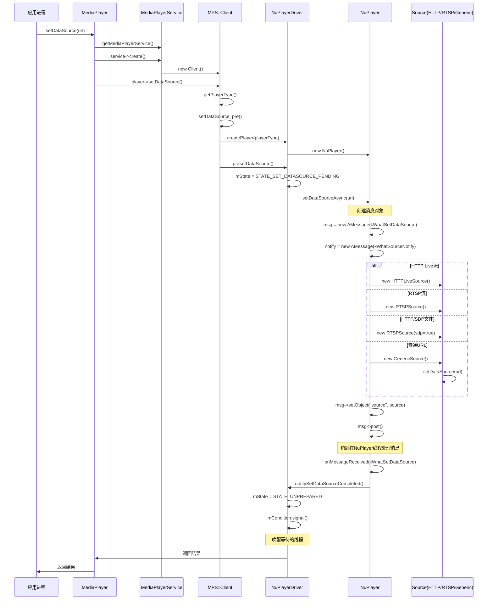

# MediaServer启动流程
在main_demaiserver.cpp启动的该服务，这部分代码没什么内容分为两部分
- 创建MMediaPlayerService
    创建一个NuPlayerFactory注册到，map容器sFactoryMap中。key是字符串比如NU_PLAYER
- ResourceManagerService
    创建ResourceObserverService对象，然后注册到ResourceManagerService中。
# MediaPlayer播放流程分析
## 使用 MediaPlayer API 播放音视频的流程
```java
        // 初始化MediaPlayer
        // MediaPlayer类位于frameworks/base/media/java/android/media/MediaPlayer.java
        mediaPlayer = new MediaPlayer();
        try {
            // 设置音频资源 (本地文件或网络URL)
            mediaPlayer.setDataSource("https://www.example.com/audio.mp3"); // 网络音频文件
            // mediaPlayer.setDataSource("/sdcard/Music/sample.mp3");       // 本地音频文件
            // 异步准备播放器
            mediaPlayer.setOnPreparedListener(mp ->{
                Log.d(TAG, "MediaPlayer准备完成，开始播放")
                mediaPlayer.start();// 开始播放
            });
            prepareAsync(); // 异步准备
        } catch (Exception e) {
            Log.e("MediaPlayer", "初始化失败：" + e.getMessage());
        }
        //播放进行中
        mediaPlayer.pause(); // 暂停播放
        mediaPlayer.stop(); // 停止播放
        mediaPlayer.prepare(); // 停止后需要重新准备播放器
```
上面就是使用MediaPlayer API的简化的播放流程。MediaPlayer是支持同步准备的，该代码使用了异步准备，目的是为了不会卡住UI，当准备完成之后会触发MediaPlayer中的函数OnPreparedListener，然后开始播放。
有AudioTrack的播放流程不同的是，不需要write。数据的读写都是MediaPlayer控制，这大大减少了APP的开发难度
接下来我们就按照播放流程来分析MediaServer的控制流。
## 控制流
### New MeidaPlayer
```java
MediaPlayer.java
   public MediaPlayer() {
        this(/*context=*/null, AudioSystem.AUDIO_SESSION_ALLOCATE);
    }
    private MediaPlayer(Context context, int sessionId) {
        // 调用父类构造函数,设置默认的音频属性
        super(new AudioAttributes.Builder().build(),
                AudioPlaybackConfiguration.PLAYER_TYPE_JAM_MEDIAPLAYER);

        // 初始化事件处理Handler,优先使用当前线程Looper
        // 如果当前线程没有Looper则使用主线程Looper
        Looper looper;
        if ((looper = Looper.myLooper()) != null) {
            mEventHandler = new EventHandler(this, looper);
        } else if ((looper = Looper.getMainLooper()) != null) {
            mEventHandler = new EventHandler(this, looper);
        } else {
            mEventHandler = null;
        }

        // 创建TimeProvider对象用于管理媒体播放时间戳和同步
        mTimeProvider = new TimeProvider(this);
        // 创建字幕源输入流列表,用于管理外挂字幕文件
        mOpenSubtitleSources = new Vector<InputStream>();

        // 获取Attribution信息,包含调用者身份信息
        // 如果context为null则使用默认Attribution
        AttributionSource attributionSource =
                context == null ? AttributionSource.myAttributionSource()
                        : context.getAttributionSource();
        if (attributionSource.getPackageName() == null) {
            attributionSource = attributionSource.withPackageName("");
        }

        // 初始化native层MediaPlayer
        try (ScopedParcelState attributionSourceState = attributionSource.asScopedParcelState()) {
            // native_setup用于初始化native层MediaPlayer
            // 参数1: 将Java层MediaPlayer对象的弱引用传递给native层,避免内存泄漏
            // 参数2: attributionSourceState.getParcel()获取包含调用者身份信息的Parcel对象
            //        Parcel是Android中用于序列化数据的容器,可以跨进程传输
            // 参数3: 解析音频会话ID,用于音频焦点管理
            native_setup(new WeakReference<>(this), attributionSourceState.getParcel(),
                    resolvePlaybackSessionId(context, sessionId));
        }
        
        // 注册到音频系统,注册到AudioServer中的mPlaybackMonitor
        baseRegisterPlayer(getAudioSessionId());
    }
```
```c++
android_media_MediaPlayer.cpp
android_media_MediaPlayer_native_setup(JNIEnv *env, jobject thiz, jobject weak_this,
                                       jobject jAttributionSource,
                                       jint jAudioSessionId)
{
    sp<MediaPlayer> mp = sp<MediaPlayer>::make(
        attributionSource, static_cast<audio_session_t>(jAudioSessionId));
    // create new listener and give it to MediaPlayer
    sp<JNIMediaPlayerListener> listener = new JNIMediaPlayerListener(env, thiz, weak_this);
    mp->setListener(listener);
    // Stow our new C++ MediaPlayer in an opaque field in the Java object.
    // 将native层MediaPlayer对象保存到Java层MediaPlayer的mNativeContext成员变量中

    setMediaPlayer(env, thiz, mp);
}

MediaPlayer::MediaPlayer(const AttributionSourceState& attributionSource,
    const audio_session_t sessionId) : mAttributionSource(attributionSource)
{
    ALOGV("constructor");
    mListener = NULL;
    mCookie = NULL;
    //默认赋值AUDIO_STREAM_MUSIC
    mStreamType = AUDIO_STREAM_MUSIC;
    //mediaplay初始状态
    mCurrentState = MEDIA_PLAYER_IDLE;
    mPrepareSync = false;
    if (sessionId == AUDIO_SESSION_ALLOCATE) {
        //在AF中获取一个唯一的mAudioSessionId
        mAudioSessionId = static_cast<audio_session_t>(
            AudioSystem::newAudioUniqueId(AUDIO_UNIQUE_ID_USE_SESSION));
    } else {
        mAudioSessionId = sessionId;
    }
    //在AF中记录在mAudioSessionRefs中，大概浏览了一下这个SessionId之后可能跟音效的操作有关
    AudioSystem::acquireAudioSessionId(mAudioSessionId, (pid_t)-1, (uid_t)-1); // always in client.
    mSendLevel = 0;
    mRetransmitEndpointValid = false;
}

```
#### 总结
构造流程其实就是完成了一些对象的创建比如TimeProvider、InputStream，然后生成一个AudioSession设置到AF中。

### SetDataSource
我们这里分析参数是网址的情况
```java
    private void setDataSource(String path, String[] keys, String[] values,
            List<HttpCookie> cookies)
            throws IOException, IllegalArgumentException, SecurityException, IllegalStateException {
        final Uri uri = Uri.parse(path);
        final String scheme = uri.getScheme();
        if ("file".equals(scheme)) {
            path = uri.getPath();
        } else if (scheme != null) {
            // handle non-file sources
            nativeSetDataSource(
                MediaHTTPService.createHttpServiceBinderIfNecessary(path, cookies),
                path,
                keys,
                values);
            return;
        }

        final File file = new File(path);
        try (FileInputStream is = new FileInputStream(file)) {
            setDataSource(is.getFD());
        }
    }
```
```c++
android_media_MediaPlayer.cpp
static void
android_media_MediaPlayer_setDataSourceAndHeaders(
        JNIEnv *env, jobject thiz, jobject httpServiceBinderObj, jstring path,
        jobjectArray keys, jobjectArray values) {

    sp<MediaPlayer> mp = getMediaPlayer(env, thiz);

    const char *tmp = env->GetStringUTFChars(path, NULL);
    String8 pathStr(tmp);
    env->ReleaseStringUTFChars(path, tmp);
    tmp = NULL;

    // 将Java层传入的HTTP请求头键值对数组转换为KeyedVector
    // headersVector用于存储HTTP请求头信息,比如:
    // User-Agent: MediaPlayer
    // Accept: */*
    // Connection: Keep-Alive 
    // 等HTTP标准请求头
    //该例子是null
    KeyedVector<String8, String8> headersVector;
    if (!ConvertKeyValueArraysToKeyedVector(
            env, keys, values, &headersVector)) {
        return;
    }

    sp<IMediaHTTPService> httpService;
    if (httpServiceBinderObj != NULL) {
        sp<IBinder> binder = ibinderForJavaObject(env, httpServiceBinderObj);
        httpService = interface_cast<IMediaHTTPService>(binder);
    }

    status_t opStatus =
        mp->setDataSource(
                httpService,
                pathStr.c_str(),
                headersVector.size() > 0? &headersVector : NULL);

    process_media_player_call(
            env, thiz, opStatus, "java/io/IOException",
            "setDataSource failed." );
}
```
```c++
mediaplayer.cpp
status_t MediaPlayer::setDataSource(
        const sp<IMediaHTTPService> &httpService,
        const char *url, const KeyedVector<String8, String8> *headers)
{
    ALOGV("setDataSource(%s)", url);
    status_t err = BAD_VALUE;
    if (url != NULL) {
        const sp<IMediaPlayerService> service(getMediaPlayerService());
        if (service != 0) {
            sp<IMediaPlayer> player(service->create(this, mAudioSessionId, mAttributionSource));
            if ((NO_ERROR != doSetRetransmitEndpoint(player)) ||
                (NO_ERROR != player->setDataSource(httpService, url, headers))) {
                player.clear();
            }
            err = attachNewPlayer(player);
        }
    }
    return err;
}
```
```c++
MediaPlayerService.cpp
sp<IMediaPlayer> MediaPlayerService::create(const sp<IMediaPlayerClient>& client,
        audio_session_t audioSessionId, const AttributionSourceState& attributionSource)
{
    int32_t connId = android_atomic_inc(&mNextConnId);
    // TODO b/182392769: use attribution source util
    AttributionSourceState verifiedAttributionSource = attributionSource;
    verifiedAttributionSource.pid = VALUE_OR_FATAL(
        legacy2aidl_pid_t_int32_t(IPCThreadState::self()->getCallingPid()));
    verifiedAttributionSource.uid = VALUE_OR_FATAL(
        legacy2aidl_uid_t_int32_t(IPCThreadState::self()->getCallingUid()));
        //Client 集成BnMediaPlayer
    sp<Client> c = new Client(
            this, verifiedAttributionSource, connId, client, audioSessionId);

    ALOGV("Create new client(%d) from %s, ", connId,
        verifiedAttributionSource.toString().c_str());
    //算是记录一下有哪些mediaplayer，注意这里使用弱指针。
    wp<Client> w = c;
    {
        Mutex::Autolock lock(mLock);
        mClients.add(w);
    }
    return c;
}
```
```c++
status_t MediaPlayerService::Client::setDataSource(
        const sp<IMediaHTTPService> &httpService,
        const char *url,
        const KeyedVector<String8, String8> *headers)
{
    ALOGV("setDataSource(%s)", url);
    if (url == NULL)
        return UNKNOWN_ERROR;

    if ((strncmp(url, "http://", 7) == 0) ||
        (strncmp(url, "https://", 8) == 0) ||
        (strncmp(url, "rtsp://", 7) == 0)) {
        if (!checkPermission("android.permission.INTERNET")) {
            return PERMISSION_DENIED;
        }
    }

//ContentProvider是Android系统中四大组件之一，用于在不同应用之间安全地共享数据
    if (strncmp(url, "content://", 10) == 0) {
        // get a filedescriptor for the content Uri and
        // pass it to the setDataSource(fd) method

        String16 url16(url);
        int fd = android::openContentProviderFile(url16);
        if (fd < 0)
        {
            ALOGE("Couldn't open fd for %s", url);
            return UNKNOWN_ERROR;
        }
        status_t status = setDataSource(fd, 0, 0x7fffffffffLL); // this sets mStatus
        close(fd);
        return mStatus = status;
    } else {
        //获取player的种类，目前只有nuplayer、testplayer 
        //获取哪种的方法 时使用打分制度来评比的，看哪种player更适合当前的url
        player_type playerType = MediaPlayerFactory::getPlayerType(this, url);
        sp<MediaPlayerBase> p = setDataSource_pre(playerType);
        if (p == NULL) {
            return NO_INIT;
        }

        return mStatus =
                setDataSource_post(
                p, p->setDataSource(httpService, url, headers));
    }
} 
```
#### MediaPlayerService.cpp setDataSource_pre
```c++
// setDataSource_pre函数主要完成以下工作:
sp<MediaPlayerBase> MediaPlayerService::Client::setDataSource_pre(player_type playerType) {
    ALOGV("player type = %d", playerType);

    // 1. 根据playerType创建对应的播放器实例(NuPlayer或TestPlayer)
    sp<MediaPlayerBase> p = createPlayer(playerType);
    if (p == NULL) {
        return p;
    }

    std::vector<DeathNotifier> deathNotifiers;

    // 2. 监听media.extractor服务的死亡通知
    // 3. 监听OMX服务的死亡通知
    // 4. 监听所有Codec2服务的死亡通知
    // 5. 更新死亡通知列表
    mDeathNotifiers.clear();
    mDeathNotifiers.swap(deathNotifiers);
    // 6. 创建音频设备更新监听器
    mAudioDeviceUpdatedListener = new AudioDeviceUpdatedNotifier(p);

    // 7. 如果不是硬件输出,创建音频输出并设置音频接收器
    if (!p->hardwareOutput()) {
        mAudioOutput = new AudioOutput(mAudioSessionId, mAttributionSource, mAudioAttributes,
                                       mAudioDeviceUpdatedListener);
        static_cast<MediaPlayerInterface*>(p.get())->setAudioSink(mAudioOutput);
    }

    return p;
}

sp<MediaPlayerBase> MediaPlayerService::Client::createPlayer(player_type playerType) {
    // determine if we have the right player type
    sp<MediaPlayerBase> p = getPlayer();

    if (p == NULL) {
        //该函数会根据playerType找对对应的playerfactory类调用对应的createPlayer
        p = MediaPlayerFactory::createPlayer(
                playerType, mListener,
                VALUE_OR_FATAL(aidl2legacy_int32_t_pid_t(mAttributionSource.pid)));
    }
    return p;
}
//MediaPlayerFactory.cpp 中的NuPlayerFactory
//先分析到这里 ，之后在深入分析NuPlayerDriver做了什么
virtual sp<MediaPlayerBase> createPlayer(pid_t pid) {
        ALOGV(" create NuPlayer");
        //这个pid应该是app的 进程号
        return new NuPlayerDriver(pid);
    }
```
#### NuPlayerDriver
```C++
NuPlayerDriver::NuPlayerDriver(pid_t pid)
    : mState(STATE_IDLE),
      mIsAsyncPrepare(false),
      mAsyncResult(UNKNOWN_ERROR),
      mSetSurfaceInProgress(false),
      mDurationUs(-1),
      mPositionUs(-1),
      mSeekInProgress(false),
      mPlayingTimeUs(0),
      mRebufferingTimeUs(0),
      mRebufferingEvents(0),
      mRebufferingAtExit(false),
      mLooper(new ALooper),
      mMediaClock(new MediaClock),
      mPlayer(new NuPlayer(pid, mMediaClock)),
      mPlayerFlags(0),
      mCachedPlayerIId(PLAYER_PIID_INVALID),
      mMetricsItem(NULL),
      mClientUid(-1),
      mAtEOS(false),
      mLooping(false),
      mAutoLoop(false) {
    ALOGD("NuPlayerDriver(%p) created, clientPid(%d)", this, pid);
    mLooper->setName("NuPlayerDriver Looper");

    mMediaClock->init();

    // set up an analytics record
    mMetricsItem = mediametrics::Item::create(kKeyPlayer);

    mLooper->start(
            false, /* runOnCallingThread */
            true,  /* canCallJava */
            PRIORITY_AUDIO);

    mLooper->registerHandler(mPlayer);
    //会调用到Nuplayer.init中
    mPlayer->init(this);
}
``` 
#### NuPlayerDriver.cpp setDataSource
```c++
status_t NuPlayerDriver::setDataSource(
        const sp<IMediaHTTPService> &httpService,
        const char *url,
        const KeyedVector<String8, String8> *headers) {
    ALOGV("setDataSource(%p) url(%s)", this, uriDebugString(url, false).c_str());
    ATRACE_BEGIN(StringPrintf("setDataSource(%p)", this).c_str());
    Mutex::Autolock autoLock(mLock);

    if (mState != STATE_IDLE) {
        ATRACE_END();
        return INVALID_OPERATION;
    }
    //设置状态 media中状态很重要
    mState = STATE_SET_DATASOURCE_PENDING;

    mPlayer->setDataSourceAsync(httpService, url, headers);
    //通过while循环来模拟同步
    while (mState == STATE_SET_DATASOURCE_PENDING) {
        mCondition.wait(mLock);
    }
    ATRACE_END();

    return mAsyncResult;
}
```
#### NuPlayer.cpp setDataSourceAync
```c++
// NuPlayer::setDataSourceAsync 函数分析
void NuPlayer::setDataSourceAsync(
        const sp<IMediaHTTPService> &httpService, // HTTP服务
        const char *url,                         // 媒体文件URL
        const KeyedVector<String8, String8> *headers) { // HTTP头部信息

    // 创建一个消息,类型为kWhatSetDataSource
    sp<AMessage> msg = new AMessage(kWhatSetDataSource, this);
    size_t len = strlen(url);

    // 创建一个通知消息,用于Source回调通知
    sp<AMessage> notify = new AMessage(kWhatSourceNotify, this);

    // 根据URL类型创建不同的Source对象
    sp<Source> source;
    
    // 1. 如果是HTTP Live流(m3u8)
    // m3u8是HTTP Live Streaming(HLS)协议的媒体播放列表文件
    // HLS协议将媒体内容切分成小片段(.ts文件)
    // m3u8文件包含了这些媒体片段的索引信息
    // 客户端可以通过HTTP协议下载m3u8和对应的媒体片段进行播放
    if (IsHTTPLiveURL(url)) {
        source = new HTTPLiveSource(notify, httpService, url, headers);
        ALOGV("setDataSourceAsync HTTPLiveSource %s", url);
        mDataSourceType = DATA_SOURCE_TYPE_HTTP_LIVE;
    } 
    // 2. 如果是RTSP流
    else if (!strncasecmp(url, "rtsp://", 7)) {
        source = new RTSPSource(
                notify, httpService, url, headers, mUIDValid, mUID);
        ALOGV("setDataSourceAsync RTSPSource %s", url);
        mDataSourceType = DATA_SOURCE_TYPE_RTSP;
    }
    // 3. 如果是HTTP/HTTPS的SDP文件(也是RTSP流)
    else if ((!strncasecmp(url, "http://", 7)
                || !strncasecmp(url, "https://", 8))
                    && ((len >= 4 && !strcasecmp(".sdp", &url[len - 4]))
                    || strstr(url, ".sdp?"))) {
        source = new RTSPSource(
                notify, httpService, url, headers, mUIDValid, mUID, true);
        ALOGV("setDataSourceAsync RTSPSource http/https/.sdp %s", url);
        mDataSourceType = DATA_SOURCE_TYPE_RTSP;
    }
    // 4. 其他普通URL(如本地文件、HTTP普通文件等)
    else {
        ALOGV("setDataSourceAsync GenericSource %s", url);

        // 创建通用Source
        sp<GenericSource> genericSource =
                new GenericSource(notify, mUIDValid, mUID, mMediaClock);

        // 设置数据源
        status_t err = genericSource->setDataSource(httpService, url, headers);

        if (err == OK) {
            source = genericSource;
        } else {
            ALOGE("Failed to set data source!");
        }

        mDataSourceType = DATA_SOURCE_TYPE_GENERIC_URL;
    }

    // 将创建的Source对象设置到消息中并发送
    msg->setObject("source", source);
    msg->post();
}
```setDataSourceAsync
#### GenericSource.cpp setDataSource
```c++
status_t NuPlayer::GenericSource::setDataSource(
        const sp<IMediaHTTPService> &httpService,
        const char *url,
        const KeyedVector<String8, String8> *headers) {
    Mutex::Autolock _l(mLock);
    ALOGV("setDataSource url: %s", url);

    resetDataSource();

    mHTTPService = httpService;
    mUri = url;

    if (headers) {
        mUriHeaders = *headers;
    }
    return OK;
}
```
#### SetDataSource 流程总结

`setDataSource` 的整个流程横跨了Java应用层、JNI、C++客户端框架以及服务端的MediaPlayerService，最终由具体的播放器引擎（如NuPlayer）执行。其核心思想是：**通过Binder机制将客户端的同步调用转化为服务端的异步处理，并在服务端通过同步阻塞的方式等待异步操作完成**。

##### 1. 应用层到客户端 (Java -> JNI -> C++)
-   Java层的 `MediaPlayer.setDataSource(String path, ...)` 方法根据URL协议类型（如http/https）调用到JNI层的 `nativeSetDataSource`。
-   JNI层 (`android_media_MediaPlayer.cpp`) 将Java数据类型转换为C++类型，然后调用C++ `MediaPlayer` 对象的 `setDataSource` 方法。

##### 2. 客户端到服务端 (MediaPlayer -> MediaPlayerService)
-   C++ `MediaPlayer` 首先通过 `getMediaPlayerService()` 获取到 `MediaPlayerService` 的Binder代理。
-   调用 `service->create()` 请求 `MediaPlayerService` 创建一个播放器实例。`MediaPlayerService` 会创建一个 `MediaPlayerService::Client` 对象（它本身是一个Binder服务端），并将其返回给客户端。
-   客户端拿到这个 `Client` 的代理后，调用其 `setDataSource` 方法，这是一次跨进程的Binder调用，将请求发送到 `mediaserver` 进程。

##### 3. 服务端分发 (MediaPlayerService::Client)
-   `MediaPlayerService::Client` 接收到 `setDataSource` 请求后，首先进行权限检查。
-   通过 `MediaPlayerFactory::getPlayerType` 判断应该使用哪种播放器（通常是 `NuPlayer`）。
-   调用 `createPlayer` 方法，通过 `NuPlayerFactory` 创建一个 `NuPlayerDriver` 实例。`NuPlayerDriver` 在其构造函数中会创建核心的 `NuPlayer` 对象和一个 `ALooper` 消息循环线程。
-   最后，调用 `NuPlayerDriver` 的 `setDataSource` 方法。

##### 4. 同步接口与异步实现 (NuPlayerDriver -> NuPlayer)
-   `NuPlayerDriver::setDataSource` 是一个 **同步阻塞** 的接口。它将自身状态设置为 `STATE_SET_DATASOURCE_PENDING`。
-   它调用 `NuPlayer::setDataSourceAsync` 发起 **异步** 请求。
-   `NuPlayer::setDataSourceAsync` 内部会根据URL创建对应的 `Source`（如`GenericSource`、`HTTPLiveSource`等），然后将这个 `Source` 对象包装在一个 `AMessage` 消息中，通过 `msg->post()` 发送到 `NuPlayer` 内部的 `ALooper` 线程进行处理，然后立即返回。
-   `NuPlayerDriver` 在调用完异步方法后，会立刻在 `while` 循环中调用 `mCondition.wait(mLock)` **阻塞等待**，直到 `NuPlayer` 的异步操作完成并通过回调通知它。

##### 5. 异步处理与完成通知
-   `NuPlayer` 的 `ALooper` 线程收到消息后，在 `onMessageReceived` 中处理 `kWhatSetDataSource` 消息，开始真正的数据源准备工作。
-   当异步操作完成后，`NuPlayer` 会回调 `NuPlayerDriver` 的 `notifySetDataSourceCompleted` 方法。
-   `NuPlayerDriver` 在这个回调中，将 `mState` 修改为完成状态，并调用 `mCondition.signal()` **唤醒** 之前阻塞的线程。
-   `setDataSource` 调用至此完成，并逐层返回结果给应用。


#### 思考
##### 为什么要有一个NuPlayerDriver类，直接使用NuPlay不行吗
总结：为什么必须分离？
### 总结：为什么必须分离？

如果将 `NuPlayerDriver` 和 `NuPlayer` 合并成一个类，会带来灾难性的后果：

| 方面 | 分离式设计 (Driver + Player) | 合并式设计 (只有一个Player) |
| :--- | :--- | :--- |
| **线程模型** | **清晰、安全**。Binder线程只负责发号施令并等待，媒体工作线程负责执行。避免了阻塞`mediaserver`。 | **混乱、危险**。耗时操作会直接在Binder线程上执行，导致`mediaserver`无响应，最终被系统`watchdog`杀死。 |
| **代码职责** | **单一、明确**。`Driver`负责对外接口和线程同步，`Player`负责内部媒体逻辑。 | **高度耦合**。API接口逻辑、线程同步逻辑、媒体处理逻辑全部混在一起，极难维护和调试。 |
| **状态管理** | **分层、简化**。`Driver`管理简单的外部状态，`Player`管理复杂的内部状态，两者解耦。 | **极其复杂**。一个类要处理两种维度的状态机，代码会充满`if/else`和`switch`，难以理解。 |
| **可维护性** | **高**。可以独立修改`NuPlayer`的内部实现（比如更换渲染器逻辑），而完全不影响`NuPlayerDriver`的API接口。 | **低**。任何微小的修改都可能影响到API行为或线程安全，牵一发而动全身。|

一个形象的比喻：
`NuPlayerDriver`就像一家餐厅的前台经理。他负责接待顾客（MediaPlayerService::Client）、接下菜单（start(), seekTo()），并告诉顾客“请稍等”。
`NuPlayer` 就像是后厨的总厨。经理把菜单通过内部系统（AMessage）发给总厨。总厨在自己的厨房里（ALooper线程）异步地进行洗、切、炒、装盘等一系列复杂操作，完成后通知经理可以上菜了。
你不能让总厨直接去前台接待顾客，否则厨房就没人干活了，整个餐厅也会陷入混乱。同理，NuPlayer也不能直接去响应Binder调用。
#### 遗留
接下来会对AMessage与ALooper写一篇分析文章
### PrepareAsync/Prepare
### Start
### Pause/Stop
### Release

