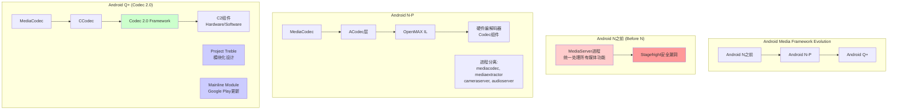
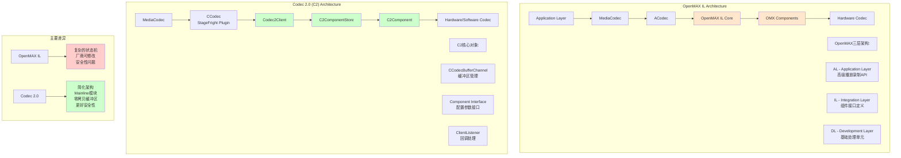
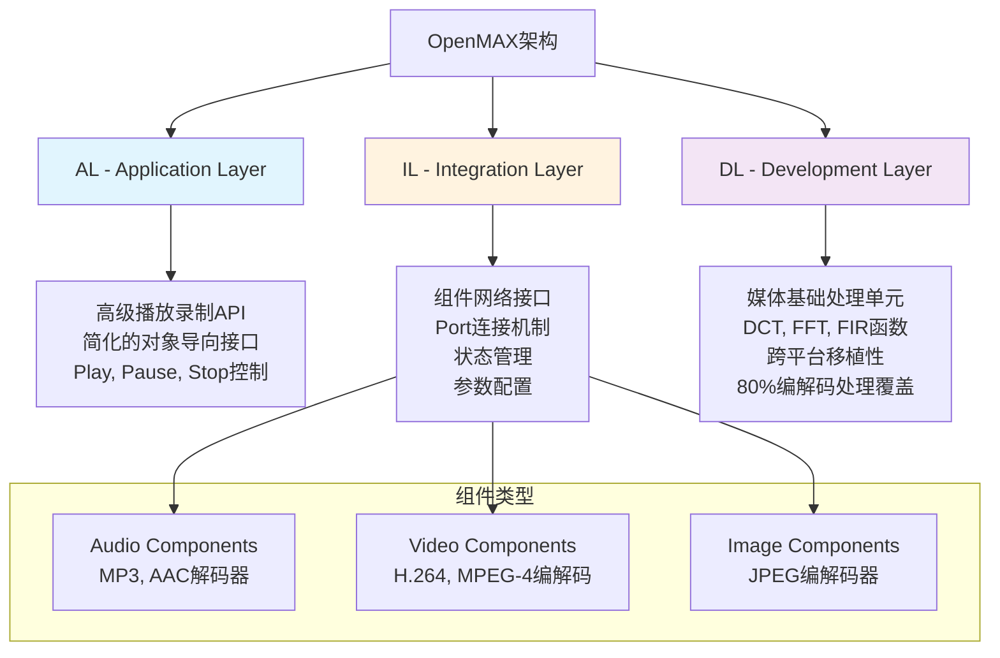
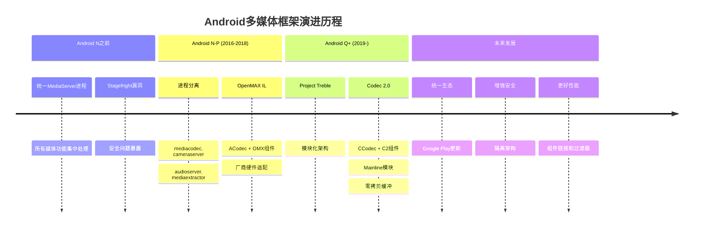
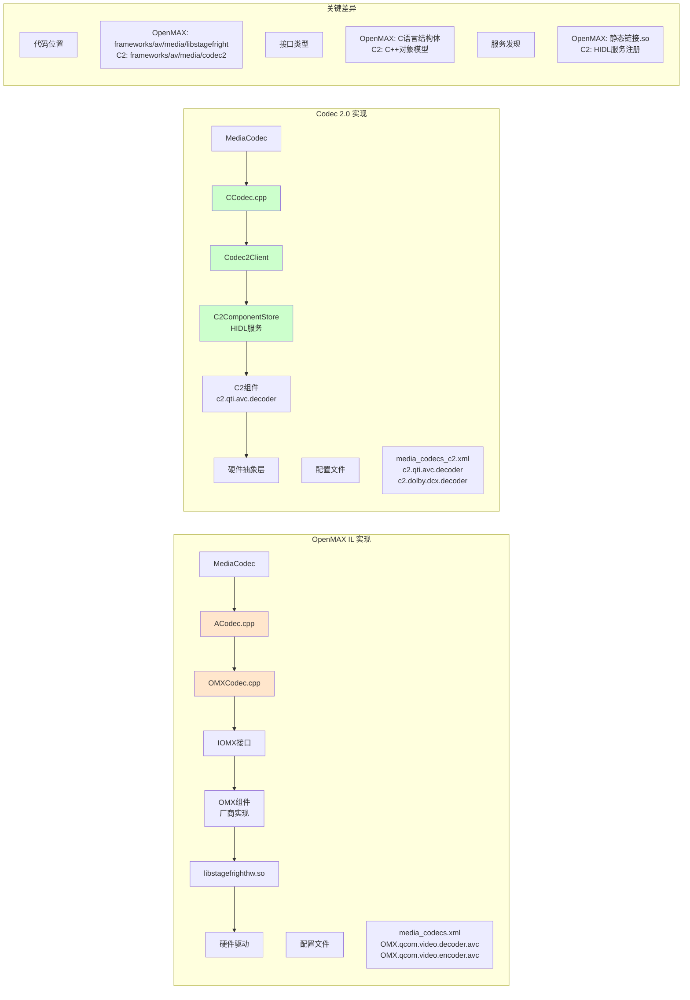

RemoteDateSource是继承BnDataSource的 是为了使用进程间的binder通信的， 那Bn应该是 服务端，那Bp是如何使用使用的
您对 Binder 机制的理解非常准确！`RemoteDataSource` 继承自 `BnDataSource`，这确实意味着它扮演了 Binder 通信中的**服务端角色（Stub）**。

那么，客户端的 `BpDataSource` 在哪里以及如何被使用呢？答案就在 `IDataSource` 这个接口被跨进程传递的那一刻。

---

### BpDataSource 的创建和使用

`BpDataSource` 是由 Binder 框架在**客户端**自动创建和使用的，这个过程对于开发者来说通常是透明的。

让我们通过 `MediaExtractor` 的创建流程来梳理一下：

1.  **客户端发起调用**:
    *   在**客户端进程**（例如 `NuPlayer` 所在的 `mediaserver` 进程或 App 进程），有一个本地的、真正的 `DataSource` 对象（比如一个 `FileSource`，它能直接从文件读取数据）。
    *   客户端想让 `media.extractor` 服务进程来解析这个 `DataSource`。它调用 `mediaExService->makeExtractor(IDataSource, ...)`。
    *   注意，`makeExtractor` 的参数是 `sp<IDataSource>`，而不是 `sp<DataSource>`。这是一个 Binder 接口。

2.  **创建本地代理 (Creating the Local Stub)**:
    *   为了将本地的 `FileSource` 对象通过 Binder 传递出去，框架会调用一个包装函数，比如 `CreateIDataSourceFromDataSource(source)`。
    *   这个函数内部会创建一个 `RemoteDataSource` 对象，并将本地的 `FileSource` **包装**在里面。
    *   这个新创建的 `RemoteDataSource` 实例就成了**本地 `FileSource` 对象在 Binder 世界中的服务端 Stub**。
    ```cpp
    // 在客户端进程中:
    sp<DataSource> localFileSource = new FileSource("path/to/file");
    
    // CreateIDataSourceFromDataSource() 内部大致是这样:
    sp<IDataSource> binderStub = new RemoteDataSource(localFileSource); 
    
    // 然后调用...
    mediaExService->makeExtractor(binderStub, ...);
    ```

3.  **Binder 驱动施展魔法**:
    *   当 `binderStub` 这个 `RemoteDataSource` 对象被作为参数，通过 Binder IPC 传递给 `media.extractor` 服务进程时，奇妙的事情发生了。
    *   Binder 驱动并不会把 `RemoteDataSource` 对象本身拷贝过去。
    *   它在**接收端（`media.extractor` 服务进程）**发现收到的只是一个 Binder 对象的“引用”或“句柄”。
    *   于是，Binder 驱动在**服务进程中**，自动实例化一个 `BpDataSource` 对象。这个 `Bp` 前缀代表 "Binder Proxy"。
    *   **这个新创建的 `BpDataSource` 就是 `RemoteDataSource` 在服务进程中的客户端代理（Proxy）。**

4.  **服务端使用代理 (Service Uses the Proxy)**:
    *   现在，在 `media.extractor` 服务进程的 `makeExtractor` 函数中，它收到的 `remoteSource` 参数，实际上就是一个 `sp<BpDataSource>`。
    *   当 `media.extractor` 服务需要从这个数据源读取数据时（比如 `sniff` 过程），它会调用 `remoteSource->readAt(...)`。
    *   这个调用实际上是调用了 `BpDataSource::readAt(...)`。
    *   `BpDataSource` 的实现就是将调用和参数打包，通过 Binder IPC **再发回给客户端进程**。

5.  **回到客户端 (Round-trip to Client)**:
    *   **客户端进程**的 Binder 线程池接收到这个 `readAt` 的请求。
    *   它将请求路由给最初的那个 `RemoteDataSource` 对象（服务端 Stub）。
    *   `RemoteDataSource::readAt(...)` 被调用，它最终将调用**转发给它所包装的那个真正的 `FileSource` 对象**。
    *   `FileSource` 从文件中读取数据，然后将数据原路通过 Binder 返回。

---

### 总结

| | **客户端进程 (e.g., Mediaserver)** | **服务端进程 (media.extractor)** |
| :--- | :--- | :--- |
| **真实对象** | `FileSource` (或其他 `DataSource` 子类) | |
| **Binder Stub** | `RemoteDataSource` (继承 `BnDataSource`)<br>包装了 `FileSource` | |
| **Binder Proxy**| | `BpDataSource` (由Binder自动创建)<br>是 `RemoteDataSource` 的代理 |
| **数据流** | `FileSource` → `RemoteDataSource` | |
| **调用流** | | `BpDataSource` → (IPC) → `RemoteDataSource` → `FileSource` |

所以，`BpDataSource` 是在**接收 Binder 对象的那个进程（在这里是 `media.extractor` 服务）**中被自动创建和使用的。它使得 `media.extractor` 服务可以像调用本地对象一样，透明地调用一个实际上存在于另一个进程中的 `DataSource` 对象。这完美地实现了**反向远程调用**。


为什么还要转换成DataSource 直接使用不行吗   sp<DataSource> localSource = CreateDataSourceFromIDataSource(remoteSource);
这是一个非常好的观察！确实，`media.extractor` 服务进程收到了一个 `remoteSource` (类型是 `sp<IDataSource>`)，为什么不直接使用它，而是要通过 `CreateDataSourceFromIDataSource` 把它转换回一个 `sp<DataSource>` 呢？

答案是：**为了与现有的、传统的 `MediaExtractor` 插件代码兼容**。

我们来深入分析一下这个设计决策背后的原因：

### 1. `MediaExtractor` 插件的“历史包袱”

*   Android 的媒体解析器插件（如 `MPEG4Extractor`, `MP3Extractor` 等）是非常古老和核心的代码，它们的历史比 `media.extractor` 这个独立的沙箱服务要长得多。
*   这些插件从被设计之初，它们的接口就是接收一个 `sp<DataSource>` 类型的参数。例如，它们的 `sniff` 函数和构造函数都期望一个能直接调用的 `DataSource` 对象。
    ```cpp
    // 一个典型的 Sniffer 函数签名
    bool MyExtractor::sniff(const sp<DataSource> &source, ...);
    
    // 一个典型的构造函数
    MyExtractor::MyExtractor(const sp<DataSource> &source);
    ```
*   这些插件内部需要频繁调用 `source->readAt()` 来读取文件头和数据块。

### 2. Binder 接口与本地接口的不匹配

*   `IDataSource` 是一个 **Binder 接口**。对它的每一次 `readAt` 调用都是一次**跨进程通信 (IPC)**，有性能开销。
*   `DataSource` 是一个**本地 C++ 抽象类**。它的子类（如 `FileSource`）的 `readAt` 调用是一个**直接的、在同一进程内的函数调用**，效率非常高。

如果 `media.extractor` 服务直接把收到的 `IDataSource` 代理对象（`BpDataSource`）传递给 `MPEG4Extractor`，理论上似乎可行，但会面临两个主要问题：

*   **问题一：类型不匹配（最直接的问题）**
    `MPEG4Extractor` 的接口需要 `sp<DataSource>`，而你只有一个 `sp<IDataSource>`。尽管 `BpDataSource` 在内部实现了 `readAt` 的远程调用，但它和 `FileSource` 并不是同一个继承体系下的兄弟，不能直接传递。

*   **问题二：设计理念和代码复用**
    Android 团队不希望为了这个新的沙箱服务，去重写所有 `MediaExtractor` 插件，让它们都能接收 `sp<IDataSource>`。这样做工作量巨大，且容易引入 Bug。最好的办法是**保持插件代码不变**。

### 3. `CreateDataSourceFromIDataSource` 的作用：适配器模式 (Adapter Pattern)

`CreateDataSourceFromIDataSource` 就是解决这个问题的关键，它扮演了一个**适配器 (Adapter)** 的角色。

它内部做的事情大致是这样的：

1.  创建一个新的类，我们叫它 `DataSourceProxy` (名字可能不同，但功能类似)。
2.  这个 `DataSourceProxy` **继承自 `DataSource`**，所以它可以被传递给任何需要 `sp<DataSource>` 的老代码。
3.  `DataSourceProxy` 的构造函数接收那个跨进程的 `sp<IDataSource>` (也就是 `BpDataSource`) 并**持有它**。
4.  `DataSourceProxy` 重写了 `readAt` 方法。它的 `readAt` 实现非常简单：**直接调用它持有的那个 `IDataSource` 代理的 `readAt` 方法**。

```cpp
// CreateDataSourceFromIDataSource 内部逻辑的伪代码
sp<DataSource> CreateDataSourceFromIDataSource(const sp<IDataSource>& remoteSource) {
    // DataSourceProxy 继承自 DataSource
    return new DataSourceProxy(remoteSource); 
}

// DataSourceProxy 的实现
class DataSourceProxy : public DataSource {
public:
    DataSourceProxy(const sp<IDataSource>& remote) : mRemoteSource(remote) {}

    virtual ssize_t readAt(off64_t offset, void *data, size_t size) {
        // 将本地调用，转发为对远程代理的调用
        return mRemoteSource->readAt(offset, data, size); 
    }
    // ... 其他方法的实现 ...
private:
    sp<IDataSource> mRemoteSource;
};
```

### 总结

所以，`CreateDataSourceFromIDataSource` 这一步转换是**不可避免**的，它的核心目的是：

**创建一个适配器对象，这个对象在“表面上”（类型系统）看起来是一个传统的、本地的 `DataSource`，从而能够无缝地被所有现存的 `MediaExtractor` 插件使用。而在“内部”，它将所有的数据读取请求，通过 Binder IPC 转发回真正的 `DataSource` 所在的客户端进程。**

这是一种非常聪明的设计，它用一个轻量级的适配器，优雅地解决了新架构（进程沙箱）与大量遗留代码（解析器插件）之间的兼容性问题。

好的，这四个常量是 `MediaPlayer` 的 `seekTo(long msec, int mode)` 方法中用来**指定 `seek` (跳转) 行为模式**的。

理解这些模式的关键，在于理解视频编码中的 **“关键帧”（Key Frame / Sync Frame / I-Frame）** 概念。

*   **关键帧 (I-Frame)**: 这是一个完整的画面，可以独立解码。
*   **非关键帧 (P-Frame, B-Frame)**: 它们只存储了与前一帧或后一帧相比的**变化部分**，不能独立解码，必须依赖于其他帧。

因此，播放器要想从任意时间点开始播放，最快、最高效的方式是**先找到一个关键帧**，从那里开始解码。

---

### 四种 Seek 模式详解

这四种模式提供了在**精确度**和**速度**之间的不同权衡。

#### 1. `SEEK_PREVIOUS_SYNC` (寻找之前的关键帧)

*   **`0x00`**: `seekTo(5000, SEEK_PREVIOUS_SYNC)`
*   **行为**: 播放器会跳转到你指定时间点（5000毫秒）**之前或正好在该时间点上**的那个**关键帧**。
*   **例子**: 假设第 4800 毫秒有一个关键帧，第 5200 毫秒有另一个关键帧。调用 `seekTo(5000, ...)` 会让播放器从 **4800 毫秒**的那个关键帧开始播放。
*   **优点**: 速度非常快，因为找到关键帧后就可以立即开始解码。
*   **缺点**: 跳转到的位置可能比你期望的要早一些，不够精确。
*   **适用场景**: 快速预览、快进/快退等不要求高精度的场景。

#### 2. `SEEK_NEXT_SYNC` (寻找之后的关键帧)

*   **`0x01`**: `seekTo(5000, SEEK_NEXT_SYNC)`
*   **行为**: 播放器会跳转到你指定时间点（5000毫秒）**之后或正好在该时间点上**的那个**关键帧**。
*   **例子**: 在上面的例子中，调用这个模式会让播放器从 **5200 毫秒**的那个关键帧开始播放。
*   **优缺点**: 与 `SEEK_PREVIOUS_SYNC` 类似，速度快，但精确度低。
*   **适用场景**: 同上。

#### 3. `SEEK_CLOSEST_SYNC` (寻找最近的关键帧)

*   **`0x02`**: `seekTo(5000, SEEK_CLOSEST_SYNC)`
*   **行为**: 播放器会跳转到离你指定时间点**时间上最近**的那个**关键帧**。
*   **例子**: 如果 4800ms 和 5200ms 分别有关键帧，5000ms 离这两点的时间差都是 200ms。这时行为可能依赖于具体实现（通常会选择前面的那个）。但如果 4900ms 和 5200ms 有关键帧，那么它会选择 **4900ms** 的关键帧。
*   **优缺点**: 仍然是基于关键帧的快速跳转，精确度比前两者稍好一些，但还是不完全精确。
*   **适用场景**: 大多数 `seek` 操作的默认推荐模式。

#### 4. `SEEK_CLOSEST` (寻找最近的帧，不一定是关键帧)

*   **`0x03`**: `seekTo(5000, SEEK_CLOSEST)`
*   **行为**: 这是**最精确**的模式。播放器会尝试跳转到离你指定时间点**最近的那一帧**，**无论它是不是关键帧**。
*   **实现方式**: 为了做到这一点，播放器内部通常需要先 `seek` 到目标时间点**之前**的那个关键帧，然后从那个关键帧开始，**依次解码**后续的 P 帧和 B 帧，直到解码到你想要的目标时间点，然后才开始显示画面。
*   **优点**: **精确度最高**。如果你 `seek` 到 5000ms，播放器就会精确地从 5000ms 开始播放。
*   **缺点**: **速度最慢**。因为它可能需要解码好几帧（甚至几十帧）才能到达你想要的位置，所以会感觉有明显的延迟。
*   **适用场景**: 视频剪辑、逐帧分析等需要高精度定位的专业应用。

### 总结

| 模式 | 跳转目标 | 速度 | 精确度 |
| :--- | :--- | :---: | :---: |
| `SEEK_PREVIOUS_SYNC` | 前一个或当前关键帧 | 最快 | 最低 |
| `SEEK_NEXT_SYNC` | 后一个或当前关键帧 | 最快 | 低 |
| `SEEK_CLOSEST_SYNC` | 时间上最近的关键帧 | 快 | 中 |
| `SEEK_CLOSEST` | 时间上最近的**任何**帧 | 慢 | 最高 |

在大多数用户播放场景中，`SEEK_PREVIOUS_SYNC` 或 `SEEK_CLOSEST_SYNC` 是最佳选择，因为它们在用户感知的速度和可接受的精确度之间取得了很好的平衡。旧版本的 `seekTo(int msec)` 方法，其内部实现就类似于 `SEEK_PREVIOUS_SYNC`。


您好，您提出了一个非常关键且容易混淆的点！您的观察基本正确，但这其中涉及了**两个方向完全不同**的数据流和通信模式。

我们来把这两个过程拆开看，您就会发现它们的设计目的和实现方式是截然不同的。

---

有一个问题 就是从source获取数据到extractor使用的是共享内存来传输,那怎么从extractor获取数据到source 用的是binder啊?
### 过程一：`Source` 把“文件”给 `Extractor`【控制流，方向：客户端 -> 服务端】

*   **谁是客户端？**: `NuPlayer` (通过 `GenericSource`)
*   **谁是服务端？**: `MediaExtractorService` (管理 `Extractor` 插件)
*   **做什么事？**: `NuPlayer` 需要 `Extractor` 服务帮它**解析一个文件**。
*   **传递的是什么？**: `NuPlayer` 传递的不是文件内容本身，而是**一个文件的“访问句柄”**，也就是 `DataSource` 对象。它告诉 `Extractor`：“**嘿，我有一个文件，它的访问方式在这里，请你用这个方式去读它**”。

**这里的通信方式确实是 Binder，但目的不是为了传输大量数据！**

*   `NuPlayer` 将本地的 `DataSource` (如 `FileSource`) 包装成 `RemoteDataSource` (一个 Binder Stub)。
*   `MediaExtractorService` 接收到的是 `RemoteDataSource` 的代理，即 `BpDataSource`。
*   当 `Extractor` 服务需要**读取文件内容**时，它会调用 `BpDataSource->readAt()`。这个调用会通过 Binder **反向**通知 `NuPlayer` 进程。
*   `NuPlayer` 进程收到请求后，通过**共享内存 (Shared Memory)** 将文件的一小块数据（例如 64KB）**拷贝**进去。
*   Binder 调用返回，`Extractor` 服务从共享内存中读取这块数据。

**小结**:
*   **Binder 用途**: 用来传递**命令**（“请在文件的这个位置读 64KB 数据”）和**控制**。
*   **共享内存用途**: 用来传输**实际的文件块数据**。
*   **优点**: 避免了在 Binder 中传输大量数据（这非常低效且有大小限制），同时又通过 Binder 实现了安全的跨进程方法调用。

---

### 过程二：`Extractor` 把“解析结果”给 `Source`【数据流，方向：服务端 -> 客户端】

*   **谁是客户端？**: `NuPlayer` (通过 `GenericSource`)
*   **谁是服务端？**: `MediaExtractorService` (管理 `Extractor` 插件)
*   **做什么事？**: `NuPlayer` 需要 `Extractor` **返回解析后的一帧帧数据** (Access Unit)。
*   **传递的是什么？**: `Extractor` 将解析出的**压缩音视频数据包** (比如一个 H.264 NALU) 和它的**元数据** (`timeUs`, `isSyncFrame` 等) 返回。

**这里的通信方式也是 Binder，但这次 Binder 中可能直接携带了数据！**

*   当 `GenericSource` 调用 `source->read(&mbuf, &options)` 时，这个 `source` 是 `IMediaSource` 的代理（`BpMediaSource`）。
*   这个调用通过 Binder IPC 发送到 `MediaExtractorService` 进程。
*   在服务端，真正的 `Extractor` 插件（比如 `MPEG4Extractor`）准备好一个 `MediaBuffer`。
*   这个 `MediaBuffer` 包含：
    1.  指向**实际压缩数据**的指针。
    2.  大量的**元数据**。
*   当 `MediaBuffer` 通过 Binder 返回给客户端时：
    *   如果数据量**很小**（通常 Binder 的传输缓存限制在 1MB 左右），数据可能会被**直接拷贝**并通过 Binder 传输。
    *   如果数据量**很大**，`MediaBuffer` 的实现可能会利用**共享内存**（`IMemory`）来避免大量拷贝。它会将数据放入一块共享内存中，然后只通过 Binder 传递这块共享内存的句柄。
*   `GenericSource` 收到 `MediaBuffer` 后，再将其转换为 `ABuffer` 放入队列。

---

### 总结与图解

| 流程 | 方向 | 目的 | Binder 用途 | 共享内存/拷贝 用途 |
| :--- | :--- | :--- | :--- | :--- |
| **1. 提供数据源** | `NuPlayer` -> `ExtractorService` | 让服务能访问文件 | 传递 `DataSource` 的**访问接口** (代理) | 响应 `readAt` 请求，传输**文件块** |
| **2. 获取解析结果**| `ExtractorService` -> `NuPlayer` | 返回一帧帧的**解析后数据** | 传递 `MediaBuffer` 对象（包括数据和元数据） | 如果数据大，用于传输**压缩数据帧** |

**简化图示**：

```
+----------------+                            +-------------------------+
| NuPlayer Proc  |      (1) Give Access       | MediaExtractorService   |
| (GenericSource)|--------------------------->| (Extractor Plugin)      |
|                |      (via Binder)          |                         |
| FileSource     |                            | BpDataSource            |
| RemoteDataSrc  |<----(readAt() request)-----|                         |
| (SharedMemory) |-----(file chunk data)----->| (SharedMemory)          |
|                |                            |                         |
|                |      (2) Get AU Data       |                         |
| BpMediaSource  |------------(read())-------->| MediaTrack              |
| (MediaBuffer)  |<----(AU data + meta)-------| (MediaBuffer)           |
+----------------+                            +-------------------------+
```

所以，您观察到的现象是完全正确的。这两个过程虽然都用了 Binder，但一个是“**我给你遥控器，你通过共享内存来我家取东西**”，另一个是“**我直接把处理好的小包裹（可能也用了共享内存）通过快递寄给你**”。这是为了在保证安全隔离的前提下，最大限度地优化不同场景下的数据传输效率。


# openmax和C2的功能与关系

我来为您详细介绍OpenMAX和Codec 2.0 (C2)的功能和关系。
Search files...
Search files...
Ran tool

基于搜索到的信息，我来详细介绍OpenMAX和Codec 2.0 (C2)的功能和关系。


## OpenMAX 和 Codec 2.0 (C2) 详细介绍

### 1. OpenMAX IL (Integration Layer) 介绍

#### 定义和目标
OpenMAX IL是由**Khronos Group**制定的开放标准，旨在为多媒体编解码器提供**标准化的组件接口**，使开发者和平台提供商能够更好地集成硬件和软件实现的多媒体编解码器。

#### OpenMAX三层架构

### 2. Codec 2.0 (C2) 介绍

#### 背景和动机
Codec 2.0是Google在**Android Q (API 29)**中引入的新一代多媒体编解码框架，目的是替代OpenMAX IL架构，解决以下问题：

1. **安全性问题**: Stagefright漏洞
2. **生态碎片化**: 厂商定制差异大
3. **维护成本**: 版本升级复杂

#### C2框架核心组件

```cpp
// C2框架核心类结构
class CCodec {
    CCodecBufferChannel* mChannel;    // 缓冲区管理
    Codec2Client* mClient;            // 组件交互
    ClientListener* mClientListener;   // 回调处理
};
```

### 3. 功能对比分析

| 特性 | OpenMAX IL | Codec 2.0 (C2) |
|------|------------|-----------------|
| **架构复杂度** | 复杂的状态机 | 简化的组件模型 |
| **缓冲区管理** | 传统拷贝机制 | 零拷贝(Zero-copy) |
| **厂商定制** | 允许修改核心代码 | Mainline模块，统一维护 |
| **更新机制** | OTA系统更新 | Google Play商店更新 |
| **安全性** | 存在Stagefright漏洞 | 增强的安全隔离 |
| **性能** | 中等 | 更高性能 |
| **组件链接** | 静态连接 | 支持组件链接(Component Chaining) |
| **配置查询** | 基础查询 | 增强的配置查询 |
| **跨进程通信** | Binder IPC | HIDL接口 |

### 4. 技术演进过程

### 5. 实现层面对比

### 6. 迁移和兼容性

#### OpenMAX到C2的迁移路径
```cpp
// OpenMAX组件注册 (旧方式)
const CodecInfo kDecoderInfo[] = {
    {MEDIA_MIMETYPE_VIDEO_AVC, "OMX.qcom.video.decoder.avc"},
    // ...
};

// C2组件注册 (新方式)  
extern "C" void RegisterCodecServices() {
    std::shared_ptr<C2ComponentStore> store = 
        android::GetCodec2PlatformComponentStore();
    // 通过HIDL服务注册
    android::sp<V1_2::IComponentStore> storeV1_2 = 
        new V1_2::utils::ComponentStore(store);
    storeV1_2->registerAsService("software");
}
```

#### 配置文件对比
```xml
<!-- OpenMAX配置 -->
<MediaCodec name="OMX.qcom.video.decoder.avc" type="video/avc">
    <Quirk name="requires-allocate-on-input-ports" />
    <Limit name="size" min="96x64" max="4096x2160" />
</MediaCodec>

<!-- C2配置 -->
<MediaCodec name="c2.qti.avc.decoder" type="video/avc">
    <Alias name="OMX.qcom.video.decoder.avc"/>
    <Limit name="size" min="96x96" max="4096x4096" />
    <Feature name="adaptive-playback" />
</MediaCodec>
```

### 7. 关键优势总结

#### OpenMAX IL优势：
- **成熟稳定**: 行业标准，广泛支持
- **生态完整**: 丰富的厂商支持和文档
- **向后兼容**: 老设备广泛支持

#### Codec 2.0优势：
- **安全性**: 解决Stagefright漏洞
- **性能**: 零拷贝缓冲区管理
- **统一性**: Mainline模块统一维护
- **扩展性**: 组件链接和过滤器支持
- **可维护性**: Google Play更新机制

### 8. 实际应用场景

从您的代码中可以看到，现代Android设备通常**同时支持两种框架**：
- **C2组件**：用于新的解码需求，如`c2.qti.avc.decoder`
- **OMX别名**：保持向后兼容，如`<Alias name="OMX.qcom.video.decoder.avc"/>`

这种双重支持确保了既能利用C2的新特性，又能保持对旧应用的兼容性。


# decoder送render中存在跳帧逻辑
`mSkipRenderingUntilMediaTimeUs` 是一个**跳帧控制变量**，用于在指定的媒体时间之前抑制帧的渲染。让我详细解释它的作用：

## 变量作用概述

这个变量控制**在特定时间点之前不渲染（跳过）解码出来的帧**，主要用于：
1. **快进/快退后的同步**
2. **特定硬件解码器的兼容性处理**
3. **避免显示过时的帧**

## 具体使用场景

### 1. **初始化和重置**
```cpp
// 构造函数中初始化为-1（表示不跳帧）
mSkipRenderingUntilMediaTimeUs(-1LL)

// 重置时也设置为-1
mSkipRenderingUntilMediaTimeUs = -1;
```

### 2. **设置跳帧时间点**

**场景一：通用的恢复播放控制**
```cpp
// 第1065-1069行：从extra消息中获取恢复时间
if (extra->findInt64("resume-at-mediaTimeUs", &resumeAtMediaTimeUs)) {
    ALOGI("[%s] suppressing rendering until %lld us",
            mComponentName.c_str(), (long long)resumeAtMediaTimeUs);
    mSkipRenderingUntilMediaTimeUs = resumeAtMediaTimeUs; // 设置跳帧截止时间
}
```

**场景二：特定硬件解码器的兼容性处理**
```cpp
// 第1075-1080行：针对Renesas解码器的特殊处理
if (mFlushCompleted && timeUs && 
    (!strncmp(mComponentName.c_str(), "OMX.RENESAS.VIDEO.DECODER.MPEG2", 31) ||
     !strncmp(mComponentName.c_str(), "OMX.RENESAS.VIDEO.DECODER.H264", 30) ||
     !strncmp(mComponentName.c_str(), "OMX.RENESAS.VIDEO.DECODER.RV", 28))) {
    
    ALOGI("[%s] suppressing rendering until %lld us",
          mComponentName.c_str(), (long long)timeUs + 150000);
    
    // 当前帧时间 + 150ms，在这个时间之前的帧都不渲染
    mSkipRenderingUntilMediaTimeUs = timeUs + 150000;
    mFlushCompleted = false;
}
```

### 3. **执行跳帧逻辑**
```cpp
// 第780-796行：在handleAnOutputBuffer中执行跳帧
if (mSkipRenderingUntilMediaTimeUs >= 0) {
    if (timeUs < mSkipRenderingUntilMediaTimeUs) {
        // 当前帧时间小于跳帧截止时间，丢弃这一帧
        ALOGV("[%s] dropping buffer at time %lld as requested.",
                 mComponentName.c_str(), (long long)timeUs);

        reply->post();  // 直接返回，不进行实际渲染
        
        if (eos) {
            // 如果是结束帧，需要特殊处理
            notifyResumeCompleteIfNecessary();
            if (mRenderer != NULL && !isDiscontinuityPending()) {
                mRenderer->queueEOS(mIsAudio, ERROR_END_OF_STREAM);
            }
        }
        return true; // 跳帧完成
    }

    // 已经到达目标时间，停止跳帧
    mSkipRenderingUntilMediaTimeUs = -1;
}
```

## 为什么需要跳帧？

### 1. **快进/快退同步**
- 用户快进到某个时间点时，解码器可能已经解码了很多旧帧
- 需要跳过这些过时的帧，直接显示目标时间点的帧

### 2. **硬件解码器兼容性**
- 某些硬件解码器（如Renesas）在flush后需要额外的稳定时间
- 通过跳帧避免显示不稳定的帧

### 3. **避免时间错乱**
- 确保显示的帧时间戳是连续和正确的

## 总结

`mSkipRenderingUntilMediaTimeUs` 是一个**时间阈值**，作用是：
- **< 0**：不跳帧，正常渲染所有帧
- **>= 0**：跳过时间戳小于此值的所有帧，直到遇到时间戳大于等于此值的帧

这个机制确保了播放的时间同步性和硬件兼容性。