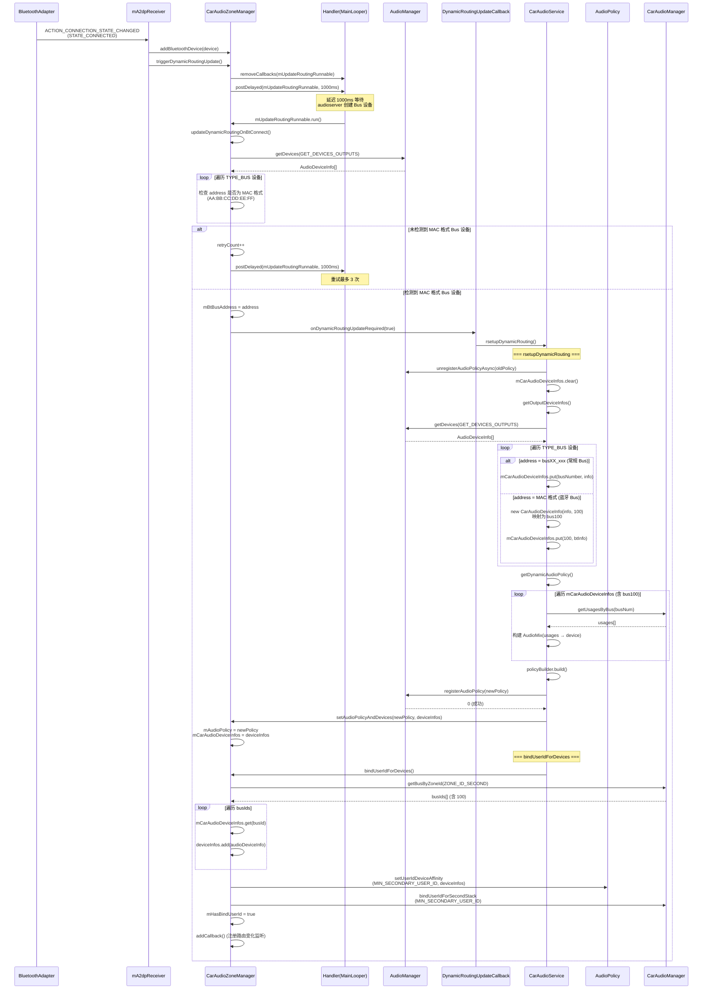

思考  主音区 播放网易云 副音区播放爱奇艺，星河行为是什么

分为两种 

连接蓝牙   网易云从车机播放 爱企业从蓝牙播放  

非连接蓝牙     公用一套焦点 如果先播放主音区的WWY在播放副音区的AQY那么WWY暂停播放

当存在两个音区那么就会有两套焦点控制

播放音乐的时候会设置usage，通过这个usage去找到对应的bus，也就是找到对应的输出流，  只要把数据写入到对应的bus输出流， 这样framework 的工作就结束了

usage与bus的对应是xml文件配置的，这个属于动态路由。

在framework层是没有音区的概念的 只有usage对应bus的概念。

连接蓝牙   carAudioManager.java中提供api  getOutputDeviceForUsage 可以通过 zoneid跟usage找到对应的设置id， 从xml可知 a2dp的id =100, 然后调用AudioTrack的接口指定播放设备。 这样就可以完成 指定 副屏幕声音从蓝牙播放出来

audioZoneId = ... ;

mediaDeviceInfo = mCarAudioManager

            .getOutputDeviceForUsage(audioZoneId, AudioAttributes.USAGE_MEDIA);

            //该 API 可用于查询用于特定音频区的输出设备以及音频属性用法

…

mPlayer.setPreferredDevice(mediaDeviceInfo);'

如果没有serPreferredDevice 也可以路由到蓝牙上流程如下

- 在连接上蓝牙后会调用AudioPolicyMixCollection::setUserIdDeviceAffinities
- 这个函数会做为给定的 userId 指定一组设备（devices）， 使得该 userId 只能通过这些设备进行音频输出。这组device就是蓝牙
![[Pasted image 20260215171124.png]]- 然后在动态路由过程中 会根据这个mRule来查找指定的匹配规则，注意这个userid ，动态路由的时候app会送这个userid下来， 从而找到指定的divice（蓝牙）

非连接蓝牙 我app是可以判断蓝牙是否连接的，如果在非连接状态下，应该不会主动设置device,这种情况下是禁用副焦点栈的，也就是说 主副音区公用一个焦点栈，那么也就是说  副音区播放app会停止主音区的app播放

![[Pasted image 20260215171133.png]]

# Android16

这个时序图展示了蓝牙连接后的完整流程：

1. 收到蓝牙连接广播 → 延迟 1s 开始检测
2. 扫描 TYPE_BUS 设备，匹配 MAC 地址格式（蓝牙 Bus），最多重试 3 次
3. 检测到后通知 CarAudioService 执行 `rsetupDynamicRouting`
4. 重新扫描设备时，MAC 地址格式的 Bus 被映射为 bus100
5. 用 bus100 的 usage 配置构建新的 AudioPolicy 并注册
6. 最后调用 `bindUserIdForDevices` 将 bus100 设备绑定到第二音区用户