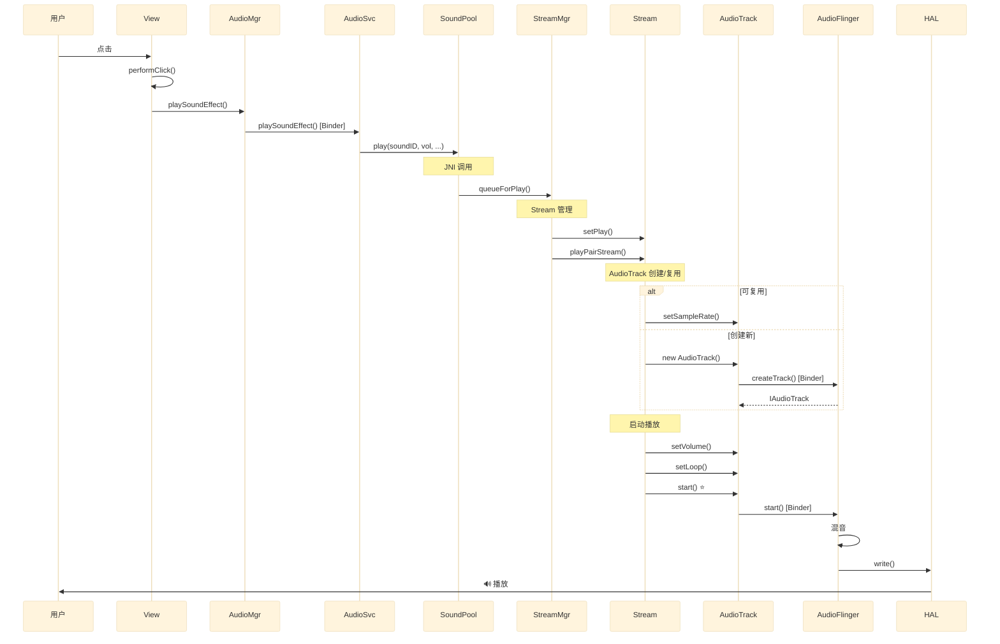
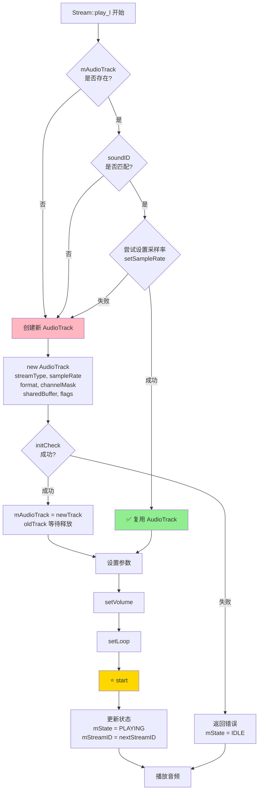
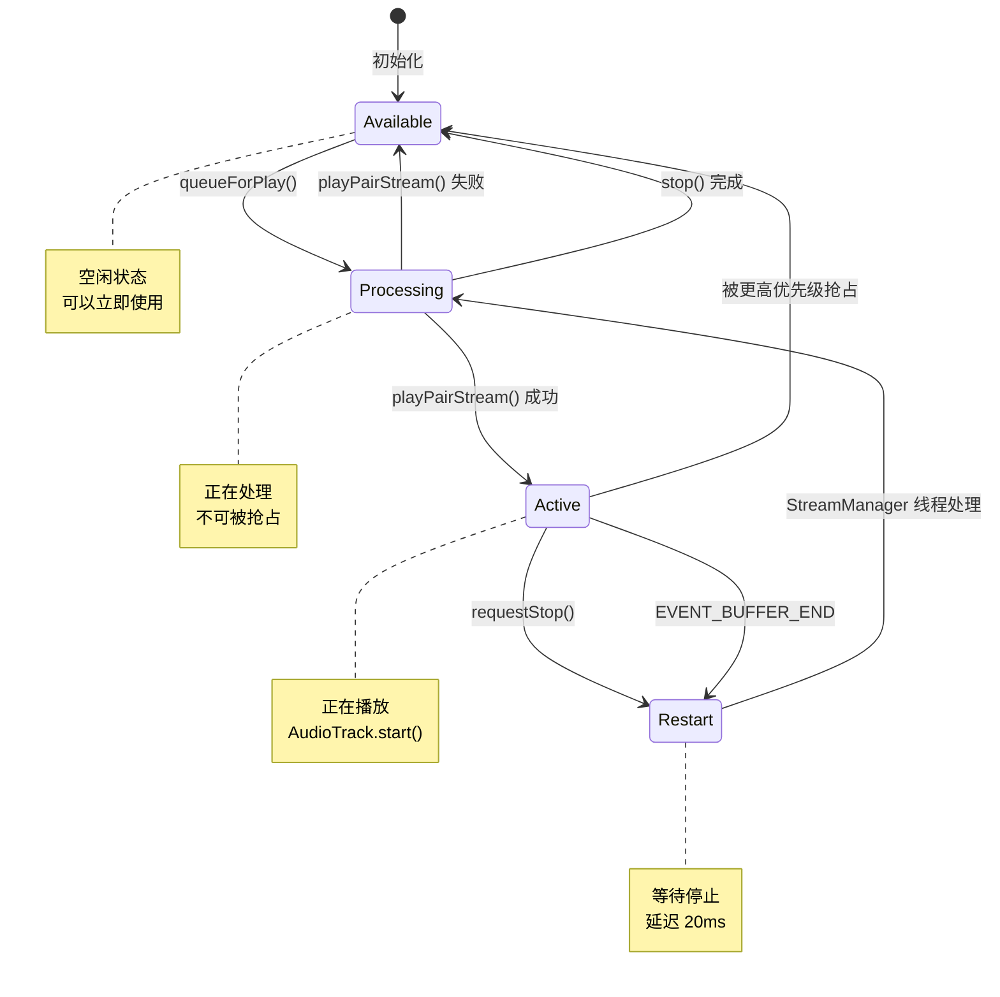

# Android 按键音播放机制详解

> 基于 SoundPool 和 AudioTrack 源码分析
>
> 作者：源码分析
> 日期：2026-02-10

---

## 目录

- [一、概述](#一概述)
- [二、完整流程时序图](#二完整流程时序图)
- [三、AudioTrack 创建与复用机制（重点）](#三audiotrack-创建与复用机制重点)
- [四、详细代码流程分析](#四详细代码流程分析)
- [五、关键数据结构](#五关键数据结构)
- [六、总结](#六总结)

---

## 一、概述

按键音播放是 Android 系统中的一个重要交互反馈机制。当用户点击按钮、导航等操作时，系统会通过 **SoundPool** 播放预加载的音效。

### 关键组件

| 组件 | 作用 | 层级 |
|------|------|------|
| **View** | 触发音效播放 | Framework (Java) |
| **AudioManager** | 音频管理服务 | Framework (Java) |
| **AudioService** | 音频系统服务 | System Service |
| **SoundPool** | 音效池管理 | Native (C++) |
| **Stream** | 音频流管理 | Native (C++) |
| **AudioTrack** | 音频轨道 | Native (C++) |
| **AudioFlinger** | 音频混音服务 | Native (C++) |

### 核心机制

- **SoundPool**：用于管理和播放短音效（<5秒）
- **双缓冲机制**：使用 Stream Pair 实现无缝切换
- **AudioTrack 复用**：避免频繁创建以提升性能
- **静态共享内存**：音频数据预加载到共享内存中

---

## 二、完整流程时序图

### 2.1 整体时序图

<div style="transform: scale(0.75); transform-origin: top left; width: 133%;">



</div>

### 2.2 AudioTrack 创建/复用决策流程图



---

## 三、AudioTrack 创建与复用机制（重点）

### 3.1 复用条件（必须同时满足）

#### ✅ 何时复用 AudioTrack

```cpp
// Stream.cpp: 306-313
if (mAudioTrack != nullptr && mSoundID == sound->getSoundID()) {
    // 尝试设置新的采样率
    if (mAudioTrack->setSampleRate(sampleRate) == NO_ERROR) {
        newTrack = mAudioTrack;
        ALOGV("%s: reusing track %p for sound %d",
                __func__, mAudioTrack.get(), sound->getSoundID());
    }
}
```

**复用条件：**

1. ✅ `mAudioTrack != nullptr` — AudioTrack 对象存在
2. ✅ `mSoundID == sound->getSoundID()` — 播放的是同一个音效
3. ✅ `setSampleRate(sampleRate) == NO_ERROR` — 采样率设置成功

**复用场景示例：**

```
场景1：连续点击同一个按钮
- 第1次点击：创建 AudioTrack (soundID=100)
- 第2次点击：复用 AudioTrack (soundID=100) ✅
- 第3次点击：复用 AudioTrack (soundID=100) ✅

场景2：快速导航
- 按下方向键向右：创建 AudioTrack (soundID=101)
- 连续按右键：复用 AudioTrack (soundID=101) ✅
```

#### ❌ 何时创建新 AudioTrack

**创建新 AudioTrack 的情况：**

1. ❌ `mAudioTrack == nullptr` — 首次播放或 AudioTrack 已被清理
2. ❌ `mSoundID != sound->getSoundID()` — 播放不同的音效
3. ❌ `setSampleRate()` 失败 — 无法修改采样率（如 Fast Track）
4. ❌ 音频参数不兼容 — 声道数、格式、缓冲区不同

**创建场景示例：**

```
场景1：播放不同音效
- 点击按钮：创建 AudioTrack (soundID=100, CLICK)
- 导航按键：创建新 AudioTrack (soundID=101, NAVIGATION) ❌
- 再次点击：创建新 AudioTrack (soundID=100, CLICK) ❌

场景2：首次播放
- 应用启动后首次点击：创建 AudioTrack ❌

场景3：Fast Track 限制
- Fast Track 不支持动态修改采样率
- setSampleRate() 返回错误 → 创建新 AudioTrack ❌
```

### 3.2 为什么需要复用？

#### 性能优势对比

| 操作 | 创建新 AudioTrack | 复用 AudioTrack |
|------|------------------|----------------|
| **耗时** | ~10-50ms | ~1-5ms |
| **内存分配** | 需要 | 不需要 |
| **Binder IPC** | 需要（createTrack） | 不需要 |
| **AudioFlinger 操作** | 创建新 Track | 仅修改参数 |
| **延迟** | 较高 | 极低 |

#### 复用机制的优势

```cpp
// 创建新 AudioTrack 的开销
new AudioTrack(...)
  ↓ Binder IPC
AudioFlinger::createTrack()
  ↓ 内存分配
分配共享内存 + Control Block
  ↓ 初始化
初始化混音器、效果器
  ↓ 总耗时：10-50ms

// 复用 AudioTrack 的开销
mAudioTrack->setSampleRate(rate)
  ↓ 直接修改
修改采样率参数
  ↓ 总耗时：1-5ms ✅
```

### 3.3 复用的局限性

#### Fast Track 的限制

```cpp
// AudioTrack.cpp
status_t AudioTrack::setSampleRate(uint32_t rate) {
    if (mFlags & AUDIO_OUTPUT_FLAG_FAST) {
        // Fast Track 不支持动态修改采样率
        return INVALID_OPERATION;
    }
    // 普通 Track 可以修改
    return mAudioTrack->setSampleRate(rate);
}
```

**SoundPool 使用 `AUDIO_OUTPUT_FLAG_FAST`，因此：**

- ✅ 如果采样率相同 → 可以复用
- ❌ 如果采样率不同 → `setSampleRate()` 失败 → 创建新 AudioTrack

#### 实际表现

```
音效文件A：44100 Hz
音效文件B：48000 Hz

播放A → 创建 AudioTrack (44100 Hz)
播放A → 复用 ✅
播放B → 创建新 AudioTrack (48000 Hz) ❌
播放B → 复用 ✅
播放A → 创建新 AudioTrack (44100 Hz) ❌
```

### 3.4 Stream Pair 双缓冲机制

SoundPool 使用 **Stream Pair** 实现无缝切换：

```cpp
// StreamManager.h
// Stream 成对创建，互为 PairStream
Stream A ←→ Stream B

播放流程：
1. Stream A 正在播放音效1
2. 新的播放请求到来
3. Stream B 设置新参数（setPlay）
4. Stream A 停止，Stream B 开始（playPairStream）
5. Stream A 进入 Available 队列等待复用
```

**双缓冲的好处：**

- ✅ 避免播放中断
- ✅ 提供平滑过渡
- ✅ 支持快速连续播放

---

## 四、详细代码流程分析

### 4.1 Framework 层触发

#### View.java - 按键音触发入口

```java
// frameworks/base/core/java/android/view/View.java
public boolean performClick() {
    // 触发点击音效
    playSoundEffect(SoundEffectConstants.CLICK);

    // 调用 OnClickListener
    if (li != null && li.mOnClickListener != null) {
        li.mOnClickListener.onClick(this);
        return true;
    }
    return false;
}

public void playSoundEffect(int soundConstant) {
    if (mAttachInfo == null ||
        mAttachInfo.mRootCallbacks == null ||
        !isSoundEffectsEnabled()) {
        return;
    }
    // 委托给 ViewRootImpl
    mAttachInfo.mRootCallbacks.playSoundEffect(soundConstant);
}
```

#### AudioManager.java - 音频管理

```java
// frameworks/base/media/java/android/media/AudioManager.java
public void playSoundEffect(int effectType) {
    // effectType:
    // - SoundEffectConstants.CLICK = 0
    // - SoundEffectConstants.NAVIGATION_LEFT = 1
    // - SoundEffectConstants.NAVIGATION_UP = 2
    // 等等...

    IAudioService service = getService();
    try {
        service.playSoundEffect(effectType);
    } catch (RemoteException e) {
        throw e.rethrowFromSystemServer();
    }
}
```

#### AudioService.java - 系统服务

```java
// frameworks/base/services/core/java/com/android/server/audio/AudioService.java
private SoundPool mSoundPool;
private int[] mSoundEffects = new int[SoundEffectConstants.NUM_SOUND_EFFECTS];

public void playSoundEffect(int effectType) {
    // 播放预加载的音效
    if (mSoundPool != null) {
        float volume = getStreamVolume(STREAM_SYSTEM);
        mSoundPool.play(
            mSoundEffects[effectType],  // soundID
            volume,                      // leftVolume
            volume,                      // rightVolume
            0,                          // priority
            0,                          // loop (0 = 不循环)
            1.0f                        // rate
        );
    }
}
```

### 4.2 SoundPool JNI 层

#### android_media_SoundPool.cpp - JNI 桥接

```cpp
// frameworks/base/core/jni/android_media_SoundPool.cpp

static jint android_media_SoundPool_play(
    JNIEnv *env, jobject thiz, jint sampleID,
    jfloat leftVolume, jfloat rightVolume,
    jint priority, jint loop, jfloat rate)
{
    ALOGV("android_media_SoundPool_play");

    // 获取 Native SoundPool 对象
    SoundPool *ap = MusterSoundPool(env, thiz);
    if (ap == nullptr) return 0;

    // 调用 Native 层 play 方法
    return (jint) ap->play(sampleID, leftVolume, rightVolume,
                           priority, loop, rate);
}

// JNI 方法注册
static JNINativeMethod gMethods[] = {
    {   "_play",
        "(IFFIIF)I",
        (void *)android_media_SoundPool_play
    },
    // ...
};
```

### 4.3 SoundPool Native 层

#### SoundPool.cpp - Native 实现

```cpp
// frameworks/base/media/jni/soundpool/SoundPool.cpp

int32_t SoundPool::play(
    int32_t soundID, float leftVolume, float rightVolume,
    int32_t priority, int32_t loop, float rate)
{
    ALOGV("%s(soundID=%d, leftVolume=%f, rightVolume=%f, "
          "priority=%d, loop=%d, rate=%f)",
          __func__, soundID, leftVolume, rightVolume,
          priority, loop, rate);

    // ========================================
    // 1. 参数检查（Android R 新增）
    // ========================================
    if (checkVolume(&leftVolume, &rightVolume) ||
        checkPriority(&priority) ||
        checkLoop(&loop) ||
        checkRate(&rate)) {
        return 0;
    }

    // ========================================
    // 2. 获取 Sound 对象
    // ========================================
    const std::shared_ptr<soundpool::Sound> sound =
        mSoundManager.findSound(soundID);

    if (sound == nullptr ||
        sound->getState() != soundpool::Sound::READY) {
        ALOGW("%s soundID %d not READY", __func__, soundID);
        return 0;
    }

    // ========================================
    // 3. 加入播放队列
    // ========================================
    const int32_t streamID = mStreamManager.queueForPlay(
        sound, soundID, leftVolume, rightVolume,
        priority, loop, rate);

    ALOGV("%s returned %d", __func__, streamID);
    return streamID;
}
```

### 4.4 StreamManager - Stream 管理

#### StreamManager.cpp - 队列管理（核心逻辑）

```cpp
// frameworks/base/media/jni/soundpool/StreamManager.cpp

int32_t StreamManager::queueForPlay(
    const std::shared_ptr<Sound> &sound,
    int32_t soundID, float leftVolume, float rightVolume,
    int32_t priority, int32_t loop, float rate)
{
    ALOGV("%s(sound=%p, soundID=%d, ...)",
          __func__, sound.get(), soundID);

    bool launchThread = false;
    int32_t streamID = 0;

    {
        std::unique_lock lock(mStreamManagerLock);
        Stream *newStream = nullptr;
        bool fromAvailableQueue = false;

        // ========================================
        // 1. 从可用队列查找 Stream（优先匹配 soundID）
        // ========================================
        if (mAvailableStreams.size() > 0) {
            // 优先查找相同 soundID 的 Stream（可复用 AudioTrack）
            for (auto stream : mAvailableStreams) {
                if (stream->getSoundID() == soundID) {
                    newStream = stream;
                    ALOGV("%s: found soundID %d in available queue",
                          __func__, soundID);
                    break;
                }
            }

            // 没有匹配的，取第一个
            if (newStream == nullptr) {
                ALOGV("%s: found stream in available queue", __func__);
                newStream = *mAvailableStreams.begin();
            }

            newStream->setStopTimeNs(systemTime());
            fromAvailableQueue = true;
        }

        // ========================================
        // 2. 从重启队列查找
        // ========================================
        if (newStream == nullptr || newStream->getSoundID() != soundID) {
            for (auto [unused, stream] : mRestartStreams) {
                if (!stream->getPairStream()->hasSound()) {
                    if (stream->getSoundID() == soundID) {
                        ALOGV("%s: found soundID %d in restart queue",
                              __func__, soundID);
                        newStream = stream;
                        fromAvailableQueue = false;
                        break;
                    } else if (newStream == nullptr) {
                        newStream = stream;
                    }
                }
            }
        }

        // ========================================
        // 3. 从活动队列"偷"一个低优先级的 Stream
        // ========================================
        if (newStream == nullptr) {
            for (auto stream : mActiveStreams) {
                if (stream->getPriority() <= priority) {
                    if (newStream == nullptr ||
                        newStream->getPriority() > stream->getPriority()) {
                        newStream = stream;
                        ALOGV("%s: found stream in active queue", __func__);
                    }
                }
            }
            if (newStream != nullptr) {
                // 停止被"偷"的 Stream
                (void)newStream->requestStop(newStream->getStreamID());
            }
        }

        // ========================================
        // 4. 从重启队列驱逐一个
        // ========================================
        if (newStream == nullptr) {
            for (auto [unused, stream] : mRestartStreams) {
                if (stream->getPairPriority() <= priority) {
                    ALOGV("%s: evict stream from restart queue", __func__);
                    newStream = stream;
                    break;
                }
            }
        }

        if (newStream == nullptr) {
            ALOGD("%s: unable to find stream, returning 0", __func__);
            return 0;
        }

        // ========================================
        // 5. 使用 PairStream 播放（双缓冲机制）
        // ========================================
        Stream *pairStream = newStream->getPairStream();
        streamID = getNextIdForStream(pairStream);

        ALOGV("%s: newStream:%p  pairStream:%p, streamID:%d",
              __func__, newStream, pairStream, streamID);

        // 设置播放参数（但还未开始播放）
        pairStream->setPlay(
            streamID, sound, soundID,
            leftVolume, rightVolume,
            priority, loop, rate);

        // ========================================
        // 6. 播放策略：立即播放 vs 延迟播放
        // ========================================
        if (fromAvailableQueue && kPlayOnCallingThread) {
            // 在调用线程立即播放
            removeFromQueues_l(newStream);
            mProcessingStreams.emplace(newStream);
            lock.unlock();

            // 执行播放
            if (Stream* nextStream = newStream->playPairStream()) {
                lock.lock();
                ALOGV("%s: starting streamID:%d",
                      __func__, nextStream->getStreamID());
                addToActiveQueue_l(nextStream);
            } else {
                lock.lock();
                mAvailableStreams.insert(newStream);
                streamID = 0;
            }
            mProcessingStreams.erase(newStream);
        } else {
            // 加入重启队列，由 StreamManager 线程处理
            launchThread = moveToRestartQueue_l(newStream) &&
                          needMoreThreads_l();
        }
    }

    // 如果需要，启动工作线程
    if (launchThread) {
        const int32_t id = mThreadPool->launch(
            [this](int32_t id) { run(id); });
        ALOGV_IF(id != 0, "%s: launched thread %d", __func__, id);
    }

    ALOGV("%s: returning %d", __func__, streamID);
    return streamID;
}
```

### 4.5 Stream - AudioTrack 管理

#### Stream.cpp - playPairStream()

```cpp
// frameworks/base/media/jni/soundpool/Stream.cpp

Stream* Stream::playPairStream() {
    Stream* pairStream = getPairStream();
    LOG_ALWAYS_FATAL_IF(pairStream == nullptr, "No pair stream!");

    sp<AudioTrack> releaseTracks[2];

    {
        ALOGV("%s: track streamID: %d", __func__, (int)getStreamID());

        // 锁定顺序：先锁 pair，再锁 this
        std::lock_guard lockp(pairStream->mLock);
        if (pairStream->mSound == nullptr) {
            return nullptr; // 没有要播放的声音
        }

        {
            std::lock_guard lock(mLock);
            LOG_ALWAYS_FATAL_IF(mState != IDLE,
                               "State: %d must be IDLE", mState);

            // ========================================
            // AudioTrack 所有权转移
            // ========================================
            // 将当前 Stream 的 AudioTrack 转移给 pairStream
            // 这样可以复用 AudioTrack
            pairStream->mAudioTrack = mAudioTrack;
            pairStream->mSoundID = mSoundID;
            pairStream->mToggle = mToggle;
            pairStream->mAutoPaused = mAutoPaused;
            pairStream->mMuted = mMuted;

            mAudioTrack.clear();  // 当前 Stream 不再持有
            mSound.reset();
            mSoundID = 0;
        }

        // ========================================
        // 执行播放
        // ========================================
        const int pairState = pairStream->mState;
        pairStream->play_l(
            pairStream->mSound,
            pairStream->mStreamID,
            pairStream->mLeftVolume,
            pairStream->mRightVolume,
            pairStream->mPriority,
            pairStream->mLoop,
            pairStream->mRate,
            releaseTracks);

        if (pairStream->mState == IDLE) {
            return nullptr; // AudioTrack 创建失败
        }

        // 恢复暂停状态
        if (pairState == PAUSED) {
            pairStream->mState = PAUSED;
            pairStream->mAudioTrack->pause();
        }
    }

    // releaseTracks 在此处释放（析构函数自动调用）
    return pairStream;
}
```

#### Stream.cpp - play_l() ⭐核心函数⭐

```cpp
// frameworks/base/media/jni/soundpool/Stream.cpp

void Stream::play_l(
    const std::shared_ptr<Sound>& sound, int32_t nextStreamID,
    float leftVolume, float rightVolume,
    int32_t priority, int32_t loop, float rate,
    sp<AudioTrack> releaseTracks[2])
{
    sp<AudioTrack> &oldTrack = releaseTracks[0];
    sp<AudioTrack> &newTrack = releaseTracks[1];
    status_t status = NO_ERROR;

    {
        ALOGV("%s(%p)(soundID=%d, streamID=%d, leftVolume=%f, "
              "rightVolume=%f, priority=%d, loop=%d, rate=%f)",
              __func__, this, sound->getSoundID(), nextStreamID,
              leftVolume, rightVolume, priority, loop, rate);

        // ========================================
        // 1. 准备 AudioTrack 参数
        // ========================================
        const audio_stream_type_t streamType =
            AudioSystem::attributesToStreamType(
                *mStreamManager->getAttributes());
        const int32_t channelCount = sound->getChannelCount();
        const auto sampleRate = (uint32_t)lround(
            double(sound->getSampleRate()) * rate);
        size_t frameCount = 0;

        // 计算循环需要的帧数
        if (loop) {
            const audio_format_t format = sound->getFormat();
            const size_t frameSize = audio_is_linear_pcm(format)
                ? channelCount * audio_bytes_per_sample(format) : 1;
            frameCount = sound->getSizeInBytes() / frameSize;
        }

        // ========================================
        // 2. 尝试复用现有 AudioTrack
        // ========================================
        if (mAudioTrack != nullptr &&
            mSoundID == sound->getSoundID()) {

            // 尝试修改采样率
            if (mAudioTrack->setSampleRate(sampleRate) == NO_ERROR) {
                newTrack = mAudioTrack;
                ALOGV("%s: reusing track %p for sound %d",
                      __func__, mAudioTrack.get(), sound->getSoundID());
            }
        }

        // ========================================
        // 3. 创建新的 AudioTrack
        // ========================================
        if (newTrack == nullptr) {
            // Toggle 机制：用于检测旧 AudioTrack 的回调
            auto toggle = mToggle ^ 1;
            void* userData = reinterpret_cast<void*>(
                (uintptr_t)this | toggle);

            // 声道掩码
            audio_channel_mask_t soundChannelMask =
                sound->getChannelMask();
            audio_channel_mask_t channelMask =
                soundChannelMask != AUDIO_CHANNEL_NONE
                    ? soundChannelMask
                    : audio_channel_out_mask_from_count(channelCount);

            // 归属信息（权限控制）
            android::content::AttributionSourceState attributionSource;
            attributionSource.packageName =
                mStreamManager->getOpPackageName();
            attributionSource.token = sp<BBinder>::make();

            // ========================================
            // 🎯🎯🎯 创建 AudioTrack 🎯🎯🎯
            // ========================================
            newTrack = new AudioTrack(
                streamType,                      // AUDIO_STREAM_SYSTEM
                sampleRate,                      // 44100/48000
                sound->getFormat(),              // AUDIO_FORMAT_PCM_16_BIT
                channelMask,                     // STEREO/MONO
                sound->getIMemory(),             // 🔥 共享内存（静态缓冲）
                AUDIO_OUTPUT_FLAG_FAST,          // 🔥 低延迟标志
                staticCallback,                  // 回调函数
                userData,                        // 用户数据
                0,                               // 默认通知帧数
                AUDIO_SESSION_ALLOCATE,          // 分配音频会话
                AudioTrack::TRANSFER_DEFAULT,    // 传输模式
                nullptr,                         // offloadInfo
                attributionSource,               // 归属信息
                mStreamManager->getAttributes(), // 音频属性
                false,                           // doNotReconnect
                1.0f                             // maxRequiredSpeed
            );

            // 设置调用者名称（用于日志和统计）
            newTrack->setCallerName("soundpool");

            oldTrack = mAudioTrack;

            // 检查初始化结果
            status = newTrack->initCheck();
            if (status != NO_ERROR) {
                ALOGE("%s: error creating AudioTrack", __func__);
                goto exit;
            }

            mToggle = toggle;
            mAudioTrack = newTrack;
            ALOGV("%s: using new track %p for sound %d",
                  __func__, newTrack.get(), sound->getSoundID());
        }

        // ========================================
        // 4. 设置播放参数
        // ========================================
        if (mMuted) {
            newTrack->setVolume(0.0f, 0.0f);
        } else {
            newTrack->setVolume(leftVolume, rightVolume);
        }
        newTrack->setLoop(0, frameCount, loop);

        // ========================================
        // 🎯🎯🎯 启动 AudioTrack 🎯🎯🎯
        // ========================================
        mAudioTrack->start();

        // ========================================
        // 5. 更新 Stream 状态
        // ========================================
        mSound = sound;
        mSoundID = sound->getSoundID();
        mPriority = priority;
        mLoop = loop;
        mLeftVolume = leftVolume;
        mRightVolume = rightVolume;
        mRate = rate;
        mState = PLAYING;
        mStopTimeNs = 0;
        mStreamID = nextStreamID;  // 原子同步点
    }

exit:
    ALOGV("%s: delete oldTrack %p", __func__, oldTrack.get());
    if (status != NO_ERROR) {
        mState = IDLE;
        mSoundID = 0;
        mSound.reset();
        mAudioTrack.clear();
    }
}
```

### 4.6 AudioTrack 层

#### AudioTrack.cpp - start() ⭐关键函数⭐

```cpp
// frameworks/av/media/libaudioclient/AudioTrack.cpp

status_t AudioTrack::start()
{
    AutoMutex lock(mLock);

    ALOGV("start");

    // ========================================
    // 1. 状态检查
    // ========================================
    if (mState == STATE_ACTIVE) {
        return INVALID_OPERATION;
    }

    mInUnderrun = true;
    State previousState = mState;

    // ========================================
    // 2. 通过 Binder 调用 AudioFlinger
    // ========================================
    status_t status = mAudioTrack->start();

    if (status != NO_ERROR) {
        ALOGE("start() status %d", status);
        mState = previousState;
        return status;
    }

    // ========================================
    // 3. 更新状态
    // ========================================
    mState = STATE_ACTIVE;

    // ========================================
    // 4. 静态缓冲模式特殊处理
    // ========================================
    if (mSharedBuffer != 0) {
        // SoundPool 使用静态缓冲
        // 数据已经在共享内存中，无需额外写入
        // AudioFlinger 会直接从共享内存读取
    }

    return NO_ERROR;
}
```

---

## 五、关键数据结构

### 5.1 Stream 数据结构

```cpp
// frameworks/base/media/jni/soundpool/Stream.h

class alignas(64) Stream {
public:
    enum state { IDLE, PAUSED, PLAYING };

private:
    // StreamManager 指针
    StreamManager*     mStreamManager = nullptr;

    // 锁和同步
    mutable std::mutex  mLock;

    // Stream 标识
    std::atomic_int32_t mStreamID GUARDED_BY(mLock) = 0;

    // 状态
    int                 mState GUARDED_BY(mLock) = IDLE;

    // Sound 对象（包含 PCM 数据）
    std::shared_ptr<Sound> mSound GUARDED_BY(mLock);
    int32_t             mSoundID GUARDED_BY(mLock) = 0;

    // 播放参数
    float               mLeftVolume GUARDED_BY(mLock) = 0.f;
    float               mRightVolume GUARDED_BY(mLock) = 0.f;
    int32_t             mPriority GUARDED_BY(mLock) = INT32_MIN;
    int32_t             mLoop GUARDED_BY(mLock) = 0;
    float               mRate GUARDED_BY(mLock) = 0.f;

    // 特殊状态
    bool                mAutoPaused GUARDED_BY(mLock) = false;
    bool                mMuted GUARDED_BY(mLock) = false;

    // 🔥 AudioTrack 对象
    sp<AudioTrack>      mAudioTrack GUARDED_BY(mLock);

    // Toggle 机制（用于检测旧回调）
    int                 mToggle GUARDED_BY(mLock) = 0;

    // 停止时间（用于延迟停止）
    int64_t             mStopTimeNs GUARDED_BY(mLock) = 0;
};
```

### 5.2 StreamManager 队列管理

```cpp
// frameworks/base/media/jni/soundpool/StreamManager.h

class StreamManager {
private:
    // 🔥 四个队列管理 Stream 生命周期

    // 1. 可用队列：空闲的 Stream，可以立即使用
    std::set<Stream*> mAvailableStreams;

    // 2. 活动队列：正在播放的 Stream
    std::list<Stream*> mActiveStreams;

    // 3. 重启队列：等待停止并重新启动的 Stream
    std::multimap<int64_t, Stream*> mRestartStreams;

    // 4. 处理中队列：正在被 StreamManager 线程处理的 Stream
    std::set<Stream*> mProcessingStreams;

    // Stream 存储（成对创建）
    std::vector<std::unique_ptr<Stream>> mStreams;

    // 线程池
    std::unique_ptr<ThreadPool> mThreadPool;

    // 同步
    std::mutex mStreamManagerLock;
    std::condition_variable mStreamManagerCondition;

    // 音频属性
    audio_attributes_t mAttributes;
};
```

### 5.3 Stream 队列状态转换



---

## 六、总结

### 6.1 核心要点回顾

#### AudioTrack 创建与复用

| 条件 | 创建新 AudioTrack | 复用 AudioTrack |
|------|------------------|----------------|
| **首次播放** | ✅ 创建 | ❌ |
| **相同 soundID** | ❌ | ✅ 复用 |
| **不同 soundID** | ✅ 创建 | ❌ |
| **采样率不同** | ✅ 创建（Fast Track 限制） | ❌ |
| **采样率相同** | ❌ | ✅ 复用 |
| **AudioTrack 为 null** | ✅ 创建 | ❌ |

#### 性能对比

| 指标 | 创建新 AudioTrack | 复用 AudioTrack |
|------|------------------|----------------|
| **耗时** | 10-50ms | 1-5ms |
| **Binder 调用** | 是 | 否 |
| **内存分配** | 是 | 否 |
| **AudioFlinger 操作** | createTrack | 仅参数修改 |

### 6.2 完整调用链

```
用户点击按钮
  ↓
View.performClick()
  ↓
View.playSoundEffect(CLICK)
  ↓
AudioManager.playSoundEffect(effectType)
  ↓ [Binder IPC]
AudioService.playSoundEffect(effectType)
  ↓
SoundPool.play(soundID, volume, ...)
  ↓ [JNI]
android_media_SoundPool_play()
  ↓
SoundPool::play() [Native]
  ↓
StreamManager::queueForPlay()
  ↓
Stream::setPlay() + Stream::playPairStream()
  ↓
Stream::play_l()
  ↓
【复用判断】
  ├─ 复用: mAudioTrack->setSampleRate()
  └─ 创建: new AudioTrack(...)
       ↓ [Binder IPC]
     AudioFlinger::createTrack()
  ↓
mAudioTrack->start() ⭐
  ↓ [Binder IPC]
AudioFlinger::Track::start()
  ↓
AudioFlinger 混音
  ↓
Audio HAL
  ↓
🔊 声音输出
```

### 6.3 关键文件清单

| 文件 | 路径 | 作用 |
|------|------|------|
| **View.java** | frameworks/base/core/java/android/view/ | 触发音效 |
| **AudioManager.java** | frameworks/base/media/java/android/media/ | 音频管理 |
| **AudioService.java** | frameworks/base/services/core/java/com/android/server/audio/ | 系统服务 |
| **android_media_SoundPool.cpp** | frameworks/base/core/jni/ | JNI 桥接 |
| **SoundPool.cpp** | frameworks/base/media/jni/soundpool/ | Native 实现 |
| **Stream.cpp** | frameworks/base/media/jni/soundpool/ | Stream 管理 |
| **StreamManager.cpp** | frameworks/base/media/jni/soundpool/ | Stream 队列 |
| **AudioTrack.cpp** | frameworks/av/media/libaudioclient/ | AudioTrack |
| **AudioFlinger.cpp** | frameworks/av/services/audioflinger/ | 音频服务 |

### 6.4 优化建议

#### 对于音效设计

1. **统一采样率**：所有按键音使用相同采样率（如 48000 Hz），提高复用率
2. **短小精悍**：控制音效时长在 500ms 以内
3. **预加载**：在应用启动时加载常用音效

#### 对于性能优化

1. **复用优先**：连续操作使用相同音效
2. **合理优先级**：重要音效使用更高优先级
3. **避免滥用**：不必要的地方不播放音效

#### 对于问题排查

```bash
# 查看 SoundPool 日志
adb logcat | grep -E "SoundPool|Stream"

# 查看 AudioTrack 创建
adb logcat | grep "AudioTrack"

# 查看 AudioFlinger
adb logcat | grep "AudioFlinger"

# 查看音频路由
adb shell dumpsys media.audio_flinger

# 监控 AudioTrack 创建和释放
adb logcat | grep -E "new AudioTrack|delete.*AudioTrack|reusing track"
```

---

## 附录

### A. 相关常量定义

```cpp
// 音效类型
SoundEffectConstants.CLICK = 0
SoundEffectConstants.NAVIGATION_LEFT = 1
SoundEffectConstants.NAVIGATION_UP = 2
SoundEffectConstants.NAVIGATION_RIGHT = 3
SoundEffectConstants.NAVIGATION_DOWN = 4

// 音频流类型
AUDIO_STREAM_VOICE_CALL = 0
AUDIO_STREAM_SYSTEM = 1        // 按键音使用
AUDIO_STREAM_RING = 2
AUDIO_STREAM_MUSIC = 3
AUDIO_STREAM_ALARM = 4
AUDIO_STREAM_NOTIFICATION = 5

// 音频格式
AUDIO_FORMAT_PCM_16_BIT = 0x1  // 16位 PCM
AUDIO_FORMAT_PCM_8_BIT = 0x2   // 8位 PCM

// 声道掩码
AUDIO_CHANNEL_OUT_MONO = 0x1
AUDIO_CHANNEL_OUT_STEREO = 0x3

// 输出标志
AUDIO_OUTPUT_FLAG_FAST = 0x4   // 低延迟
AUDIO_OUTPUT_FLAG_DEEP_BUFFER = 0x8  // 深度缓冲
```

### B. 时间常量

```cpp
// Stream.h
inline constexpr int64_t kStopWaitTimeNs = 20 * NANOS_PER_MILLISECOND;
// 停止等待时间：20ms（用于音量淡出）

// StreamManager.cpp
inline constexpr int64_t kWaitTimeBeforeCloseNs = 1000000000;
// 线程关闭前等待时间：1秒
```

---

**文档版本**: 1.0
**最后更新**: 2026-02-10
**基于代码版本**: Android 13 (T)

**参考资料**:
- Android 源码：frameworks/base/media/jni/soundpool/
- Android 源码：frameworks/av/media/libaudioclient/
- Android 源码：frameworks/av/services/audioflinger/
