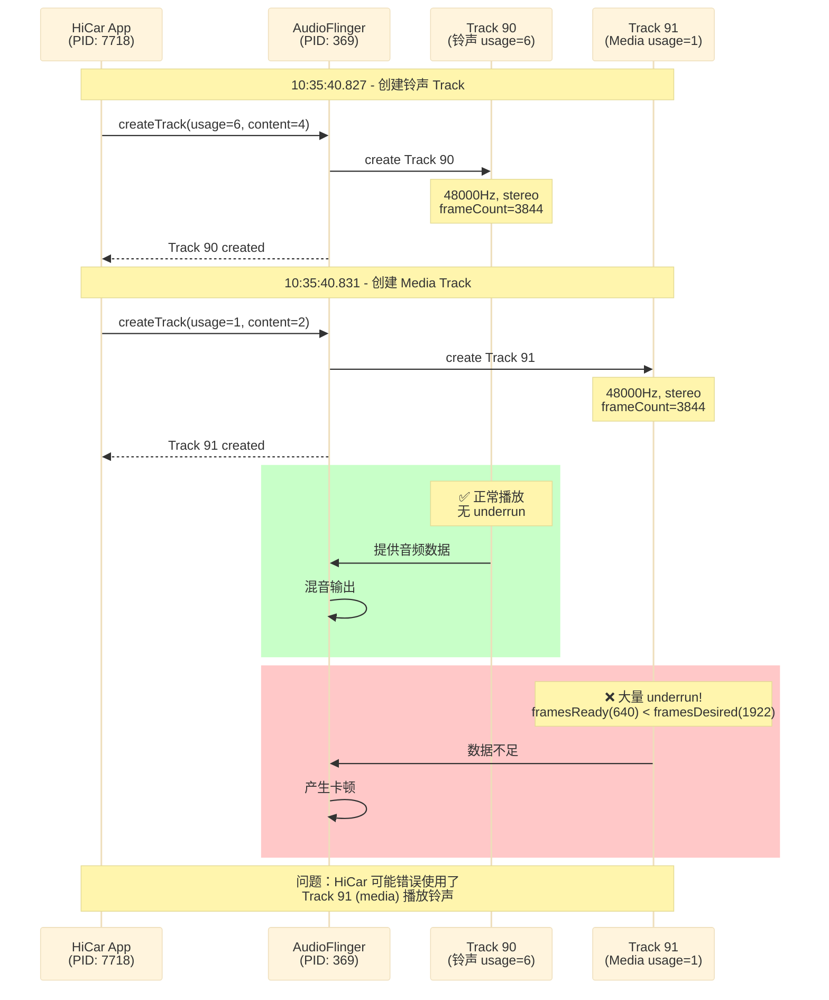

# 日报 2026-02-24

## 待办任务

- [ ] 任务1
- [ ] 任务2
- [ ] 任务3
## bug解决

| BUG ID                                                           | 问题简述                 | 状态     |     |
| ---------------------------------------------------------------- | -------------------- | ------ | --- |
| [#1386804](http://zentao.gxatek.com:20080/bug-view-1386804.html) | 【T68】【德赛】U盘升级完播放音乐无声 | 🔄 进行中 |     |
|                                                                  |                      |        |     |
|                                                                  |                      |        |     |

### 详细记录

#### #1386804 - U盘升级完播放音乐无声

**分析过程**:
<!-- 在这里粘贴分析截图 -->


**解决方案**:
<!-- 在这里粘贴解决方案和代码截图 -->
log信息不对，转给测试了

---

#### #1385064 - 【T75】【广研】【实车】开启按键音，每3秒后无点击屏幕无按键音响应


**分析过程**:
<!-- 在这里粘贴分析截图和日志 -->

``` xml
frameworks/base/core/res/res/xml/audio_assets.xml 
<audio_assets version="1.0">

    <asset id="FX_KEY_CLICK" file="Effect_Tick.ogg"/>

    <asset id="FX_FOCUS_NAVIGATION_UP" file="Effect_Tick.ogg"/>

    <asset id="FX_FOCUS_NAVIGATION_DOWN" file="Effect_Tick.ogg"/>

    <asset id="FX_FOCUS_NAVIGATION_LEFT" file="Effect_Tick.ogg"/>

    <asset id="FX_FOCUS_NAVIGATION_RIGHT" file="Effect_Tick.ogg"/>

    <asset id="FX_KEYPRESS_STANDARD" file="KeypressStandard.ogg"/>

    <asset id="FX_KEYPRESS_SPACEBAR" file="KeypressSpacebar.ogg"/>

    <asset id="FX_KEYPRESS_DELETE" file="KeypressDelete.ogg"/>

    <asset id="FX_KEYPRESS_RETURN" file="KeypressReturn.ogg"/>

    <asset id="FX_KEYPRESS_INVALID" file="KeypressInvalid.ogg"/>

    <asset id="FX_BACK" file="Effect_Tick.ogg"/>

    <asset id="FX_KEYPRESS_MODERN" file="CustomKeypressModern.wav"/>

    <asset id="FX_KEYPRESS_RETRO" file="CustomKeypressRetro.wav"/>

    <asset id="FX_KEYPRESS_ENTRY" file="CustomKeypressEntry.wav"/>

    <asset id="FX_KEYPRESS_CARD" file="CustomKeypressCard.wav"/>

    <asset id="FX_KEYPRESS_TOAST" file="CustomKeypressToast.wav"/>

    <asset id="FX_KEYPRESS_HVAC_COLD" file="CustomKeypressHavc_Cold.wav"/>

    <asset id="FX_KEYPRESS_HVAC_WARM" file="CustomKeypressHavc_Warm.wav"/>

</audio_assets>
```
文件规定了 要加载的 wav与对应的id
![[Pasted image 20260226143219.png]]
**解决方案**:
<!-- 在这里粘贴解决方案和代码截图 -->

---


#### #1388015 - 【MAX平台】【3.6.5】【hicar】5.x手机hicar通话铃声卡顿


**分析过程**:

**时序图 - HiCar 铃声播放流程**:



首先查看对应时间的是否出现underrrun，如果有确定是哪一个track
```
AudioFlinger: track(91) underrun, track state ACTIVE  framesReady(640) < framesDesired(1922)
```
可以确定是91，那么就要找对应的91是谁申请的
```
	行 172994: 02-13 10:35:40.831  7718 14132 I AudioTrack: set(): streamType -1, sampleRate 48000, format 0x1, channelMask 0x3, frameCount 3844, flags #0, notificationFrames 0, sessionId 0, transferType 3, uid -1, pid -1
	行 172995: 02-13 10:35:40.831  7718 14132 I AudioTrack: set(): Building AudioTrack with attributes: usage=1 content=2 flags=0x800 tags=[]
	行 173026: 02-13 10:35:40.832   369  2820 D AF::TrackHandle: OpPlayAudio: track:91 usage:1 not muted
```
根据OpPlayAudio 可以看到是进程7718申请的 并且usage  =1 也就是media
**解决方案**:

**结论**:
<!-- 在这里粘贴解决方案和代码截图 -->
从log看track91 播放的是usage =1 也就是media 。

不过从视频看 没看看出来哪里有卡顿。如果认为是铃声在10s左右卡顿 那个是正常现象，理由是 铃声与语音的 音频数据振幅相差较大导致听觉上是卡顿的状态。

![[Pasted image 20260224112730.png]]

track 91 出现大量的underrun
```
行 172994: 02-13 10:35:40.831 7718 14132 I AudioTrack: set(): streamType -1, sampleRate 48000, format 0x1, channelMask 0x3, frameCount 3844, flags #0, notificationFrames 0, sessionId 0, transferType 3, uid -1, pid -1

行 172995: 02-13 10:35:40.831 7718 14132 I AudioTrack: set(): Building AudioTrack with attributes: usage=1 content=2 flags=0x800 tags=[]

行 173026: 02-13 10:35:40.832 369 2820 D AF::TrackHandle: OpPlayAudio: track:91 usage:1 not muted

另外 行 172864: 02-13 10:35:40.827 7718 14132 I AudioTrack: set(): streamType -1, sampleRate 48000, format 0x1, channelMask 0x3, frameCount 3844, flags #0, notificationFrames 0, sessionId 0, transferType 3, uid -1, pid -1

行 172868: 02-13 10:35:40.827 7718 14132 I AudioTrack: set(): Building AudioTrack with attributes: usage=6 content=4 flags=0x800 tags=[]

行 172981: 02-13 10:35:40.830 369 2820 D AF::TrackHandle: OpPlayAudio: track:90 usage:6 not muted
```

铃声申请的audiotrack id是90不存在卡顿。 
并且怀疑HiCar播放铃声使用的AudioTrack 是错的用的之前申请的media的


---

## 开发任务

| 任务              | 状态  |
| --------------- | --- |
| 实现Android16蓝牙方案 | 正在搞 |
|                 |     |
|                 |     |
## 联调
| 任务  | 状态  |
| --- | --- |
|     |     |
|     |     |
|     |     |
## 今日收获
[[副音区蓝牙方案]]
## 明日安排
把蓝牙副音区的代码再改一下 ， 蓝牙设备的Type不是 *TYPE_BUS 可能是TYPE_BLUETOOTH_A2DP*
## 文档输出

## 会议结论