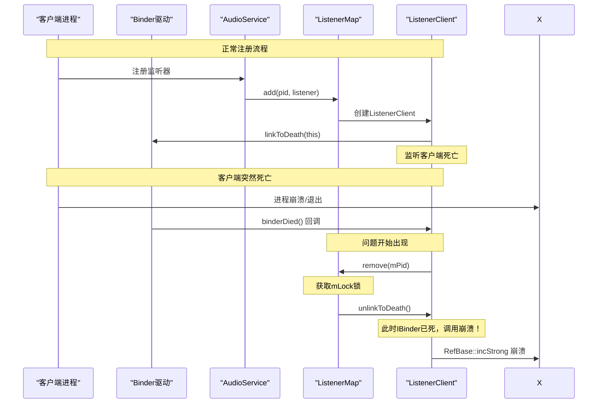
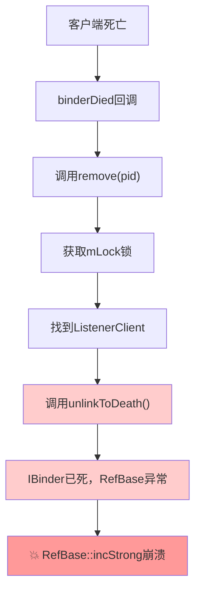
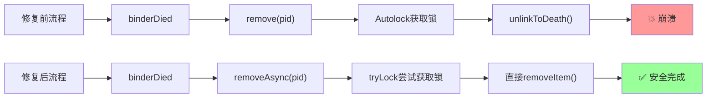

我来详细解释这个崩溃问题的根本原因和解决方法，让你彻底理解！

Ran tool

## 🔍 **根本原因深度分析**

### **问题1: Binder死亡回调的时序问题**

当客户端进程死亡时，会发生这样的时序：

```cpp
// 1. 客户端进程死亡
// 2. Binder驱动检测到死亡
// 3. 回调所有注册的死亡监听器
void binderDied(const wp<IBinder>& who) {
    // 此时 IBinder 对象已经无效！
    mParent->remove(mPid);  // 调用remove
}

void remove(int pid) {
    Mutex::Autolock _l(mLock);  // 获取锁
    // ...
    client->unlinkToDeath();    // ❌ 崩溃点！IBinder已死，不能操作
}
```

**关键点**：`unlinkToDeath()` 尝试操作已经死亡的IBinder，导致RefBase计数异常！

### **问题2: 智能指针生命周期混乱**
Ran tool

```cpp
// Android智能指针的工作原理
class ListenerClient : public IBinder::DeathRecipient {
    wp<IBinder> mBinder;  // 弱引用，避免循环引用
};

// 当IBinder死亡时：
// 1. IBinder的强引用计数变为0
// 2. 对象开始析构
// 3. 但binderDied回调仍在执行
// 4. unlinkToDeath尝试操作正在析构的对象
// 5. RefBase::incStrong检查失败 → 崩溃
```

## 🛠️ **解决方案的核心思路**

### **策略1: 避免在死亡回调中操作死亡的IBinder**

```cpp
// ❌ 错误做法
void binderDied(const wp<IBinder>& who) {
    mParent->remove(mPid);  // 会调用unlinkToDeath
}

// ✅ 正确做法  
void binderDied(const wp<IBinder>& who) {
    mParent->removeAsync(mPid);  // 不调用unlinkToDeath
}
```

### **策略2: 使用tryLock避免死锁**

```cpp
void removeAsync(const int clientPid) {
    // 使用tryLock而不是Autolock
    if (mLock.tryLock() != NO_ERROR) {
        // 无法获取锁就放弃，让其他线程处理
        return;
    }
    
    // 直接移除，不调用unlinkToDeath
    mListenerMap.removeItem(clientPid);
    mLock.unlock();
}
```

## 🧠 **为什么这样修复有效？**
Ran tool

### **1. 避免操作死亡的IBinder**
- **问题**：`unlinkToDeath()`操作已死的IBinder → RefBase异常
- **解决**：死亡回调中不调用`unlinkToDeath()`

### **2. 避免重入锁死锁**  
- **问题**：`binderDied`在binder线程中，可能与主线程形成死锁
- **解决**：使用`tryLock()`，失败就放弃

### **3. 智能指针自动管理**
- **问题**：手动调用`unlinkToDeath`干扰智能指针析构
- **解决**：让`sp<ListenerClient>`自然析构

## 💡 **核心概念理解**

### **Android Binder死亡通知机制**
```cpp
// 注册死亡监听
binder->linkToDeath(listener);

// 当binder死亡时，系统会：
// 1. 将IBinder标记为死亡状态
// 2. 调用所有注册的DeathRecipient::binderDied
// 3. 在回调中，IBinder已经"半死不活"，不能再操作！
```

### **RefBase智能指针的脆弱性**
```cpp
// RefBase在析构过程中有严格的状态检查
void RefBase::incStrong() {
    if (mFlags & OBJECT_LIFETIME_MASK) {
        // 检查对象生命周期状态
        // 如果对象正在析构，这里会断言失败！
    }
}
```

## 🎯 **这个修复解决了什么？**

1. **消除RefBase崩溃**：不在死亡回调中操作死亡的IBinder
2. **避免死锁**：使用tryLock替代阻塞锁  
3. **保证线程安全**：正确处理多线程并发访问
4. **简化生命周期**：让智能指针自动管理对象析构

这是Android系统编程中非常经典的一个陷阱 - **在Binder死亡回调中错误地操作已死的IBinder对象**！修复的关键是理解Binder生命周期和智能指针的工作机制。🎉