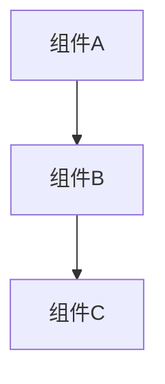

---
tags:
  - 知识卡片
  - 待分类
status: 待学习
难度: 待评估
学习时间:
掌握程度: ⭐☆☆☆☆
下次复习:
关联笔记: []
优先级: 中等
---

# 🎯 [主题名称] 知识卡片

## 📋 基本信息
- **主题**: [主题名称]
- **核心概念**: [一句话概括]
- **重要性**: ⭐⭐⭐☆☆ (1-5星)
- **适用场景**: [主要使用场景]

## 🎯 核心概念

### 是什么？
**[简洁的定义]**

**[类比理解]**

## 📊 关键要点速查表

| 要点 | 说明 | 示例/代码 |
|------|------|-----------|
| [要点1] | [说明1] | [示例1] |
| [要点2] | [说明2] | [示例2] |
| [要点3] | [说明3] | [示例3] |

## 🔧 关键API/使用

### 基本用法
```[语言]
[代码示例]
```

### 高级用法
```[语言]
[代码示例]
```

## 🏗️ 架构理解

### 系统架构


### 核心组件
1. **[组件1]** - [功能说明]
2. **[组件2]** - [功能说明]
3. **[组件3]** - [功能说明]

## 💡 关键机制

### 机制1
- **原理**: [原理说明]
- **应用**: [应用场景]
- **注意事项**: [注意事项]

### 机制2
- **原理**: [原理说明]
- **应用**: [应用场景]
- **注意事项**: [注意事项]

## 🚨 常见问题与解决方案

### 问题1: [问题描述]
**可能原因**: [原因分析]
**解决方案**: [解决方案]

### 问题2: [问题描述]
**可能原因**: [原因分析]
**解决方案**: [解决方案]

## 📈 学习要点总结

### 必须掌握
✅ [要点1]
✅ [要点2]
✅ [要点3]

### 深入理解
✅ [深入点1]
✅ [深入点2]

### 高级应用
✅ [高级点1]
✅ [高级点2]

## 🔗 关联知识点

### 前置知识
- [[相关笔记1]]
- [[相关笔记2]]

### 相关技术
- [[相关技术1]]
- [[相关技术2]]

### 扩展学习
- [[扩展学习1]]
- [[扩展学习2]]

## 🧪 实践建议

### 代码练习
1. [练习1描述]
2. [练习2描述]
3. [练习3描述]

### 调试技巧
```bash
[调试命令]
```

### 测试场景
1. [测试场景1]
2. [测试场景2]
3. [测试场景3]

## 📚 参考资料
- [参考链接1]
- [参考链接2]
- [[详细源码分析笔记]]

---

**最后更新**: {{date}}
**掌握程度**: ⭐☆☆☆☆ (1/5星)
**下次复习**: {{+7d}}
**学习心得**: [填写学习心得]